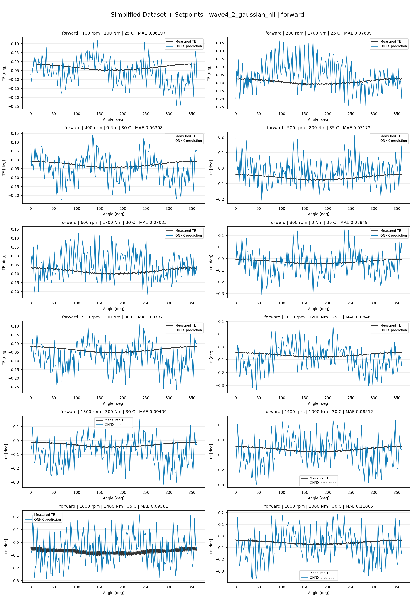
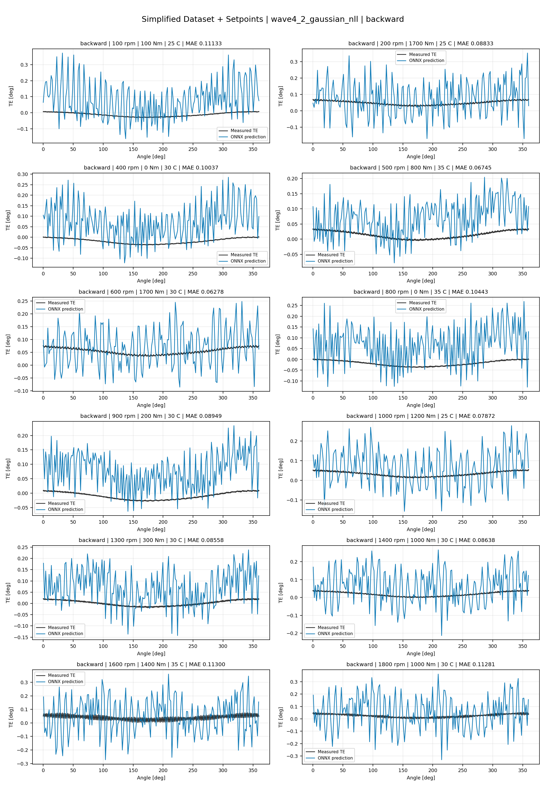
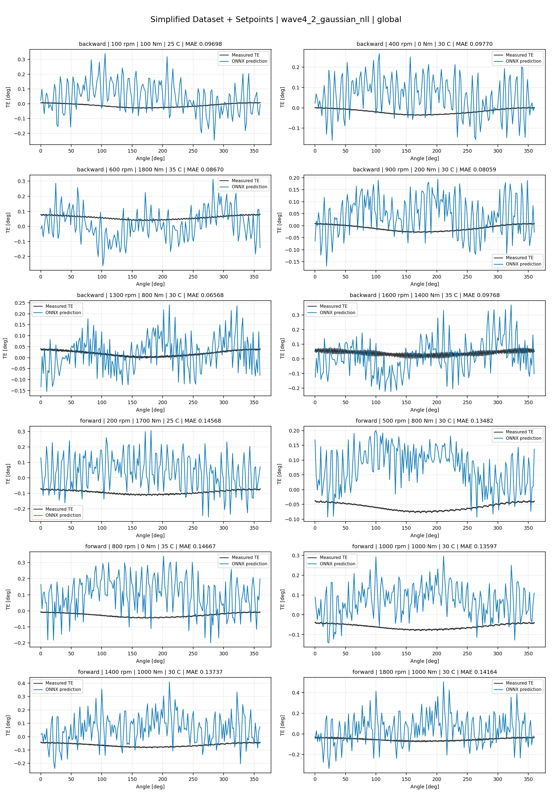
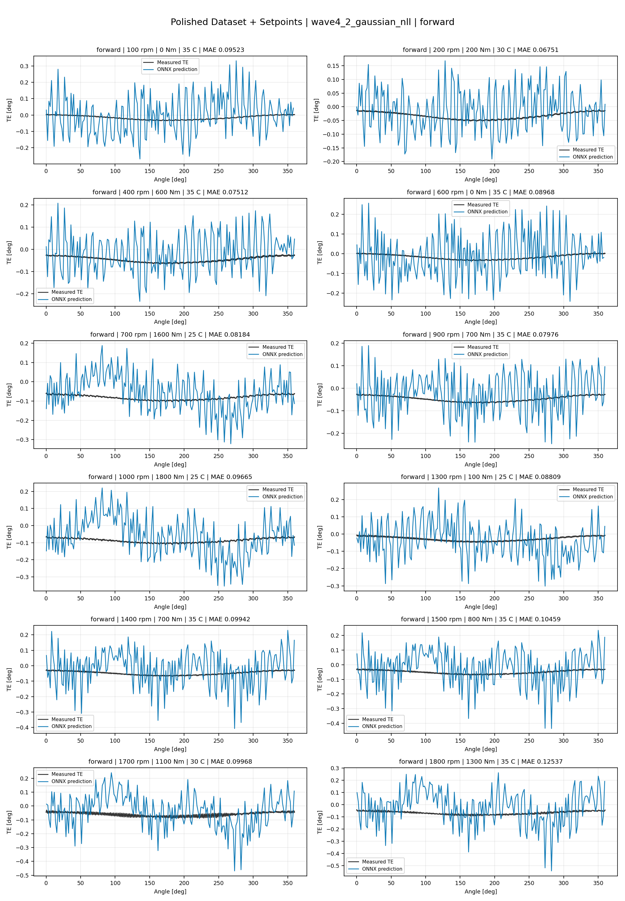
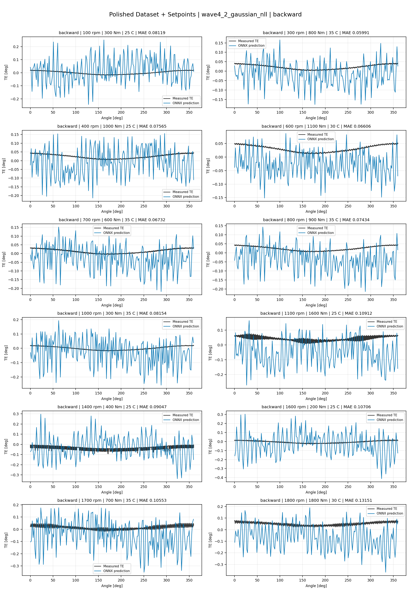
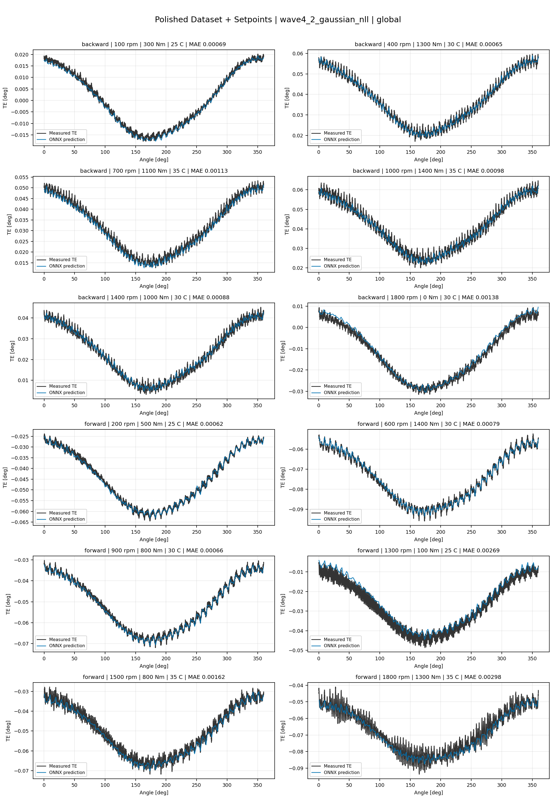
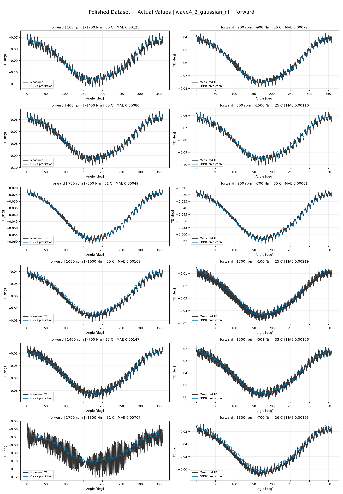
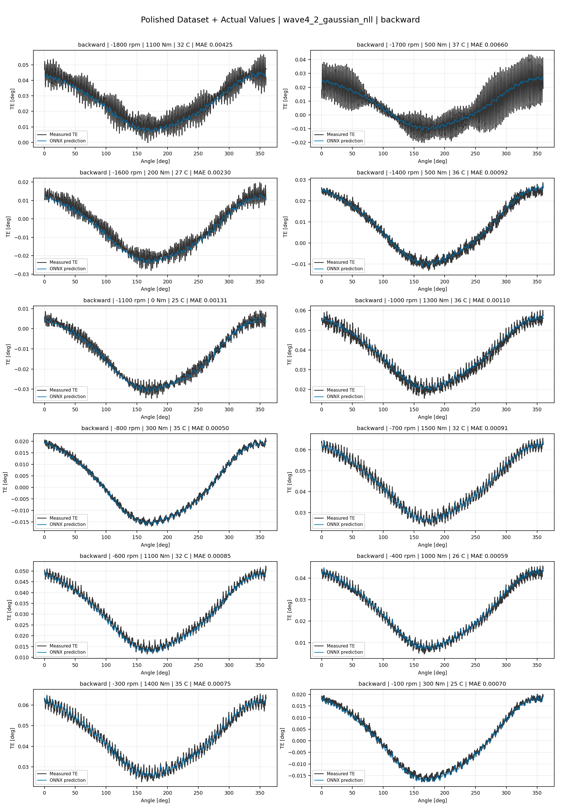
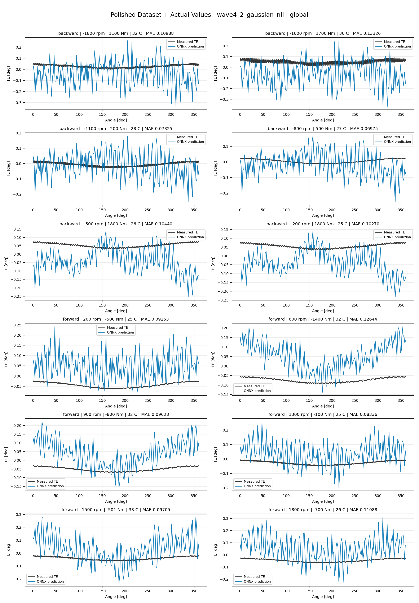

# TE Curve Verification Pipeline Familywise ONNX Report - wave4_2_gaussian_nll

## Overview

This report evaluates exported ONNX models from the dataset input-mode
retraining program. Each dataset/input-mode section uses dataset-matched
held-out test curves and lists the exact model artifacts loaded from
`models/`.

Rank-3 temporal ONNX exports are evaluated on the sequence-window test
contract stored in each `training_config.snapshot.yaml`, including
`sequence_length`, `sequence_stride`, `sequence_target_position`, and
`maximum_sequences_per_curve`.
The collage pages keep the measured TE trace at the original full-curve
resolution; temporal ONNX predictions are overlaid at the evaluated
sequence-target angles.

The report is diagnostic and family-specific. It does not replace an
official multi-index model-promotion decision.

## Output Artifacts

- output directory: `output/validation_checks/track2_familywise_onnx_report/wave4_2_gaussian_nll/2026-07-15-00-50-22__track2_wave4_2_gaussian_nll_familywise_onnx_report`;
- summary YAML: `output/validation_checks/track2_familywise_onnx_report/wave4_2_gaussian_nll/2026-07-15-00-50-22__track2_wave4_2_gaussian_nll_familywise_onnx_report/track2_familywise_onnx_report_summary.yaml`;
- model inventory CSV: `output/validation_checks/track2_familywise_onnx_report/wave4_2_gaussian_nll/2026-07-15-00-50-22__track2_wave4_2_gaussian_nll_familywise_onnx_report/model_inventory.csv`;
- per-curve metrics CSV: `output/validation_checks/track2_familywise_onnx_report/wave4_2_gaussian_nll/2026-07-15-00-50-22__track2_wave4_2_gaussian_nll_familywise_onnx_report/per_curve_metrics.csv`.

## Simplified Dataset + Setpoints

- dataset: `simplified_dataset`;
- input mode: `setpoints`;
- evaluated family: `wave4_2_gaussian_nll`;
- dataset root: `data/simplified_dataset`.

### Models Used

| Surface | Run Name | Run Instance | Dataset Schema |
| --- | --- | --- | --- |
| forward | `te_wave4_2_gaussian_nll_fw__simplified_setpoints` | `2026-07-14-18-14-13__te_wave4_2_gaussian_nll_fw__simplified_setpoints` | `simplified_curve_v1` |
| backward | `te_wave4_2_gaussian_nll_bw__simplified_setpoints` | `2026-07-14-18-22-47__te_wave4_2_gaussian_nll_bw__simplified_setpoints` | `simplified_curve_v1` |
| global | `te_wave4_2_gaussian_nll_global__simplified_setpoints` | `2026-07-14-18-05-51__te_wave4_2_gaussian_nll_global__simplified_setpoints` | `simplified_curve_v1` |

Exact model paths:

| Surface | ONNX Model Path | Python Model Path |
| --- | --- | --- |
| forward | `models/simplified_dataset/setpoints/wave4_2_gaussian_nll/forward/onnx/model.onnx` | `models/simplified_dataset/setpoints/wave4_2_gaussian_nll/forward/python/curve_aware_harmonic_residual_offset_probe-epoch=000-val_mae=0.09172054.ckpt` |
| backward | `models/simplified_dataset/setpoints/wave4_2_gaussian_nll/backward/onnx/model.onnx` | `models/simplified_dataset/setpoints/wave4_2_gaussian_nll/backward/python/curve_aware_harmonic_residual_offset_probe-epoch=000-val_mae=0.10096127.ckpt` |
| global | `models/simplified_dataset/setpoints/wave4_2_gaussian_nll/global/onnx/model.onnx` | `models/simplified_dataset/setpoints/wave4_2_gaussian_nll/global/python/curve_aware_harmonic_residual_offset_probe-epoch=000-val_mae=0.11074460.ckpt` |

### Aggregate Metrics

| Surface | Curves | MAE [deg] | RMSE [deg] | Mean Error [%] | P95 Error [%] |
| --- | ---: | ---: | ---: | ---: | ---: |
| forward | 97 | 0.082245 | 0.102432 | 194.276 | 270.351 |
| backward | 97 | 0.085830 | 0.105303 | 206.593 | 273.695 |
| global | 194 | 0.109411 | 0.131401 | 261.317 | 360.683 |

Offset And Shape Metrics:

| Surface | Signed Offset [deg] | Absolute Offset [deg] | Centered MAE [deg] | P2P Error [deg] |
| --- | ---: | ---: | ---: | ---: |
| forward | -0.004801 | 0.029124 | 0.078083 | 0.405986 |
| backward | 0.043939 | 0.043939 | 0.074643 | 0.404386 |
| global | 0.059129 | 0.074005 | 0.082555 | 0.463450 |

### Forward 12-Curve Page

### Backward 12-Curve Page

### Global 12-Curve Page

## Polished Dataset + Setpoints

- dataset: `polished_dataset`;
- input mode: `setpoints`;
- evaluated family: `wave4_2_gaussian_nll`;
- dataset root: `data/polished_dataset`.

### Models Used

| Surface | Run Name | Run Instance | Dataset Schema |
| --- | --- | --- | --- |
| forward | `te_wave4_2_gaussian_nll_fw__polished_setpoints` | `2026-07-14-19-42-55__te_wave4_2_gaussian_nll_fw__polished_setpoints` | `polished_setpoint_curve_v1` |
| backward | `te_wave4_2_gaussian_nll_bw__polished_setpoints` | `2026-07-14-19-52-54__te_wave4_2_gaussian_nll_bw__polished_setpoints` | `polished_setpoint_curve_v1` |
| global | `te_wave4_2_gaussian_nll_global__polished_setpoints` | `2026-07-14-18-46-23__te_wave4_2_gaussian_nll_global__polished_setpoints` | `polished_setpoint_curve_v1` |

Exact model paths:

| Surface | ONNX Model Path | Python Model Path |
| --- | --- | --- |
| forward | `models/polished_dataset/setpoints/wave4_2_gaussian_nll/forward/onnx/model.onnx` | `models/polished_dataset/setpoints/wave4_2_gaussian_nll/forward/python/curve_aware_harmonic_residual_offset_probe-epoch=001-val_mae=0.08819758.ckpt` |
| backward | `models/polished_dataset/setpoints/wave4_2_gaussian_nll/backward/onnx/model.onnx` | `models/polished_dataset/setpoints/wave4_2_gaussian_nll/backward/python/curve_aware_harmonic_residual_offset_probe-epoch=000-val_mae=0.08419463.ckpt` |
| global | `models/polished_dataset/setpoints/wave4_2_gaussian_nll/global/onnx/model.onnx` | `models/polished_dataset/setpoints/wave4_2_gaussian_nll/global/python/curve_aware_harmonic_residual_offset_probe-epoch=240-val_mae=0.00188169.ckpt` |

### Aggregate Metrics

| Surface | Curves | MAE [deg] | RMSE [deg] | Mean Error [%] | P95 Error [%] |
| --- | ---: | ---: | ---: | ---: | ---: |
| forward | 100 | 0.084405 | 0.104096 | 196.555 | 267.080 |
| backward | 94 | 0.089452 | 0.110313 | 205.340 | 267.531 |
| global | 194 | 0.002210 | 0.002606 | 4.396 | 11.075 |

Offset And Shape Metrics:

| Surface | Signed Offset [deg] | Absolute Offset [deg] | Centered MAE [deg] | P2P Error [deg] |
| --- | ---: | ---: | ---: | ---: |
| forward | 0.020395 | 0.021862 | 0.081161 | 0.481015 |
| backward | -0.051109 | 0.053138 | 0.073874 | 0.401005 |
| global | -0.000031 | 0.000976 | 0.001810 | 0.005167 |

### Forward 12-Curve Page

### Backward 12-Curve Page

### Global 12-Curve Page

## Polished Dataset + Actual Values

- dataset: `polished_dataset`;
- input mode: `actual_values`;
- evaluated family: `wave4_2_gaussian_nll`;
- dataset root: `data/polished_dataset`.

### Models Used

| Surface | Run Name | Run Instance | Dataset Schema |
| --- | --- | --- | --- |
| forward | `te_wave4_2_gaussian_nll_fw__polished_actual_values` | `2026-07-14-20-42-59__te_wave4_2_gaussian_nll_fw__polished_actual_values` | `polished_point_v1` |
| backward | `te_wave4_2_gaussian_nll_bw__polished_actual_values` | `2026-07-14-21-40-47__te_wave4_2_gaussian_nll_bw__polished_actual_values` | `polished_point_v1` |
| global | `te_wave4_2_gaussian_nll_global__polished_actual_values` | `2026-07-14-20-32-49__te_wave4_2_gaussian_nll_global__polished_actual_values` | `polished_point_v1` |

Exact model paths:

| Surface | ONNX Model Path | Python Model Path |
| --- | --- | --- |
| forward | `models/polished_dataset/actual_values/wave4_2_gaussian_nll/forward/onnx/model.onnx` | `models/polished_dataset/actual_values/wave4_2_gaussian_nll/forward/python/curve_aware_harmonic_residual_offset_probe-epoch=258-val_mae=0.00181578.ckpt` |
| backward | `models/polished_dataset/actual_values/wave4_2_gaussian_nll/backward/onnx/model.onnx` | `models/polished_dataset/actual_values/wave4_2_gaussian_nll/backward/python/curve_aware_harmonic_residual_offset_probe-epoch=255-val_mae=0.00180572.ckpt` |
| global | `models/polished_dataset/actual_values/wave4_2_gaussian_nll/global/onnx/model.onnx` | `models/polished_dataset/actual_values/wave4_2_gaussian_nll/global/python/curve_aware_harmonic_residual_offset_probe-epoch=000-val_mae=0.10197201.ckpt` |

### Aggregate Metrics

| Surface | Curves | MAE [deg] | RMSE [deg] | Mean Error [%] | P95 Error [%] |
| --- | ---: | ---: | ---: | ---: | ---: |
| forward | 100 | 0.001794 | 0.002146 | 3.899 | 9.847 |
| backward | 94 | 0.002327 | 0.002758 | 4.211 | 10.769 |
| global | 194 | 0.101119 | 0.121453 | 233.698 | 320.425 |

Offset And Shape Metrics:

| Surface | Signed Offset [deg] | Absolute Offset [deg] | Centered MAE [deg] | P2P Error [deg] |
| --- | ---: | ---: | ---: | ---: |
| forward | 0.000007 | 0.000775 | 0.001531 | 0.004301 |
| backward | 0.000232 | 0.000743 | 0.002062 | 0.005876 |
| global | 0.022821 | 0.077653 | 0.070505 | 0.405473 |

### Forward 12-Curve Page

### Backward 12-Curve Page

### Global 12-Curve Page

