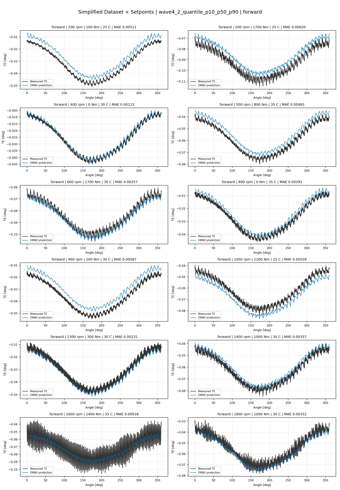
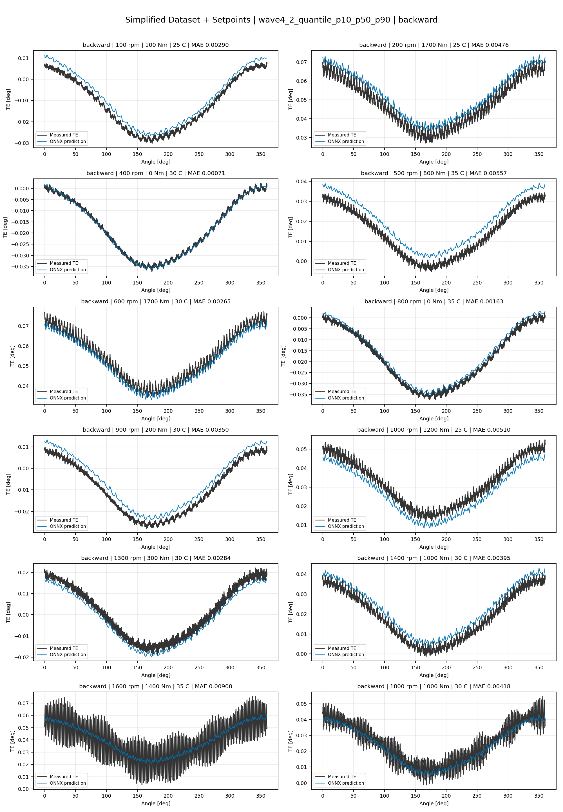
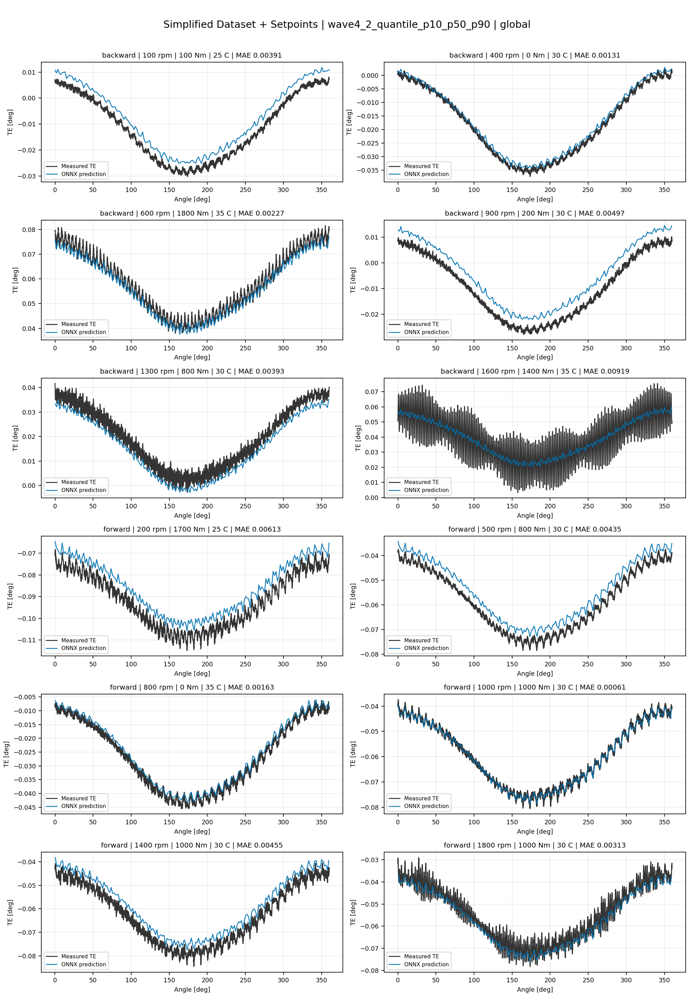
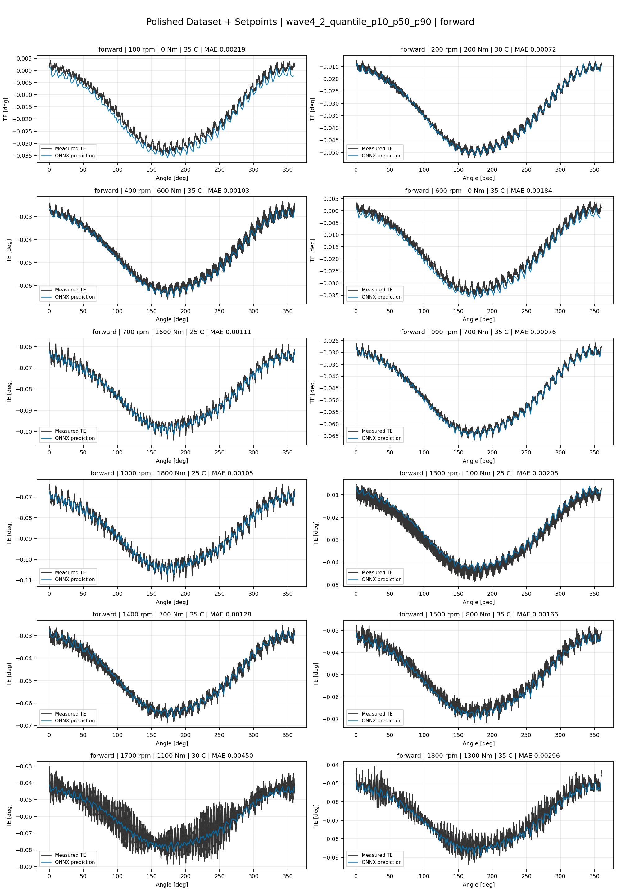
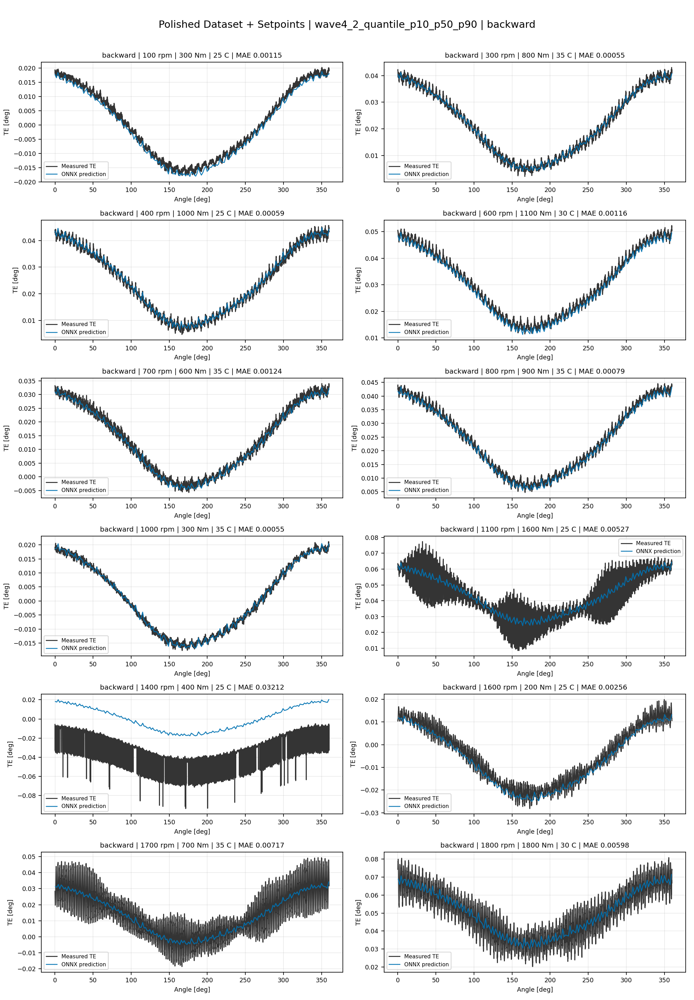
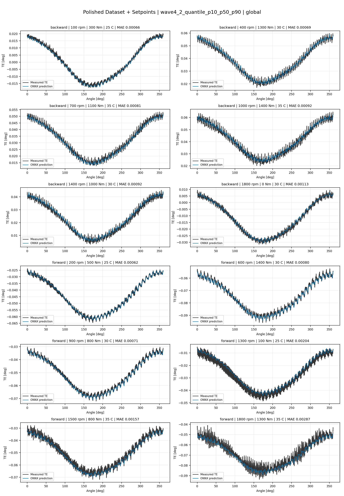
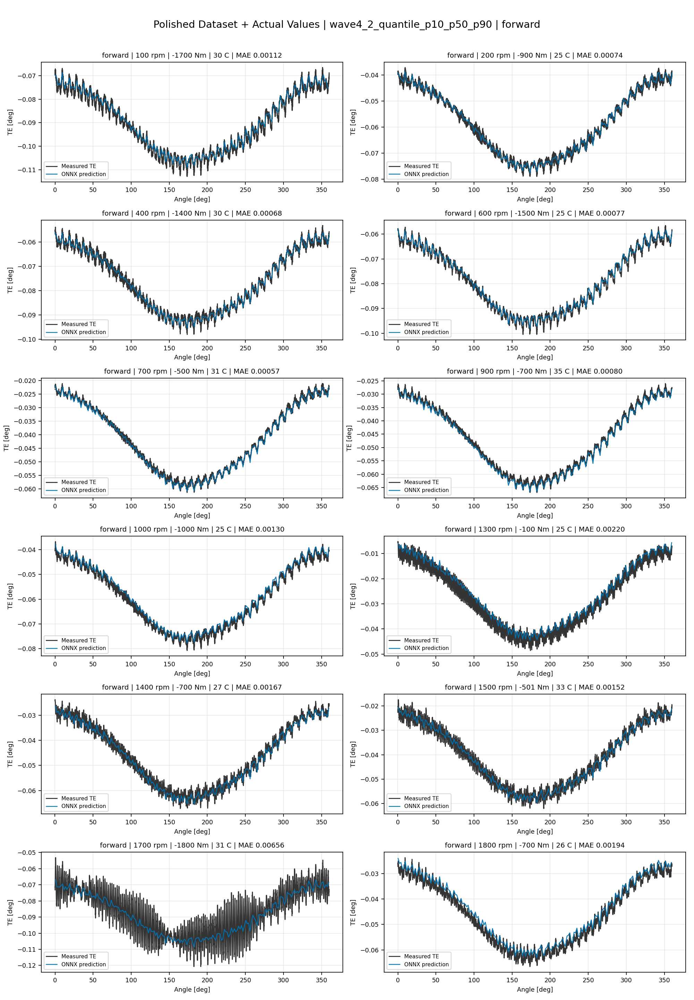
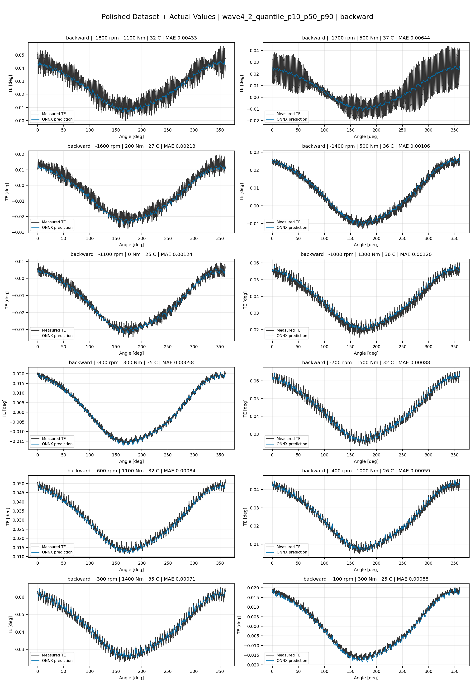
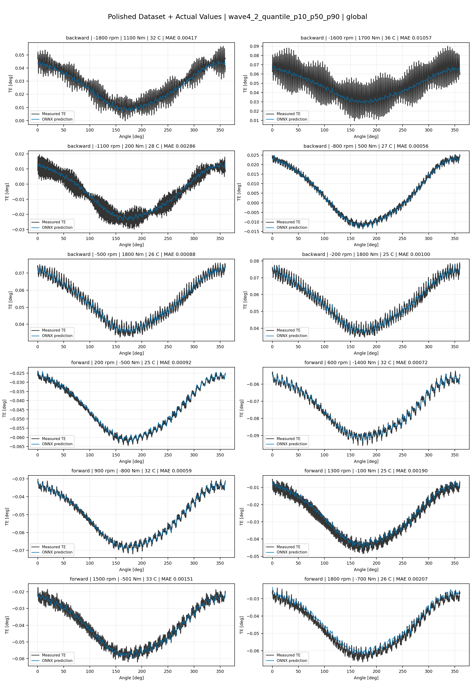

# TE Curve Verification Pipeline Familywise ONNX Report - wave4_2_quantile_p10_p50_p90

## Overview

This report evaluates exported ONNX models from the dataset input-mode
retraining program. Each dataset/input-mode section uses dataset-matched
held-out test curves and lists the exact model artifacts loaded from
`models/`.

Rank-3 temporal ONNX exports are evaluated on the sequence-window test
contract stored in each `training_config.snapshot.yaml`, including
`sequence_length`, `sequence_stride`, `sequence_target_position`, and
`maximum_sequences_per_curve`.
The collage pages keep the measured TE trace at the original full-curve
resolution; temporal ONNX predictions are overlaid at the evaluated
sequence-target angles.

The report is diagnostic and family-specific. It does not replace an
official multi-index model-promotion decision.

## Output Artifacts

- output directory: `output/validation_checks/track2_familywise_onnx_report/wave4_2_quantile_p10_p50_p90/2026-07-14-18-14-36__track2_wave4_2_quantile_p10_p50_p90_familywise_onnx_report`;
- summary YAML: `output/validation_checks/track2_familywise_onnx_report/wave4_2_quantile_p10_p50_p90/2026-07-14-18-14-36__track2_wave4_2_quantile_p10_p50_p90_familywise_onnx_report/track2_familywise_onnx_report_summary.yaml`;
- model inventory CSV: `output/validation_checks/track2_familywise_onnx_report/wave4_2_quantile_p10_p50_p90/2026-07-14-18-14-36__track2_wave4_2_quantile_p10_p50_p90_familywise_onnx_report/model_inventory.csv`;
- per-curve metrics CSV: `output/validation_checks/track2_familywise_onnx_report/wave4_2_quantile_p10_p50_p90/2026-07-14-18-14-36__track2_wave4_2_quantile_p10_p50_p90_familywise_onnx_report/per_curve_metrics.csv`.

## Simplified Dataset + Setpoints

- dataset: `simplified_dataset`;
- input mode: `setpoints`;
- evaluated family: `wave4_2_quantile_p10_p50_p90`;
- dataset root: `data/simplified_dataset`.

### Models Used

| Surface | Run Name | Run Instance | Dataset Schema |
| --- | --- | --- | --- |
| forward | `te_wave4_2_quantile_p10_p50_p90_fw__simplified_setpoints` | `2026-07-14-11-30-33__te_wave4_2_quantile_p10_p50_p90_fw__simplified_setpoints` | `simplified_curve_v1` |
| backward | `te_wave4_2_quantile_p10_p50_p90_bw__simplified_setpoints` | `2026-07-14-11-58-31__te_wave4_2_quantile_p10_p50_p90_bw__simplified_setpoints` | `simplified_curve_v1` |
| global | `te_wave4_2_quantile_p10_p50_p90_global__simplified_setpoints` | `2026-07-14-11-05-29__te_wave4_2_quantile_p10_p50_p90_global__simplified_setpoints` | `simplified_curve_v1` |

Exact model paths:

| Surface | ONNX Model Path | Python Model Path |
| --- | --- | --- |
| forward | `models/simplified_dataset/setpoints/wave4_2_quantile_p10_p50_p90/forward/onnx/model.onnx` | `models/simplified_dataset/setpoints/wave4_2_quantile_p10_p50_p90/forward/python/curve_aware_harmonic_residual_offset_probe-epoch=098-val_mae=0.00349706.ckpt` |
| backward | `models/simplified_dataset/setpoints/wave4_2_quantile_p10_p50_p90/backward/onnx/model.onnx` | `models/simplified_dataset/setpoints/wave4_2_quantile_p10_p50_p90/backward/python/curve_aware_harmonic_residual_offset_probe-epoch=087-val_mae=0.00355108.ckpt` |
| global | `models/simplified_dataset/setpoints/wave4_2_quantile_p10_p50_p90/global/onnx/model.onnx` | `models/simplified_dataset/setpoints/wave4_2_quantile_p10_p50_p90/global/python/curve_aware_harmonic_residual_offset_probe-epoch=096-val_mae=0.00351589.ckpt` |

### Aggregate Metrics

| Surface | Curves | MAE [deg] | RMSE [deg] | Mean Error [%] | P95 Error [%] |
| --- | ---: | ---: | ---: | ---: | ---: |
| forward | 97 | 0.003390 | 0.003653 | 7.944 | 14.140 |
| backward | 97 | 0.003476 | 0.003786 | 8.072 | 15.010 |
| global | 194 | 0.003378 | 0.003659 | 7.876 | 15.980 |

Offset And Shape Metrics:

| Surface | Signed Offset [deg] | Absolute Offset [deg] | Centered MAE [deg] | P2P Error [deg] |
| --- | ---: | ---: | ---: | ---: |
| forward | 0.000287 | 0.002984 | 0.001245 | 0.003167 |
| backward | 0.000280 | 0.002819 | 0.001513 | 0.003509 |
| global | 0.000684 | 0.002850 | 0.001355 | 0.003481 |

### Forward 12-Curve Page

### Backward 12-Curve Page

### Global 12-Curve Page

## Polished Dataset + Setpoints

- dataset: `polished_dataset`;
- input mode: `setpoints`;
- evaluated family: `wave4_2_quantile_p10_p50_p90`;
- dataset root: `data/polished_dataset`.

### Models Used

| Surface | Run Name | Run Instance | Dataset Schema |
| --- | --- | --- | --- |
| forward | `te_wave4_2_quantile_p10_p50_p90_fw__polished_setpoints` | `2026-07-14-13-15-27__te_wave4_2_quantile_p10_p50_p90_fw__polished_setpoints` | `polished_setpoint_curve_v1` |
| backward | `te_wave4_2_quantile_p10_p50_p90_bw__polished_setpoints` | `2026-07-14-13-54-54__te_wave4_2_quantile_p10_p50_p90_bw__polished_setpoints` | `polished_setpoint_curve_v1` |
| global | `te_wave4_2_quantile_p10_p50_p90_global__polished_setpoints` | `2026-07-14-12-41-50__te_wave4_2_quantile_p10_p50_p90_global__polished_setpoints` | `polished_setpoint_curve_v1` |

Exact model paths:

| Surface | ONNX Model Path | Python Model Path |
| --- | --- | --- |
| forward | `models/polished_dataset/setpoints/wave4_2_quantile_p10_p50_p90/forward/onnx/model.onnx` | `models/polished_dataset/setpoints/wave4_2_quantile_p10_p50_p90/forward/python/curve_aware_harmonic_residual_offset_probe-epoch=157-val_mae=0.00180121.ckpt` |
| backward | `models/polished_dataset/setpoints/wave4_2_quantile_p10_p50_p90/backward/onnx/model.onnx` | `models/polished_dataset/setpoints/wave4_2_quantile_p10_p50_p90/backward/python/curve_aware_harmonic_residual_offset_probe-epoch=063-val_mae=0.00181729.ckpt` |
| global | `models/polished_dataset/setpoints/wave4_2_quantile_p10_p50_p90/global/onnx/model.onnx` | `models/polished_dataset/setpoints/wave4_2_quantile_p10_p50_p90/global/python/curve_aware_harmonic_residual_offset_probe-epoch=109-val_mae=0.00179474.ckpt` |

### Aggregate Metrics

| Surface | Curves | MAE [deg] | RMSE [deg] | Mean Error [%] | P95 Error [%] |
| --- | ---: | ---: | ---: | ---: | ---: |
| forward | 100 | 0.001825 | 0.002180 | 3.979 | 9.470 |
| backward | 94 | 0.002476 | 0.002904 | 4.468 | 10.935 |
| global | 194 | 0.002095 | 0.002478 | 4.097 | 10.805 |

Offset And Shape Metrics:

| Surface | Signed Offset [deg] | Absolute Offset [deg] | Centered MAE [deg] | P2P Error [deg] |
| --- | ---: | ---: | ---: | ---: |
| forward | -0.000423 | 0.000898 | 0.001506 | 0.004174 |
| backward | 0.000308 | 0.000936 | 0.002077 | 0.005988 |
| global | 0.000043 | 0.000863 | 0.001766 | 0.005201 |

### Forward 12-Curve Page

### Backward 12-Curve Page

### Global 12-Curve Page

## Polished Dataset + Actual Values

- dataset: `polished_dataset`;
- input mode: `actual_values`;
- evaluated family: `wave4_2_quantile_p10_p50_p90`;
- dataset root: `data/polished_dataset`.

### Models Used

| Surface | Run Name | Run Instance | Dataset Schema |
| --- | --- | --- | --- |
| forward | `te_wave4_2_quantile_p10_p50_p90_fw__polished_actual_values` | `2026-07-14-16-15-03__te_wave4_2_quantile_p10_p50_p90_fw__polished_actual_values` | `polished_point_v1` |
| backward | `te_wave4_2_quantile_p10_p50_p90_bw__polished_actual_values` | `2026-07-14-17-11-13__te_wave4_2_quantile_p10_p50_p90_bw__polished_actual_values` | `polished_point_v1` |
| global | `te_wave4_2_quantile_p10_p50_p90_global__polished_actual_values` | `2026-07-14-15-32-15__te_wave4_2_quantile_p10_p50_p90_global__polished_actual_values` | `polished_point_v1` |

Exact model paths:

| Surface | ONNX Model Path | Python Model Path |
| --- | --- | --- |
| forward | `models/polished_dataset/actual_values/wave4_2_quantile_p10_p50_p90/forward/onnx/model.onnx` | `models/polished_dataset/actual_values/wave4_2_quantile_p10_p50_p90/forward/python/curve_aware_harmonic_residual_offset_probe-epoch=250-val_mae=0.00176755.ckpt` |
| backward | `models/polished_dataset/actual_values/wave4_2_quantile_p10_p50_p90/backward/onnx/model.onnx` | `models/polished_dataset/actual_values/wave4_2_quantile_p10_p50_p90/backward/python/curve_aware_harmonic_residual_offset_probe-epoch=123-val_mae=0.00178818.ckpt` |
| global | `models/polished_dataset/actual_values/wave4_2_quantile_p10_p50_p90/global/onnx/model.onnx` | `models/polished_dataset/actual_values/wave4_2_quantile_p10_p50_p90/global/python/curve_aware_harmonic_residual_offset_probe-epoch=180-val_mae=0.00177392.ckpt` |

### Aggregate Metrics

| Surface | Curves | MAE [deg] | RMSE [deg] | Mean Error [%] | P95 Error [%] |
| --- | ---: | ---: | ---: | ---: | ---: |
| forward | 100 | 0.001710 | 0.002057 | 3.698 | 9.059 |
| backward | 94 | 0.002179 | 0.002642 | 4.064 | 10.740 |
| global | 194 | 0.001934 | 0.002326 | 3.872 | 10.643 |

Offset And Shape Metrics:

| Surface | Signed Offset [deg] | Absolute Offset [deg] | Centered MAE [deg] | P2P Error [deg] |
| --- | ---: | ---: | ---: | ---: |
| forward | -0.000135 | 0.000705 | 0.001500 | 0.003818 |
| backward | 0.000090 | 0.000590 | 0.002099 | 0.006195 |
| global | -0.000035 | 0.000641 | 0.001772 | 0.004877 |

### Forward 12-Curve Page

### Backward 12-Curve Page

### Global 12-Curve Page

