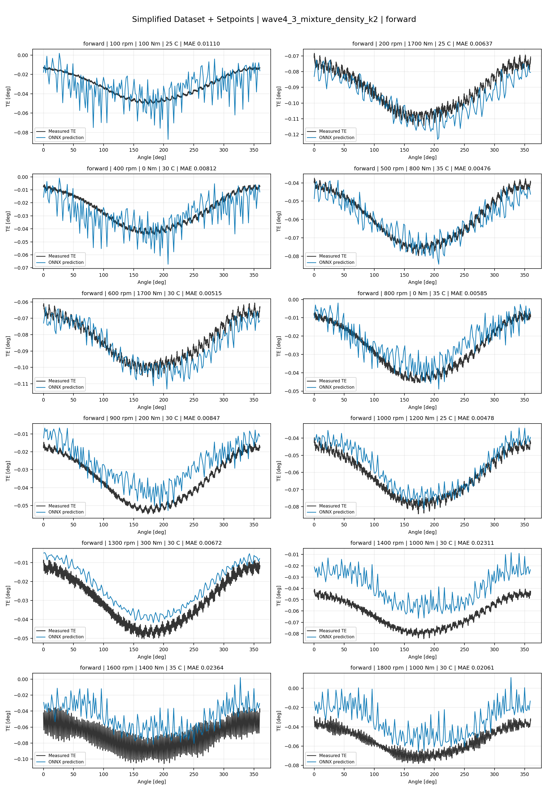
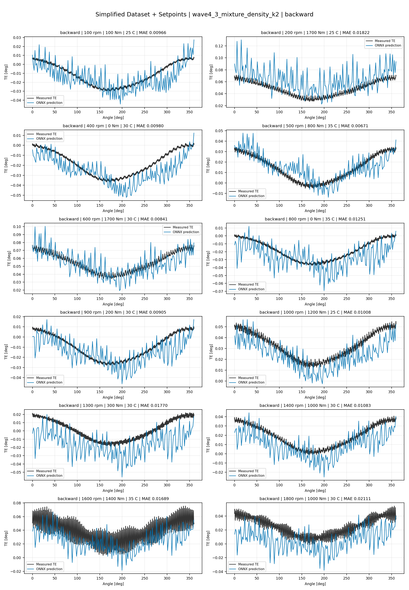
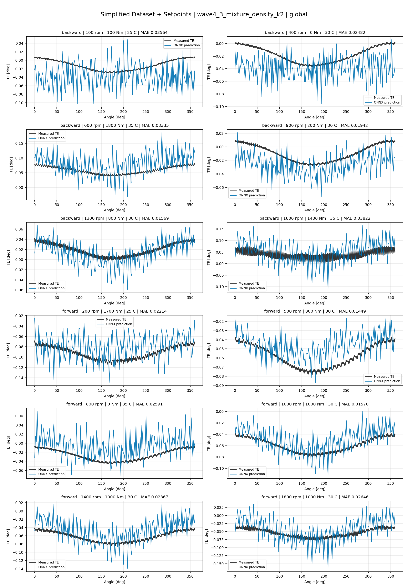
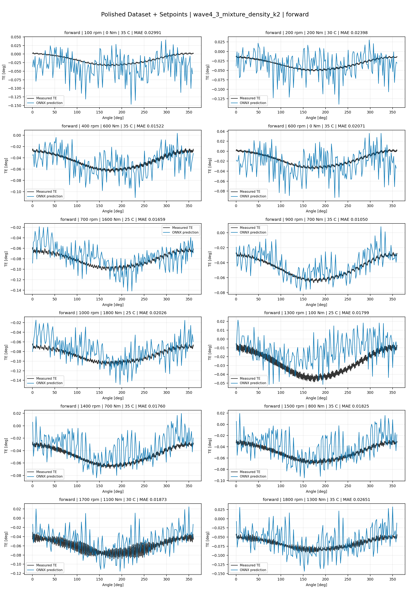
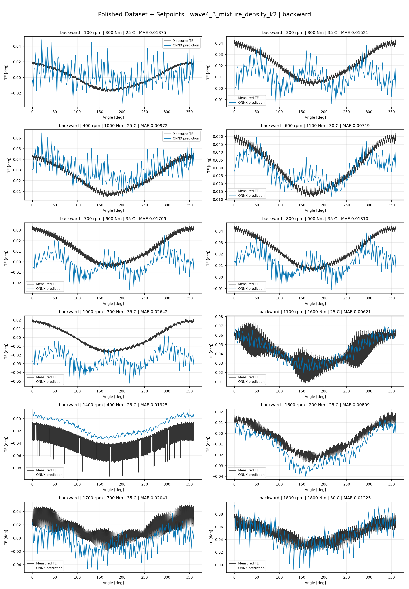
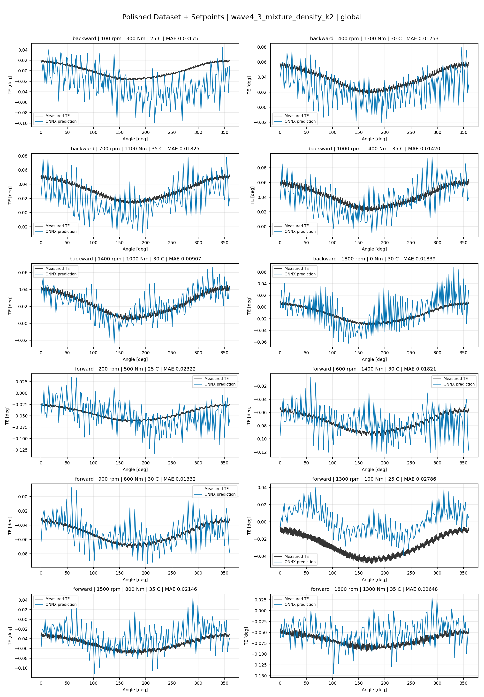
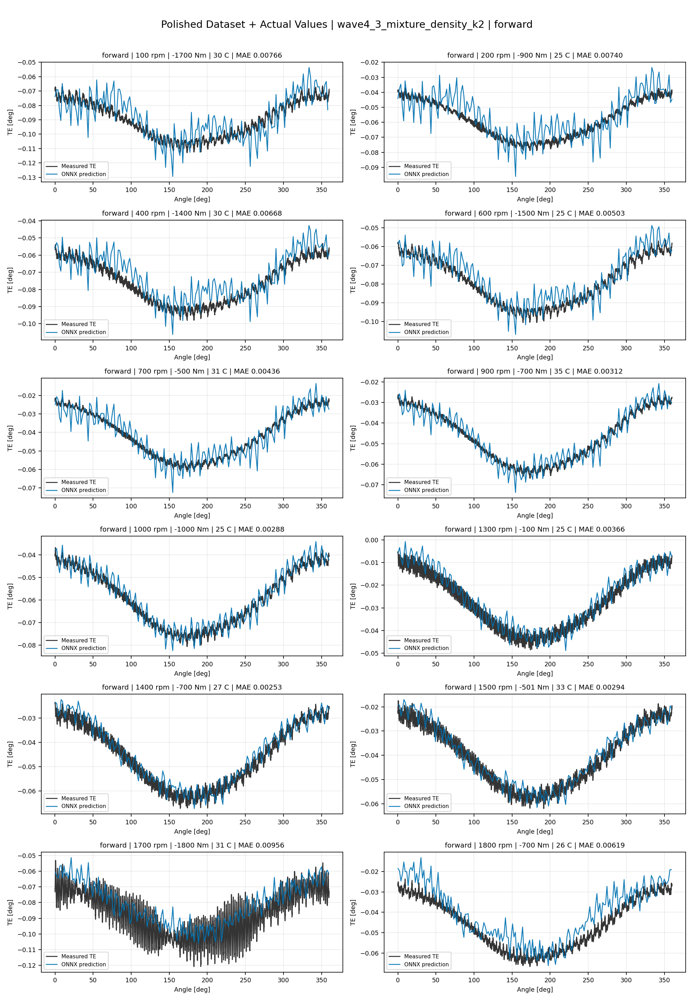
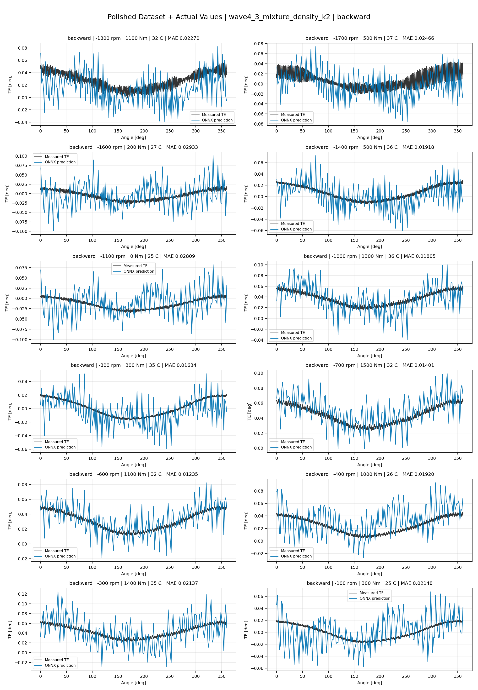
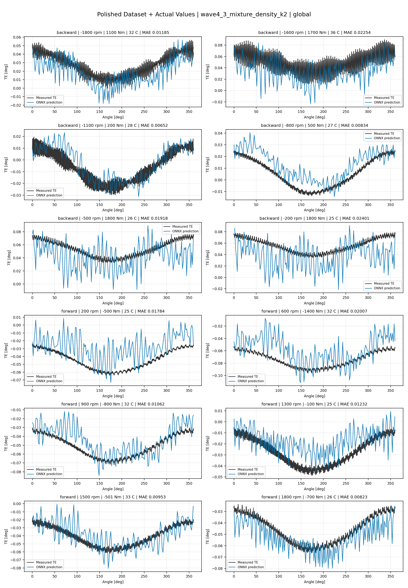

# TE Curve Verification Pipeline Familywise ONNX Report - wave4_3_mixture_density_k2

## Overview

This report evaluates exported ONNX models from the dataset input-mode
retraining program. Each dataset/input-mode section uses dataset-matched
held-out test curves and lists the exact model artifacts loaded from
`models/`.

Rank-3 temporal ONNX exports are evaluated on the sequence-window test
contract stored in each `training_config.snapshot.yaml`, including
`sequence_length`, `sequence_stride`, `sequence_target_position`, and
`maximum_sequences_per_curve`.
The collage pages keep the measured TE trace at the original full-curve
resolution; temporal ONNX predictions are overlaid at the evaluated
sequence-target angles.

MDN multi-output exports use the configured deterministic playback
channel `maximum_weight_component` when reducing component outputs to one
curve.

The report is diagnostic and family-specific. It does not replace an
official multi-index model-promotion decision.

## Output Artifacts

- output directory: `output/validation_checks/track2_familywise_onnx_report/wave4_3_mixture_density_k2/2026-07-20-12-56-40__track2_wave4_3_mixture_density_k2_familywise_onnx_report`;
- summary YAML: `output/validation_checks/track2_familywise_onnx_report/wave4_3_mixture_density_k2/2026-07-20-12-56-40__track2_wave4_3_mixture_density_k2_familywise_onnx_report/track2_familywise_onnx_report_summary.yaml`;
- model inventory CSV: `output/validation_checks/track2_familywise_onnx_report/wave4_3_mixture_density_k2/2026-07-20-12-56-40__track2_wave4_3_mixture_density_k2_familywise_onnx_report/model_inventory.csv`;
- per-curve metrics CSV: `output/validation_checks/track2_familywise_onnx_report/wave4_3_mixture_density_k2/2026-07-20-12-56-40__track2_wave4_3_mixture_density_k2_familywise_onnx_report/per_curve_metrics.csv`.

## Simplified Dataset + Setpoints

- dataset: `simplified_dataset`;
- input mode: `setpoints`;
- evaluated family: `wave4_3_mixture_density_k2`;
- dataset root: `data/simplified_dataset`.

### Models Used

| Surface | Run Name | Run Instance | Dataset Schema |
| --- | --- | --- | --- |
| forward | `te_wave4_3_mixture_density_k2_fw__simplified_setpoints` | `2026-07-14-23-46-20__te_wave4_3_mixture_density_k2_fw__simplified_setpoints` | `simplified_curve_v1` |
| backward | `te_wave4_3_mixture_density_k2_bw__simplified_setpoints` | `2026-07-15-00-37-24__te_wave4_3_mixture_density_k2_bw__simplified_setpoints` | `simplified_curve_v1` |
| global | `te_wave4_3_mixture_density_k2_global__simplified_setpoints` | `2026-07-14-22-56-56__te_wave4_3_mixture_density_k2_global__simplified_setpoints` | `simplified_curve_v1` |

Exact model paths:

| Surface | ONNX Model Path | Python Model Path |
| --- | --- | --- |
| forward | `models/simplified_dataset/setpoints/wave4_3_mixture_density_k2/forward/onnx/model.onnx` | `models/simplified_dataset/setpoints/wave4_3_mixture_density_k2/forward/python/curve_aware_harmonic_residual_offset_probe-epoch=258-val_mae=0.00346706.ckpt` |
| backward | `models/simplified_dataset/setpoints/wave4_3_mixture_density_k2/backward/onnx/model.onnx` | `models/simplified_dataset/setpoints/wave4_3_mixture_density_k2/backward/python/curve_aware_harmonic_residual_offset_probe-epoch=185-val_mae=0.00360751.ckpt` |
| global | `models/simplified_dataset/setpoints/wave4_3_mixture_density_k2/global/onnx/model.onnx` | `models/simplified_dataset/setpoints/wave4_3_mixture_density_k2/global/python/curve_aware_harmonic_residual_offset_probe-epoch=237-val_mae=0.00346790.ckpt` |

### Aggregate Metrics

| Surface | Curves | MAE [deg] | RMSE [deg] | Mean Error [%] | P95 Error [%] |
| --- | ---: | ---: | ---: | ---: | ---: |
| forward | 97 | 0.002994 | 0.003265 | 6.986 | 14.094 |
| backward | 97 | 0.003497 | 0.003808 | 8.129 | 15.260 |
| global | 194 | 0.003240 | 0.003529 | 7.508 | 13.522 |

Offset And Shape Metrics:

| Surface | Signed Offset [deg] | Absolute Offset [deg] | Centered MAE [deg] | P2P Error [deg] |
| --- | ---: | ---: | ---: | ---: |
| forward | 0.000488 | 0.002525 | 0.001239 | 0.003018 |
| backward | 0.000896 | 0.002857 | 0.001512 | 0.003335 |
| global | -0.000130 | 0.002721 | 0.001373 | 0.003544 |

### Forward 12-Curve Page

### Backward 12-Curve Page

### Global 12-Curve Page

## Polished Dataset + Setpoints

- dataset: `polished_dataset`;
- input mode: `setpoints`;
- evaluated family: `wave4_3_mixture_density_k2`;
- dataset root: `data/polished_dataset`.

### Models Used

| Surface | Run Name | Run Instance | Dataset Schema |
| --- | --- | --- | --- |
| forward | `te_wave4_3_mixture_density_k2_fw__polished_setpoints` | `2026-07-15-02-19-32__te_wave4_3_mixture_density_k2_fw__polished_setpoints` | `polished_setpoint_curve_v1` |
| backward | `te_wave4_3_mixture_density_k2_bw__polished_setpoints` | `2026-07-15-02-51-55__te_wave4_3_mixture_density_k2_bw__polished_setpoints` | `polished_setpoint_curve_v1` |
| global | `te_wave4_3_mixture_density_k2_global__polished_setpoints` | `2026-07-15-01-42-15__te_wave4_3_mixture_density_k2_global__polished_setpoints` | `polished_setpoint_curve_v1` |

Exact model paths:

| Surface | ONNX Model Path | Python Model Path |
| --- | --- | --- |
| forward | `models/polished_dataset/setpoints/wave4_3_mixture_density_k2/forward/onnx/model.onnx` | `models/polished_dataset/setpoints/wave4_3_mixture_density_k2/forward/python/curve_aware_harmonic_residual_offset_probe-epoch=101-val_mae=0.00184963.ckpt` |
| backward | `models/polished_dataset/setpoints/wave4_3_mixture_density_k2/backward/onnx/model.onnx` | `models/polished_dataset/setpoints/wave4_3_mixture_density_k2/backward/python/curve_aware_harmonic_residual_offset_probe-epoch=173-val_mae=0.00181733.ckpt` |
| global | `models/polished_dataset/setpoints/wave4_3_mixture_density_k2/global/onnx/model.onnx` | `models/polished_dataset/setpoints/wave4_3_mixture_density_k2/global/python/curve_aware_harmonic_residual_offset_probe-epoch=122-val_mae=0.00186311.ckpt` |

### Aggregate Metrics

| Surface | Curves | MAE [deg] | RMSE [deg] | Mean Error [%] | P95 Error [%] |
| --- | ---: | ---: | ---: | ---: | ---: |
| forward | 100 | 0.001829 | 0.002185 | 3.990 | 9.554 |
| backward | 94 | 0.002449 | 0.002881 | 4.376 | 10.908 |
| global | 194 | 0.002207 | 0.002602 | 4.365 | 10.832 |

Offset And Shape Metrics:

| Surface | Signed Offset [deg] | Absolute Offset [deg] | Centered MAE [deg] | P2P Error [deg] |
| --- | ---: | ---: | ---: | ---: |
| forward | -0.000288 | 0.000830 | 0.001529 | 0.004313 |
| backward | 0.000260 | 0.000945 | 0.002086 | 0.006232 |
| global | -0.000206 | 0.001090 | 0.001765 | 0.005126 |

### Forward 12-Curve Page

### Backward 12-Curve Page

### Global 12-Curve Page

## Polished Dataset + Actual Values

- dataset: `polished_dataset`;
- input mode: `actual_values`;
- evaluated family: `wave4_3_mixture_density_k2`;
- dataset root: `data/polished_dataset`.

### Models Used

| Surface | Run Name | Run Instance | Dataset Schema |
| --- | --- | --- | --- |
| forward | `te_wave4_3_mixture_density_k2_fw__polished_actual_values` | `2026-07-15-05-01-50__te_wave4_3_mixture_density_k2_fw__polished_actual_values` | `polished_point_v1` |
| backward | `te_wave4_3_mixture_density_k2_bw__polished_actual_values` | `2026-07-15-06-02-16__te_wave4_3_mixture_density_k2_bw__polished_actual_values` | `polished_point_v1` |
| global | `te_wave4_3_mixture_density_k2_global__polished_actual_values` | `2026-07-15-04-04-29__te_wave4_3_mixture_density_k2_global__polished_actual_values` | `polished_point_v1` |

Exact model paths:

| Surface | ONNX Model Path | Python Model Path |
| --- | --- | --- |
| forward | `models/polished_dataset/actual_values/wave4_3_mixture_density_k2/forward/onnx/model.onnx` | `models/polished_dataset/actual_values/wave4_3_mixture_density_k2/forward/python/curve_aware_harmonic_residual_offset_probe-epoch=256-val_mae=0.00172453.ckpt` |
| backward | `models/polished_dataset/actual_values/wave4_3_mixture_density_k2/backward/onnx/model.onnx` | `models/polished_dataset/actual_values/wave4_3_mixture_density_k2/backward/python/curve_aware_harmonic_residual_offset_probe-epoch=129-val_mae=0.00180093.ckpt` |
| global | `models/polished_dataset/actual_values/wave4_3_mixture_density_k2/global/onnx/model.onnx` | `models/polished_dataset/actual_values/wave4_3_mixture_density_k2/global/python/curve_aware_harmonic_residual_offset_probe-epoch=252-val_mae=0.00175520.ckpt` |

### Aggregate Metrics

| Surface | Curves | MAE [deg] | RMSE [deg] | Mean Error [%] | P95 Error [%] |
| --- | ---: | ---: | ---: | ---: | ---: |
| forward | 100 | 0.001679 | 0.002025 | 3.603 | 9.146 |
| backward | 94 | 0.002391 | 0.002822 | 4.327 | 10.790 |
| global | 194 | 0.001990 | 0.002398 | 3.889 | 10.567 |

Offset And Shape Metrics:

| Surface | Signed Offset [deg] | Absolute Offset [deg] | Centered MAE [deg] | P2P Error [deg] |
| --- | ---: | ---: | ---: | ---: |
| forward | -0.000162 | 0.000670 | 0.001508 | 0.003909 |
| backward | 0.000291 | 0.000839 | 0.002054 | 0.005978 |
| global | -0.000148 | 0.000626 | 0.001843 | 0.005603 |

### Forward 12-Curve Page

### Backward 12-Curve Page

### Global 12-Curve Page

