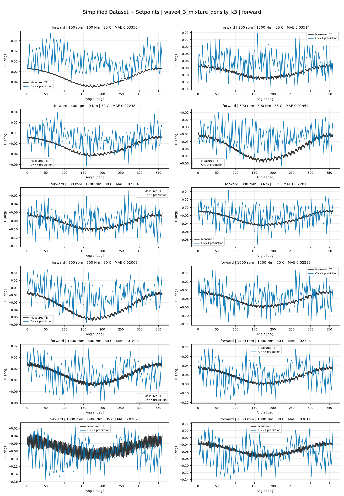
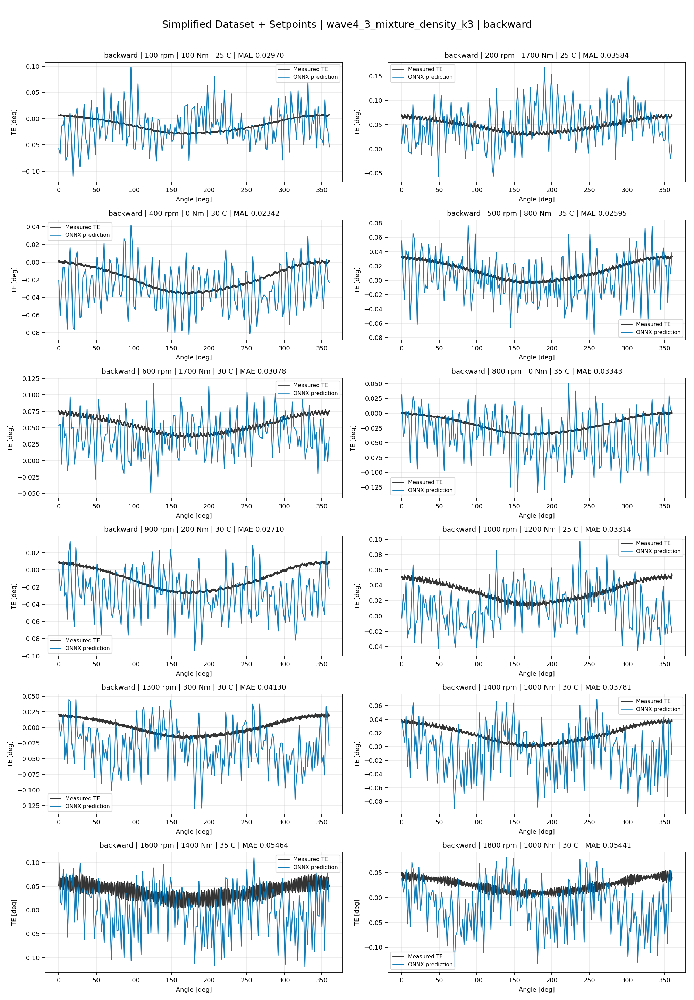
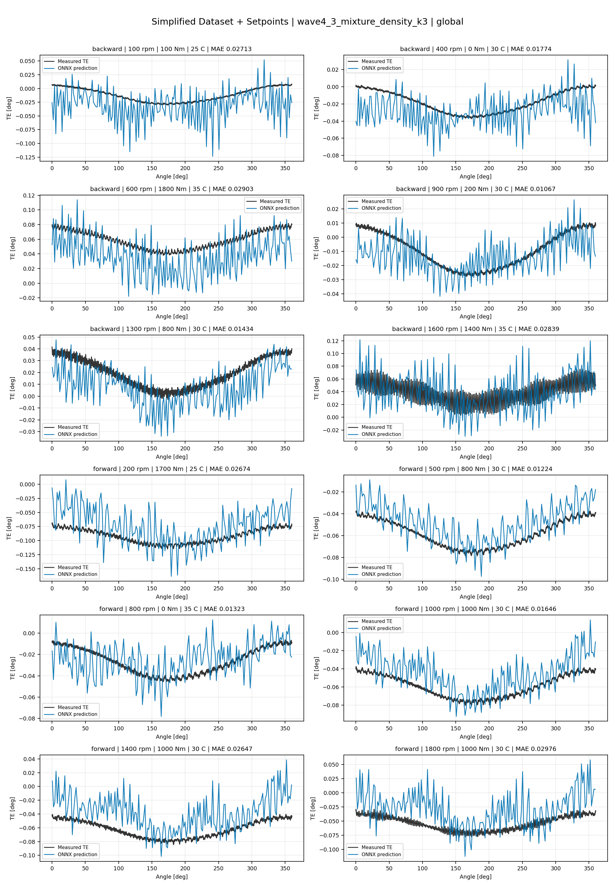
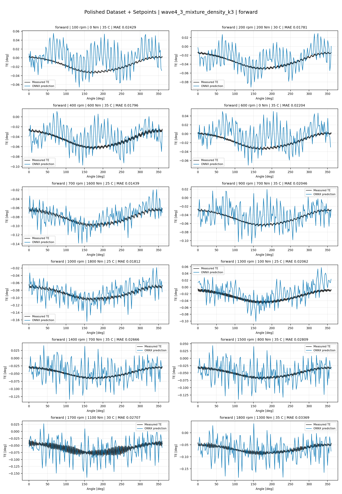
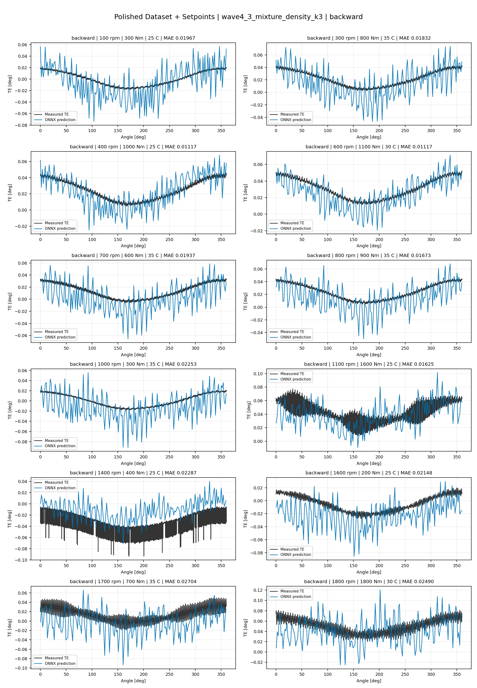
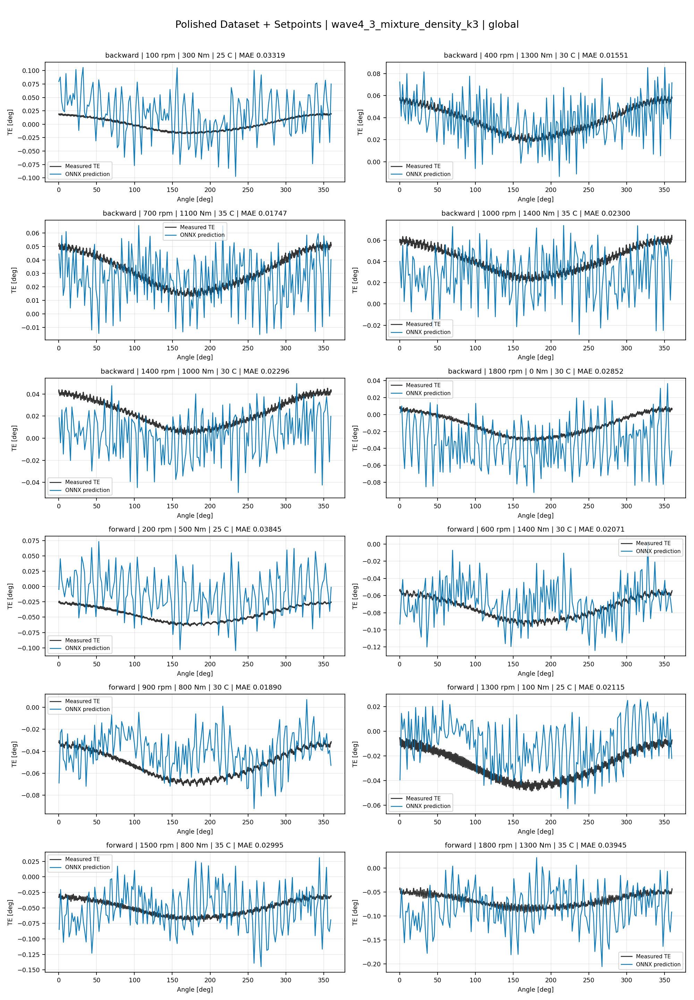
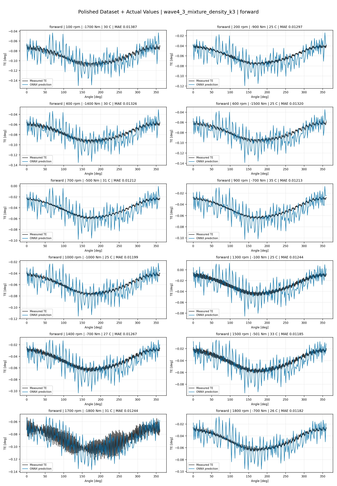
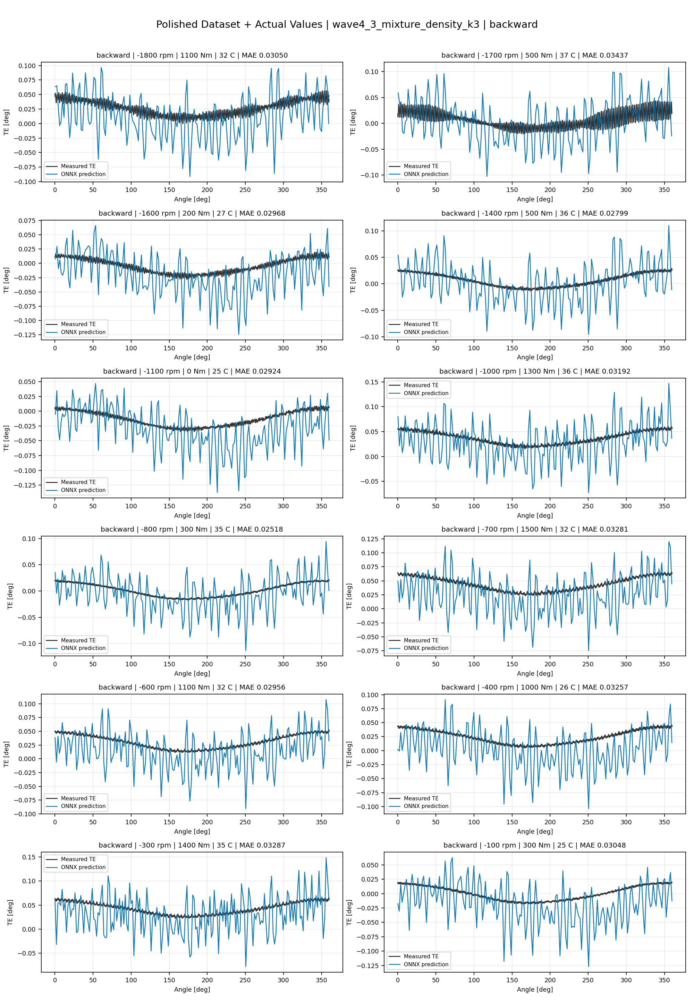
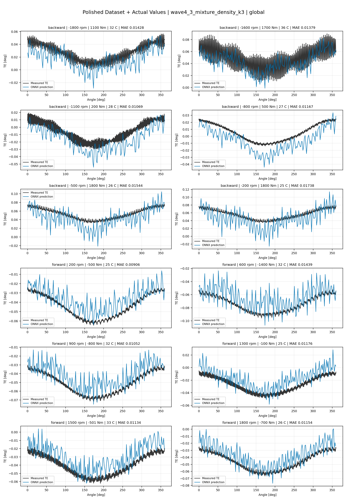

# TE Curve Verification Pipeline Familywise ONNX Report - wave4_3_mixture_density_k3

## Overview

This report evaluates exported ONNX models from the dataset input-mode
retraining program. Each dataset/input-mode section uses dataset-matched
held-out test curves and lists the exact model artifacts loaded from
`models/`.

Rank-3 temporal ONNX exports are evaluated on the sequence-window test
contract stored in each `training_config.snapshot.yaml`, including
`sequence_length`, `sequence_stride`, `sequence_target_position`, and
`maximum_sequences_per_curve`.
The collage pages keep the measured TE trace at the original full-curve
resolution; temporal ONNX predictions are overlaid at the evaluated
sequence-target angles.

MDN multi-output exports use the configured deterministic playback
channel `maximum_weight_component` when reducing component outputs to one
curve.

The report is diagnostic and family-specific. It does not replace an
official multi-index model-promotion decision.

## Output Artifacts

- output directory: `output/validation_checks/track2_familywise_onnx_report/wave4_3_mixture_density_k3/2026-07-20-13-06-10__track2_wave4_3_mixture_density_k3_familywise_onnx_report`;
- summary YAML: `output/validation_checks/track2_familywise_onnx_report/wave4_3_mixture_density_k3/2026-07-20-13-06-10__track2_wave4_3_mixture_density_k3_familywise_onnx_report/track2_familywise_onnx_report_summary.yaml`;
- model inventory CSV: `output/validation_checks/track2_familywise_onnx_report/wave4_3_mixture_density_k3/2026-07-20-13-06-10__track2_wave4_3_mixture_density_k3_familywise_onnx_report/model_inventory.csv`;
- per-curve metrics CSV: `output/validation_checks/track2_familywise_onnx_report/wave4_3_mixture_density_k3/2026-07-20-13-06-10__track2_wave4_3_mixture_density_k3_familywise_onnx_report/per_curve_metrics.csv`.

## Simplified Dataset + Setpoints

- dataset: `simplified_dataset`;
- input mode: `setpoints`;
- evaluated family: `wave4_3_mixture_density_k3`;
- dataset root: `data/simplified_dataset`.

### Models Used

| Surface | Run Name | Run Instance | Dataset Schema |
| --- | --- | --- | --- |
| forward | `te_wave4_3_mixture_density_k3_fw__simplified_setpoints` | `2026-07-15-10-35-14__te_wave4_3_mixture_density_k3_fw__simplified_setpoints` | `simplified_curve_v1` |
| backward | `te_wave4_3_mixture_density_k3_bw__simplified_setpoints` | `2026-07-15-10-57-54__te_wave4_3_mixture_density_k3_bw__simplified_setpoints` | `simplified_curve_v1` |
| global | `te_wave4_3_mixture_density_k3_global__simplified_setpoints` | `2026-07-15-10-10-10__te_wave4_3_mixture_density_k3_global__simplified_setpoints` | `simplified_curve_v1` |

Exact model paths:

| Surface | ONNX Model Path | Python Model Path |
| --- | --- | --- |
| forward | `models/simplified_dataset/setpoints/wave4_3_mixture_density_k3/forward/onnx/model.onnx` | `models/simplified_dataset/setpoints/wave4_3_mixture_density_k3/forward/python/curve_aware_harmonic_residual_offset_probe-epoch=077-val_mae=0.00357399.ckpt` |
| backward | `models/simplified_dataset/setpoints/wave4_3_mixture_density_k3/backward/onnx/model.onnx` | `models/simplified_dataset/setpoints/wave4_3_mixture_density_k3/backward/python/curve_aware_harmonic_residual_offset_probe-epoch=083-val_mae=0.00361315.ckpt` |
| global | `models/simplified_dataset/setpoints/wave4_3_mixture_density_k3/global/onnx/model.onnx` | `models/simplified_dataset/setpoints/wave4_3_mixture_density_k3/global/python/curve_aware_harmonic_residual_offset_probe-epoch=103-val_mae=0.00358189.ckpt` |

### Aggregate Metrics

| Surface | Curves | MAE [deg] | RMSE [deg] | Mean Error [%] | P95 Error [%] |
| --- | ---: | ---: | ---: | ---: | ---: |
| forward | 97 | 0.003278 | 0.003543 | 7.667 | 13.348 |
| backward | 97 | 0.003658 | 0.003971 | 8.522 | 16.529 |
| global | 194 | 0.003456 | 0.003746 | 8.059 | 15.878 |

Offset And Shape Metrics:

| Surface | Signed Offset [deg] | Absolute Offset [deg] | Centered MAE [deg] | P2P Error [deg] |
| --- | ---: | ---: | ---: | ---: |
| forward | 0.000276 | 0.002902 | 0.001228 | 0.003224 |
| backward | 0.001087 | 0.003037 | 0.001527 | 0.003435 |
| global | 0.000461 | 0.002936 | 0.001373 | 0.003475 |

### Forward 12-Curve Page

### Backward 12-Curve Page

### Global 12-Curve Page

## Polished Dataset + Setpoints

- dataset: `polished_dataset`;
- input mode: `setpoints`;
- evaluated family: `wave4_3_mixture_density_k3`;
- dataset root: `data/polished_dataset`.

### Models Used

| Surface | Run Name | Run Instance | Dataset Schema |
| --- | --- | --- | --- |
| forward | `te_wave4_3_mixture_density_k3_fw__polished_setpoints` | `2026-07-15-12-21-49__te_wave4_3_mixture_density_k3_fw__polished_setpoints` | `polished_setpoint_curve_v1` |
| backward | `te_wave4_3_mixture_density_k3_bw__polished_setpoints` | `2026-07-15-12-55-40__te_wave4_3_mixture_density_k3_bw__polished_setpoints` | `polished_setpoint_curve_v1` |
| global | `te_wave4_3_mixture_density_k3_global__polished_setpoints` | `2026-07-15-11-41-10__te_wave4_3_mixture_density_k3_global__polished_setpoints` | `polished_setpoint_curve_v1` |

Exact model paths:

| Surface | ONNX Model Path | Python Model Path |
| --- | --- | --- |
| forward | `models/polished_dataset/setpoints/wave4_3_mixture_density_k3/forward/onnx/model.onnx` | `models/polished_dataset/setpoints/wave4_3_mixture_density_k3/forward/python/curve_aware_harmonic_residual_offset_probe-epoch=140-val_mae=0.00184649.ckpt` |
| backward | `models/polished_dataset/setpoints/wave4_3_mixture_density_k3/backward/onnx/model.onnx` | `models/polished_dataset/setpoints/wave4_3_mixture_density_k3/backward/python/curve_aware_harmonic_residual_offset_probe-epoch=166-val_mae=0.00183407.ckpt` |
| global | `models/polished_dataset/setpoints/wave4_3_mixture_density_k3/global/onnx/model.onnx` | `models/polished_dataset/setpoints/wave4_3_mixture_density_k3/global/python/curve_aware_harmonic_residual_offset_probe-epoch=177-val_mae=0.00183826.ckpt` |

### Aggregate Metrics

| Surface | Curves | MAE [deg] | RMSE [deg] | Mean Error [%] | P95 Error [%] |
| --- | ---: | ---: | ---: | ---: | ---: |
| forward | 100 | 0.001734 | 0.002070 | 3.755 | 9.329 |
| backward | 94 | 0.002412 | 0.002825 | 4.298 | 10.658 |
| global | 194 | 0.002122 | 0.002506 | 4.160 | 10.932 |

Offset And Shape Metrics:

| Surface | Signed Offset [deg] | Absolute Offset [deg] | Centered MAE [deg] | P2P Error [deg] |
| --- | ---: | ---: | ---: | ---: |
| forward | -0.000378 | 0.000788 | 0.001462 | 0.003766 |
| backward | 0.000260 | 0.000857 | 0.002026 | 0.006130 |
| global | 0.000008 | 0.000870 | 0.001774 | 0.005189 |

### Forward 12-Curve Page

### Backward 12-Curve Page

### Global 12-Curve Page

## Polished Dataset + Actual Values

- dataset: `polished_dataset`;
- input mode: `actual_values`;
- evaluated family: `wave4_3_mixture_density_k3`;
- dataset root: `data/polished_dataset`.

### Models Used

| Surface | Run Name | Run Instance | Dataset Schema |
| --- | --- | --- | --- |
| forward | `te_wave4_3_mixture_density_k3_fw__polished_actual_values` | `2026-07-15-14-39-00__te_wave4_3_mixture_density_k3_fw__polished_actual_values` | `polished_point_v1` |
| backward | `te_wave4_3_mixture_density_k3_bw__polished_actual_values` | `2026-07-15-15-39-35__te_wave4_3_mixture_density_k3_bw__polished_actual_values` | `polished_point_v1` |
| global | `te_wave4_3_mixture_density_k3_global__polished_actual_values` | `2026-07-15-13-58-20__te_wave4_3_mixture_density_k3_global__polished_actual_values` | `polished_point_v1` |

Exact model paths:

| Surface | ONNX Model Path | Python Model Path |
| --- | --- | --- |
| forward | `models/polished_dataset/actual_values/wave4_3_mixture_density_k3/forward/onnx/model.onnx` | `models/polished_dataset/actual_values/wave4_3_mixture_density_k3/forward/python/curve_aware_harmonic_residual_offset_probe-epoch=240-val_mae=0.00161545.ckpt` |
| backward | `models/polished_dataset/actual_values/wave4_3_mixture_density_k3/backward/onnx/model.onnx` | `models/polished_dataset/actual_values/wave4_3_mixture_density_k3/backward/python/curve_aware_harmonic_residual_offset_probe-epoch=076-val_mae=0.00181385.ckpt` |
| global | `models/polished_dataset/actual_values/wave4_3_mixture_density_k3/global/onnx/model.onnx` | `models/polished_dataset/actual_values/wave4_3_mixture_density_k3/global/python/curve_aware_harmonic_residual_offset_probe-epoch=164-val_mae=0.00178681.ckpt` |

### Aggregate Metrics

| Surface | Curves | MAE [deg] | RMSE [deg] | Mean Error [%] | P95 Error [%] |
| --- | ---: | ---: | ---: | ---: | ---: |
| forward | 100 | 0.001722 | 0.002070 | 3.695 | 10.655 |
| backward | 94 | 0.002452 | 0.002890 | 4.398 | 10.852 |
| global | 194 | 0.002022 | 0.002440 | 3.958 | 10.445 |

Offset And Shape Metrics:

| Surface | Signed Offset [deg] | Absolute Offset [deg] | Centered MAE [deg] | P2P Error [deg] |
| --- | ---: | ---: | ---: | ---: |
| forward | -0.000285 | 0.000720 | 0.001496 | 0.003302 |
| backward | 0.000310 | 0.000914 | 0.002101 | 0.006586 |
| global | 0.000084 | 0.000648 | 0.001850 | 0.005788 |

### Forward 12-Curve Page

### Backward 12-Curve Page

### Global 12-Curve Page

