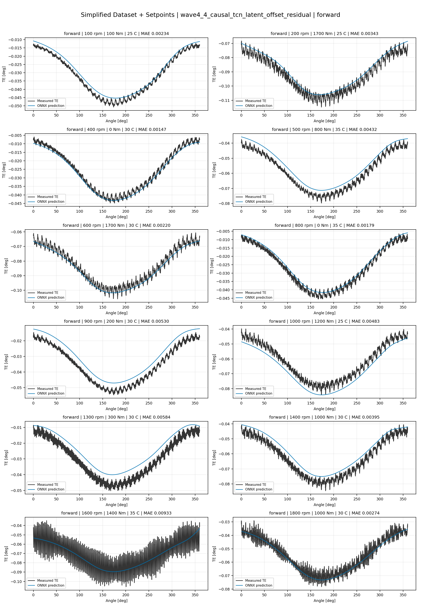
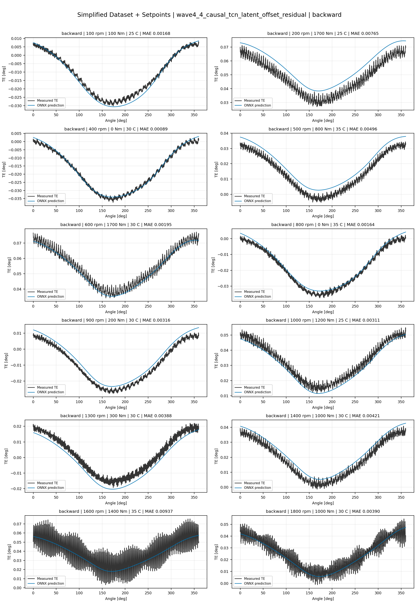
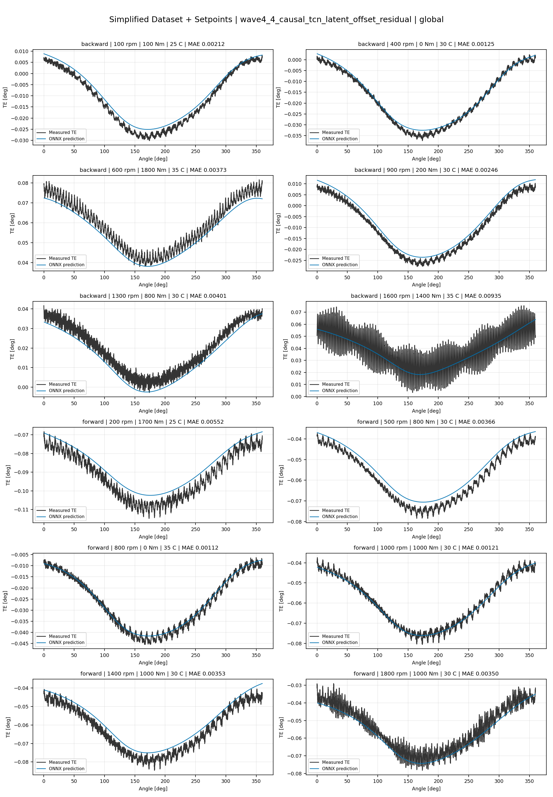
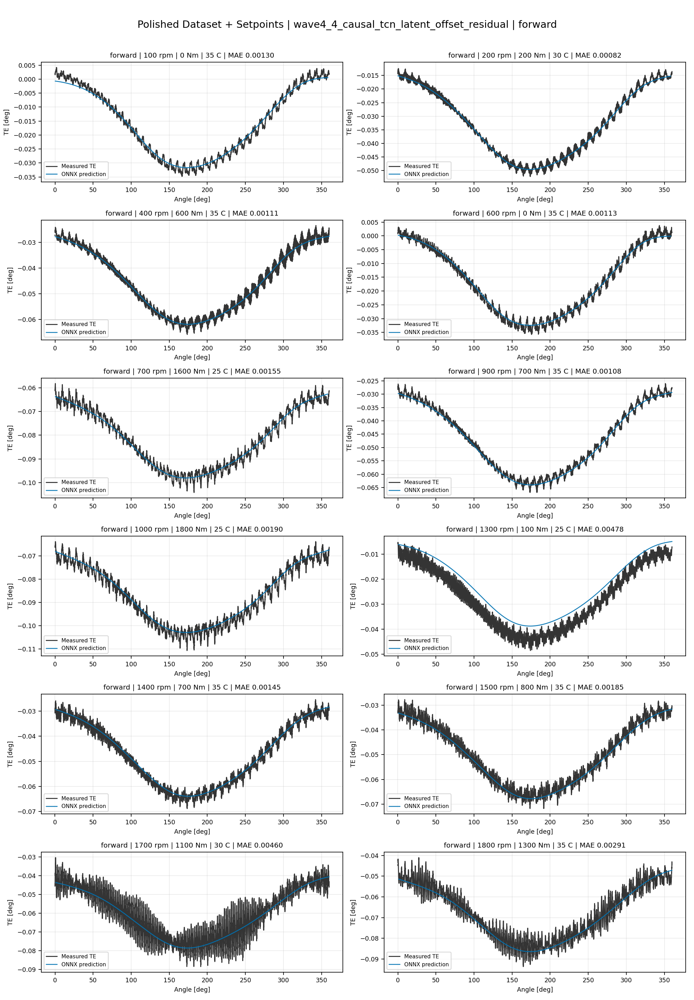
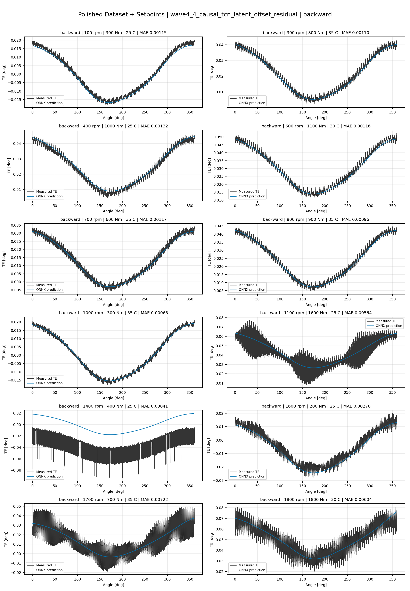
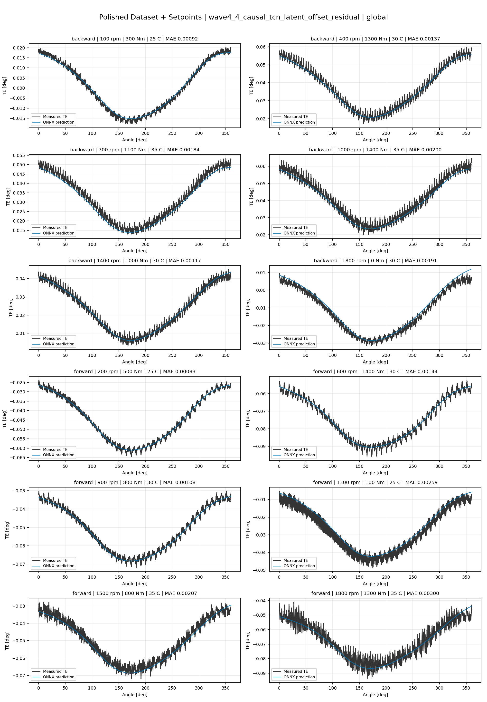
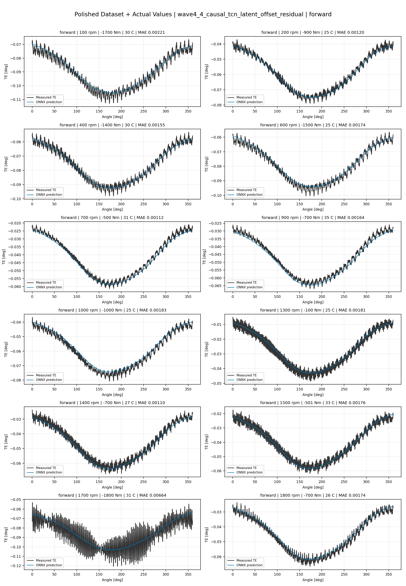
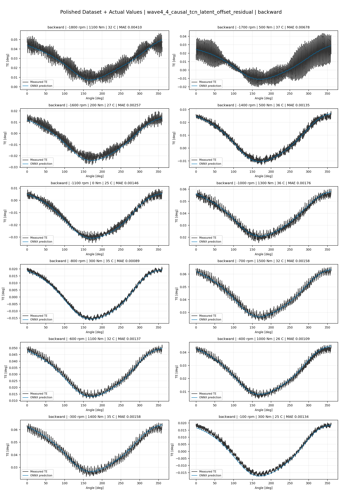
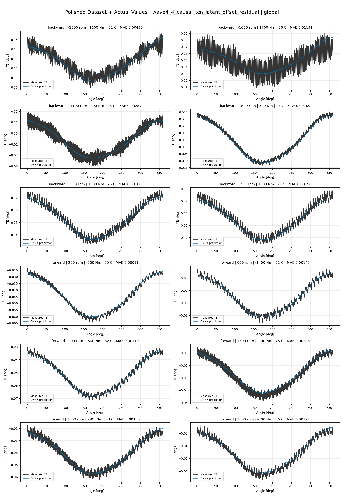

# TE Curve Verification Pipeline Familywise ONNX Report - wave4_4_causal_tcn_latent_offset_residual

## Overview

This report evaluates exported ONNX models from the dataset input-mode
retraining program. Each dataset/input-mode section uses dataset-matched
held-out test curves and lists the exact model artifacts loaded from
`models/`.

Rank-3 temporal ONNX exports are evaluated on the sequence-window test
contract stored in each `training_config.snapshot.yaml`, including
`sequence_length`, `sequence_stride`, `sequence_target_position`, and
`maximum_sequences_per_curve`.
The collage pages keep the measured TE trace at the original full-curve
resolution; temporal ONNX predictions are overlaid at the evaluated
sequence-target angles.

The report is diagnostic and family-specific. It does not replace an
official multi-index model-promotion decision.

## Output Artifacts

- output directory: `output/validation_checks/track2_familywise_onnx_report/wave4_4_causal_tcn_latent_offset_residual/2026-07-15-23-45-15__track2_wave4_4_causal_tcn_latent_offset_residual_familywise_onnx_report`;
- summary YAML: `output/validation_checks/track2_familywise_onnx_report/wave4_4_causal_tcn_latent_offset_residual/2026-07-15-23-45-15__track2_wave4_4_causal_tcn_latent_offset_residual_familywise_onnx_report/track2_familywise_onnx_report_summary.yaml`;
- model inventory CSV: `output/validation_checks/track2_familywise_onnx_report/wave4_4_causal_tcn_latent_offset_residual/2026-07-15-23-45-15__track2_wave4_4_causal_tcn_latent_offset_residual_familywise_onnx_report/model_inventory.csv`;
- per-curve metrics CSV: `output/validation_checks/track2_familywise_onnx_report/wave4_4_causal_tcn_latent_offset_residual/2026-07-15-23-45-15__track2_wave4_4_causal_tcn_latent_offset_residual_familywise_onnx_report/per_curve_metrics.csv`.

## Simplified Dataset + Setpoints

- dataset: `simplified_dataset`;
- input mode: `setpoints`;
- evaluated family: `wave4_4_causal_tcn_latent_offset_residual`;
- dataset root: `data/simplified_dataset`.

### Models Used

| Surface | Run Name | Run Instance | Dataset Schema |
| --- | --- | --- | --- |
| forward | `te_wave4_4_causal_tcn_latent_offset_residual_fw__simplified_setpoints` | `2026-07-15-20-14-26__te_wave4_4_causal_tcn_latent_offset_residual_fw__simplified_setpoints` | `simplified_curve_v1` |
| backward | `te_wave4_4_causal_tcn_latent_offset_residual_bw__simplified_setpoints` | `2026-07-15-20-38-50__te_wave4_4_causal_tcn_latent_offset_residual_bw__simplified_setpoints` | `simplified_curve_v1` |
| global | `te_wave4_4_causal_tcn_latent_offset_residual_global__simplified_setpoints` | `2026-07-15-20-07-16__te_wave4_4_causal_tcn_latent_offset_residual_global__simplified_setpoints` | `simplified_curve_v1` |

Exact model paths:

| Surface | ONNX Model Path | Python Model Path |
| --- | --- | --- |
| forward | `models/simplified_dataset/setpoints/wave4_4_causal_tcn_latent_offset_residual/forward/onnx/model.onnx` | `models/simplified_dataset/setpoints/wave4_4_causal_tcn_latent_offset_residual/forward/python/latent_state_hysteresis_probe-epoch=236-val_mae=0.00349844.ckpt` |
| backward | `models/simplified_dataset/setpoints/wave4_4_causal_tcn_latent_offset_residual/backward/onnx/model.onnx` | `models/simplified_dataset/setpoints/wave4_4_causal_tcn_latent_offset_residual/backward/python/latent_state_hysteresis_probe-epoch=105-val_mae=0.00370934.ckpt` |
| global | `models/simplified_dataset/setpoints/wave4_4_causal_tcn_latent_offset_residual/global/onnx/model.onnx` | `models/simplified_dataset/setpoints/wave4_4_causal_tcn_latent_offset_residual/global/python/latent_state_hysteresis_probe-epoch=055-val_mae=0.00376625.ckpt` |

### Aggregate Metrics

| Surface | Curves | MAE [deg] | RMSE [deg] | Mean Error [%] | P95 Error [%] |
| --- | ---: | ---: | ---: | ---: | ---: |
| forward | 97 | 0.003261 | 0.003690 | 7.650 | 14.507 |
| backward | 97 | 0.003713 | 0.004153 | 8.641 | 16.030 |
| global | 194 | 0.003548 | 0.003989 | 8.280 | 14.373 |

Offset And Shape Metrics:

| Surface | Signed Offset [deg] | Absolute Offset [deg] | Centered MAE [deg] | P2P Error [deg] |
| --- | ---: | ---: | ---: | ---: |
| forward | -0.000012 | 0.002621 | 0.001748 | 0.006147 |
| backward | 0.000398 | 0.002988 | 0.001910 | 0.004800 |
| global | -0.000035 | 0.002891 | 0.001838 | 0.006096 |

### Forward 12-Curve Page

### Backward 12-Curve Page

### Global 12-Curve Page

## Polished Dataset + Setpoints

- dataset: `polished_dataset`;
- input mode: `setpoints`;
- evaluated family: `wave4_4_causal_tcn_latent_offset_residual`;
- dataset root: `data/polished_dataset`.

### Models Used

| Surface | Run Name | Run Instance | Dataset Schema |
| --- | --- | --- | --- |
| forward | `te_wave4_4_causal_tcn_latent_offset_residual_fw__polished_setpoints` | `2026-07-15-21-27-08__te_wave4_4_causal_tcn_latent_offset_residual_fw__polished_setpoints` | `polished_setpoint_curve_v1` |
| backward | `te_wave4_4_causal_tcn_latent_offset_residual_bw__polished_setpoints` | `2026-07-15-21-50-42__te_wave4_4_causal_tcn_latent_offset_residual_bw__polished_setpoints` | `polished_setpoint_curve_v1` |
| global | `te_wave4_4_causal_tcn_latent_offset_residual_global__polished_setpoints` | `2026-07-15-21-10-35__te_wave4_4_causal_tcn_latent_offset_residual_global__polished_setpoints` | `polished_setpoint_curve_v1` |

Exact model paths:

| Surface | ONNX Model Path | Python Model Path |
| --- | --- | --- |
| forward | `models/polished_dataset/setpoints/wave4_4_causal_tcn_latent_offset_residual/forward/onnx/model.onnx` | `models/polished_dataset/setpoints/wave4_4_causal_tcn_latent_offset_residual/forward/python/latent_state_hysteresis_probe-epoch=107-val_mae=0.00221473.ckpt` |
| backward | `models/polished_dataset/setpoints/wave4_4_causal_tcn_latent_offset_residual/backward/onnx/model.onnx` | `models/polished_dataset/setpoints/wave4_4_causal_tcn_latent_offset_residual/backward/python/latent_state_hysteresis_probe-epoch=074-val_mae=0.00224017.ckpt` |
| global | `models/polished_dataset/setpoints/wave4_4_causal_tcn_latent_offset_residual/global/onnx/model.onnx` | `models/polished_dataset/setpoints/wave4_4_causal_tcn_latent_offset_residual/global/python/latent_state_hysteresis_probe-epoch=060-val_mae=0.00222789.ckpt` |

### Aggregate Metrics

| Surface | Curves | MAE [deg] | RMSE [deg] | Mean Error [%] | P95 Error [%] |
| --- | ---: | ---: | ---: | ---: | ---: |
| forward | 100 | 0.002307 | 0.002763 | 5.148 | 11.986 |
| backward | 94 | 0.002784 | 0.003302 | 5.388 | 11.522 |
| global | 194 | 0.002515 | 0.003019 | 5.204 | 11.393 |

Offset And Shape Metrics:

| Surface | Signed Offset [deg] | Absolute Offset [deg] | Centered MAE [deg] | P2P Error [deg] |
| --- | ---: | ---: | ---: | ---: |
| forward | 0.000047 | 0.001003 | 0.001918 | 0.006548 |
| backward | 0.000476 | 0.000961 | 0.002414 | 0.006619 |
| global | 0.000001 | 0.001042 | 0.002165 | 0.006338 |

### Forward 12-Curve Page

### Backward 12-Curve Page

### Global 12-Curve Page

## Polished Dataset + Actual Values

- dataset: `polished_dataset`;
- input mode: `actual_values`;
- evaluated family: `wave4_4_causal_tcn_latent_offset_residual`;
- dataset root: `data/polished_dataset`.

### Models Used

| Surface | Run Name | Run Instance | Dataset Schema |
| --- | --- | --- | --- |
| forward | `te_wave4_4_causal_tcn_latent_offset_residual_fw__polished_actual_values` | `2026-07-15-22-40-16__te_wave4_4_causal_tcn_latent_offset_residual_fw__polished_actual_values` | `polished_point_v1` |
| backward | `te_wave4_4_causal_tcn_latent_offset_residual_bw__polished_actual_values` | `2026-07-15-22-54-23__te_wave4_4_causal_tcn_latent_offset_residual_bw__polished_actual_values` | `polished_point_v1` |
| global | `te_wave4_4_causal_tcn_latent_offset_residual_global__polished_actual_values` | `2026-07-15-22-27-43__te_wave4_4_causal_tcn_latent_offset_residual_global__polished_actual_values` | `polished_point_v1` |

Exact model paths:

| Surface | ONNX Model Path | Python Model Path |
| --- | --- | --- |
| forward | `models/polished_dataset/actual_values/wave4_4_causal_tcn_latent_offset_residual/forward/onnx/model.onnx` | `models/polished_dataset/actual_values/wave4_4_causal_tcn_latent_offset_residual/forward/python/latent_state_hysteresis_probe-epoch=038-val_mae=0.00225416.ckpt` |
| backward | `models/polished_dataset/actual_values/wave4_4_causal_tcn_latent_offset_residual/backward/onnx/model.onnx` | `models/polished_dataset/actual_values/wave4_4_causal_tcn_latent_offset_residual/backward/python/latent_state_hysteresis_probe-epoch=078-val_mae=0.00222665.ckpt` |
| global | `models/polished_dataset/actual_values/wave4_4_causal_tcn_latent_offset_residual/global/onnx/model.onnx` | `models/polished_dataset/actual_values/wave4_4_causal_tcn_latent_offset_residual/global/python/latent_state_hysteresis_probe-epoch=041-val_mae=0.00230429.ckpt` |

### Aggregate Metrics

| Surface | Curves | MAE [deg] | RMSE [deg] | Mean Error [%] | P95 Error [%] |
| --- | ---: | ---: | ---: | ---: | ---: |
| forward | 100 | 0.002209 | 0.002680 | 4.882 | 10.614 |
| backward | 94 | 0.002529 | 0.003079 | 4.973 | 11.654 |
| global | 194 | 0.002420 | 0.002956 | 5.053 | 11.649 |

Offset And Shape Metrics:

| Surface | Signed Offset [deg] | Absolute Offset [deg] | Centered MAE [deg] | P2P Error [deg] |
| --- | ---: | ---: | ---: | ---: |
| forward | -0.000333 | 0.000863 | 0.001972 | 0.006472 |
| backward | -0.000241 | 0.000602 | 0.002437 | 0.005110 |
| global | -0.000282 | 0.000829 | 0.002230 | 0.006169 |

### Forward 12-Curve Page

### Backward 12-Curve Page

### Global 12-Curve Page

