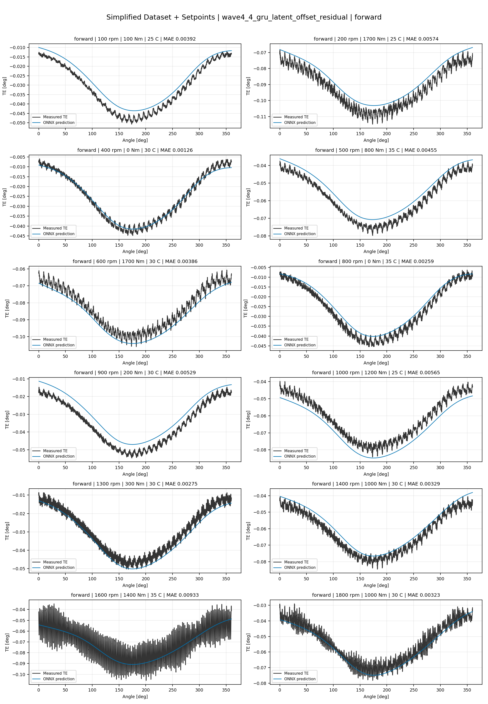
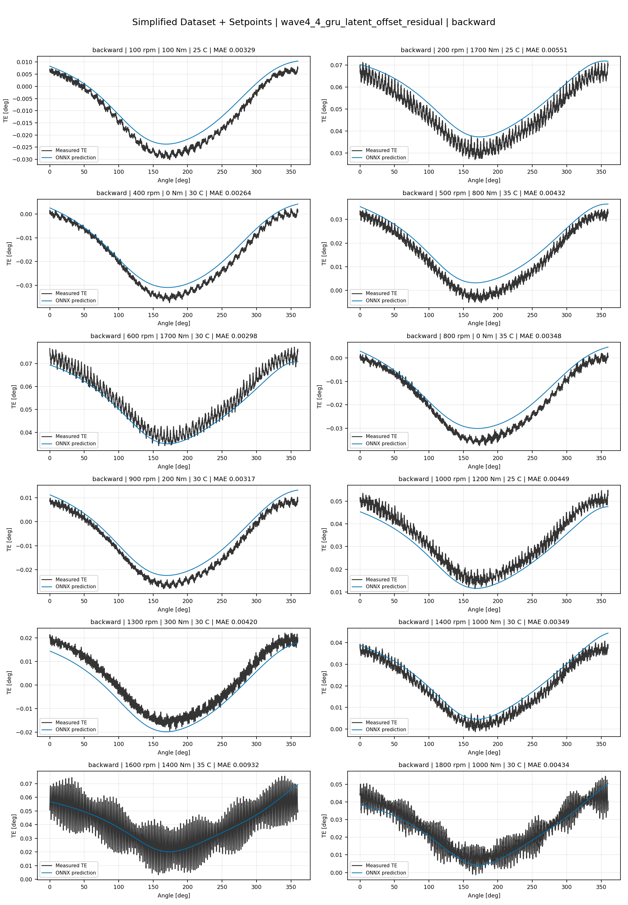
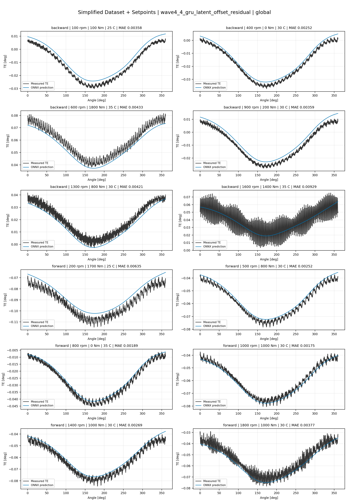
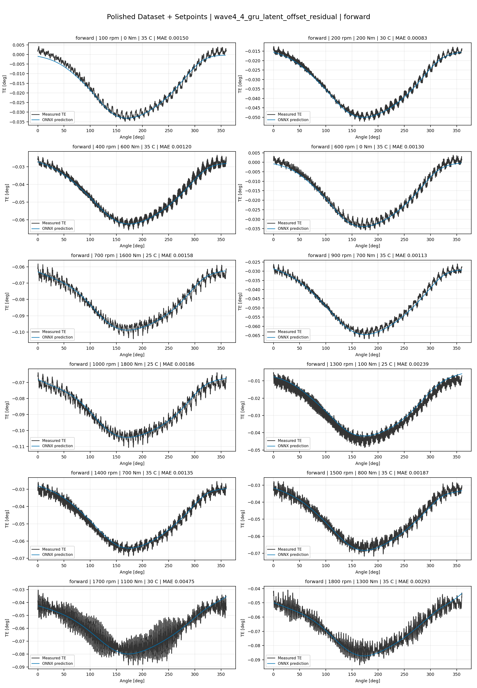
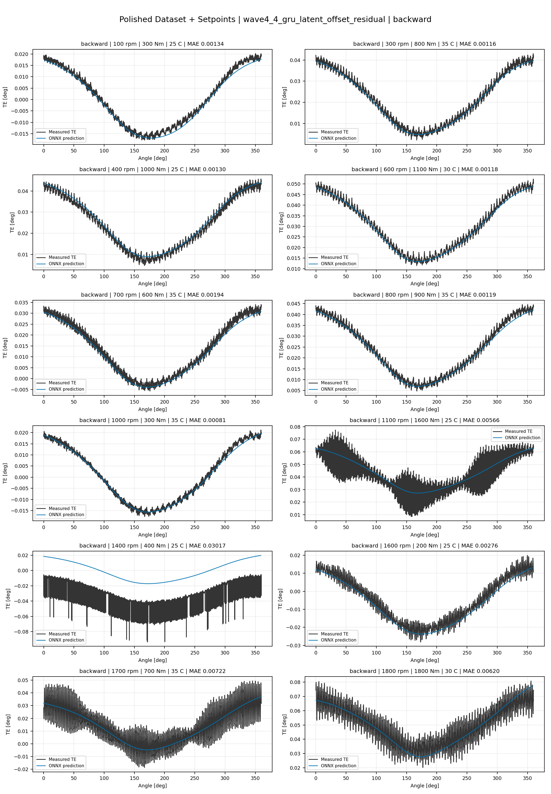
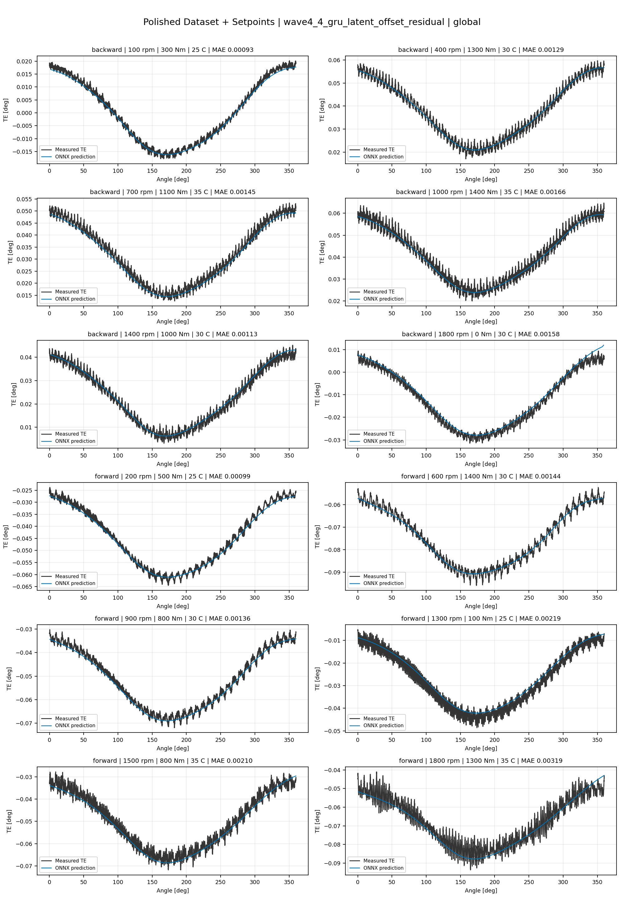
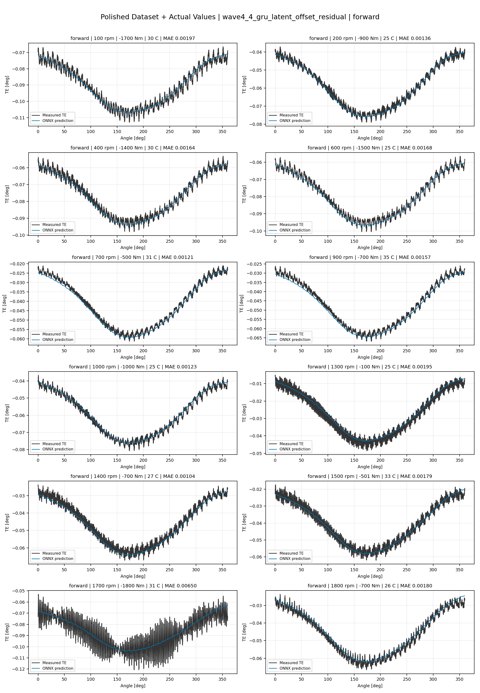
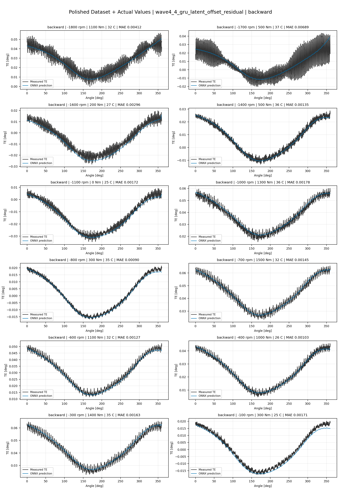
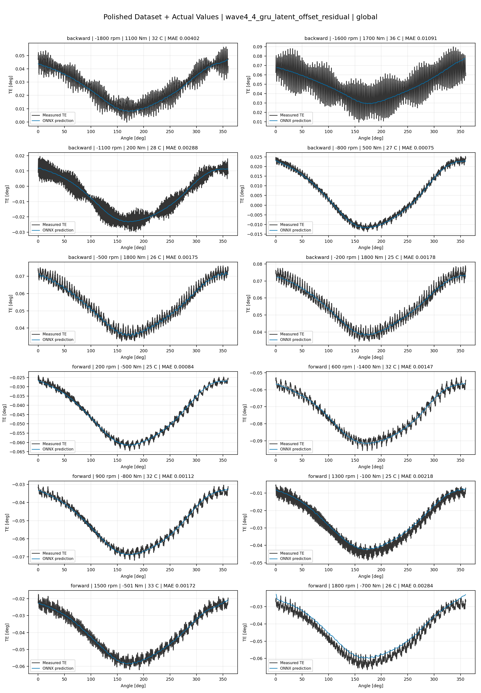

# TE Curve Verification Pipeline Familywise ONNX Report - wave4_4_gru_latent_offset_residual

## Overview

This report evaluates exported ONNX models from the dataset input-mode
retraining program. Each dataset/input-mode section uses dataset-matched
held-out test curves and lists the exact model artifacts loaded from
`models/`.

Rank-3 temporal ONNX exports are evaluated on the sequence-window test
contract stored in each `training_config.snapshot.yaml`, including
`sequence_length`, `sequence_stride`, `sequence_target_position`, and
`maximum_sequences_per_curve`.
The collage pages keep the measured TE trace at the original full-curve
resolution; temporal ONNX predictions are overlaid at the evaluated
sequence-target angles.

The report is diagnostic and family-specific. It does not replace an
official multi-index model-promotion decision.

## Output Artifacts

- output directory: `output/validation_checks/track2_familywise_onnx_report/wave4_4_gru_latent_offset_residual/2026-07-15-22-18-25__track2_wave4_4_gru_latent_offset_residual_familywise_onnx_report`;
- summary YAML: `output/validation_checks/track2_familywise_onnx_report/wave4_4_gru_latent_offset_residual/2026-07-15-22-18-25__track2_wave4_4_gru_latent_offset_residual_familywise_onnx_report/track2_familywise_onnx_report_summary.yaml`;
- model inventory CSV: `output/validation_checks/track2_familywise_onnx_report/wave4_4_gru_latent_offset_residual/2026-07-15-22-18-25__track2_wave4_4_gru_latent_offset_residual_familywise_onnx_report/model_inventory.csv`;
- per-curve metrics CSV: `output/validation_checks/track2_familywise_onnx_report/wave4_4_gru_latent_offset_residual/2026-07-15-22-18-25__track2_wave4_4_gru_latent_offset_residual_familywise_onnx_report/per_curve_metrics.csv`.

## Simplified Dataset + Setpoints

- dataset: `simplified_dataset`;
- input mode: `setpoints`;
- evaluated family: `wave4_4_gru_latent_offset_residual`;
- dataset root: `data/simplified_dataset`.

### Models Used

| Surface | Run Name | Run Instance | Dataset Schema |
| --- | --- | --- | --- |
| forward | `te_wave4_4_gru_latent_offset_residual_fw__simplified_setpoints` | `2026-07-15-07-11-49__te_wave4_4_gru_latent_offset_residual_fw__simplified_setpoints` | `simplified_curve_v1` |
| backward | `te_wave4_4_gru_latent_offset_residual_bw__simplified_setpoints` | `2026-07-15-07-26-38__te_wave4_4_gru_latent_offset_residual_bw__simplified_setpoints` | `simplified_curve_v1` |
| global | `te_wave4_4_gru_latent_offset_residual_global__simplified_setpoints` | `2026-07-15-06-59-43__te_wave4_4_gru_latent_offset_residual_global__simplified_setpoints` | `simplified_curve_v1` |

Exact model paths:

| Surface | ONNX Model Path | Python Model Path |
| --- | --- | --- |
| forward | `models/simplified_dataset/setpoints/wave4_4_gru_latent_offset_residual/forward/onnx/model.onnx` | `models/simplified_dataset/setpoints/wave4_4_gru_latent_offset_residual/forward/python/latent_state_hysteresis_probe-epoch=081-val_mae=0.00371922.ckpt` |
| backward | `models/simplified_dataset/setpoints/wave4_4_gru_latent_offset_residual/backward/onnx/model.onnx` | `models/simplified_dataset/setpoints/wave4_4_gru_latent_offset_residual/backward/python/latent_state_hysteresis_probe-epoch=072-val_mae=0.00377245.ckpt` |
| global | `models/simplified_dataset/setpoints/wave4_4_gru_latent_offset_residual/global/onnx/model.onnx` | `models/simplified_dataset/setpoints/wave4_4_gru_latent_offset_residual/global/python/latent_state_hysteresis_probe-epoch=065-val_mae=0.00375664.ckpt` |

### Aggregate Metrics

| Surface | Curves | MAE [deg] | RMSE [deg] | Mean Error [%] | P95 Error [%] |
| --- | ---: | ---: | ---: | ---: | ---: |
| forward | 97 | 0.003522 | 0.003976 | 8.251 | 13.855 |
| backward | 97 | 0.003631 | 0.004129 | 8.429 | 13.607 |
| global | 194 | 0.003535 | 0.003979 | 8.242 | 13.654 |

Offset And Shape Metrics:

| Surface | Signed Offset [deg] | Absolute Offset [deg] | Centered MAE [deg] | P2P Error [deg] |
| --- | ---: | ---: | ---: | ---: |
| forward | -0.000147 | 0.002951 | 0.001819 | 0.005940 |
| backward | -0.000013 | 0.002861 | 0.002036 | 0.005469 |
| global | -0.000337 | 0.002912 | 0.001827 | 0.004557 |

### Forward 12-Curve Page

### Backward 12-Curve Page

### Global 12-Curve Page

## Polished Dataset + Setpoints

- dataset: `polished_dataset`;
- input mode: `setpoints`;
- evaluated family: `wave4_4_gru_latent_offset_residual`;
- dataset root: `data/polished_dataset`.

### Models Used

| Surface | Run Name | Run Instance | Dataset Schema |
| --- | --- | --- | --- |
| forward | `te_wave4_4_gru_latent_offset_residual_fw__polished_setpoints` | `2026-07-15-17-03-49__te_wave4_4_gru_latent_offset_residual_fw__polished_setpoints` | `polished_setpoint_curve_v1` |
| backward | `te_wave4_4_gru_latent_offset_residual_bw__polished_setpoints` | `2026-07-15-17-34-55__te_wave4_4_gru_latent_offset_residual_bw__polished_setpoints` | `polished_setpoint_curve_v1` |
| global | `te_wave4_4_gru_latent_offset_residual_global__polished_setpoints` | `2026-07-15-16-39-39__te_wave4_4_gru_latent_offset_residual_global__polished_setpoints` | `polished_setpoint_curve_v1` |

Exact model paths:

| Surface | ONNX Model Path | Python Model Path |
| --- | --- | --- |
| forward | `models/polished_dataset/setpoints/wave4_4_gru_latent_offset_residual/forward/onnx/model.onnx` | `models/polished_dataset/setpoints/wave4_4_gru_latent_offset_residual/forward/python/latent_state_hysteresis_probe-epoch=164-val_mae=0.00221821.ckpt` |
| backward | `models/polished_dataset/setpoints/wave4_4_gru_latent_offset_residual/backward/onnx/model.onnx` | `models/polished_dataset/setpoints/wave4_4_gru_latent_offset_residual/backward/python/latent_state_hysteresis_probe-epoch=036-val_mae=0.00226526.ckpt` |
| global | `models/polished_dataset/setpoints/wave4_4_gru_latent_offset_residual/global/onnx/model.onnx` | `models/polished_dataset/setpoints/wave4_4_gru_latent_offset_residual/global/python/latent_state_hysteresis_probe-epoch=100-val_mae=0.00222289.ckpt` |

### Aggregate Metrics

| Surface | Curves | MAE [deg] | RMSE [deg] | Mean Error [%] | P95 Error [%] |
| --- | ---: | ---: | ---: | ---: | ---: |
| forward | 100 | 0.002266 | 0.002721 | 5.038 | 10.929 |
| backward | 94 | 0.002836 | 0.003378 | 5.522 | 11.514 |
| global | 194 | 0.002534 | 0.003041 | 5.241 | 11.510 |

Offset And Shape Metrics:

| Surface | Signed Offset [deg] | Absolute Offset [deg] | Centered MAE [deg] | P2P Error [deg] |
| --- | ---: | ---: | ---: | ---: |
| forward | -0.000264 | 0.000923 | 0.001948 | 0.005463 |
| backward | 0.000055 | 0.001090 | 0.002443 | 0.006519 |
| global | -0.000057 | 0.001054 | 0.002169 | 0.006334 |

### Forward 12-Curve Page

### Backward 12-Curve Page

### Global 12-Curve Page

## Polished Dataset + Actual Values

- dataset: `polished_dataset`;
- input mode: `actual_values`;
- evaluated family: `wave4_4_gru_latent_offset_residual`;
- dataset root: `data/polished_dataset`.

### Models Used

| Surface | Run Name | Run Instance | Dataset Schema |
| --- | --- | --- | --- |
| forward | `te_wave4_4_gru_latent_offset_residual_fw__polished_actual_values` | `2026-07-15-18-51-23__te_wave4_4_gru_latent_offset_residual_fw__polished_actual_values` | `polished_point_v1` |
| backward | `te_wave4_4_gru_latent_offset_residual_bw__polished_actual_values` | `2026-07-15-19-13-13__te_wave4_4_gru_latent_offset_residual_bw__polished_actual_values` | `polished_point_v1` |
| global | `te_wave4_4_gru_latent_offset_residual_global__polished_actual_values` | `2026-07-15-18-05-18__te_wave4_4_gru_latent_offset_residual_global__polished_actual_values` | `polished_point_v1` |

Exact model paths:

| Surface | ONNX Model Path | Python Model Path |
| --- | --- | --- |
| forward | `models/polished_dataset/actual_values/wave4_4_gru_latent_offset_residual/forward/onnx/model.onnx` | `models/polished_dataset/actual_values/wave4_4_gru_latent_offset_residual/forward/python/latent_state_hysteresis_probe-epoch=113-val_mae=0.00224746.ckpt` |
| backward | `models/polished_dataset/actual_values/wave4_4_gru_latent_offset_residual/backward/onnx/model.onnx` | `models/polished_dataset/actual_values/wave4_4_gru_latent_offset_residual/backward/python/latent_state_hysteresis_probe-epoch=140-val_mae=0.00222826.ckpt` |
| global | `models/polished_dataset/actual_values/wave4_4_gru_latent_offset_residual/global/onnx/model.onnx` | `models/polished_dataset/actual_values/wave4_4_gru_latent_offset_residual/global/python/latent_state_hysteresis_probe-epoch=208-val_mae=0.00217281.ckpt` |

### Aggregate Metrics

| Surface | Curves | MAE [deg] | RMSE [deg] | Mean Error [%] | P95 Error [%] |
| --- | ---: | ---: | ---: | ---: | ---: |
| forward | 100 | 0.002210 | 0.002681 | 4.885 | 9.768 |
| backward | 94 | 0.002547 | 0.003098 | 5.046 | 11.669 |
| global | 194 | 0.002271 | 0.002760 | 4.701 | 11.037 |

Offset And Shape Metrics:

| Surface | Signed Offset [deg] | Absolute Offset [deg] | Centered MAE [deg] | P2P Error [deg] |
| --- | ---: | ---: | ---: | ---: |
| forward | -0.000505 | 0.000889 | 0.001982 | 0.005484 |
| backward | -0.000211 | 0.000681 | 0.002406 | 0.005017 |
| global | -0.000072 | 0.000628 | 0.002142 | 0.004824 |

### Forward 12-Curve Page

### Backward 12-Curve Page

### Global 12-Curve Page

