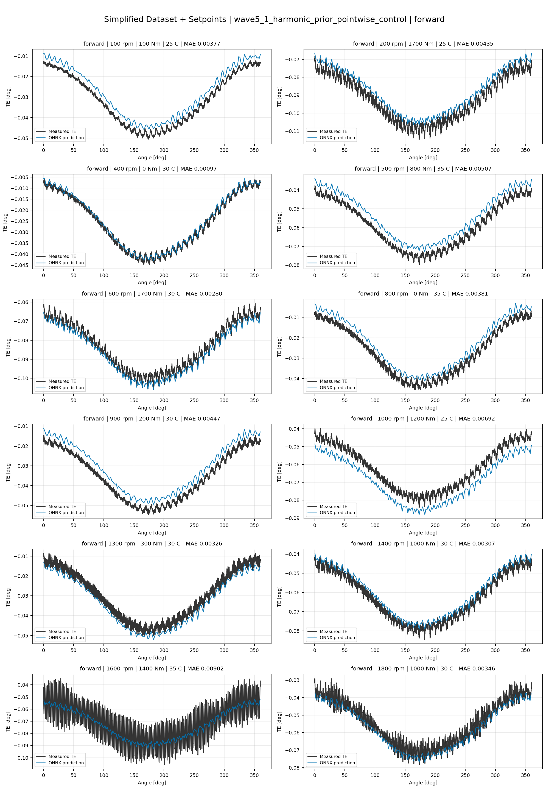
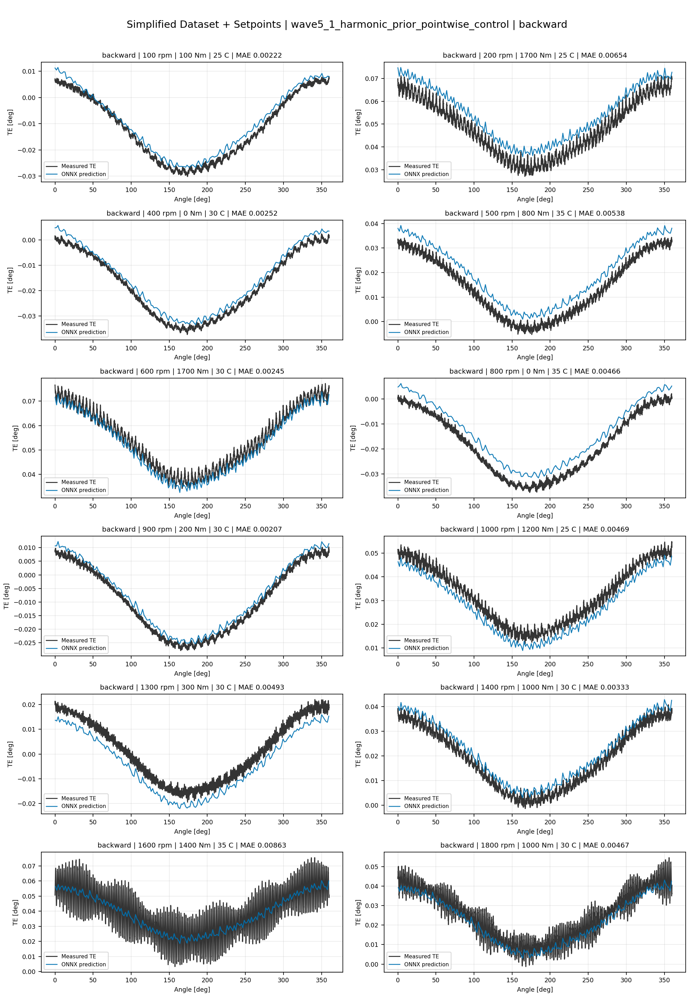
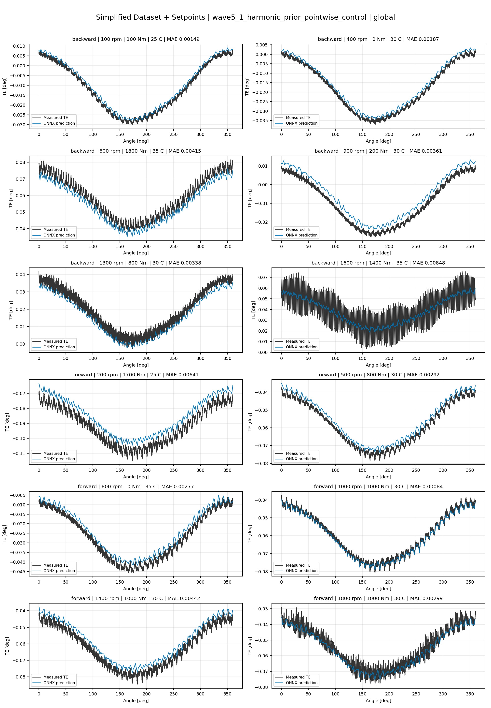
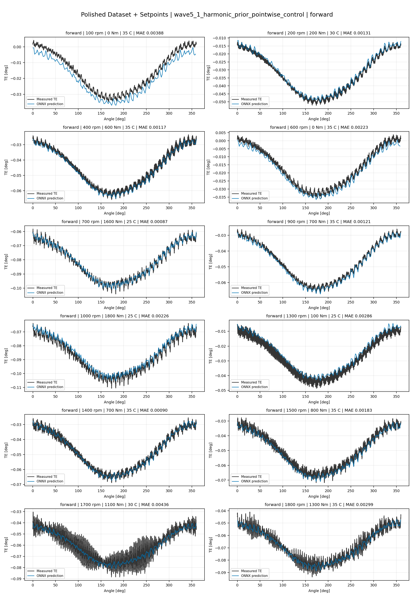
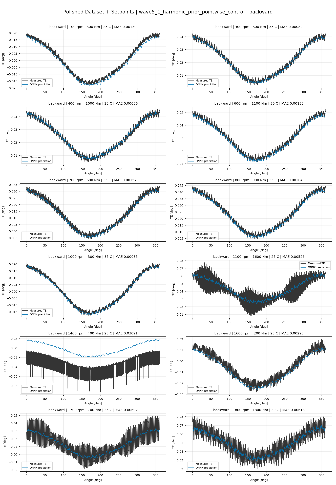
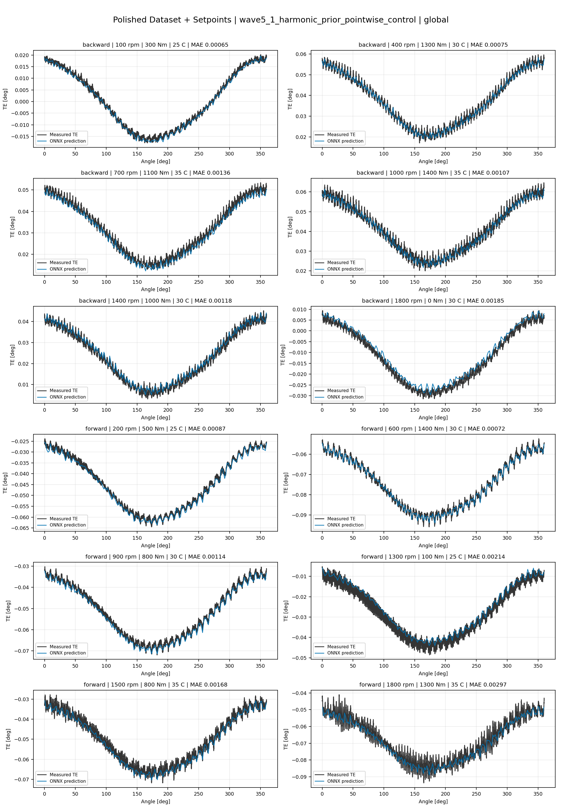
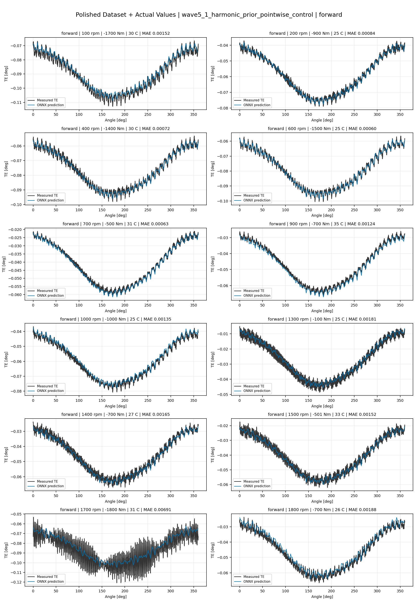
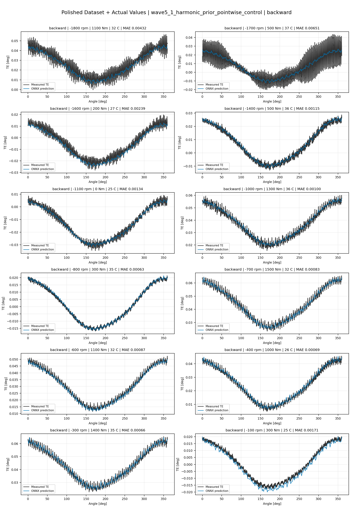
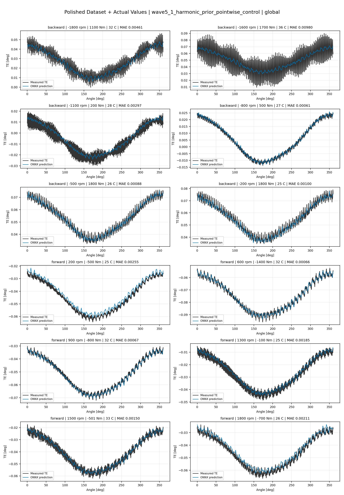

# TE Curve Verification Pipeline Familywise ONNX Report - wave5_1_harmonic_prior_pointwise_control

## Overview

This report evaluates exported ONNX models from the dataset input-mode
retraining program. Each dataset/input-mode section uses dataset-matched
held-out test curves and lists the exact model artifacts loaded from
`models/`.

Rank-3 temporal ONNX exports are evaluated on the sequence-window test
contract stored in each `training_config.snapshot.yaml`, including
`sequence_length`, `sequence_stride`, `sequence_target_position`, and
`maximum_sequences_per_curve`.
The collage pages keep the measured TE trace at the original full-curve
resolution; temporal ONNX predictions are overlaid at the evaluated
sequence-target angles.

The report is diagnostic and family-specific. It does not replace an
official multi-index model-promotion decision.

## Output Artifacts

- output directory: `output/validation_checks/track2_familywise_onnx_report/wave5_1_harmonic_prior_pointwise_control/2026-07-16-09-56-10__track2_wave5_1_harmonic_prior_pointwise_control_familywise_onnx_report`;
- summary YAML: `output/validation_checks/track2_familywise_onnx_report/wave5_1_harmonic_prior_pointwise_control/2026-07-16-09-56-10__track2_wave5_1_harmonic_prior_pointwise_control_familywise_onnx_report/track2_familywise_onnx_report_summary.yaml`;
- model inventory CSV: `output/validation_checks/track2_familywise_onnx_report/wave5_1_harmonic_prior_pointwise_control/2026-07-16-09-56-10__track2_wave5_1_harmonic_prior_pointwise_control_familywise_onnx_report/model_inventory.csv`;
- per-curve metrics CSV: `output/validation_checks/track2_familywise_onnx_report/wave5_1_harmonic_prior_pointwise_control/2026-07-16-09-56-10__track2_wave5_1_harmonic_prior_pointwise_control_familywise_onnx_report/per_curve_metrics.csv`.

## Simplified Dataset + Setpoints

- dataset: `simplified_dataset`;
- input mode: `setpoints`;
- evaluated family: `wave5_1_harmonic_prior_pointwise_control`;
- dataset root: `data/simplified_dataset`.

### Models Used

| Surface | Run Name | Run Instance | Dataset Schema |
| --- | --- | --- | --- |
| forward | `te_wave5_1_harmonic_prior_pointwise_control_fw__simplified_setpoints` | `2026-07-15-23-51-01__te_wave5_1_harmonic_prior_pointwise_control_fw__simplified_setpoints` | `simplified_curve_v1` |
| backward | `te_wave5_1_harmonic_prior_pointwise_control_bw__simplified_setpoints` | `2026-07-16-00-17-20__te_wave5_1_harmonic_prior_pointwise_control_bw__simplified_setpoints` | `simplified_curve_v1` |
| global | `te_wave5_1_harmonic_prior_pointwise_control_global__simplified_setpoints` | `2026-07-15-23-32-06__te_wave5_1_harmonic_prior_pointwise_control_global__simplified_setpoints` | `simplified_curve_v1` |

Exact model paths:

| Surface | ONNX Model Path | Python Model Path |
| --- | --- | --- |
| forward | `models/simplified_dataset/setpoints/wave5_1_harmonic_prior_pointwise_control/forward/onnx/model.onnx` | `models/simplified_dataset/setpoints/wave5_1_harmonic_prior_pointwise_control/forward/python/wave3_harmonic_prior_residual-epoch=223-val_mae=0.00356285.ckpt` |
| backward | `models/simplified_dataset/setpoints/wave5_1_harmonic_prior_pointwise_control/backward/onnx/model.onnx` | `models/simplified_dataset/setpoints/wave5_1_harmonic_prior_pointwise_control/backward/python/wave3_harmonic_prior_residual-epoch=063-val_mae=0.00364360.ckpt` |
| global | `models/simplified_dataset/setpoints/wave5_1_harmonic_prior_pointwise_control/global/onnx/model.onnx` | `models/simplified_dataset/setpoints/wave5_1_harmonic_prior_pointwise_control/global/python/wave3_harmonic_prior_residual-epoch=120-val_mae=0.00359724.ckpt` |

### Aggregate Metrics

| Surface | Curves | MAE [deg] | RMSE [deg] | Mean Error [%] | P95 Error [%] |
| --- | ---: | ---: | ---: | ---: | ---: |
| forward | 97 | 0.003352 | 0.003624 | 7.836 | 13.430 |
| backward | 97 | 0.003569 | 0.003894 | 8.316 | 14.191 |
| global | 194 | 0.003417 | 0.003717 | 7.977 | 13.759 |

Offset And Shape Metrics:

| Surface | Signed Offset [deg] | Absolute Offset [deg] | Centered MAE [deg] | P2P Error [deg] |
| --- | ---: | ---: | ---: | ---: |
| forward | -0.000409 | 0.002988 | 0.001258 | 0.003084 |
| backward | -0.000133 | 0.002948 | 0.001567 | 0.003281 |
| global | 0.000319 | 0.002896 | 0.001418 | 0.003071 |

### Forward 12-Curve Page

### Backward 12-Curve Page

### Global 12-Curve Page

## Polished Dataset + Setpoints

- dataset: `polished_dataset`;
- input mode: `setpoints`;
- evaluated family: `wave5_1_harmonic_prior_pointwise_control`;
- dataset root: `data/polished_dataset`.

### Models Used

| Surface | Run Name | Run Instance | Dataset Schema |
| --- | --- | --- | --- |
| forward | `te_wave5_1_harmonic_prior_pointwise_control_fw__polished_setpoints` | `2026-07-16-01-19-11__te_wave5_1_harmonic_prior_pointwise_control_fw__polished_setpoints` | `polished_setpoint_curve_v1` |
| backward | `te_wave5_1_harmonic_prior_pointwise_control_bw__polished_setpoints` | `2026-07-16-01-39-54__te_wave5_1_harmonic_prior_pointwise_control_bw__polished_setpoints` | `polished_setpoint_curve_v1` |
| global | `te_wave5_1_harmonic_prior_pointwise_control_global__polished_setpoints` | `2026-07-16-00-50-35__te_wave5_1_harmonic_prior_pointwise_control_global__polished_setpoints` | `polished_setpoint_curve_v1` |

Exact model paths:

| Surface | ONNX Model Path | Python Model Path |
| --- | --- | --- |
| forward | `models/polished_dataset/setpoints/wave5_1_harmonic_prior_pointwise_control/forward/onnx/model.onnx` | `models/polished_dataset/setpoints/wave5_1_harmonic_prior_pointwise_control/forward/python/wave3_harmonic_prior_residual-epoch=084-val_mae=0.00195891.ckpt` |
| backward | `models/polished_dataset/setpoints/wave5_1_harmonic_prior_pointwise_control/backward/onnx/model.onnx` | `models/polished_dataset/setpoints/wave5_1_harmonic_prior_pointwise_control/backward/python/wave3_harmonic_prior_residual-epoch=074-val_mae=0.00194037.ckpt` |
| global | `models/polished_dataset/setpoints/wave5_1_harmonic_prior_pointwise_control/global/onnx/model.onnx` | `models/polished_dataset/setpoints/wave5_1_harmonic_prior_pointwise_control/global/python/wave3_harmonic_prior_residual-epoch=131-val_mae=0.00190080.ckpt` |

### Aggregate Metrics

| Surface | Curves | MAE [deg] | RMSE [deg] | Mean Error [%] | P95 Error [%] |
| --- | ---: | ---: | ---: | ---: | ---: |
| forward | 100 | 0.002089 | 0.002467 | 4.633 | 11.374 |
| backward | 94 | 0.002528 | 0.002964 | 4.638 | 10.757 |
| global | 194 | 0.002231 | 0.002628 | 4.456 | 10.872 |

Offset And Shape Metrics:

| Surface | Signed Offset [deg] | Absolute Offset [deg] | Centered MAE [deg] | P2P Error [deg] |
| --- | ---: | ---: | ---: | ---: |
| forward | 0.000096 | 0.001207 | 0.001587 | 0.003484 |
| backward | -0.000147 | 0.001027 | 0.002081 | 0.006060 |
| global | -0.000010 | 0.001071 | 0.001799 | 0.004747 |

### Forward 12-Curve Page

### Backward 12-Curve Page

### Global 12-Curve Page

## Polished Dataset + Actual Values

- dataset: `polished_dataset`;
- input mode: `actual_values`;
- evaluated family: `wave5_1_harmonic_prior_pointwise_control`;
- dataset root: `data/polished_dataset`.

### Models Used

| Surface | Run Name | Run Instance | Dataset Schema |
| --- | --- | --- | --- |
| forward | `te_wave5_1_harmonic_prior_pointwise_control_fw__polished_actual_values` | `2026-07-16-02-44-33__te_wave5_1_harmonic_prior_pointwise_control_fw__polished_actual_values` | `polished_point_v1` |
| backward | `te_wave5_1_harmonic_prior_pointwise_control_bw__polished_actual_values` | `2026-07-16-03-08-07__te_wave5_1_harmonic_prior_pointwise_control_bw__polished_actual_values` | `polished_point_v1` |
| global | `te_wave5_1_harmonic_prior_pointwise_control_global__polished_actual_values` | `2026-07-16-02-19-49__te_wave5_1_harmonic_prior_pointwise_control_global__polished_actual_values` | `polished_point_v1` |

Exact model paths:

| Surface | ONNX Model Path | Python Model Path |
| --- | --- | --- |
| forward | `models/polished_dataset/actual_values/wave5_1_harmonic_prior_pointwise_control/forward/onnx/model.onnx` | `models/polished_dataset/actual_values/wave5_1_harmonic_prior_pointwise_control/forward/python/wave3_harmonic_prior_residual-epoch=119-val_mae=0.00192899.ckpt` |
| backward | `models/polished_dataset/actual_values/wave5_1_harmonic_prior_pointwise_control/backward/onnx/model.onnx` | `models/polished_dataset/actual_values/wave5_1_harmonic_prior_pointwise_control/backward/python/wave3_harmonic_prior_residual-epoch=113-val_mae=0.00189638.ckpt` |
| global | `models/polished_dataset/actual_values/wave5_1_harmonic_prior_pointwise_control/global/onnx/model.onnx` | `models/polished_dataset/actual_values/wave5_1_harmonic_prior_pointwise_control/global/python/wave3_harmonic_prior_residual-epoch=121-val_mae=0.00194574.ckpt` |

### Aggregate Metrics

| Surface | Curves | MAE [deg] | RMSE [deg] | Mean Error [%] | P95 Error [%] |
| --- | ---: | ---: | ---: | ---: | ---: |
| forward | 100 | 0.001895 | 0.002272 | 4.174 | 9.574 |
| backward | 94 | 0.002478 | 0.002917 | 4.505 | 10.722 |
| global | 194 | 0.002247 | 0.002651 | 4.518 | 10.362 |

Offset And Shape Metrics:

| Surface | Signed Offset [deg] | Absolute Offset [deg] | Centered MAE [deg] | P2P Error [deg] |
| --- | ---: | ---: | ---: | ---: |
| forward | -0.000161 | 0.000931 | 0.001576 | 0.003652 |
| backward | 0.000196 | 0.000893 | 0.002106 | 0.006198 |
| global | 0.000460 | 0.001008 | 0.001833 | 0.004758 |

### Forward 12-Curve Page

### Backward 12-Curve Page

### Global 12-Curve Page

