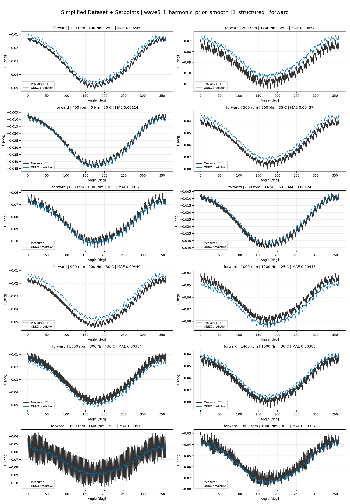
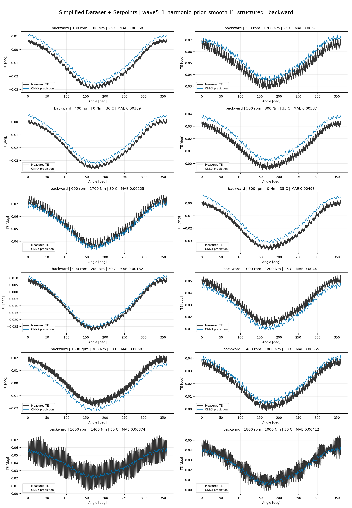
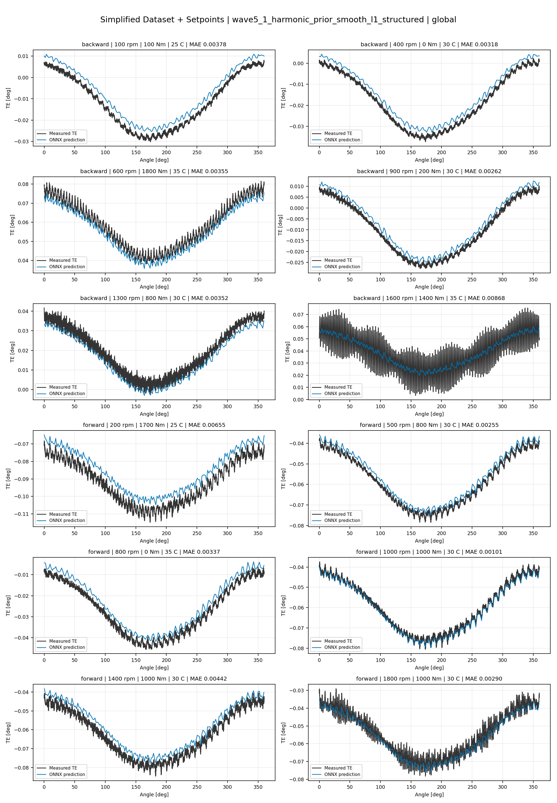
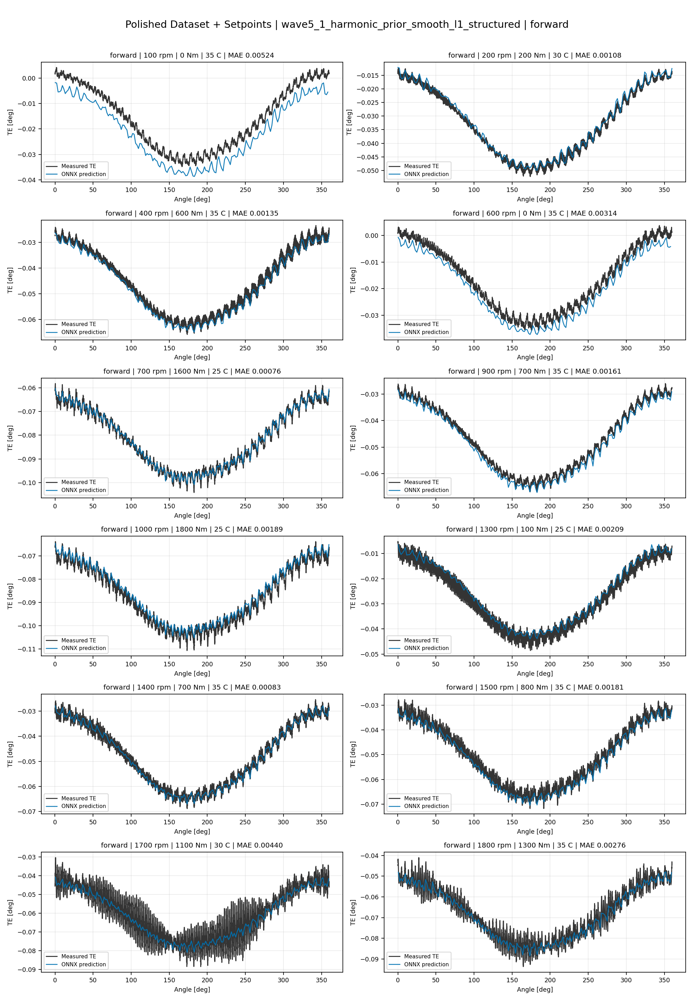
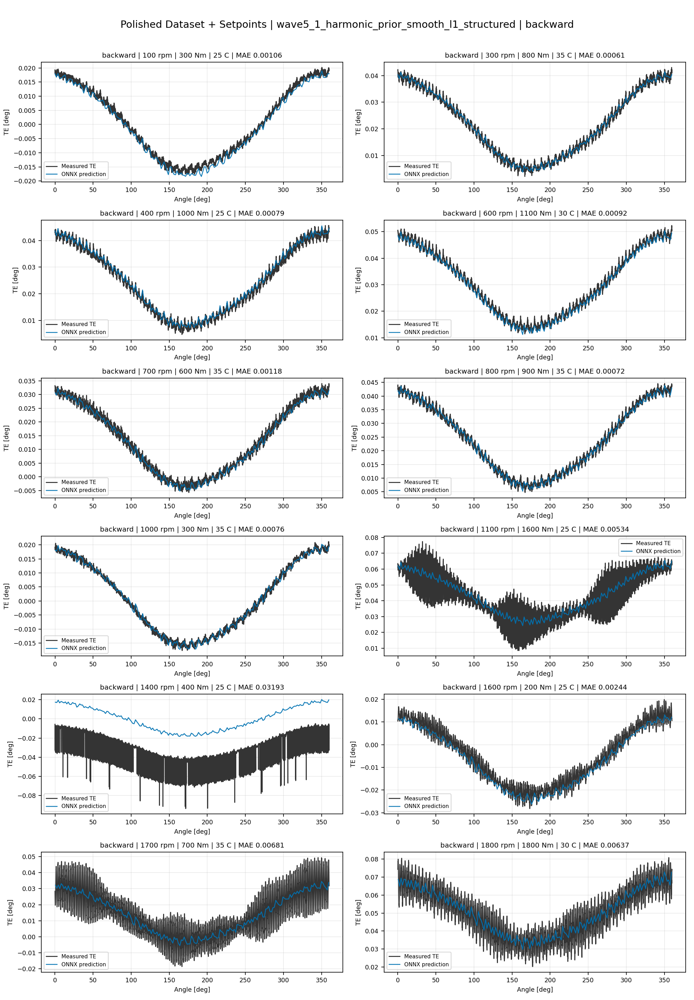
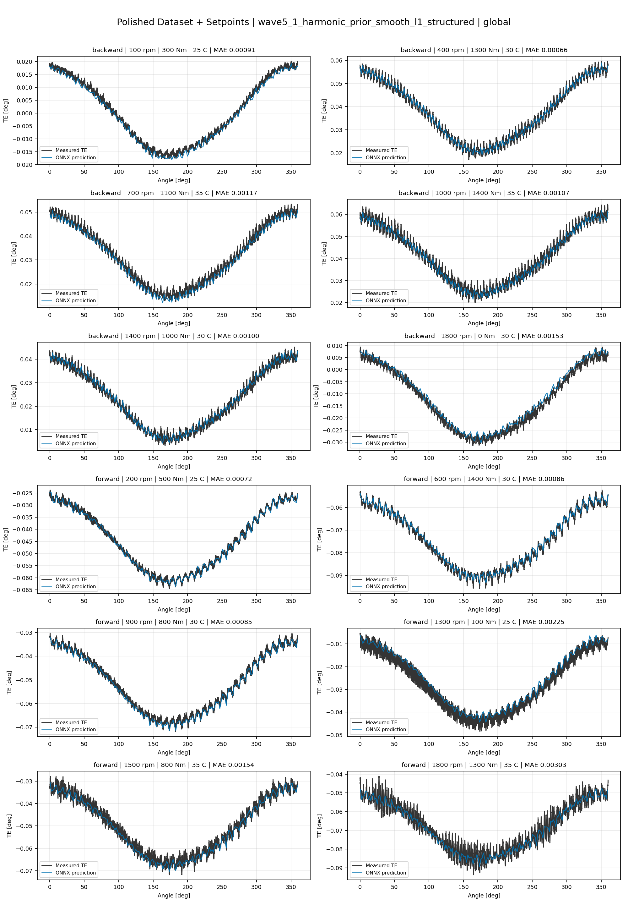
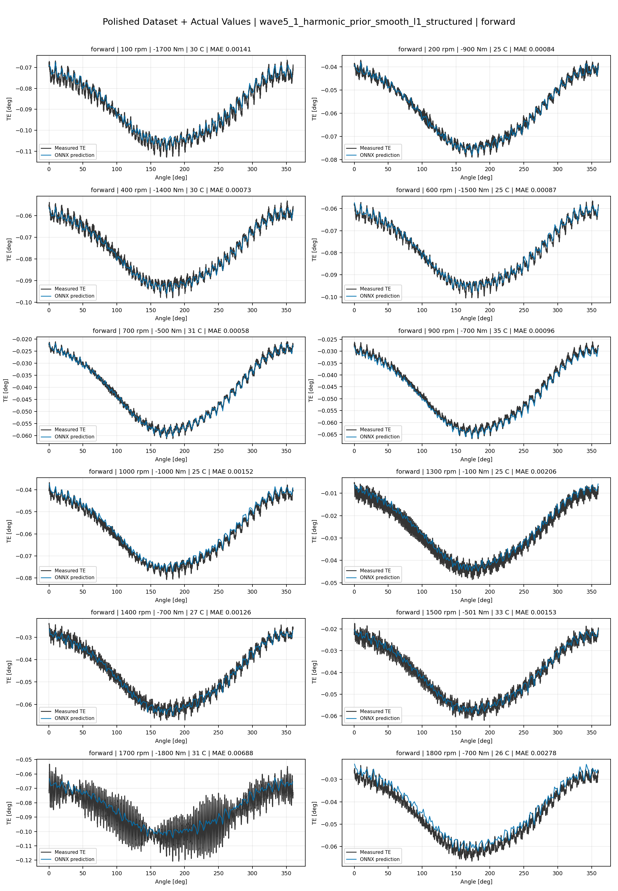
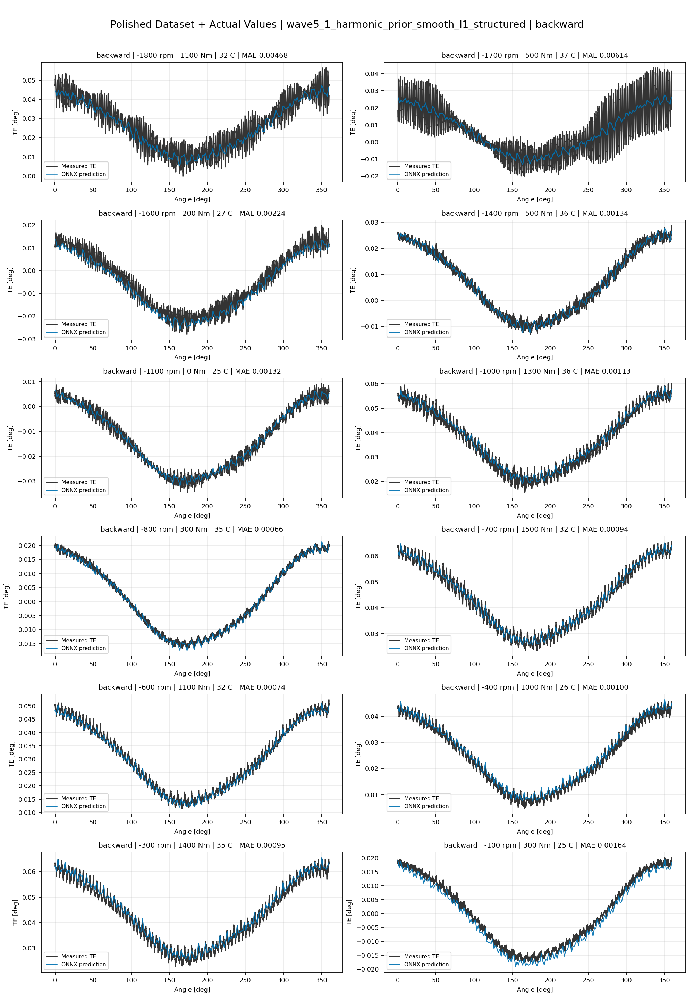
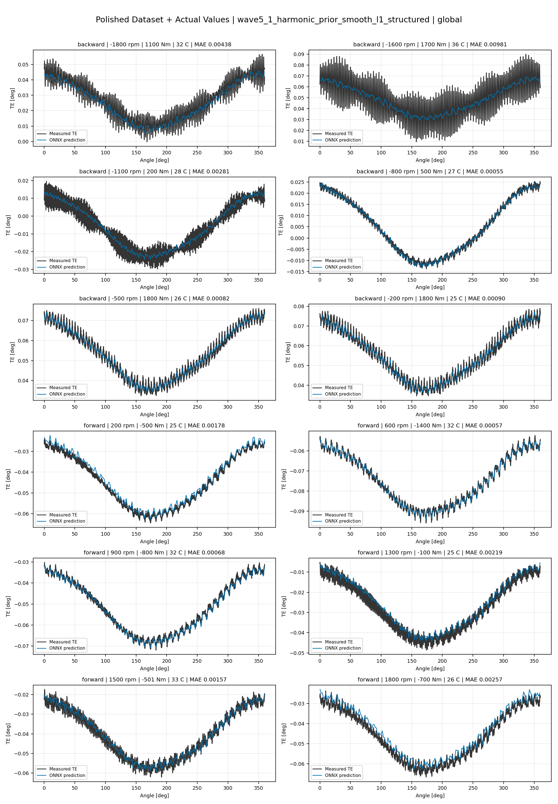

# TE Curve Verification Pipeline Familywise ONNX Report - wave5_1_harmonic_prior_smooth_l1_structured

## Overview

This report evaluates exported ONNX models from the dataset input-mode
retraining program. Each dataset/input-mode section uses dataset-matched
held-out test curves and lists the exact model artifacts loaded from
`models/`.

Rank-3 temporal ONNX exports are evaluated on the sequence-window test
contract stored in each `training_config.snapshot.yaml`, including
`sequence_length`, `sequence_stride`, `sequence_target_position`, and
`maximum_sequences_per_curve`.
The collage pages keep the measured TE trace at the original full-curve
resolution; temporal ONNX predictions are overlaid at the evaluated
sequence-target angles.

The report is diagnostic and family-specific. It does not replace an
official multi-index model-promotion decision.

## Output Artifacts

- output directory: `output/validation_checks/track2_familywise_onnx_report/wave5_1_harmonic_prior_smooth_l1_structured/2026-07-16-10-14-11__track2_wave5_1_harmonic_prior_smooth_l1_structured_familywise_onnx_report`;
- summary YAML: `output/validation_checks/track2_familywise_onnx_report/wave5_1_harmonic_prior_smooth_l1_structured/2026-07-16-10-14-11__track2_wave5_1_harmonic_prior_smooth_l1_structured_familywise_onnx_report/track2_familywise_onnx_report_summary.yaml`;
- model inventory CSV: `output/validation_checks/track2_familywise_onnx_report/wave5_1_harmonic_prior_smooth_l1_structured/2026-07-16-10-14-11__track2_wave5_1_harmonic_prior_smooth_l1_structured_familywise_onnx_report/model_inventory.csv`;
- per-curve metrics CSV: `output/validation_checks/track2_familywise_onnx_report/wave5_1_harmonic_prior_smooth_l1_structured/2026-07-16-10-14-11__track2_wave5_1_harmonic_prior_smooth_l1_structured_familywise_onnx_report/per_curve_metrics.csv`.

## Simplified Dataset + Setpoints

- dataset: `simplified_dataset`;
- input mode: `setpoints`;
- evaluated family: `wave5_1_harmonic_prior_smooth_l1_structured`;
- dataset root: `data/simplified_dataset`.

### Models Used

| Surface | Run Name | Run Instance | Dataset Schema |
| --- | --- | --- | --- |
| forward | `te_wave5_1_harmonic_prior_smooth_l1_structured_fw__simplified_setpoints` | `2026-07-16-04-17-30__te_wave5_1_harmonic_prior_smooth_l1_structured_fw__simplified_setpoints` | `simplified_curve_v1` |
| backward | `te_wave5_1_harmonic_prior_smooth_l1_structured_bw__simplified_setpoints` | `2026-07-16-04-31-07__te_wave5_1_harmonic_prior_smooth_l1_structured_bw__simplified_setpoints` | `simplified_curve_v1` |
| global | `te_wave5_1_harmonic_prior_smooth_l1_structured_global__simplified_setpoints` | `2026-07-16-04-00-48__te_wave5_1_harmonic_prior_smooth_l1_structured_global__simplified_setpoints` | `simplified_curve_v1` |

Exact model paths:

| Surface | ONNX Model Path | Python Model Path |
| --- | --- | --- |
| forward | `models/simplified_dataset/setpoints/exported/wave5_1_harmonic_prior_smooth_l1_structured/forward/2026-07-16-04-17-30__te_wave5_1_harmonic_prior_smooth_l1_structured_fw__simplified_setpoints/onnx/model.onnx` | `models/simplified_dataset/setpoints/exported/wave5_1_harmonic_prior_smooth_l1_structured/forward/2026-07-16-04-17-30__te_wave5_1_harmonic_prior_smooth_l1_structured_fw__simplified_setpoints/python/wave3_harmonic_prior_residual-epoch=070-val_mae=0.00364754.ckpt` |
| backward | `models/simplified_dataset/setpoints/exported/wave5_1_harmonic_prior_smooth_l1_structured/backward/2026-07-16-04-31-07__te_wave5_1_harmonic_prior_smooth_l1_structured_bw__simplified_setpoints/onnx/model.onnx` | `models/simplified_dataset/setpoints/exported/wave5_1_harmonic_prior_smooth_l1_structured/backward/2026-07-16-04-31-07__te_wave5_1_harmonic_prior_smooth_l1_structured_bw__simplified_setpoints/python/wave3_harmonic_prior_residual-epoch=044-val_mae=0.00364993.ckpt` |
| global | `models/simplified_dataset/setpoints/exported/wave5_1_harmonic_prior_smooth_l1_structured/global/2026-07-16-04-00-48__te_wave5_1_harmonic_prior_smooth_l1_structured_global__simplified_setpoints/onnx/model.onnx` | `models/simplified_dataset/setpoints/exported/wave5_1_harmonic_prior_smooth_l1_structured/global/2026-07-16-04-00-48__te_wave5_1_harmonic_prior_smooth_l1_structured_global__simplified_setpoints/python/wave3_harmonic_prior_residual-epoch=098-val_mae=0.00363558.ckpt` |

### Aggregate Metrics

| Surface | Curves | MAE [deg] | RMSE [deg] | Mean Error [%] | P95 Error [%] |
| --- | ---: | ---: | ---: | ---: | ---: |
| forward | 97 | 0.003279 | 0.003554 | 7.674 | 13.405 |
| backward | 97 | 0.003578 | 0.003900 | 8.339 | 14.813 |
| global | 194 | 0.003463 | 0.003753 | 8.089 | 14.285 |

Offset And Shape Metrics:

| Surface | Signed Offset [deg] | Absolute Offset [deg] | Centered MAE [deg] | P2P Error [deg] |
| --- | ---: | ---: | ---: | ---: |
| forward | 0.000248 | 0.002897 | 0.001258 | 0.003220 |
| backward | 0.000080 | 0.002947 | 0.001553 | 0.003360 |
| global | 0.000351 | 0.002935 | 0.001396 | 0.003334 |

### Forward 12-Curve Page

### Backward 12-Curve Page

### Global 12-Curve Page

## Polished Dataset + Setpoints

- dataset: `polished_dataset`;
- input mode: `setpoints`;
- evaluated family: `wave5_1_harmonic_prior_smooth_l1_structured`;
- dataset root: `data/polished_dataset`.

### Models Used

| Surface | Run Name | Run Instance | Dataset Schema |
| --- | --- | --- | --- |
| forward | `te_wave5_1_harmonic_prior_smooth_l1_structured_fw__polished_setpoints` | `2026-07-16-05-26-56__te_wave5_1_harmonic_prior_smooth_l1_structured_fw__polished_setpoints` | `polished_setpoint_curve_v1` |
| backward | `te_wave5_1_harmonic_prior_smooth_l1_structured_bw__polished_setpoints` | `2026-07-16-05-43-29__te_wave5_1_harmonic_prior_smooth_l1_structured_bw__polished_setpoints` | `polished_setpoint_curve_v1` |
| global | `te_wave5_1_harmonic_prior_smooth_l1_structured_global__polished_setpoints` | `2026-07-16-04-58-25__te_wave5_1_harmonic_prior_smooth_l1_structured_global__polished_setpoints` | `polished_setpoint_curve_v1` |

Exact model paths:

| Surface | ONNX Model Path | Python Model Path |
| --- | --- | --- |
| forward | `models/polished_dataset/setpoints/exported/wave5_1_harmonic_prior_smooth_l1_structured/forward/2026-07-16-05-26-56__te_wave5_1_harmonic_prior_smooth_l1_structured_fw__polished_setpoints/onnx/model.onnx` | `models/polished_dataset/setpoints/exported/wave5_1_harmonic_prior_smooth_l1_structured/forward/2026-07-16-05-26-56__te_wave5_1_harmonic_prior_smooth_l1_structured_fw__polished_setpoints/python/wave3_harmonic_prior_residual-epoch=095-val_mae=0.00197140.ckpt` |
| backward | `models/polished_dataset/setpoints/exported/wave5_1_harmonic_prior_smooth_l1_structured/backward/2026-07-16-05-43-29__te_wave5_1_harmonic_prior_smooth_l1_structured_bw__polished_setpoints/onnx/model.onnx` | `models/polished_dataset/setpoints/exported/wave5_1_harmonic_prior_smooth_l1_structured/backward/2026-07-16-05-43-29__te_wave5_1_harmonic_prior_smooth_l1_structured_bw__polished_setpoints/python/wave3_harmonic_prior_residual-epoch=090-val_mae=0.00199981.ckpt` |
| global | `models/polished_dataset/setpoints/exported/wave5_1_harmonic_prior_smooth_l1_structured/global/2026-07-16-04-58-25__te_wave5_1_harmonic_prior_smooth_l1_structured_global__polished_setpoints/onnx/model.onnx` | `models/polished_dataset/setpoints/exported/wave5_1_harmonic_prior_smooth_l1_structured/global/2026-07-16-04-58-25__te_wave5_1_harmonic_prior_smooth_l1_structured_global__polished_setpoints/python/wave3_harmonic_prior_residual-epoch=135-val_mae=0.00191029.ckpt` |

### Aggregate Metrics

| Surface | Curves | MAE [deg] | RMSE [deg] | Mean Error [%] | P95 Error [%] |
| --- | ---: | ---: | ---: | ---: | ---: |
| forward | 100 | 0.002105 | 0.002470 | 4.677 | 11.917 |
| backward | 94 | 0.002536 | 0.002982 | 4.652 | 10.889 |
| global | 194 | 0.002236 | 0.002633 | 4.464 | 10.777 |

Offset And Shape Metrics:

| Surface | Signed Offset [deg] | Absolute Offset [deg] | Centered MAE [deg] | P2P Error [deg] |
| --- | ---: | ---: | ---: | ---: |
| forward | -0.000275 | 0.001224 | 0.001562 | 0.003935 |
| backward | 0.000391 | 0.000984 | 0.002133 | 0.005588 |
| global | 0.000148 | 0.001028 | 0.001809 | 0.004624 |

### Forward 12-Curve Page

### Backward 12-Curve Page

### Global 12-Curve Page

## Polished Dataset + Actual Values

- dataset: `polished_dataset`;
- input mode: `actual_values`;
- evaluated family: `wave5_1_harmonic_prior_smooth_l1_structured`;
- dataset root: `data/polished_dataset`.

### Models Used

| Surface | Run Name | Run Instance | Dataset Schema |
| --- | --- | --- | --- |
| forward | `te_wave5_1_harmonic_prior_smooth_l1_structured_fw__polished_actual_values` | `2026-07-16-06-39-53__te_wave5_1_harmonic_prior_smooth_l1_structured_fw__polished_actual_values` | `polished_point_v1` |
| backward | `te_wave5_1_harmonic_prior_smooth_l1_structured_bw__polished_actual_values` | `2026-07-16-06-57-05__te_wave5_1_harmonic_prior_smooth_l1_structured_bw__polished_actual_values` | `polished_point_v1` |
| global | `te_wave5_1_harmonic_prior_smooth_l1_structured_global__polished_actual_values` | `2026-07-16-06-16-41__te_wave5_1_harmonic_prior_smooth_l1_structured_global__polished_actual_values` | `polished_point_v1` |

Exact model paths:

| Surface | ONNX Model Path | Python Model Path |
| --- | --- | --- |
| forward | `models/polished_dataset/actual_values/exported/wave5_1_harmonic_prior_smooth_l1_structured/forward/2026-07-16-06-39-53__te_wave5_1_harmonic_prior_smooth_l1_structured_fw__polished_actual_values/onnx/model.onnx` | `models/polished_dataset/actual_values/exported/wave5_1_harmonic_prior_smooth_l1_structured/forward/2026-07-16-06-39-53__te_wave5_1_harmonic_prior_smooth_l1_structured_fw__polished_actual_values/python/wave3_harmonic_prior_residual-epoch=071-val_mae=0.00193329.ckpt` |
| backward | `models/polished_dataset/actual_values/exported/wave5_1_harmonic_prior_smooth_l1_structured/backward/2026-07-16-06-57-05__te_wave5_1_harmonic_prior_smooth_l1_structured_bw__polished_actual_values/onnx/model.onnx` | `models/polished_dataset/actual_values/exported/wave5_1_harmonic_prior_smooth_l1_structured/backward/2026-07-16-06-57-05__te_wave5_1_harmonic_prior_smooth_l1_structured_bw__polished_actual_values/python/wave3_harmonic_prior_residual-epoch=101-val_mae=0.00192977.ckpt` |
| global | `models/polished_dataset/actual_values/exported/wave5_1_harmonic_prior_smooth_l1_structured/global/2026-07-16-06-16-41__te_wave5_1_harmonic_prior_smooth_l1_structured_global__polished_actual_values/onnx/model.onnx` | `models/polished_dataset/actual_values/exported/wave5_1_harmonic_prior_smooth_l1_structured/global/2026-07-16-06-16-41__te_wave5_1_harmonic_prior_smooth_l1_structured_global__polished_actual_values/python/wave3_harmonic_prior_residual-epoch=086-val_mae=0.00190146.ckpt` |

### Aggregate Metrics

| Surface | Curves | MAE [deg] | RMSE [deg] | Mean Error [%] | P95 Error [%] |
| --- | ---: | ---: | ---: | ---: | ---: |
| forward | 100 | 0.001916 | 0.002276 | 4.226 | 10.150 |
| backward | 94 | 0.002516 | 0.002965 | 4.613 | 10.865 |
| global | 194 | 0.002191 | 0.002596 | 4.369 | 10.557 |

Offset And Shape Metrics:

| Surface | Signed Offset [deg] | Absolute Offset [deg] | Centered MAE [deg] | P2P Error [deg] |
| --- | ---: | ---: | ---: | ---: |
| forward | 0.000057 | 0.000920 | 0.001563 | 0.003839 |
| backward | 0.000281 | 0.000931 | 0.002141 | 0.005837 |
| global | 0.000212 | 0.000930 | 0.001832 | 0.004922 |

### Forward 12-Curve Page

### Backward 12-Curve Page

### Global 12-Curve Page

