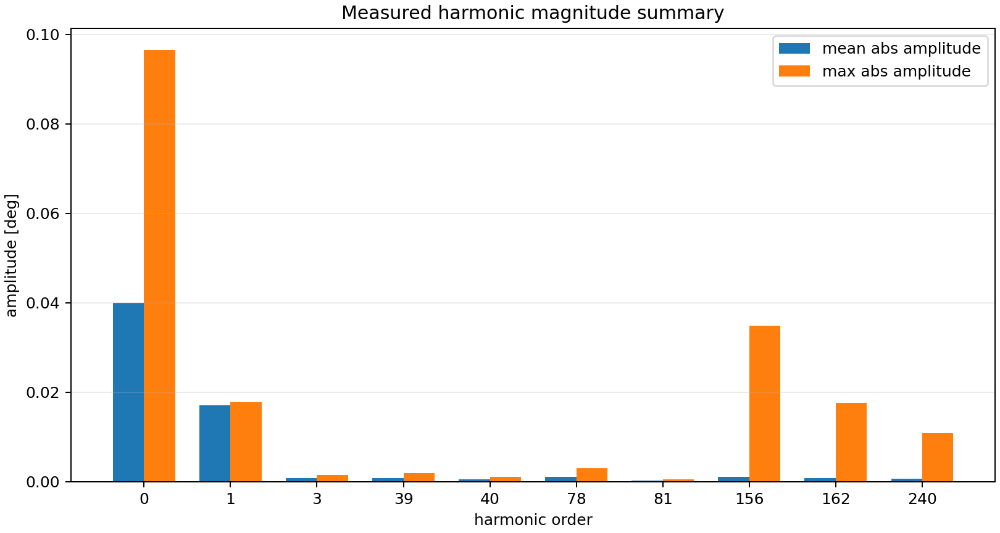
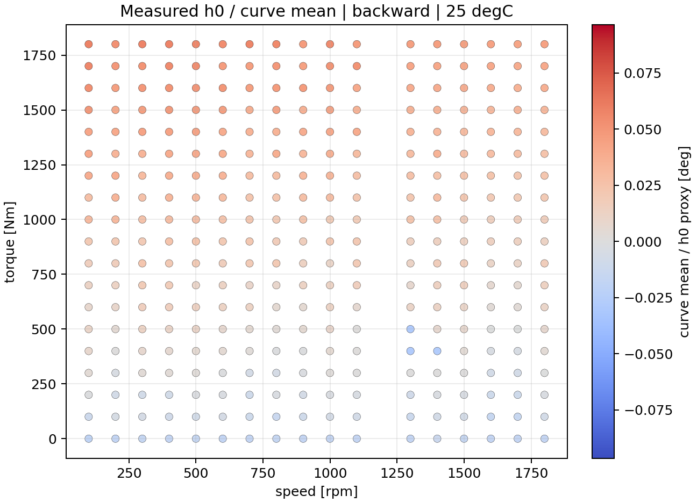
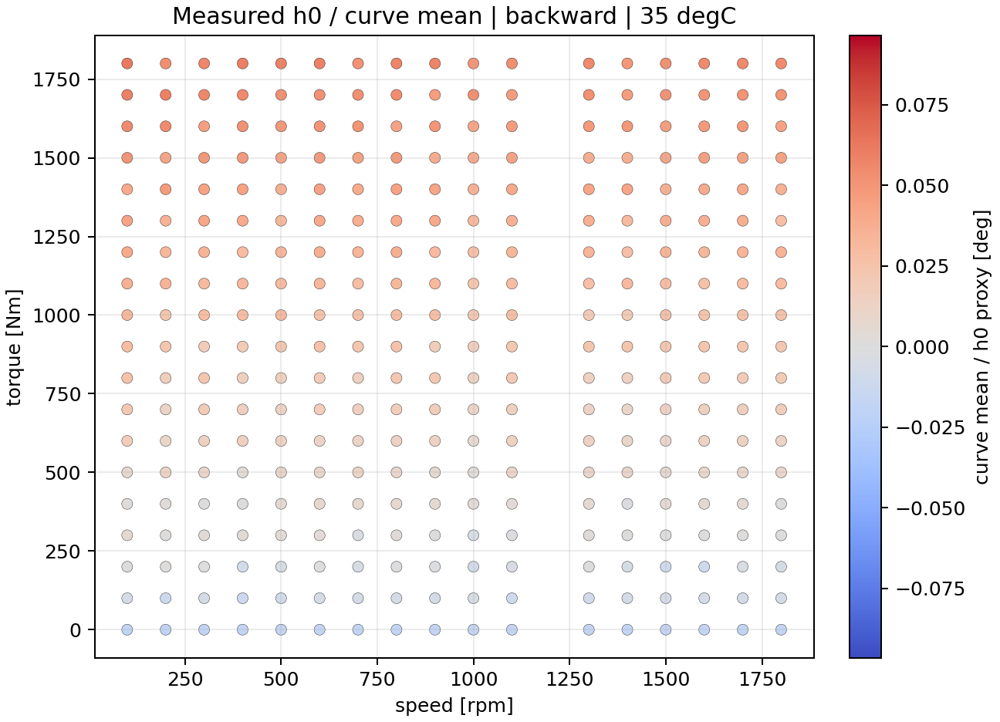
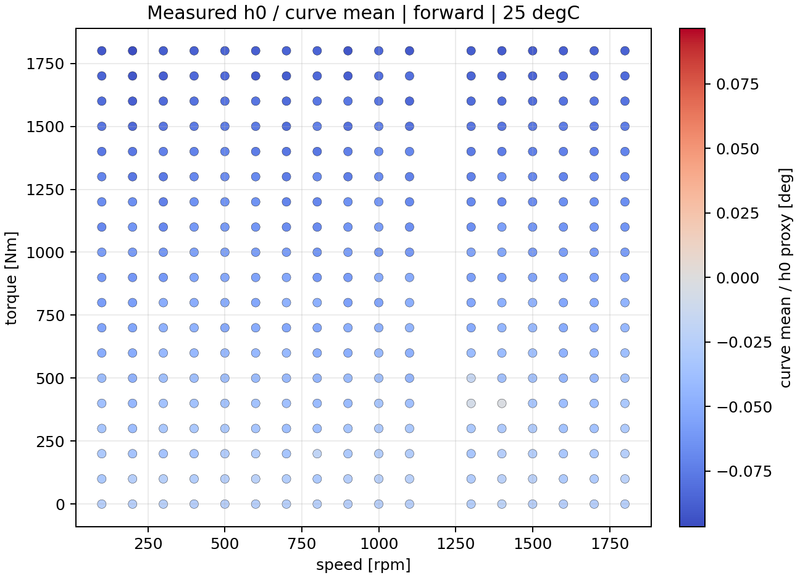

# TE Curve Verification Pipeline Component Offset Identification Diagnostic

## Overview

Measured component-offset diagnostic over `969` CSV files, `1938` directional curves, and harmonic orders `0, 1, 3, 39, 40, 78, 81, 156, 162, 240`.

## Main Findings

| Finding | Interpretation |
| --- | --- |
| Harmonic `0` mean absolute amplitude is `0.039935094 deg`; harmonic `1` is `0.017149350 deg`. | The measured curve mean / `a_0` proxy is the largest average component in the prepared diagnostic set. |
| Largest non-zero maximum amplitude is harmonic `156` at `0.034888028 deg`. | `a_0` is not the only component that can show large individual cases; high-order outliers still need inspection. |
| The current repository CSV grid has one curve per direction / speed / torque / temperature condition. | Repeatability cannot be estimated from the current canonical CSV set alone; external repeated-measurement data are required for a real repeatability conclusion. |
| Forward `h0` values are consistently negative while backward values are mostly positive in the temperature-direction summaries. | Direction must remain a first-class diagnostic axis; a global-only offset correction would hide sign structure. |

## Harmonic Summary

| Harmonic | Mean Abs Amp [deg] | P95 Abs Amp [deg] | Max Abs Amp [deg] |
| ---: | ---: | ---: | ---: |
| `0` | 0.039935094 | 0.083114220 | 0.096616939 |
| `1` | 0.017149350 | 0.017278498 | 0.017859552 |
| `3` | 0.000875204 | 0.001134171 | 0.001460335 |
| `39` | 0.000790242 | 0.001588147 | 0.001878775 |
| `40` | 0.000566066 | 0.000896364 | 0.001100963 |
| `78` | 0.001124873 | 0.002319621 | 0.003014301 |
| `81` | 0.000222494 | 0.000411677 | 0.000610119 |
| `156` | 0.001042352 | 0.004207800 | 0.034888028 |
| `162` | 0.000876746 | 0.003036829 | 0.017653806 |
| `240` | 0.000661320 | 0.001756488 | 0.010896642 |

## Temperature And Direction Summary

| Direction | Temp | Curves | Mean h0 | Std h0 | Min h0 | Max h0 |
| --- | ---: | ---: | ---: | ---: | ---: | ---: |
| `backward` | 25 | 323 | 0.018656 | 0.020290 | -0.029064 | 0.058645 |
| `backward` | 30 | 323 | 0.020811 | 0.020988 | -0.020349 | 0.061768 |
| `backward` | 35 | 323 | 0.022132 | 0.021044 | -0.018715 | 0.062035 |
| `forward` | 25 | 323 | -0.055359 | 0.020531 | -0.095686 | -0.002487 |
| `forward` | 30 | 323 | -0.056172 | 0.019818 | -0.095808 | -0.019389 |
| `forward` | 35 | 323 | -0.055833 | 0.020146 | -0.096617 | -0.022198 |

## Largest Absolute h0 Cases

| Rank | Direction | Speed | Torque | Temp | h0 | P2P | File |
| ---: | --- | ---: | ---: | ---: | ---: | ---: | --- |
| 1 | `forward` | 200 | 1800 | 35 | -0.096617 | 0.048101 | `200.0rpm1800.0Nm35.0deg.csv` |
| 2 | `forward` | 300 | 1800 | 30 | -0.095808 | 0.046346 | `300.0rpm1800.0Nm30.0deg.csv` |
| 3 | `forward` | 200 | 1800 | 25 | -0.095686 | 0.047207 | `200.0rpm1800.0Nm25.0deg.csv` |
| 4 | `forward` | 700 | 1800 | 35 | -0.094272 | 0.047849 | `700.0rpm1800.0Nm35.0deg.csv` |
| 5 | `forward` | 800 | 1800 | 30 | -0.093640 | 0.046183 | `800.0rpm1800.0Nm30.0deg.csv` |
| 6 | `forward` | 500 | 1800 | 30 | -0.093112 | 0.046271 | `500.0rpm1800.0Nm30.0deg.csv` |
| 7 | `forward` | 1000 | 1800 | 35 | -0.092984 | 0.045909 | `1000.0rpm1800.0Nm35.0deg.csv` |
| 8 | `forward` | 1400 | 1800 | 35 | -0.092720 | 0.048646 | `1400.0rpm1800.0Nm35.0deg.csv` |
| 9 | `forward` | 1000 | 1800 | 30 | -0.092215 | 0.047390 | `1000.0rpm1800.0Nm30.0deg.csv` |
| 10 | `forward` | 300 | 1700 | 30 | -0.091875 | 0.046462 | `300.0rpm1700.0Nm30.0deg.csv` |

## Figures

## Decision

`a_0` / harmonic zero should stay the priority suspect because it is
the largest average measured component and shows strong direction
structure. It should not yet be documented as the sole confirmed
cause of the TE Curve Verification Pipeline model offset. The next analysis should compare
these measured h0 surfaces with CVP 1.4 signed model-offset rows and
inspect high-order outliers, especially where harmonic `156`, `162`,
or `240` amplitudes spike.
