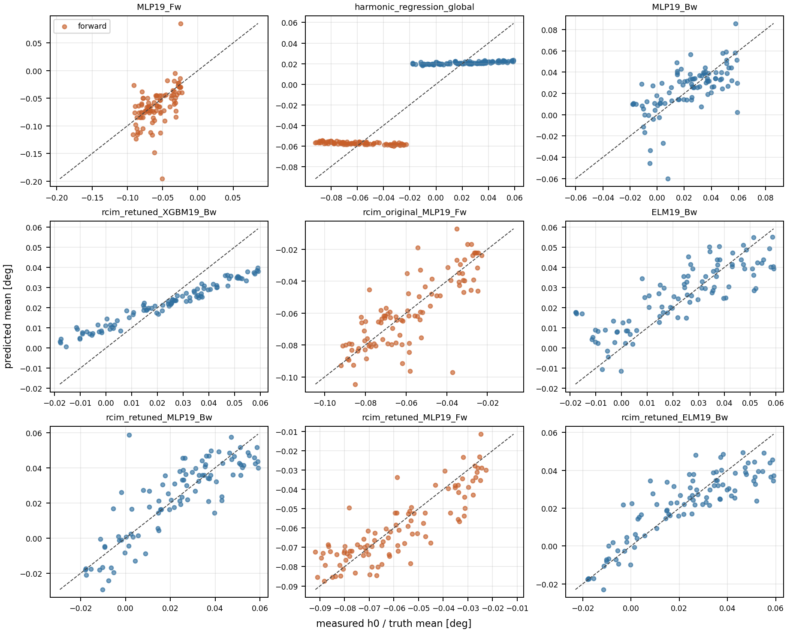
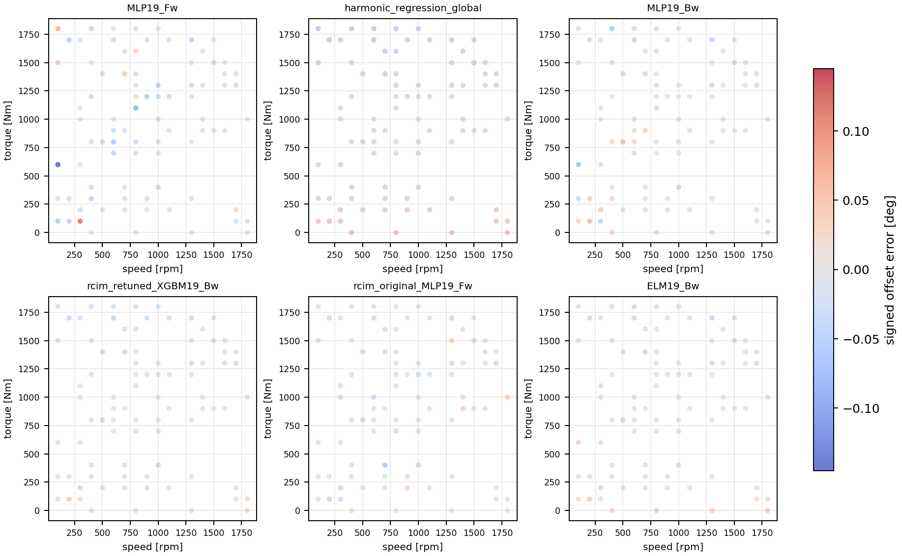

# CVP 1.4 Predicted Mean h0 Surface Diagnostic

## Overview

Predicted-mean versus measured-`h0` diagnostic over `39` selected candidates from the `CVP 1.4` per-curve matrix.

## Decision

- The next intervention should target predicted mean / offset-surface behavior, not measured `h0` magnitude alone.
- Median selected-candidate mean bias is `-0.0001` deg and median mean absolute offset error is `0.0031` deg.
- Median predicted-mean versus measured-`h0` slope is `0.9769`; `1` selected candidates deviate from unit slope by at least `0.50`.
- `1` selected candidates have absolute mean bias at least `0.005 deg`.

## Candidate Selection

| Candidate | Reason |
| --- | --- |
| `DT19_Bw` | `surface_leader_Bw` |
| `ELM19_Bw` | `largest_mean_offset` |
| `ELM19_Fw` | `strong_h0_error_overlap` |
| `GBM19_Fw` | `strong_h0_error_overlap` |
| `LGBM19_Fw` | `strong_h0_error_overlap` |
| `MLP19_Bw` | `largest_mean_offset` |
| `MLP19_Fw` | `largest_mean_offset` |
| `XGBM19_Bw` | `largest_mean_offset` |
| `XGBM19_Fw` | `strong_h0_error_overlap` |
| `feedforward_global` | `global_high_offset` |
| `gru_sequence_global` | `global_high_offset` |
| `harmonic_regression_global` | `global_high_offset;largest_mean_offset` |
| `paper_retuned_best_Fw` | `track2d_top_rank` |
| `periodic_gru_sequence_global` | `surface_leader_global` |
| `periodic_temporal_convolution_global` | `global_high_offset` |
| `rcim_original_DT19_Fw` | `track2d_top_rank` |
| `rcim_original_ERT19_Fw` | `track2d_top_rank` |
| `rcim_original_GBM19_Fw` | `track2d_top_rank` |
| `rcim_original_LGBM19_Fw` | `track2d_top_rank` |
| `rcim_original_MLP19_Fw` | `largest_mean_offset` |
| `rcim_original_RF19_Fw` | `track2d_top_rank` |
| `rcim_retuned_DT19_Fw` | `track2d_top_rank` |
| `rcim_retuned_ELM19_Bw` | `largest_mean_offset;strong_h0_error_overlap` |
| `rcim_retuned_ERT19_Fw` | `track2d_top_rank` |
| `rcim_retuned_GBM19_Fw` | `surface_leader_Fw;track2d_top_rank` |
| `rcim_retuned_HGBM19_Bw` | `strong_h0_error_overlap` |
| `rcim_retuned_LGBM19_Bw` | `strong_h0_error_overlap` |
| `rcim_retuned_MLP19_Bw` | `largest_mean_offset` |
| `rcim_retuned_MLP19_Fw` | `largest_mean_offset` |
| `rcim_retuned_RF19_Fw` | `track2d_top_rank` |
| `rcim_retuned_XGBM19_Bw` | `largest_mean_offset;strong_h0_error_overlap` |
| `residual_harmonic_gru_sequence_dense240_global` | `global_high_offset` |
| `residual_harmonic_gru_sequence_dense360_global` | `global_high_offset` |
| `residual_harmonic_lstm_sequence_dense240_global` | `global_high_offset` |
| `residual_harmonic_lstm_sequence_dense360_global` | `global_high_offset` |
| `residual_harmonic_lstm_sequence_sparse_rcim_Fw` | `strong_h0_error_overlap` |
| `residual_harmonic_mlp_global` | `global_high_offset` |
| `temporal_convolution_Bw` | `strong_h0_error_overlap` |
| `temporal_convolution_global` | `global_high_offset` |

## Candidate Mean-Surface Summary

| Candidate | Surface | Bias | Mean AE | P90 AE | Corr | Slope | Intercept |
| --- | --- | ---: | ---: | ---: | ---: | ---: | ---: |
| `MLP19_Fw` | `Fw` | -0.0060 | 0.0185 | 0.0413 | 0.5330 | 0.8766 | -0.0132 |
| `harmonic_regression_global` | `global` | -0.0005 | 0.0180 | 0.0327 | 0.8892 | 0.7598 | -0.0047 |
| `MLP19_Bw` | `Bw` | 0.0013 | 0.0137 | 0.0283 | 0.6407 | 0.6408 | 0.0096 |
| `rcim_retuned_XGBM19_Bw` | `Bw` | -0.0013 | 0.0101 | 0.0196 | 0.9826 | 0.4648 | 0.0110 |
| `rcim_original_MLP19_Fw` | `Fw` | -0.0006 | 0.0098 | 0.0207 | 0.8007 | 0.8802 | -0.0076 |
| `ELM19_Bw` | `Bw` | 0.0033 | 0.0097 | 0.0187 | 0.8343 | 0.6028 | 0.0124 |
| `rcim_retuned_MLP19_Bw` | `Bw` | -0.0000 | 0.0090 | 0.0190 | 0.8458 | 0.8674 | 0.0030 |
| `rcim_retuned_MLP19_Fw` | `Fw` | -0.0015 | 0.0083 | 0.0177 | 0.8556 | 0.7450 | -0.0165 |
| `rcim_retuned_ELM19_Bw` | `Bw` | -0.0010 | 0.0081 | 0.0188 | 0.8713 | 0.7220 | 0.0054 |
| `XGBM19_Bw` | `Bw` | 0.0030 | 0.0077 | 0.0171 | 0.9240 | 0.5587 | 0.0131 |

## Direction Split

| Candidate | Direction | Bias | Mean AE | Corr | Slope |
| --- | --- | ---: | ---: | ---: | ---: |
| `ELM19_Bw` | `backward` | 0.0033 | 0.0097 | 0.8343 | 0.6028 |
| `MLP19_Bw` | `backward` | 0.0013 | 0.0137 | 0.6407 | 0.6408 |
| `MLP19_Fw` | `forward` | -0.0060 | 0.0185 | 0.5330 | 0.8766 |
| `XGBM19_Bw` | `backward` | 0.0030 | 0.0077 | 0.9240 | 0.5587 |
| `harmonic_regression_global` | `backward` | -0.0021 | 0.0178 | 0.7416 | 0.0410 |
| `harmonic_regression_global` | `forward` | 0.0011 | 0.0182 | -0.7018 | -0.0411 |
| `rcim_original_MLP19_Fw` | `forward` | -0.0006 | 0.0098 | 0.8007 | 0.8802 |
| `rcim_retuned_ELM19_Bw` | `backward` | -0.0010 | 0.0081 | 0.8713 | 0.7220 |
| `rcim_retuned_MLP19_Bw` | `backward` | -0.0000 | 0.0090 | 0.8458 | 0.8674 |
| `rcim_retuned_MLP19_Fw` | `forward` | -0.0015 | 0.0083 | 0.8556 | 0.7450 |
| `rcim_retuned_XGBM19_Bw` | `backward` | -0.0013 | 0.0101 | 0.9826 | 0.4648 |

## Visual Diagnostics





## Interpretation

The useful signal is model-side mean-surface behavior: candidates with large offset error generally show candidate-specific bias, compressed or shifted predicted-mean surfaces, or direction-dependent behavior.
This supports planning an offset/mean head or calibration branch that is evaluated per `Fw`, `Bw`, and `global` surface, while keeping centered-shape metrics separate.

## Machine-Readable Artifacts

- `output/validation_checks/track2d_predicted_mean_h0_surface_diagnostic/2026-06-10-13-00-59__track2d_predicted_mean_h0_surface_diagnostic/track2d_predicted_mean_h0_candidate_summary.csv`
- `output/validation_checks/track2d_predicted_mean_h0_surface_diagnostic/2026-06-10-13-00-59__track2d_predicted_mean_h0_surface_diagnostic/track2d_predicted_mean_h0_direction_summary.csv`
- `output/validation_checks/track2d_predicted_mean_h0_surface_diagnostic/2026-06-10-13-00-59__track2d_predicted_mean_h0_surface_diagnostic/track2d_predicted_mean_h0_candidate_selection.csv`
- `output/validation_checks/track2d_predicted_mean_h0_surface_diagnostic/2026-06-10-13-00-59__track2d_predicted_mean_h0_surface_diagnostic/track2d_predicted_mean_h0_selected_rows.csv`
- `output/validation_checks/track2d_predicted_mean_h0_surface_diagnostic/2026-06-10-13-00-59__track2d_predicted_mean_h0_surface_diagnostic/track2d_predicted_mean_h0_surface_diagnostic_summary.yaml`

## Reproduction

```powershell
conda run -n pinns_env python -B scripts/reports/analysis/build_track2d_predicted_mean_h0_surface_diagnostic.py
```
