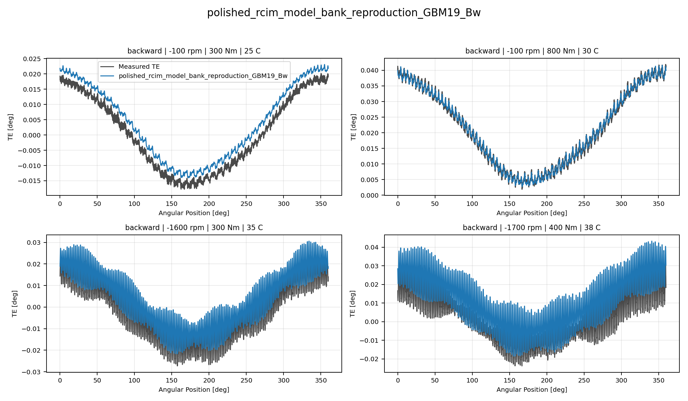
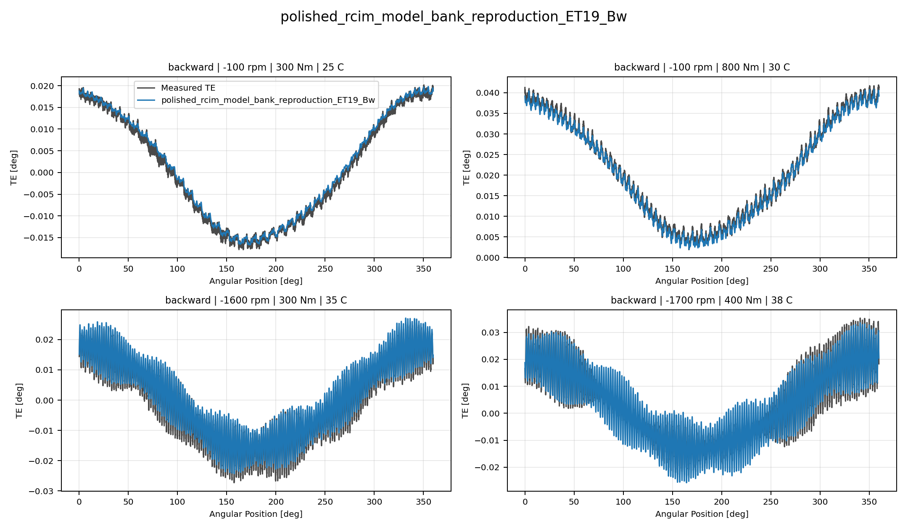
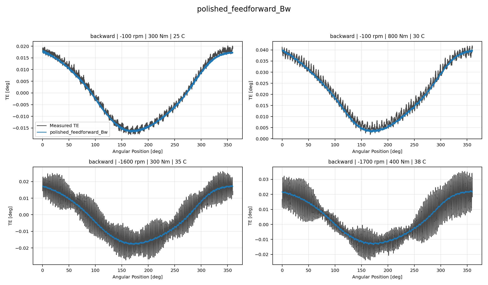
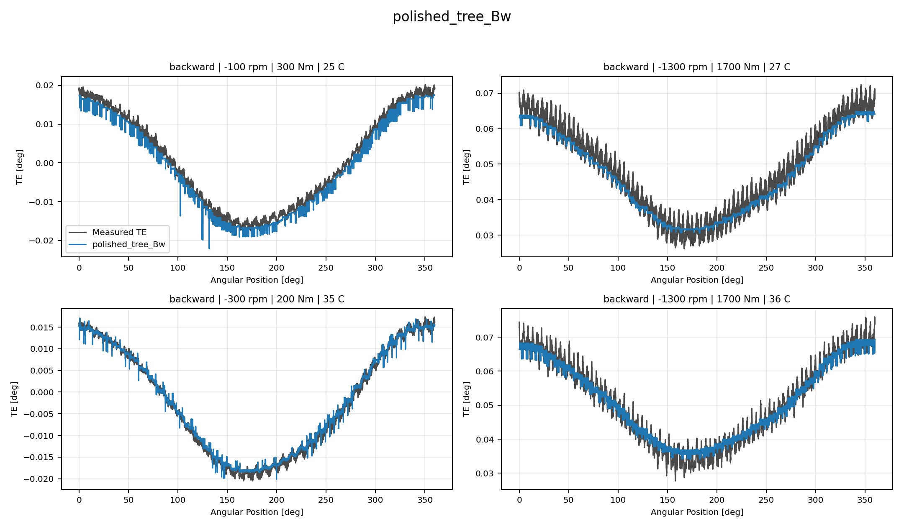
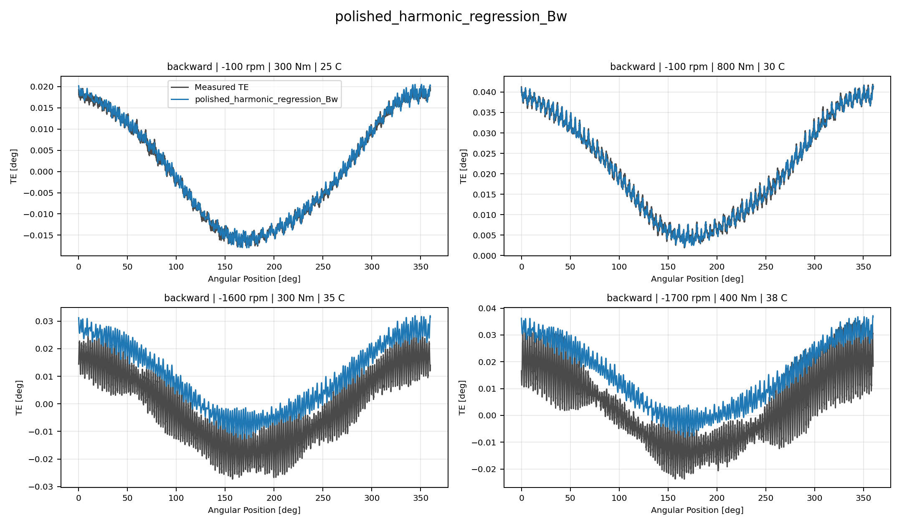
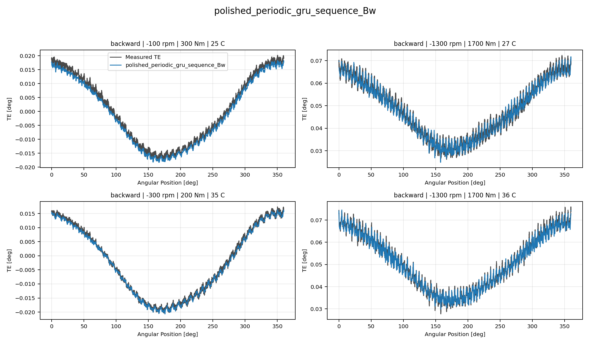
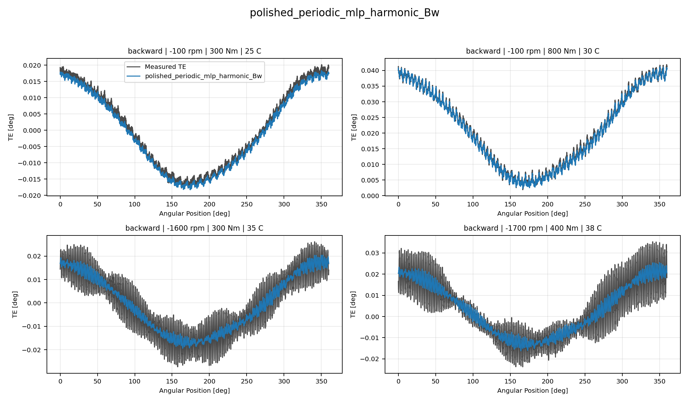
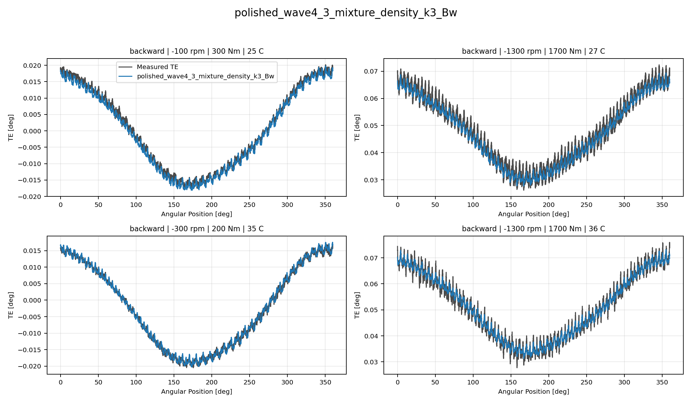
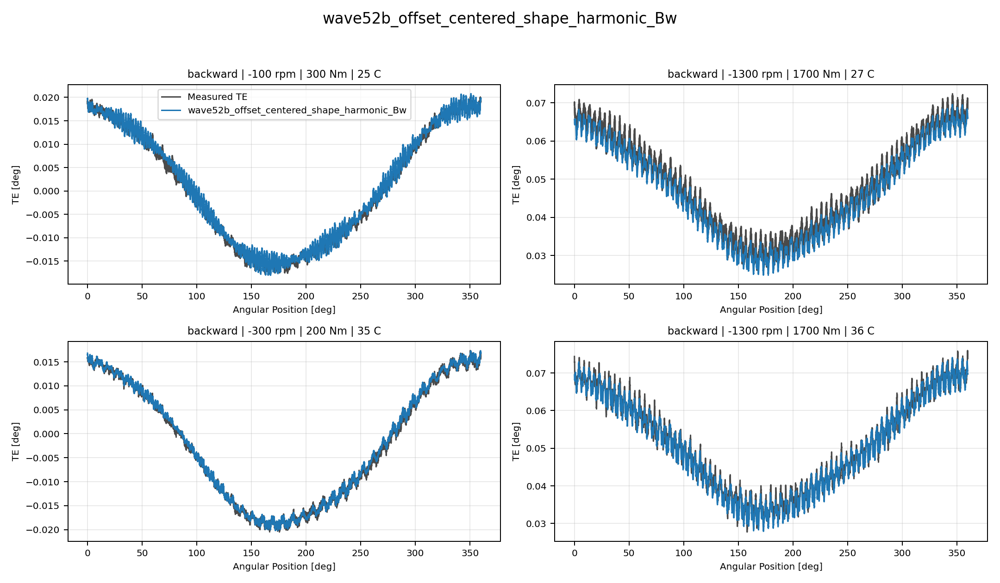

# TE Curve Verification Pipeline Directional Model Comparison

## Overview

This report is the canonical `TE Curve Verification Pipeline` offline comparison between
`RCIM Model-Bank Reproduction`, recovered original, retuned paper-reference model banks, and
repository-owned `Wave 1` and `Wave 2.1` model candidates. It starts from
the current direction-aware comparison matrix.

## Dataset And Split

- dataset config: `config/datasets/transmission_error_dataset.yaml`;
- dataset root: `data\polished_dataset`;
- comparison mode: `reduced_selected_model_matrix`;
- candidate count: `9`;
- held-out curve count before candidate filtering: `94`;
- percentage-error denominator: `peak_to_peak_truth`;
- `Fw` candidates are evaluated only on forward curves;
- `Bw` candidates are evaluated only on backward curves;

## Candidate Inventory

| Candidate | Source | Family | Surface | Valid Directions |
| --- | --- | --- | --- | --- |
| `polished_rcim_model_bank_reproduction_GBM19_Bw` | `polished_rcim_model_bank_reproduction` | `GBM` | `Bw` | `backward` |
| `polished_rcim_model_bank_reproduction_ET19_Bw` | `polished_rcim_model_bank_reproduction` | `ET` | `Bw` | `backward` |
| `polished_feedforward_Bw` | `polished_model_development_registry` | `feedforward` | `Bw` | `backward` |
| `polished_tree_Bw` | `polished_model_development_registry` | `tree` | `Bw` | `backward` |
| `polished_harmonic_regression_Bw` | `polished_model_development_registry` | `harmonic_regression` | `Bw` | `backward` |
| `polished_periodic_gru_sequence_Bw` | `polished_model_development_registry` | `periodic_gru_sequence` | `Bw` | `backward` |
| `polished_periodic_mlp_harmonic_Bw` | `polished_model_development_registry` | `periodic_mlp_harmonic` | `Bw` | `backward` |
| `polished_wave4_3_mixture_density_k3_Bw` | `polished_model_development_registry` | `wave4_3_mixture_density_k3` | `Bw` | `backward` |
| `wave52b_offset_centered_shape_harmonic_Bw` | `wave52b_offset_harmonic_guided_registry` | `wave52b_offset_harmonic_guided` | `Bw` | `backward` |

## Forward Comparison

## Backward Comparison

### Wave 5.2B Offset And Harmonic Guided Backward And Global Models

| Candidate | Curve MAE [deg] | Curve RMSE [deg] | Mean Percentage Error [%] | P95 Mean Percentage Error [%] |
| --- | ---: | ---: | ---: | ---: |
| `wave52b_offset_centered_shape_harmonic_Bw` | 0.002266 | 0.002708 | 3.986 | 9.758 |

### Polished Model-Development Backward And Global Models

| Candidate | Curve MAE [deg] | Curve RMSE [deg] | Mean Percentage Error [%] | P95 Mean Percentage Error [%] |
| --- | ---: | ---: | ---: | ---: |
| `polished_periodic_gru_sequence_Bw` | 0.001129 | 0.001412 | 2.228 | 4.688 |
| `polished_wave4_3_mixture_density_k3_Bw` | 0.001930 | 0.002341 | 3.405 | 9.512 |
| `polished_periodic_mlp_harmonic_Bw` | 0.002396 | 0.002823 | 4.137 | 10.607 |
| `polished_feedforward_Bw` | 0.002655 | 0.003193 | 4.708 | 10.602 |
| `polished_tree_Bw` | 0.002756 | 0.003287 | 4.934 | 10.752 |
| `polished_harmonic_regression_Bw` | 0.004181 | 0.004742 | 8.213 | 15.543 |

### Polished RCIM Model-Bank Reproduction Backward Models

| Candidate | Curve MAE [deg] | Curve RMSE [deg] | Mean Percentage Error [%] | P95 Mean Percentage Error [%] |
| --- | ---: | ---: | ---: | ---: |
| `polished_rcim_model_bank_reproduction_ET19_Bw` | 0.004034 | 0.004316 | 8.163 | 41.965 |
| `polished_rcim_model_bank_reproduction_GBM19_Bw` | 0.004482 | 0.004755 | 9.169 | 43.941 |

## Curve Evidence

Each selected candidate is shown with the same four deterministic held-out operating conditions for this direction.
The dark line is the measured TE curve and the blue line is the model
prediction for the same operating condition.

Shared operating conditions:

- 100 rpm, 300 Nm, 25 C
- 1300 rpm, 1700 Nm, 25 C
- 300 rpm, 200 Nm, 35 C
- 1300 rpm, 1700 Nm, 35 C

| Candidate | Role | Curve MAE [deg] | Curve RMSE [deg] | Mean MPE [%] | P95 MPE [%] |
| --- | --- | ---: | ---: | ---: | ---: |
| `polished_rcim_model_bank_reproduction_GBM19_Bw` | Selected candidate | 0.004482 | 0.004755 | 9.169 | 43.941 |
| `polished_rcim_model_bank_reproduction_ET19_Bw` | Selected candidate | 0.004034 | 0.004316 | 8.163 | 41.965 |
| `polished_feedforward_Bw` | Selected candidate | 0.002655 | 0.003193 | 4.708 | 10.602 |
| `polished_tree_Bw` | Selected candidate | 0.002756 | 0.003287 | 4.934 | 10.752 |
| `polished_harmonic_regression_Bw` | Selected candidate | 0.004181 | 0.004742 | 8.213 | 15.543 |
| `polished_periodic_gru_sequence_Bw` | Surface leader | 0.001129 | 0.001412 | 2.228 | 4.688 |
| `polished_periodic_mlp_harmonic_Bw` | Selected candidate | 0.002396 | 0.002823 | 4.137 | 10.607 |
| `polished_wave4_3_mixture_density_k3_Bw` | Selected candidate | 0.001930 | 0.002341 | 3.405 | 9.512 |
| `wave52b_offset_centered_shape_harmonic_Bw` | Selected candidate | 0.002266 | 0.002708 | 3.986 | 9.758 |

### polished_rcim_model_bank_reproduction_GBM19_Bw

### polished_rcim_model_bank_reproduction_ET19_Bw

### polished_feedforward_Bw

### polished_tree_Bw

### polished_harmonic_regression_Bw

### polished_periodic_gru_sequence_Bw

### polished_periodic_mlp_harmonic_Bw

### polished_wave4_3_mixture_density_k3_Bw

### wave52b_offset_centered_shape_harmonic_Bw

## Artifacts

- summary YAML: `output\validation_checks\track2_reference_comparison\2026-07-07-01-18-57__track2_reduced_selected_model_matrix_track2_selected_polished_dataset_backward_2026_07_06/validation_summary.yaml`;
- per-condition CSV: `output\validation_checks\track2_reference_comparison\2026-07-07-01-18-57__track2_reduced_selected_model_matrix_track2_selected_polished_dataset_backward_2026_07_06\per_condition_metrics.csv`;
- grouped report plot root: `doc\reports\campaign_results\track_2\verification_plots\paused_reduced_selected_model_matrix`;
- grouped report plot count: `0`;

## Interpretation

Rows are ranked by mean percentage error within each source group
and direction. Directional paper-reference, Wave 1, and Wave 2.1
models are never evaluated on the opposite direction. Global Wave
models remain valid on both directions and are therefore shown in
the directional sections and again in the global breakdown.
The `rcim_track1` forward reference banks use the opposite stored
`h0` sign convention relative to the TE Curve Verification Pipeline reconstruction
contract, so the TE Curve Verification Pipeline comparison applies the documented
source-specific `h0` compatibility multiplier before curve
reconstruction.

## Open Gaps

- This remains an offline TE-curve comparison and does not replace the
  future online `Table 9` compensation benchmark.
- The report uses the saved Python model artifacts from `models/`; ONNX
  parity checks remain a separate deployment-readiness task.
