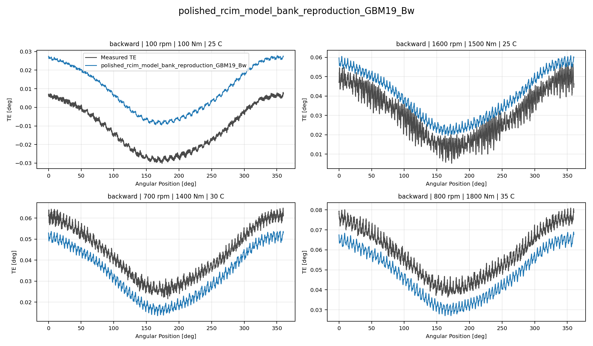
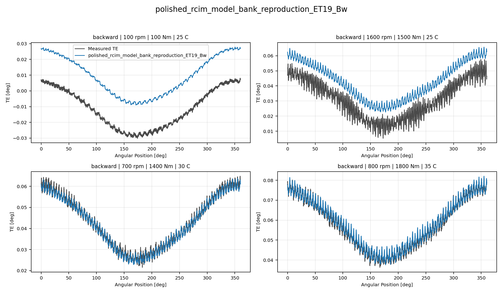
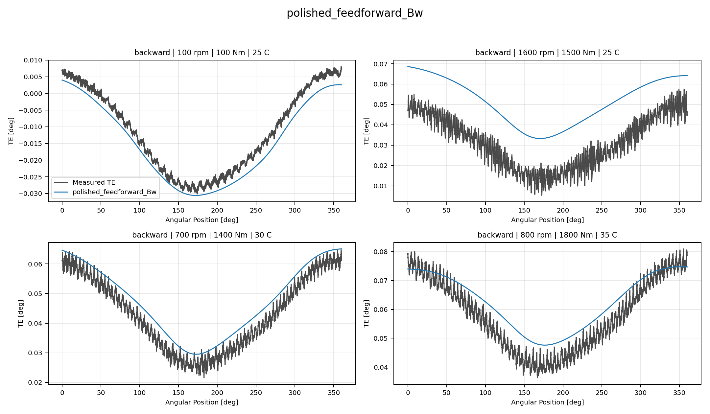
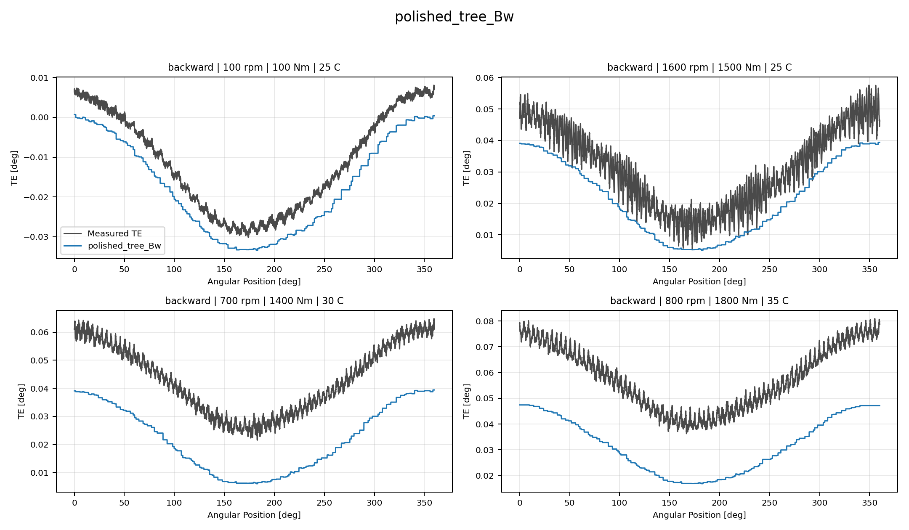
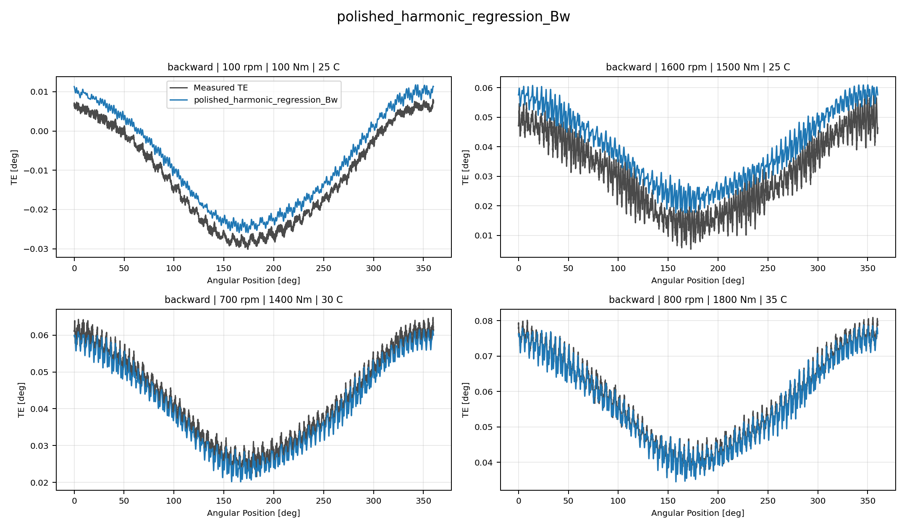
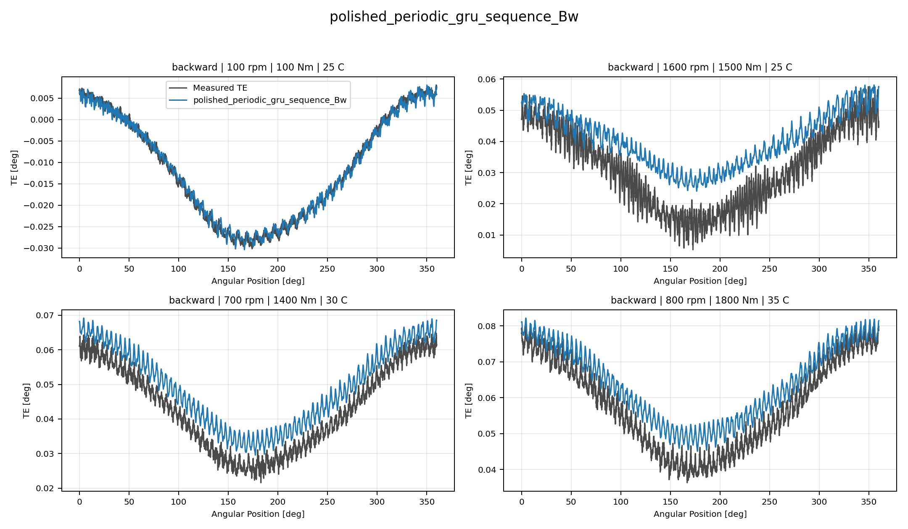
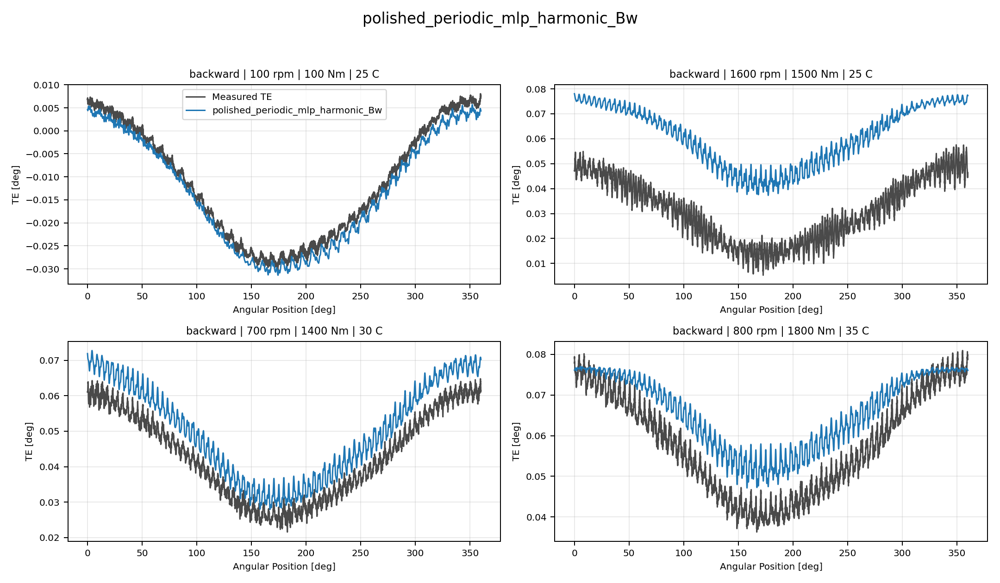
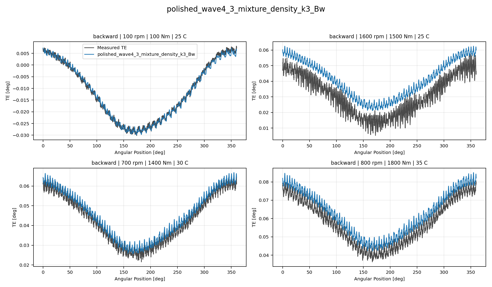
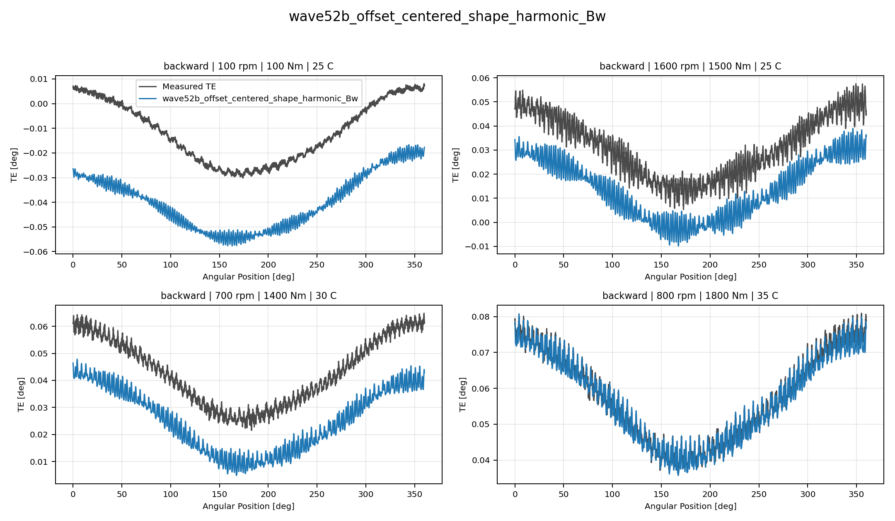

# TE Curve Verification Pipeline Directional Model Comparison

## Overview

This report is the reduced selected-model `TE Curve Verification Pipeline`
offline comparison for one dataset and one direction. It includes only the
active selected model-development candidates plus reduced baseline anchors.

## Dataset And Split

- dataset config: `config/datasets/transmission_error_dataset.yaml`;
- dataset root: `data\simplified_dataset`;
- comparison mode: `reduced_selected_model_matrix`;
- candidate count: `9`;
- held-out curve count before candidate filtering: `97`;
- percentage-error denominator: `peak_to_peak_truth`;
- this reduced report excludes `global` candidates by design;
- only candidates valid for this direction are evaluated.

## Candidate Inventory

| Candidate | Family | Source | Kind | Surface | Valid Directions | Model Source |
| --- | --- | --- | --- | --- | --- | --- |
| `polished_rcim_model_bank_reproduction_GBM19_Bw` | `GBM` | `polished_rcim_model_bank_reproduction` | `track1_reference_bank` | `Bw` | `backward` | `output\validation_checks\rcim_model_bank_reproduction\reference_inventories\backward\gbm_reference_models\reference_inventory.yaml` |
| `polished_rcim_model_bank_reproduction_ET19_Bw` | `ET` | `polished_rcim_model_bank_reproduction` | `track1_reference_bank` | `Bw` | `backward` | `output\validation_checks\rcim_model_bank_reproduction\reference_inventories\backward\et_reference_models\reference_inventory.yaml` |
| `polished_feedforward_Bw` | `feedforward` | `polished_model_development_registry` | `wave1_registry_model` | `Bw` | `backward` | `output\registries\families\feedforward_bw\latest_family_best.yaml` |
| `polished_tree_Bw` | `tree` | `polished_model_development_registry` | `wave1_registry_model` | `Bw` | `backward` | `output\registries\families\tree_bw\latest_family_best.yaml` |
| `polished_harmonic_regression_Bw` | `harmonic_regression` | `polished_model_development_registry` | `wave1_registry_model` | `Bw` | `backward` | `output\registries\families\harmonic_regression_bw\latest_family_best.yaml` |
| `polished_periodic_gru_sequence_Bw` | `periodic_gru_sequence` | `polished_model_development_registry` | `wave1_registry_model` | `Bw` | `backward` | `output\registries\families\periodic_gru_sequence_bw\latest_family_best.yaml` |
| `polished_periodic_mlp_harmonic_Bw` | `periodic_mlp_harmonic` | `polished_model_development_registry` | `wave1_registry_model` | `Bw` | `backward` | `output\registries\families\periodic_mlp_harmonic_bw\latest_family_best.yaml` |
| `polished_wave4_3_mixture_density_k3_Bw` | `wave4_3_mixture_density_k3` | `polished_model_development_registry` | `wave1_registry_model` | `Bw` | `backward` | `output\registries\families\wave4_3_mixture_density_k3_bw\latest_family_best.yaml` |
| `wave52b_offset_centered_shape_harmonic_Bw` | `wave52b_offset_harmonic_guided` | `wave52b_offset_harmonic_guided_registry` | `wave1_registry_model` | `Bw` | `backward` | `output\registries\families\wave52b_offset_harmonic_guided_offset_centered_shape_harmonic_bw\latest_family_best.yaml` |

## Forward Comparison

## Backward Comparison

### Wave 5.2B Offset And Harmonic Guided Backward Models

| Candidate | Curve MAE [deg] | Curve RMSE [deg] | Mean Percentage Error [%] | P95 Mean Percentage Error [%] |
| --- | ---: | ---: | ---: | ---: |
| `wave52b_offset_centered_shape_harmonic_Bw` | 0.020690 | 0.021139 | 48.162 | 112.613 |

### Polished Model-Development Backward Models

| Candidate | Curve MAE [deg] | Curve RMSE [deg] | Mean Percentage Error [%] | P95 Mean Percentage Error [%] |
| --- | ---: | ---: | ---: | ---: |
| `polished_harmonic_regression_Bw` | 0.003678 | 0.004012 | 8.058 | 15.071 |
| `polished_wave4_3_mixture_density_k3_Bw` | 0.005049 | 0.005359 | 11.212 | 23.958 |
| `polished_periodic_gru_sequence_Bw` | 0.006320 | 0.006795 | 14.078 | 28.125 |
| `polished_feedforward_Bw` | 0.008079 | 0.008672 | 17.892 | 35.715 |
| `polished_periodic_mlp_harmonic_Bw` | 0.009393 | 0.009831 | 20.198 | 50.399 |
| `polished_tree_Bw` | 0.015215 | 0.015523 | 34.609 | 61.506 |

### Polished RCIM Model-Bank Reproduction Backward Models

| Candidate | Curve MAE [deg] | Curve RMSE [deg] | Mean Percentage Error [%] | P95 Mean Percentage Error [%] |
| --- | ---: | ---: | ---: | ---: |
| `polished_rcim_model_bank_reproduction_ET19_Bw` | 0.007426 | 0.007704 | 16.960 | 62.118 |
| `polished_rcim_model_bank_reproduction_GBM19_Bw` | 0.007624 | 0.007918 | 17.434 | 48.611 |

## Curve Evidence

Each selected candidate is shown with four deterministic held-out curves.
The dark line is the measured TE curve and the blue line is the model
prediction for the same operating condition.

| Candidate | Role | Curve MAE [deg] | Curve RMSE [deg] | Mean MPE [%] | P95 MPE [%] |
| --- | --- | ---: | ---: | ---: | ---: |
| `polished_rcim_model_bank_reproduction_GBM19_Bw` | Selected candidate | 0.007624 | 0.007918 | 17.434 | 48.611 |
| `polished_rcim_model_bank_reproduction_ET19_Bw` | Selected candidate | 0.007426 | 0.007704 | 16.960 | 62.118 |
| `polished_feedforward_Bw` | Selected candidate | 0.008079 | 0.008672 | 17.892 | 35.715 |
| `polished_tree_Bw` | Selected candidate | 0.015215 | 0.015523 | 34.609 | 61.506 |
| `polished_harmonic_regression_Bw` | Surface leader | 0.003678 | 0.004012 | 8.058 | 15.071 |
| `polished_periodic_gru_sequence_Bw` | Selected candidate | 0.006320 | 0.006795 | 14.078 | 28.125 |
| `polished_periodic_mlp_harmonic_Bw` | Selected candidate | 0.009393 | 0.009831 | 20.198 | 50.399 |
| `polished_wave4_3_mixture_density_k3_Bw` | Selected candidate | 0.005049 | 0.005359 | 11.212 | 23.958 |
| `wave52b_offset_centered_shape_harmonic_Bw` | Selected candidate | 0.020690 | 0.021139 | 48.162 | 112.613 |

### polished_rcim_model_bank_reproduction_GBM19_Bw

### polished_rcim_model_bank_reproduction_ET19_Bw

### polished_feedforward_Bw

### polished_tree_Bw

### polished_harmonic_regression_Bw

### polished_periodic_gru_sequence_Bw

### polished_periodic_mlp_harmonic_Bw

### polished_wave4_3_mixture_density_k3_Bw

### wave52b_offset_centered_shape_harmonic_Bw

## Artifacts

- summary YAML: `output\validation_checks\track2_reference_comparison\2026-07-06-19-55-29__track2_reduced_selected_model_matrix_track2_selected_simplified_dataset_backward_2026_07_06/validation_summary.yaml`;
- per-condition CSV: `output\validation_checks\track2_reference_comparison\2026-07-06-19-55-29__track2_reduced_selected_model_matrix_track2_selected_simplified_dataset_backward_2026_07_06\per_condition_metrics.csv`;
- grouped report plot root: `doc\reports\campaign_results\track_2\verification_plots\paused_reduced_selected_model_matrix`;
- grouped report plot count: `0`;

## Interpretation

Rows are ranked by mean percentage error within each source group
and direction. Directional candidates are never evaluated on the opposite
direction in this reduced report. `global` is paused for the active reduced
pipeline and is not included in the candidate inventory.
The `rcim_track1` forward reference banks use the opposite stored
`h0` sign convention relative to the TE Curve Verification Pipeline reconstruction
contract, so the TE Curve Verification Pipeline comparison applies the documented
source-specific `h0` compatibility multiplier before curve
reconstruction.

## Open Gaps

- This remains an offline TE-curve comparison and does not replace the
  future online `Table 9` compensation benchmark.
- The report uses the saved Python model artifacts from `models/`; ONNX
  parity checks remain a separate deployment-readiness task.
