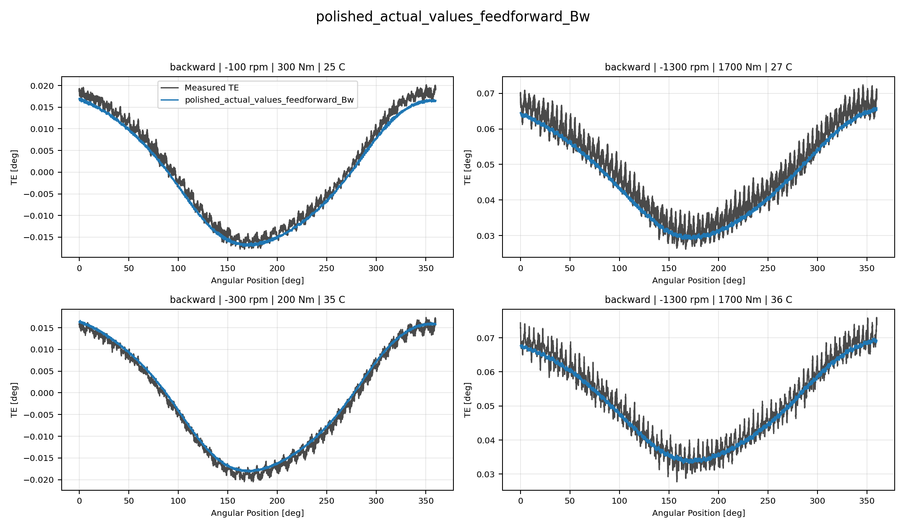
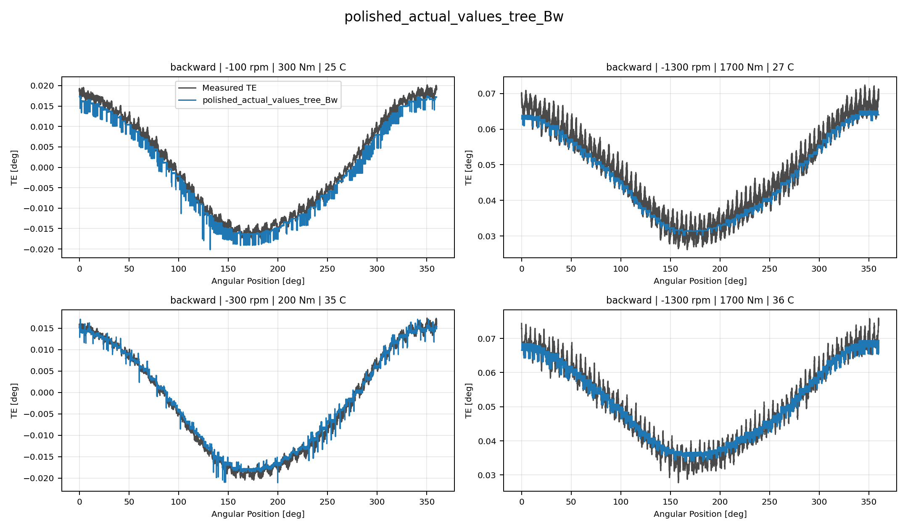
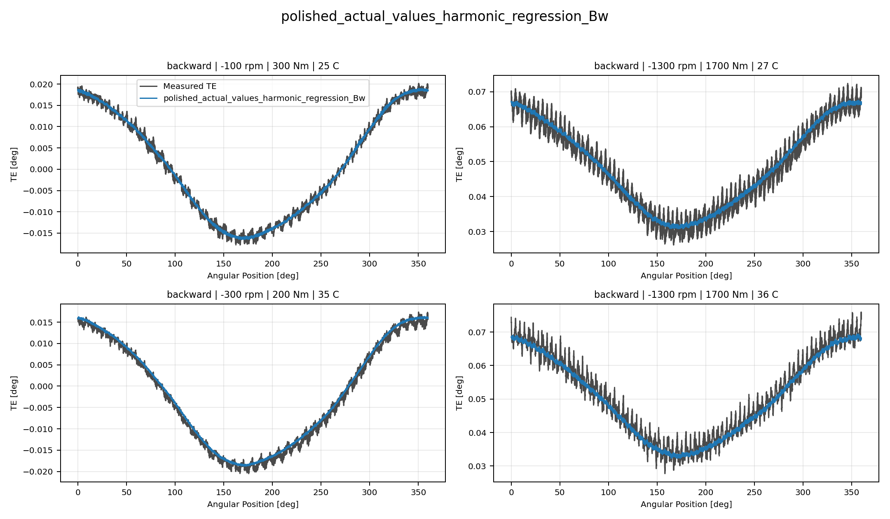
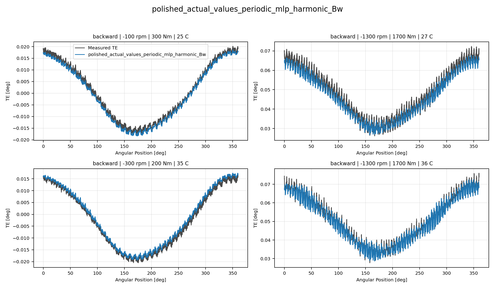
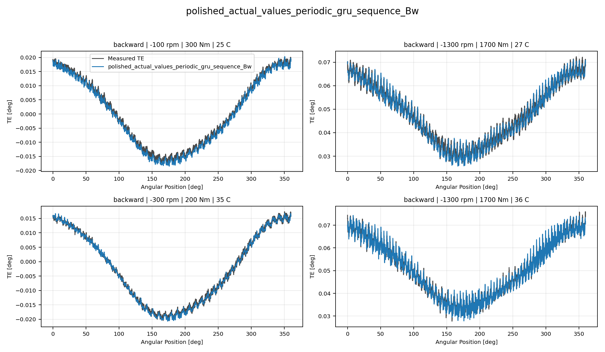
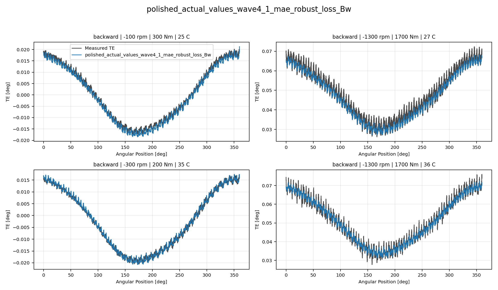
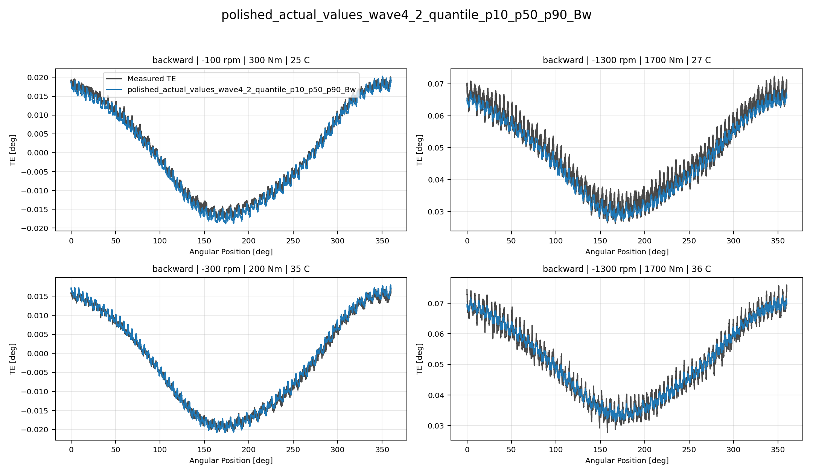

# TE Curve Verification Pipeline Selected Active Model Report

## Overview

This report evaluates only the currently selected active model families
against the repository held-out TE-curve test split. The `global` surface
is intentionally excluded from this reduced decision report.

## Dataset And Split

- dataset config: `config/datasets/transmission_error_dataset.yaml`;
- dataset root: `data\polished_dataset`;
- comparison mode: `selected_active_model_matrix`;
- candidate count: `7`;
- held-out curve count before candidate filtering: `94`;
- percentage-error denominator: `peak_to_peak_truth`;
- evaluated surface: `Bw`;
- evaluated direction: `backward`;

## Candidate Inventory

| Candidate | Source | Family | Surface | Valid Directions |
| --- | --- | --- | --- | --- |
| `polished_actual_values_feedforward_Bw` | `polished_actual_values_model_archive` | `feedforward` | `Bw` | `backward` |
| `polished_actual_values_tree_Bw` | `polished_actual_values_model_archive` | `tree` | `Bw` | `backward` |
| `polished_actual_values_harmonic_regression_Bw` | `polished_actual_values_model_archive` | `harmonic_regression` | `Bw` | `backward` |
| `polished_actual_values_periodic_mlp_harmonic_Bw` | `polished_actual_values_model_archive` | `periodic_mlp_harmonic` | `Bw` | `backward` |
| `polished_actual_values_periodic_gru_sequence_Bw` | `polished_actual_values_model_archive` | `periodic_gru_sequence` | `Bw` | `backward` |
| `polished_actual_values_wave4_1_mae_robust_loss_Bw` | `polished_actual_values_model_archive` | `wave4_1_mae_robust_loss` | `Bw` | `backward` |
| `polished_actual_values_wave4_2_quantile_p10_p50_p90_Bw` | `polished_actual_values_model_archive` | `wave4_2_quantile_p10_p50_p90` | `Bw` | `backward` |

## Exact Model Paths

| Candidate | Family | Surface | ONNX Model Path | Python Model Path |
| --- | --- | --- | --- | --- |
| `polished_actual_values_feedforward_Bw` | `feedforward` | `Bw` | `models/polished_dataset/actual_values/feedforward/backward/onnx/model.onnx` | `models/polished_dataset/actual_values/feedforward/backward/python/feedforward-epoch=074-val_mae=0.00164741.ckpt` |
| `polished_actual_values_tree_Bw` | `tree` | `Bw` | `models/polished_dataset/actual_values/tree/backward/onnx/model.onnx` | `models/polished_dataset/actual_values/tree/backward/python/tree_model.pkl` |
| `polished_actual_values_harmonic_regression_Bw` | `harmonic_regression` | `Bw` | `models/polished_dataset/actual_values/harmonic_regression/backward/onnx/model.onnx` | `models/polished_dataset/actual_values/harmonic_regression/backward/python/harmonic_regression-epoch=054-val_mae=0.00182643.ckpt` |
| `polished_actual_values_periodic_mlp_harmonic_Bw` | `periodic_mlp_harmonic` | `Bw` | `models/polished_dataset/actual_values/periodic_mlp_harmonic/backward/onnx/model.onnx` | `models/polished_dataset/actual_values/periodic_mlp_harmonic/backward/python/periodic_mlp-epoch=128-val_mae=0.00117146.ckpt` |
| `polished_actual_values_periodic_gru_sequence_Bw` | `periodic_gru_sequence` | `Bw` | `models/polished_dataset/actual_values/periodic_gru_sequence/backward/onnx/model.onnx` | `models/polished_dataset/actual_values/periodic_gru_sequence/backward/python/periodic_gru_sequence-epoch=257-val_mae=0.00127934.ckpt` |
| `polished_actual_values_wave4_1_mae_robust_loss_Bw` | `wave4_1_mae_robust_loss` | `Bw` | `models/polished_dataset/actual_values/wave4_1_mae_robust_loss/backward/onnx/model.onnx` | `models/polished_dataset/actual_values/wave4_1_mae_robust_loss/backward/python/curve_aware_harmonic_residual_offset_probe-epoch=173-val_mae=0.00178689.ckpt` |
| `polished_actual_values_wave4_2_quantile_p10_p50_p90_Bw` | `wave4_2_quantile_p10_p50_p90` | `Bw` | `models/polished_dataset/actual_values/wave4_2_quantile_p10_p50_p90/backward/onnx/model.onnx` | `models/polished_dataset/actual_values/wave4_2_quantile_p10_p50_p90/backward/python/curve_aware_harmonic_residual_offset_probe-epoch=123-val_mae=0.00178818.ckpt` |

## Metric Ranking

| Rank | Candidate | Curve MAE [deg] | Curve RMSE [deg] | Mean Percentage Error [%] | P95 Mean Percentage Error [%] |
| ---: | --- | ---: | ---: | ---: | ---: |
| 1 | `polished_actual_values_periodic_gru_sequence_Bw` | 0.001333 | 0.001672 | 2.625 | 5.438 |
| 2 | `polished_actual_values_wave4_2_quantile_p10_p50_p90_Bw` | 0.002188 | 0.002651 | 3.867 | 10.067 |
| 3 | `polished_actual_values_wave4_1_mae_robust_loss_Bw` | 0.002315 | 0.002784 | 3.989 | 10.342 |
| 4 | `polished_actual_values_periodic_mlp_harmonic_Bw` | 0.002483 | 0.002914 | 4.321 | 10.519 |
| 5 | `polished_actual_values_feedforward_Bw` | 0.002769 | 0.003293 | 4.919 | 10.603 |
| 6 | `polished_actual_values_tree_Bw` | 0.002759 | 0.003293 | 4.935 | 10.731 |
| 7 | `polished_actual_values_harmonic_regression_Bw` | 0.002966 | 0.003511 | 5.369 | 10.974 |

## Direction Breakdown

| Direction | Candidate | Curve MAE [deg] | Curve RMSE [deg] | Mean Percentage Error [%] | P95 Mean Percentage Error [%] |
| --- | --- | ---: | ---: | ---: | ---: |
| `backward` | `polished_actual_values_periodic_gru_sequence_Bw` | 0.001333 | 0.001672 | 2.625 | 5.438 |
| `backward` | `polished_actual_values_wave4_2_quantile_p10_p50_p90_Bw` | 0.002188 | 0.002651 | 3.867 | 10.067 |
| `backward` | `polished_actual_values_wave4_1_mae_robust_loss_Bw` | 0.002315 | 0.002784 | 3.989 | 10.342 |
| `backward` | `polished_actual_values_periodic_mlp_harmonic_Bw` | 0.002483 | 0.002914 | 4.321 | 10.519 |
| `backward` | `polished_actual_values_feedforward_Bw` | 0.002769 | 0.003293 | 4.919 | 10.603 |
| `backward` | `polished_actual_values_tree_Bw` | 0.002759 | 0.003293 | 4.935 | 10.731 |
| `backward` | `polished_actual_values_harmonic_regression_Bw` | 0.002966 | 0.003511 | 5.369 | 10.974 |

## Curve Evidence

Each selected candidate is shown with the same four deterministic held-out operating conditions for this direction.
The dark line is the measured TE curve and the blue line is the model
prediction for the same operating condition.

Shared operating conditions:

- 100 rpm, 300 Nm, 25 C
- 1300 rpm, 1700 Nm, 25 C
- 300 rpm, 200 Nm, 35 C
- 1300 rpm, 1700 Nm, 35 C

| Candidate | Role | Curve MAE [deg] | Curve RMSE [deg] | Mean MPE [%] | P95 MPE [%] |
| --- | --- | ---: | ---: | ---: | ---: |
| `polished_actual_values_feedforward_Bw` | Selected candidate | 0.002769 | 0.003293 | 4.919 | 10.603 |
| `polished_actual_values_tree_Bw` | Selected candidate | 0.002759 | 0.003293 | 4.935 | 10.731 |
| `polished_actual_values_harmonic_regression_Bw` | Selected candidate | 0.002966 | 0.003511 | 5.369 | 10.974 |
| `polished_actual_values_periodic_mlp_harmonic_Bw` | Selected candidate | 0.002483 | 0.002914 | 4.321 | 10.519 |
| `polished_actual_values_periodic_gru_sequence_Bw` | Surface leader | 0.001333 | 0.001672 | 2.625 | 5.438 |
| `polished_actual_values_wave4_1_mae_robust_loss_Bw` | Selected candidate | 0.002315 | 0.002784 | 3.989 | 10.342 |
| `polished_actual_values_wave4_2_quantile_p10_p50_p90_Bw` | Selected candidate | 0.002188 | 0.002651 | 3.867 | 10.067 |

### polished_actual_values_feedforward_Bw

### polished_actual_values_tree_Bw

### polished_actual_values_harmonic_regression_Bw

### polished_actual_values_periodic_mlp_harmonic_Bw

### polished_actual_values_periodic_gru_sequence_Bw

### polished_actual_values_wave4_1_mae_robust_loss_Bw

### polished_actual_values_wave4_2_quantile_p10_p50_p90_Bw

## Artifacts

- summary YAML: `output\validation_checks\track2_reference_comparison\2026-07-19-17-49-24__track2_selected_active_polished_actual_values_matrix_track2_selected_active_polished_actual_values_backward_2026_07_19/validation_summary.yaml`;
- per-condition CSV: `output\validation_checks\track2_reference_comparison\2026-07-19-17-49-24__track2_selected_active_polished_actual_values_matrix_track2_selected_active_polished_actual_values_backward_2026_07_19\per_condition_metrics.csv`;
- grouped report plot root: `doc\reports\campaign_results\track_2\verification_plots\selected_active_model_matrix`;
- grouped report plot count: `0`;

## Interpretation

Rows are ranked by mean percentage error within this selected-active
surface report. The curve-evidence section uses shared deterministic
held-out operating conditions so visual shape fidelity can be compared
across the selected families.

## Open Gaps

- This remains an offline TE-curve comparison and does not replace the
  future online `Table 9` compensation benchmark.
- RCIM Model-Bank Reproduction remains a separate paper-reference
  benchmark path and is not part of this selected-active model-only
  report.
