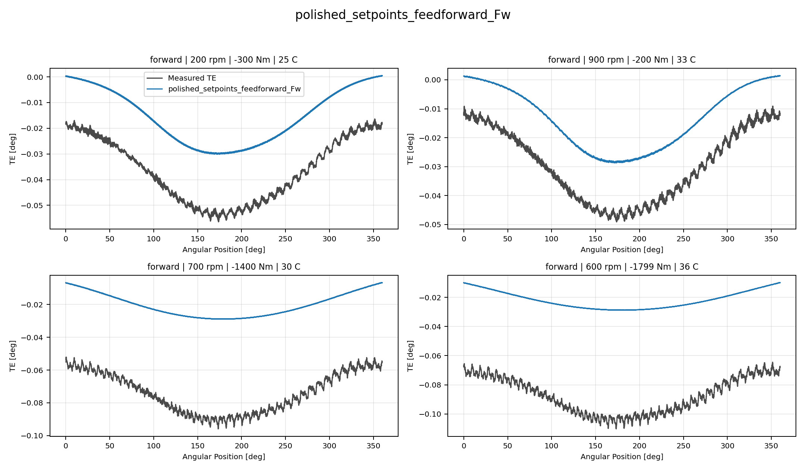
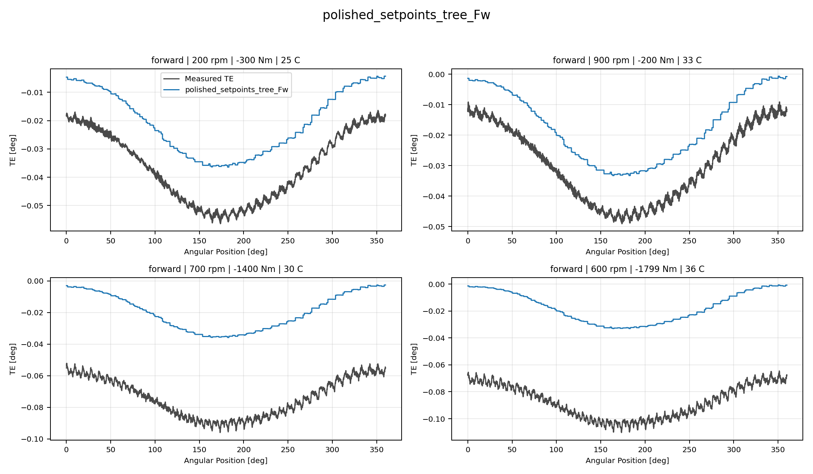
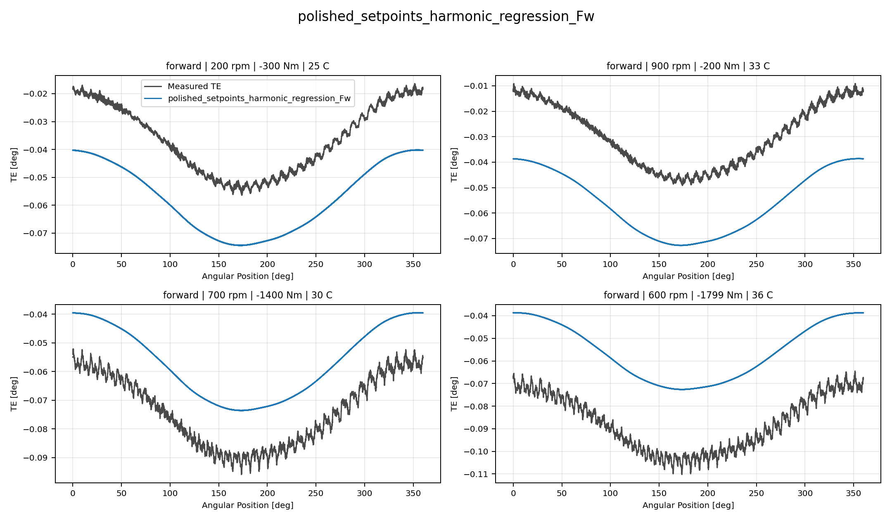
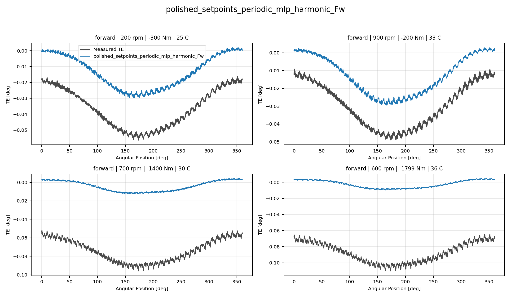
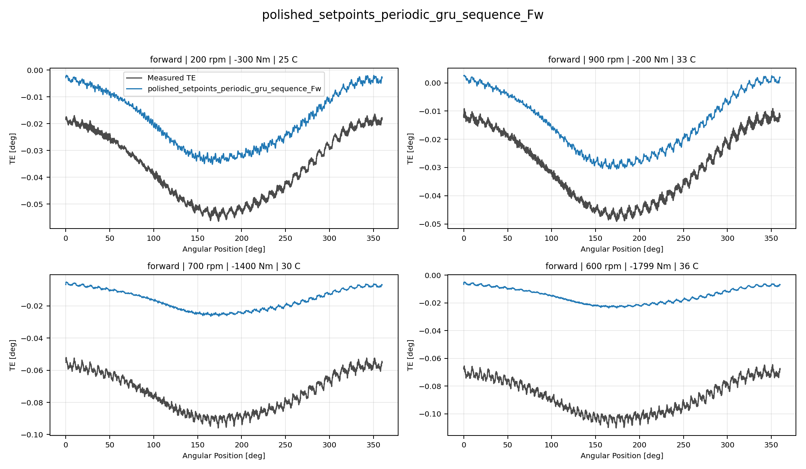
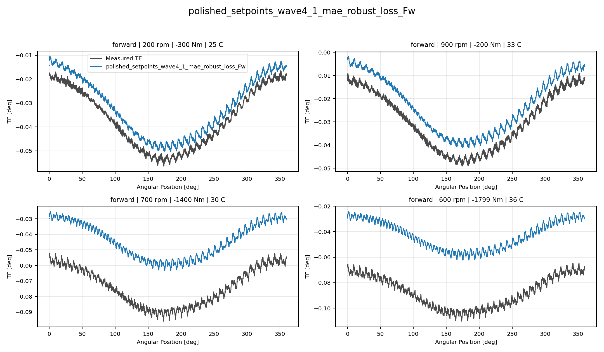
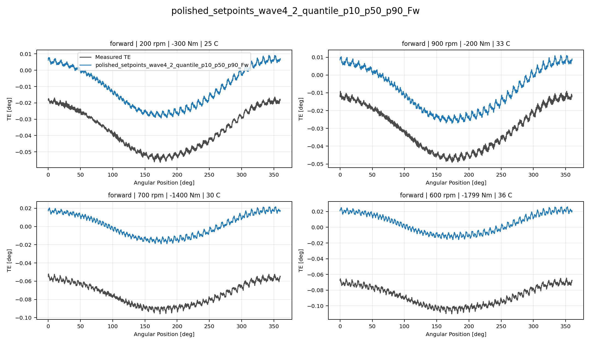

# TE Curve Verification Pipeline Selected Active Model Report

## Overview

This report evaluates only the currently selected active model families
against the repository held-out TE-curve test split. The `global` surface
is intentionally excluded from this reduced decision report.

## Dataset And Split

- dataset config: `config/datasets/transmission_error_dataset.yaml`;
- dataset root: `data\polished_dataset`;
- comparison mode: `selected_active_model_matrix`;
- candidate count: `7`;
- held-out curve count before candidate filtering: `100`;
- percentage-error denominator: `peak_to_peak_truth`;
- evaluated surface: `Fw`;
- evaluated direction: `forward`;

## Candidate Inventory

| Candidate | Source | Family | Surface | Valid Directions |
| --- | --- | --- | --- | --- |
| `polished_setpoints_feedforward_Fw` | `polished_setpoints_model_archive` | `feedforward` | `Fw` | `forward` |
| `polished_setpoints_tree_Fw` | `polished_setpoints_model_archive` | `tree` | `Fw` | `forward` |
| `polished_setpoints_harmonic_regression_Fw` | `polished_setpoints_model_archive` | `harmonic_regression` | `Fw` | `forward` |
| `polished_setpoints_periodic_mlp_harmonic_Fw` | `polished_setpoints_model_archive` | `periodic_mlp_harmonic` | `Fw` | `forward` |
| `polished_setpoints_periodic_gru_sequence_Fw` | `polished_setpoints_model_archive` | `periodic_gru_sequence` | `Fw` | `forward` |
| `polished_setpoints_wave4_1_mae_robust_loss_Fw` | `polished_setpoints_model_archive` | `wave4_1_mae_robust_loss` | `Fw` | `forward` |
| `polished_setpoints_wave4_2_quantile_p10_p50_p90_Fw` | `polished_setpoints_model_archive` | `wave4_2_quantile_p10_p50_p90` | `Fw` | `forward` |

## Exact Model Paths

| Candidate | Family | Surface | ONNX Model Path | Python Model Path |
| --- | --- | --- | --- | --- |
| `polished_setpoints_feedforward_Fw` | `feedforward` | `Fw` | `models/polished_dataset/setpoints/exported/feedforward/forward/2026-07-07-17-25-58__te_feedforward_fw__polished_setpoints/onnx/model.onnx` | `models/polished_dataset/setpoints/exported/feedforward/forward/2026-07-07-17-25-58__te_feedforward_fw__polished_setpoints/python/feedforward-epoch=042-val_mae=0.00168289.ckpt` |
| `polished_setpoints_tree_Fw` | `tree` | `Fw` | `models/polished_dataset/setpoints/exported/tree/forward/2026-07-07-09-34-40__te_tree_fw__polished_setpoints/onnx/model.onnx` | `models/polished_dataset/setpoints/exported/tree/forward/2026-07-07-09-34-40__te_tree_fw__polished_setpoints/python/tree_model.pkl` |
| `polished_setpoints_harmonic_regression_Fw` | `harmonic_regression` | `Fw` | `models/polished_dataset/setpoints/exported/harmonic_regression/forward/2026-07-07-23-29-07__te_harmonic_regression_fw__polished_setpoints/onnx/model.onnx` | `models/polished_dataset/setpoints/exported/harmonic_regression/forward/2026-07-07-23-29-07__te_harmonic_regression_fw__polished_setpoints/python/harmonic_regression-epoch=032-val_mae=0.01714993.ckpt` |
| `polished_setpoints_periodic_mlp_harmonic_Fw` | `periodic_mlp_harmonic` | `Fw` | `models/polished_dataset/setpoints/exported/periodic_mlp_harmonic/forward/2026-07-08-02-15-59__te_periodic_mlp_harmonic_fw__polished_setpoints/onnx/model.onnx` | `models/polished_dataset/setpoints/exported/periodic_mlp_harmonic/forward/2026-07-08-02-15-59__te_periodic_mlp_harmonic_fw__polished_setpoints/python/periodic_mlp-epoch=051-val_mae=0.00120808.ckpt` |
| `polished_setpoints_periodic_gru_sequence_Fw` | `periodic_gru_sequence` | `Fw` | `models/polished_dataset/setpoints/exported/periodic_gru_sequence/forward/2026-07-08-22-57-44__te_periodic_gru_sequence_fw__polished_setpoints/onnx/model.onnx` | `models/polished_dataset/setpoints/exported/periodic_gru_sequence/forward/2026-07-08-22-57-44__te_periodic_gru_sequence_fw__polished_setpoints/python/periodic_gru_sequence-epoch=091-val_mae=0.00183161.ckpt` |
| `polished_setpoints_wave4_1_mae_robust_loss_Fw` | `wave4_1_mae_robust_loss` | `Fw` | `models/polished_dataset/setpoints/exported/wave4_1_mae_robust_loss/forward/2026-07-12-16-19-34__te_wave4_1_mae_robust_loss_fw__polished_setpoints/onnx/model.onnx` | `models/polished_dataset/setpoints/exported/wave4_1_mae_robust_loss/forward/2026-07-12-16-19-34__te_wave4_1_mae_robust_loss_fw__polished_setpoints/python/curve_aware_harmonic_residual_offset_probe-epoch=105-val_mae=0.00179190.ckpt` |
| `polished_setpoints_wave4_2_quantile_p10_p50_p90_Fw` | `wave4_2_quantile_p10_p50_p90` | `Fw` | `models/polished_dataset/setpoints/exported/wave4_2_quantile_p10_p50_p90/forward/2026-07-14-13-15-27__te_wave4_2_quantile_p10_p50_p90_fw__polished_setpoints/onnx/model.onnx` | `models/polished_dataset/setpoints/exported/wave4_2_quantile_p10_p50_p90/forward/2026-07-14-13-15-27__te_wave4_2_quantile_p10_p50_p90_fw__polished_setpoints/python/curve_aware_harmonic_residual_offset_probe-epoch=157-val_mae=0.00180121.ckpt` |

## Metric Ranking

| Rank | Candidate | Curve MAE [deg] | Curve RMSE [deg] | Mean Percentage Error [%] | P95 Mean Percentage Error [%] |
| ---: | --- | ---: | ---: | ---: | ---: |
| 1 | `polished_setpoints_wave4_1_mae_robust_loss_Fw` | 0.016970 | 0.017294 | 36.104 | 88.789 |
| 2 | `polished_setpoints_harmonic_regression_Fw` | 0.017019 | 0.017299 | 38.005 | 77.612 |
| 3 | `polished_setpoints_tree_Fw` | 0.035091 | 0.035237 | 75.422 | 148.017 |
| 4 | `polished_setpoints_feedforward_Fw` | 0.036872 | 0.037171 | 79.766 | 139.388 |
| 5 | `polished_setpoints_periodic_gru_sequence_Fw` | 0.038470 | 0.038781 | 82.792 | 150.753 |
| 6 | `polished_setpoints_periodic_mlp_harmonic_Fw` | 0.046156 | 0.046484 | 99.650 | 180.552 |
| 7 | `polished_setpoints_wave4_2_quantile_p10_p50_p90_Fw` | 0.051176 | 0.051284 | 110.194 | 191.941 |

## Direction Breakdown

| Direction | Candidate | Curve MAE [deg] | Curve RMSE [deg] | Mean Percentage Error [%] | P95 Mean Percentage Error [%] |
| --- | --- | ---: | ---: | ---: | ---: |
| `forward` | `polished_setpoints_wave4_1_mae_robust_loss_Fw` | 0.016970 | 0.017294 | 36.104 | 88.789 |
| `forward` | `polished_setpoints_harmonic_regression_Fw` | 0.017019 | 0.017299 | 38.005 | 77.612 |
| `forward` | `polished_setpoints_tree_Fw` | 0.035091 | 0.035237 | 75.422 | 148.017 |
| `forward` | `polished_setpoints_feedforward_Fw` | 0.036872 | 0.037171 | 79.766 | 139.388 |
| `forward` | `polished_setpoints_periodic_gru_sequence_Fw` | 0.038470 | 0.038781 | 82.792 | 150.753 |
| `forward` | `polished_setpoints_periodic_mlp_harmonic_Fw` | 0.046156 | 0.046484 | 99.650 | 180.552 |
| `forward` | `polished_setpoints_wave4_2_quantile_p10_p50_p90_Fw` | 0.051176 | 0.051284 | 110.194 | 191.941 |

## Curve Evidence

Each selected candidate is shown with the same four deterministic held-out operating conditions for this direction.
The dark line is the measured TE curve and the blue line is the model
prediction for the same operating condition.

Shared operating conditions:
- 200 rpm, 300 Nm, 25 C
- 900 rpm, 200 Nm, 30 C
- 700 rpm, 1400 Nm, 30 C
- 600 rpm, 1800 Nm, 35 C

| Candidate | Role | Curve MAE [deg] | Curve RMSE [deg] | Mean MPE [%] | P95 MPE [%] |
| --- | --- | ---: | ---: | ---: | ---: |
| `polished_setpoints_feedforward_Fw` | Selected candidate | 0.036872 | 0.037171 | 79.766 | 139.388 |
| `polished_setpoints_tree_Fw` | Selected candidate | 0.035091 | 0.035237 | 75.422 | 148.017 |
| `polished_setpoints_harmonic_regression_Fw` | Selected candidate | 0.017019 | 0.017299 | 38.005 | 77.612 |
| `polished_setpoints_periodic_mlp_harmonic_Fw` | Selected candidate | 0.046156 | 0.046484 | 99.650 | 180.552 |
| `polished_setpoints_periodic_gru_sequence_Fw` | Selected candidate | 0.038470 | 0.038781 | 82.792 | 150.753 |
| `polished_setpoints_wave4_1_mae_robust_loss_Fw` | Surface leader | 0.016970 | 0.017294 | 36.104 | 88.789 |
| `polished_setpoints_wave4_2_quantile_p10_p50_p90_Fw` | Selected candidate | 0.051176 | 0.051284 | 110.194 | 191.941 |

### polished_setpoints_feedforward_Fw

### polished_setpoints_tree_Fw

### polished_setpoints_harmonic_regression_Fw

### polished_setpoints_periodic_mlp_harmonic_Fw

### polished_setpoints_periodic_gru_sequence_Fw

### polished_setpoints_wave4_1_mae_robust_loss_Fw

### polished_setpoints_wave4_2_quantile_p10_p50_p90_Fw

## Artifacts

- summary YAML: `output\validation_checks\track2_reference_comparison\2026-07-19-17-42-20__track2_selected_active_polished_setpoints_matrix_track2_selected_active_polished_setpoints_forward_2026_07_19/validation_summary.yaml`;
- per-condition CSV: `output\validation_checks\track2_reference_comparison\2026-07-19-17-42-20__track2_selected_active_polished_setpoints_matrix_track2_selected_active_polished_setpoints_forward_2026_07_19\per_condition_metrics.csv`;
- grouped report plot root: `doc\reports\campaign_results\track_2\verification_plots\selected_active_model_matrix`;
- grouped report plot count: `0`;

## Interpretation

Rows are ranked by mean percentage error within this selected-active
surface report. The curve-evidence section uses shared deterministic
held-out operating conditions so visual shape fidelity can be compared
across the selected families.

## Open Gaps

- This remains an offline TE-curve comparison and does not replace the
  future online `Table 9` compensation benchmark.
- RCIM Model-Bank Reproduction remains a separate paper-reference
  benchmark path and is not part of this selected-active model-only
  report.
