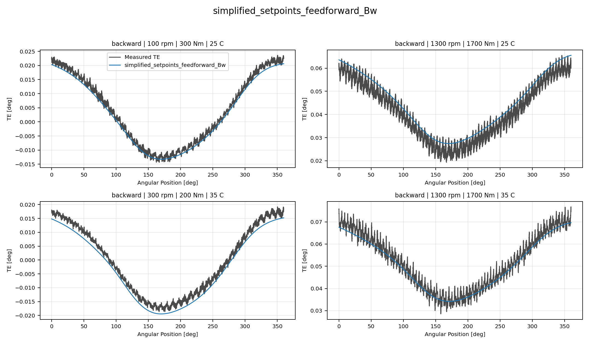
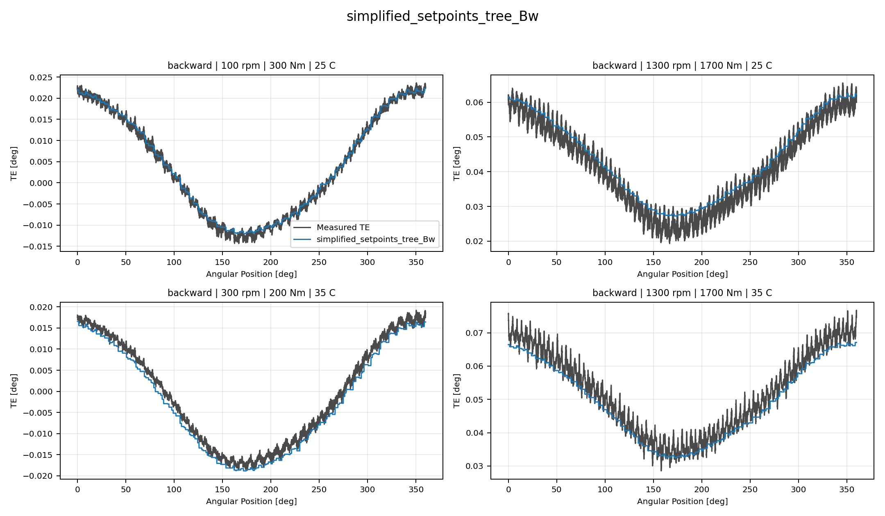
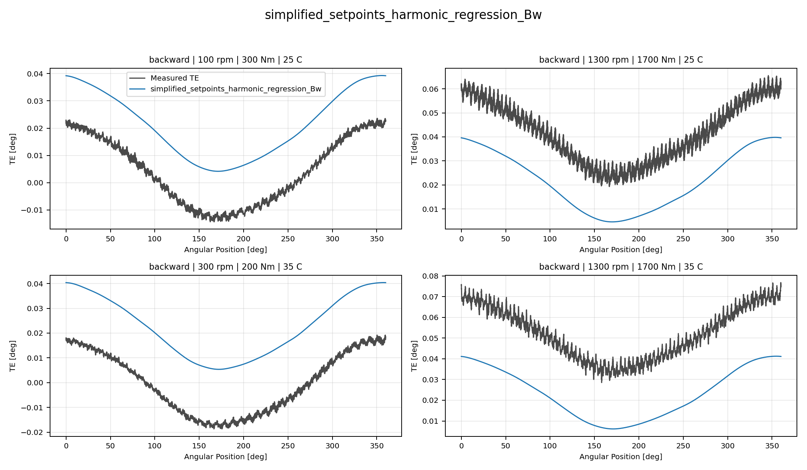
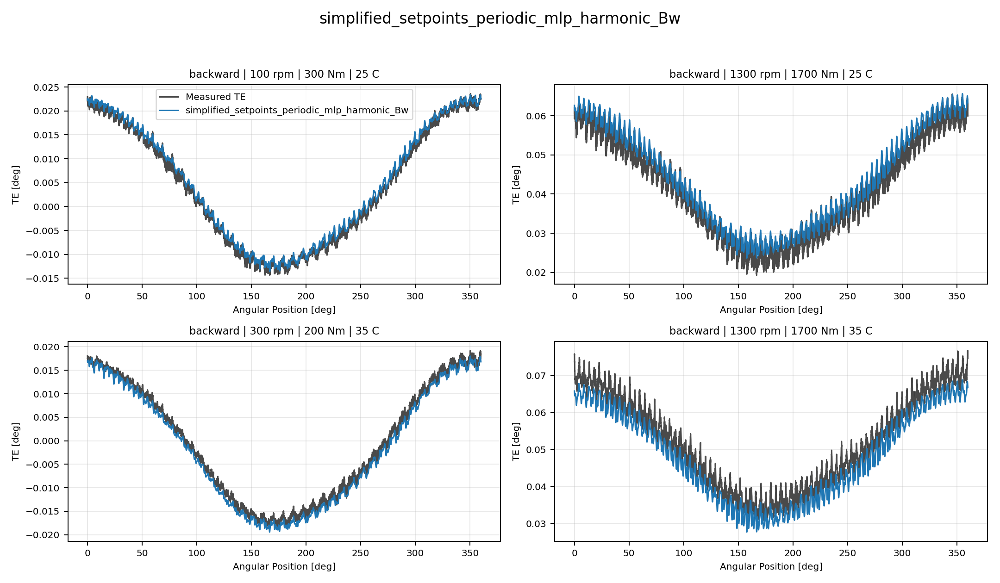
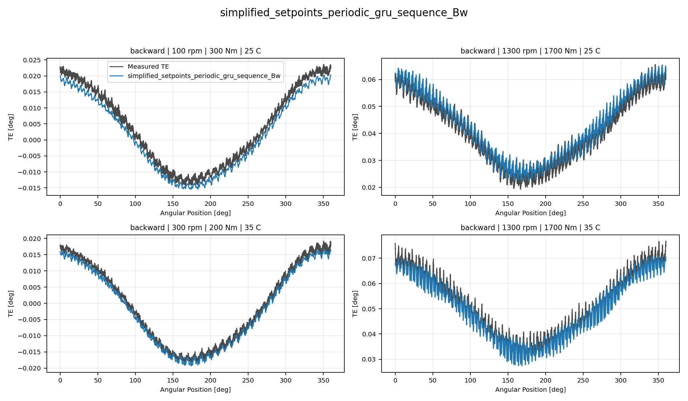
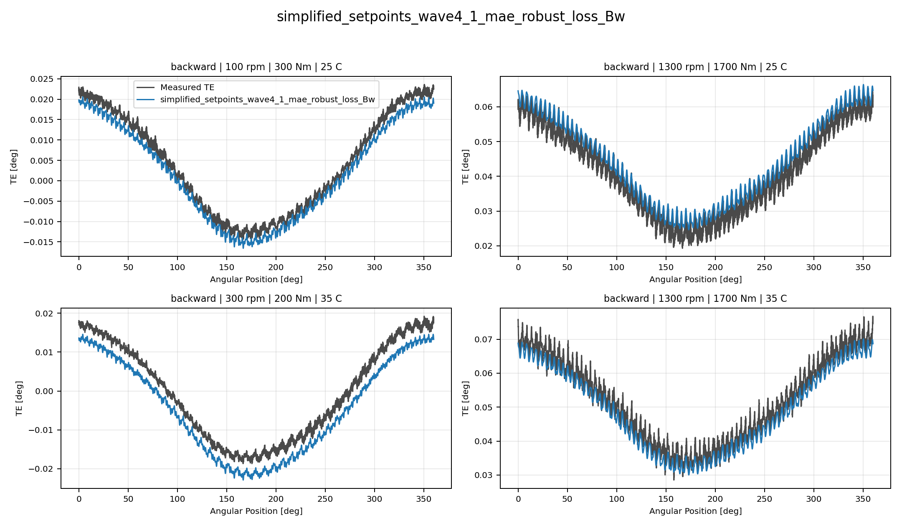
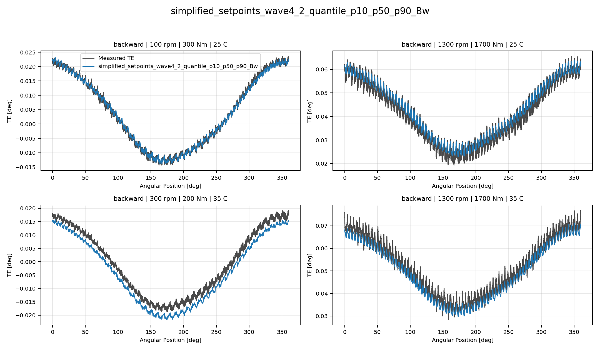

# TE Curve Verification Pipeline Selected Active Model Report

## Overview

This report evaluates only the currently selected active model families
against the repository held-out TE-curve test split. The `global` surface
is intentionally excluded from this reduced decision report.

## Dataset And Split

- dataset config: `config/datasets/transmission_error_dataset.yaml`;
- dataset root: `data\simplified_dataset`;
- comparison mode: `selected_active_model_matrix`;
- candidate count: `7`;
- held-out curve count before candidate filtering: `97`;
- percentage-error denominator: `peak_to_peak_truth`;
- evaluated surface: `Bw`;
- evaluated direction: `backward`;

## Candidate Inventory

| Candidate | Source | Family | Surface | Valid Directions |
| --- | --- | --- | --- | --- |
| `simplified_setpoints_feedforward_Bw` | `simplified_setpoints_model_archive` | `feedforward` | `Bw` | `backward` |
| `simplified_setpoints_tree_Bw` | `simplified_setpoints_model_archive` | `tree` | `Bw` | `backward` |
| `simplified_setpoints_harmonic_regression_Bw` | `simplified_setpoints_model_archive` | `harmonic_regression` | `Bw` | `backward` |
| `simplified_setpoints_periodic_mlp_harmonic_Bw` | `simplified_setpoints_model_archive` | `periodic_mlp_harmonic` | `Bw` | `backward` |
| `simplified_setpoints_periodic_gru_sequence_Bw` | `simplified_setpoints_model_archive` | `periodic_gru_sequence` | `Bw` | `backward` |
| `simplified_setpoints_wave4_1_mae_robust_loss_Bw` | `simplified_setpoints_model_archive` | `wave4_1_mae_robust_loss` | `Bw` | `backward` |
| `simplified_setpoints_wave4_2_quantile_p10_p50_p90_Bw` | `simplified_setpoints_model_archive` | `wave4_2_quantile_p10_p50_p90` | `Bw` | `backward` |

## Exact Model Paths

| Candidate | Family | Surface | ONNX Model Path | Python Model Path |
| --- | --- | --- | --- | --- |
| `simplified_setpoints_feedforward_Bw` | `feedforward` | `Bw` | `models/simplified_dataset/setpoints/feedforward/backward/onnx/model.onnx` | `models/simplified_dataset/setpoints/feedforward/backward/python/feedforward-epoch=128-val_mae=0.00297364.ckpt` |
| `simplified_setpoints_tree_Bw` | `tree` | `Bw` | `models/simplified_dataset/setpoints/tree/backward/onnx/model.onnx` | `models/simplified_dataset/setpoints/tree/backward/python/tree_model.pkl` |
| `simplified_setpoints_harmonic_regression_Bw` | `harmonic_regression` | `Bw` | `models/simplified_dataset/setpoints/harmonic_regression/backward/onnx/model.onnx` | `models/simplified_dataset/setpoints/harmonic_regression/backward/python/harmonic_regression-epoch=060-val_mae=0.01698885.ckpt` |
| `simplified_setpoints_periodic_mlp_harmonic_Bw` | `periodic_mlp_harmonic` | `Bw` | `models/simplified_dataset/setpoints/periodic_mlp_harmonic/backward/onnx/model.onnx` | `models/simplified_dataset/setpoints/periodic_mlp_harmonic/backward/python/periodic_mlp-epoch=053-val_mae=0.00280310.ckpt` |
| `simplified_setpoints_periodic_gru_sequence_Bw` | `periodic_gru_sequence` | `Bw` | `models/simplified_dataset/setpoints/periodic_gru_sequence/backward/onnx/model.onnx` | `models/simplified_dataset/setpoints/periodic_gru_sequence/backward/python/periodic_gru_sequence-epoch=081-val_mae=0.00349987.ckpt` |
| `simplified_setpoints_wave4_1_mae_robust_loss_Bw` | `wave4_1_mae_robust_loss` | `Bw` | `models/simplified_dataset/setpoints/wave4_1_mae_robust_loss/backward/onnx/model.onnx` | `models/simplified_dataset/setpoints/wave4_1_mae_robust_loss/backward/python/curve_aware_harmonic_residual_offset_probe-epoch=073-val_mae=0.00358581.ckpt` |
| `simplified_setpoints_wave4_2_quantile_p10_p50_p90_Bw` | `wave4_2_quantile_p10_p50_p90` | `Bw` | `models/simplified_dataset/setpoints/wave4_2_quantile_p10_p50_p90/backward/onnx/model.onnx` | `models/simplified_dataset/setpoints/wave4_2_quantile_p10_p50_p90/backward/python/curve_aware_harmonic_residual_offset_probe-epoch=087-val_mae=0.00355108.ckpt` |

## Metric Ranking

| Rank | Candidate | Curve MAE [deg] | Curve RMSE [deg] | Mean Percentage Error [%] | P95 Mean Percentage Error [%] |
| ---: | --- | ---: | ---: | ---: | ---: |
| 1 | `simplified_setpoints_tree_Bw` | 0.003345 | 0.003754 | 7.249 | 13.745 |
| 2 | `simplified_setpoints_periodic_gru_sequence_Bw` | 0.003364 | 0.003671 | 7.402 | 13.429 |
| 3 | `simplified_setpoints_wave4_2_quantile_p10_p50_p90_Bw` | 0.003473 | 0.003784 | 7.598 | 14.047 |
| 4 | `simplified_setpoints_wave4_1_mae_robust_loss_Bw` | 0.003519 | 0.003851 | 7.680 | 12.958 |
| 5 | `simplified_setpoints_feedforward_Bw` | 0.003594 | 0.004023 | 7.858 | 15.119 |
| 6 | `simplified_setpoints_periodic_mlp_harmonic_Bw` | 0.003842 | 0.004144 | 8.477 | 16.308 |
| 7 | `simplified_setpoints_harmonic_regression_Bw` | 0.017958 | 0.018234 | 41.314 | 85.556 |

## Direction Breakdown

| Direction | Candidate | Curve MAE [deg] | Curve RMSE [deg] | Mean Percentage Error [%] | P95 Mean Percentage Error [%] |
| --- | --- | ---: | ---: | ---: | ---: |
| `backward` | `simplified_setpoints_tree_Bw` | 0.003345 | 0.003754 | 7.249 | 13.745 |
| `backward` | `simplified_setpoints_periodic_gru_sequence_Bw` | 0.003364 | 0.003671 | 7.402 | 13.429 |
| `backward` | `simplified_setpoints_wave4_2_quantile_p10_p50_p90_Bw` | 0.003473 | 0.003784 | 7.598 | 14.047 |
| `backward` | `simplified_setpoints_wave4_1_mae_robust_loss_Bw` | 0.003519 | 0.003851 | 7.680 | 12.958 |
| `backward` | `simplified_setpoints_feedforward_Bw` | 0.003594 | 0.004023 | 7.858 | 15.119 |
| `backward` | `simplified_setpoints_periodic_mlp_harmonic_Bw` | 0.003842 | 0.004144 | 8.477 | 16.308 |
| `backward` | `simplified_setpoints_harmonic_regression_Bw` | 0.017958 | 0.018234 | 41.314 | 85.556 |

## Curve Evidence

Each selected candidate is shown with the same four deterministic held-out operating conditions for this direction.
The dark line is the measured TE curve and the blue line is the model
prediction for the same operating condition.

Shared operating conditions:

- 100 rpm, 300 Nm, 25 C
- 1300 rpm, 1700 Nm, 25 C
- 300 rpm, 200 Nm, 35 C
- 1300 rpm, 1700 Nm, 35 C

| Candidate | Role | Curve MAE [deg] | Curve RMSE [deg] | Mean MPE [%] | P95 MPE [%] |
| --- | --- | ---: | ---: | ---: | ---: |
| `simplified_setpoints_feedforward_Bw` | Selected candidate | 0.003594 | 0.004023 | 7.858 | 15.119 |
| `simplified_setpoints_tree_Bw` | Surface leader | 0.003345 | 0.003754 | 7.249 | 13.745 |
| `simplified_setpoints_harmonic_regression_Bw` | Selected candidate | 0.017958 | 0.018234 | 41.314 | 85.556 |
| `simplified_setpoints_periodic_mlp_harmonic_Bw` | Selected candidate | 0.003842 | 0.004144 | 8.477 | 16.308 |
| `simplified_setpoints_periodic_gru_sequence_Bw` | Selected candidate | 0.003364 | 0.003671 | 7.402 | 13.429 |
| `simplified_setpoints_wave4_1_mae_robust_loss_Bw` | Selected candidate | 0.003519 | 0.003851 | 7.680 | 12.958 |
| `simplified_setpoints_wave4_2_quantile_p10_p50_p90_Bw` | Selected candidate | 0.003473 | 0.003784 | 7.598 | 14.047 |

### simplified_setpoints_feedforward_Bw

### simplified_setpoints_tree_Bw

### simplified_setpoints_harmonic_regression_Bw

### simplified_setpoints_periodic_mlp_harmonic_Bw

### simplified_setpoints_periodic_gru_sequence_Bw

### simplified_setpoints_wave4_1_mae_robust_loss_Bw

### simplified_setpoints_wave4_2_quantile_p10_p50_p90_Bw

## Artifacts

- summary YAML: `output\validation_checks\track2_reference_comparison\2026-07-24-13-35-56__track2_selected_active_simplified_setpoints_matrix_track2_selected_simplified_dataset_setpoints_backward_2026_07_24_13_30_33/validation_summary.yaml`;
- per-condition CSV: `output\validation_checks\track2_reference_comparison\2026-07-24-13-35-56__track2_selected_active_simplified_setpoints_matrix_track2_selected_simplified_dataset_setpoints_backward_2026_07_24_13_30_33\per_condition_metrics.csv`;
- grouped report plot root: `doc\reports\campaign_results\track_2\verification_plots\selected_active_model_matrix`;
- grouped report plot count: `0`;

## Interpretation

Rows are ranked by mean percentage error within this selected-active
surface report. The curve-evidence section uses shared deterministic
held-out operating conditions so visual shape fidelity can be compared
across the selected families.

## Open Gaps

- This remains an offline TE-curve comparison and does not replace the
  future online `Table 9` compensation benchmark.
- RCIM Model-Bank Reproduction remains a separate paper-reference
  benchmark path and is not part of this selected-active model-only
  report.
