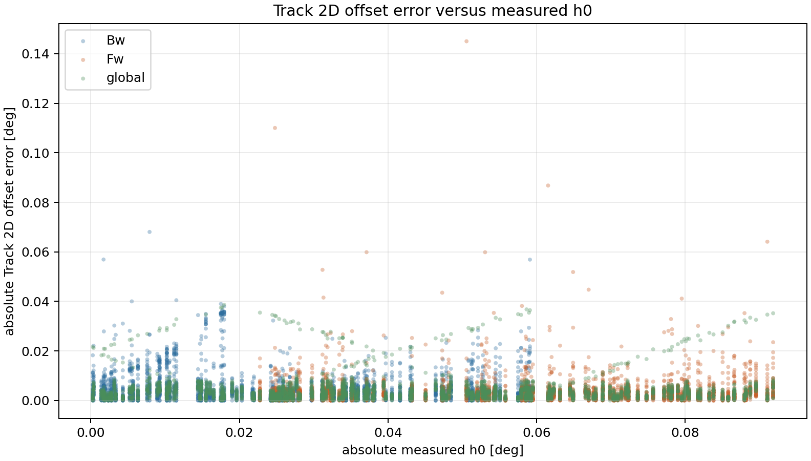

# Track 2D h0 Offset Cross-Check

## Overview

Cross-check of `Track 2D` signed model offset errors against measured `h0` / curve mean over `12416` joined candidate-curve rows and `111` candidates.

## Decision

- `h0` magnitude alone does not explain most Track 2D offset failures.
- Median candidate `abs(error)` versus `abs(h0)` correlation is `-0.0152`; mean is `-0.0125`.
- Median top-decile overlap lift is `1.0000` versus a random-decile baseline of `1.0`; `33` of `111` candidates reach lift `>= 2.0`.
- `94` of `111` candidates have weak absolute correlation `< 0.25`.
- Join validation is tight: maximum `Track 2D truth_mean_deg - measured_h0_deg` is `0.0000` deg.

## Surface Summary

| Surface | Rows | Mean Abs Offset | Mean Abs h0 | Abs Corr | Overlap Lift | Max Delta |
| --- | ---: | ---: | ---: | ---: | ---: | ---: |
| `Bw` | 3977 | 0.0044 | 0.0263 | -0.0885 | 1.4824 | 0.0000 |
| `Fw` | 5141 | 0.0032 | 0.0585 | 0.0181 | 1.7476 | 0.0000 |
| `global` | 3298 | 0.0039 | 0.0424 | -0.0044 | 1.0303 | 0.0000 |

## Largest Mean Offset Error Candidates

| Candidate | Rows | Mean Abs Offset | Mean Abs h0 | Abs Corr | Overlap Lift |
| --- | ---: | ---: | ---: | ---: | ---: |
| `MLP19_Fw` | 97 | 0.0185 | 0.0585 | -0.0388 | 1.0000 |
| `harmonic_regression_global` | 194 | 0.0180 | 0.0424 | 0.0744 | 1.5000 |
| `MLP19_Bw` | 97 | 0.0137 | 0.0263 | -0.1186 | 2.0000 |
| `rcim_retuned_XGBM19_Bw` | 97 | 0.0101 | 0.0263 | 0.3105 | 5.0000 |
| `rcim_original_MLP19_Fw` | 97 | 0.0098 | 0.0585 | -0.0789 | 0.0000 |
| `ELM19_Bw` | 97 | 0.0097 | 0.0263 | -0.0313 | 3.0000 |
| `rcim_retuned_MLP19_Bw` | 97 | 0.0090 | 0.0263 | -0.0431 | 1.0000 |
| `rcim_retuned_MLP19_Fw` | 97 | 0.0083 | 0.0585 | -0.0620 | 2.0000 |
| `rcim_retuned_ELM19_Bw` | 97 | 0.0081 | 0.0263 | 0.3107 | 4.0000 |
| `XGBM19_Bw` | 97 | 0.0077 | 0.0263 | -0.2231 | 0.0000 |

## Strongest h0/Error Overlap Candidates

| Candidate | Rows | Abs Corr | High Error | High h0 | Overlap | Lift |
| --- | ---: | ---: | ---: | ---: | ---: | ---: |
| `rcim_retuned_LGBM19_Bw` | 97 | 0.3199 | 10 | 10 | 6 | 6.0000 |
| `rcim_retuned_XGBM19_Bw` | 97 | 0.3105 | 10 | 10 | 5 | 5.0000 |
| `rcim_retuned_HGBM19_Bw` | 97 | 0.2870 | 10 | 10 | 5 | 5.0000 |
| `LGBM19_Fw` | 97 | 0.0258 | 10 | 10 | 5 | 5.0000 |
| `rcim_retuned_ELM19_Bw` | 97 | 0.3107 | 10 | 10 | 4 | 4.0000 |
| `XGBM19_Fw` | 97 | 0.1168 | 10 | 10 | 4 | 4.0000 |
| `ELM19_Fw` | 97 | 0.3372 | 10 | 10 | 3 | 3.0000 |
| `temporal_convolution_Bw` | 97 | 0.0720 | 10 | 10 | 3 | 3.0000 |
| `GBM19_Fw` | 97 | 0.0508 | 10 | 10 | 3 | 3.0000 |
| `residual_harmonic_lstm_sequence_sparse_rcim_Fw` | 97 | 0.0458 | 10 | 10 | 3 | 3.0000 |

## Strongest Absolute Correlation Candidates

| Candidate | Rows | Abs Corr | Signed Corr | Mean Abs Offset | Mean Abs h0 |
| --- | ---: | ---: | ---: | ---: | ---: |
| `rcim_retuned_ET19_Fw` | 97 | 0.3722 | 0.0846 | 0.0017 | 0.0585 |
| `ELM19_Fw` | 97 | 0.3372 | -0.3204 | 0.0071 | 0.0585 |
| `rcim_retuned_LGBM19_Bw` | 97 | 0.3199 | -0.9679 | 0.0073 | 0.0263 |
| `rcim_retuned_ELM19_Bw` | 97 | 0.3107 | -0.5644 | 0.0081 | 0.0263 |
| `rcim_retuned_XGBM19_Bw` | 97 | 0.3105 | -0.9868 | 0.0101 | 0.0263 |
| `rcim_retuned_HGBM19_Bw` | 97 | 0.2870 | -0.7289 | 0.0034 | 0.0263 |
| `rcim_original_ELM19_Fw` | 97 | 0.2581 | -0.3404 | 0.0050 | 0.0585 |
| `rcim_retuned_RF19_Fw` | 97 | 0.1682 | 0.0298 | 0.0012 | 0.0585 |
| `rcim_original_RF19_Fw` | 97 | 0.1618 | 0.0593 | 0.0015 | 0.0585 |
| `rcim_original_XGBM19_Fw` | 97 | 0.1571 | -0.0270 | 0.0024 | 0.0585 |

## High-Error Normal-h0 Quadrants

These rows are important because they contradict a pure `h0`-magnitude explanation.

| Candidate | High Error + High h0 | High Error + Normal h0 | Normal Error + High h0 |
| --- | ---: | ---: | ---: |
| `feedforward_global` | 0 | 20 | 20 |
| `periodic_temporal_convolution_global` | 1 | 19 | 19 |
| `residual_harmonic_gru_sequence_dense240_global` | 1 | 19 | 19 |
| `residual_harmonic_lstm_sequence_dense240_global` | 1 | 19 | 19 |
| `temporal_convolution_global` | 1 | 19 | 19 |
| `gru_sequence_global` | 2 | 18 | 18 |
| `periodic_gru_sequence_global` | 2 | 18 | 18 |
| `residual_harmonic_gru_sequence_dense360_global` | 2 | 18 | 18 |
| `residual_harmonic_gru_sequence_sparse_rcim_global` | 2 | 18 | 18 |
| `residual_harmonic_lstm_sequence_dense360_global` | 2 | 18 | 18 |

## Interpretation

The cross-check supports a narrower framing: the problematic quantity is still the curve mean / `h0` channel, but the large Track 2D model offset errors do not simply occur where measured `abs(h0)` is large.
This points toward candidate-specific mean prediction bias, direction/regime dependence, or missing causal state information rather than a pure measured-`h0` outlier problem.
The useful next diagnostic is therefore predicted-mean versus measured-`h0` surface analysis for the high-error candidates, with separate `Fw`, `Bw`, and `global` handling.

## Scatter Diagnostic



## Machine-Readable Artifacts

- `output/validation_checks/track2d_h0_offset_crosscheck/2026-06-09-20-09-16__track2d_h0_offset_crosscheck/track2d_h0_offset_crosscheck_joined_rows.csv`
- `output/validation_checks/track2d_h0_offset_crosscheck/2026-06-09-20-09-16__track2d_h0_offset_crosscheck/track2d_h0_offset_crosscheck_candidate_summary.csv`
- `output/validation_checks/track2d_h0_offset_crosscheck/2026-06-09-20-09-16__track2d_h0_offset_crosscheck/track2d_h0_offset_crosscheck_surface_summary.csv`
- `output/validation_checks/track2d_h0_offset_crosscheck/2026-06-09-20-09-16__track2d_h0_offset_crosscheck/track2d_h0_offset_crosscheck_quadrant_summary.csv`
- `output/validation_checks/track2d_h0_offset_crosscheck/2026-06-09-20-09-16__track2d_h0_offset_crosscheck/track2d_h0_offset_crosscheck_summary.yaml`

## Reproduction

```powershell
conda run -n pinns_env python -B scripts/reports/analysis/build_track2d_h0_offset_crosscheck_report.py
```
