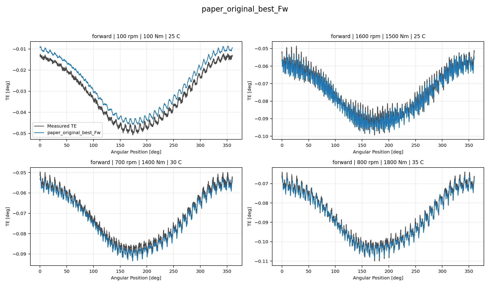
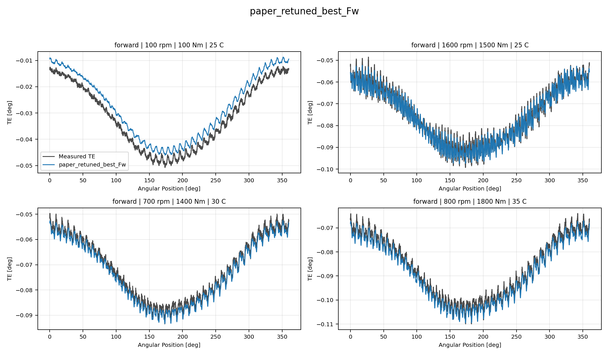
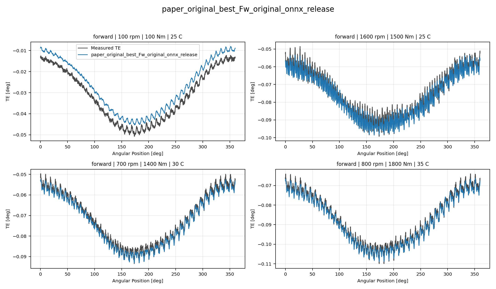
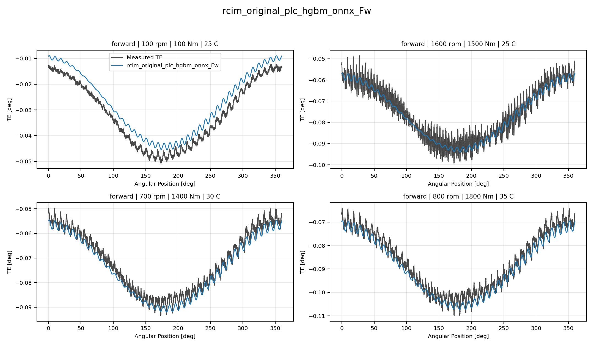

# Track 2 Forward Reference Curve Comparison Report

## Overview

This report compares five forward `Track 2` reconstructed-curve
candidates on the same `97` held-out forward curves:

- `paper_original_best_Fw`, from repository paper-original reference banks;
- `paper_retuned_best_Fw`, from repository paper-retuned reference banks;
- `paper_original_best_Fw_original_onnx_release`, loaded directly from the recovered original `ONNX` release;
- `rcim_original_simplified_onnx_Fw`, using harmonics `0`, `1`, `39`, and `40`;
- `rcim_original_plc_hgbm_onnx_Fw`, using only `HGBM` original `ONNX` models for those sparse harmonics.

The collages below are regenerated with the same four representative
forward curves for every candidate, so visual differences are directly
comparable across models.

Model labels used in compact tables:

| Label | Candidate |
| --- | --- |
| Original | `paper_original_best_Fw` |
| Retuned | `paper_retuned_best_Fw` |
| Full ONNX | `paper_original_best_Fw_original_onnx_release` |
| Sparse | `rcim_original_simplified_onnx_Fw` |
| PLC HGBM | `rcim_original_plc_hgbm_onnx_Fw` |

## Aggregate Track 2 Metrics

| Candidate | Curves | MAE [deg] | RMSE [deg] | Mean Error [%] | P95 Error [%] |
| --- | ---: | ---: | ---: | ---: | ---: |
| `paper_original_best_Fw` | 97 | 0.002768839 | 0.002951263 | 6.250311 | 13.826566 |
| `paper_retuned_best_Fw` | 97 | 0.001839362 | 0.002040887 | 4.108527 | 9.865680 |
| `paper_original_best_Fw_original_onnx_release` | 97 | 0.002803544 | 0.002986894 | 6.329387 | 13.846840 |
| `rcim_original_simplified_onnx_Fw` | 97 | 0.002617089 | 0.002979175 | 5.729772 | 11.357307 |
| `rcim_original_plc_hgbm_onnx_Fw` | 97 | 0.002449482 | 0.002809453 | 5.338223 | 10.932099 |

## Pairwise Predicted-Curve Differences

| Pair | Mean MAE [deg] | P95 [deg] | Max [deg] | RMSE [deg] | Corr. |
| --- | ---: | ---: | ---: | ---: | ---: |
| Original vs Retuned | 0.001854789 | 0.004372766 | 0.006321356 | 0.002361028 | 0.999986565 |
| Original vs Full ONNX | 0.000202431 | 0.000491746 | 0.000636939 | 0.000247559 | 0.999992899 |
| Original vs Sparse | 0.002338454 | 0.007941779 | 0.019313790 | 0.003122241 | 0.988188713 |
| Original vs PLC HGBM | 0.002249346 | 0.007310691 | 0.020324662 | 0.002959511 | 0.988187717 |
| Retuned vs Full ONNX | 0.001906367 | 0.004418687 | 0.006470047 | 0.002417028 | 0.999992636 |
| Retuned vs Sparse | 0.001998912 | 0.006889777 | 0.019046146 | 0.002751516 | 0.988208626 |
| Retuned vs PLC HGBM | 0.001337372 | 0.005218275 | 0.019153349 | 0.002094972 | 0.988208183 |
| Full ONNX vs Sparse | 0.002368388 | 0.008159896 | 0.019655131 | 0.003161418 | 0.988187282 |
| Full ONNX vs PLC HGBM | 0.002285644 | 0.007483631 | 0.020666003 | 0.003000129 | 0.988186285 |
| Sparse vs PLC HGBM | 0.001391881 | 0.004152736 | 0.005587220 | 0.001830819 | 0.999999000 |

## Collage Curve Metrics

All metric columns in this section are `MAE [deg]`.

| Curve | Operating Point | Original | Retuned | Full ONNX | Sparse | PLC HGBM |
| --- | --- | ---: | ---: | ---: | ---: | ---: |
| `Curve 1` | 100 rpm / 100 Nm / 25 C | 0.003931161 | 0.003849563 | 0.004471498 | 0.004241496 | 0.004190061 |
| `Curve 2` | 1600 rpm / 1500 Nm / 25 C | 0.001674670 | 0.001472680 | 0.001934975 | 0.003028629 | 0.002887111 |
| `Curve 3` | 700 rpm / 1400 Nm / 30 C | 0.001514636 | 0.001533115 | 0.001358691 | 0.004597120 | 0.002192193 |
| `Curve 4` | 800 rpm / 1800 Nm / 35 C | 0.001046320 | 0.001916711 | 0.001279273 | 0.003744366 | 0.002411656 |

## Collage Curve Anchor Deltas

All delta columns in this section are predicted-curve `MAE [deg]`.

| Curve | Operating Point | Full ONNX | Sparse | PLC | PLC-Full |
| --- | --- | ---: | ---: | ---: | ---: |
| `Curve 1` | 100 rpm / 100 Nm / 25 C | 0.000540337 | 0.000526955 | 0.000508614 | 0.000505684 |
| `Curve 2` | 1600 rpm / 1500 Nm / 25 C | 0.000444175 | 0.002496205 | 0.002530544 | 0.002614484 |
| `Curve 3` | 700 rpm / 1400 Nm / 30 C | 0.000162021 | 0.003089332 | 0.001249842 | 0.001317514 |
| `Curve 4` | 800 rpm / 1800 Nm / 35 C | 0.000293090 | 0.002855756 | 0.001800590 | 0.001673647 |

## Technical Interpretation

The full recovered original `ONNX` release remains almost superposed with
`paper_original_best_Fw`: the pair has the smallest mean curve-difference
`MAE`, a near-unit mean correlation, and only small aggregate metric
changes. This supports the same conclusion as the earlier diagnostic:
the repository paper-original bank and the recovered original `ONNX`
release are effectively the same Track 2 reconstructed surface, with
minor differences attributable to archive/export/loading path details.

`paper_retuned_best_Fw` is visually shape-aligned with the paper-original
surface, but it is numerically distinct and improves the measured-curve
metrics. The sparse original `ONNX` variants are also shape-aligned, but
they move away from the 19-target original surface because they retain
only harmonics `0`, `1`, `39`, and `40`. In this run, the PLC-oriented
all-`HGBM` sparse variant is the stronger sparse candidate.

## Candidate Collages

### paper_original_best_Fw

### paper_retuned_best_Fw

### paper_original_best_Fw_original_onnx_release

### rcim_original_simplified_onnx_Fw

### rcim_original_plc_hgbm_onnx_Fw

## Output Artifacts

- output directory: `output\validation_checks\track2_forward_reference_curve_comparison\2026-06-08-18-00-50__track2_forward_reference_curve_comparison`;
- summary YAML: `output\validation_checks\track2_forward_reference_curve_comparison\2026-06-08-18-00-50__track2_forward_reference_curve_comparison\track2_forward_reference_curve_comparison_summary.yaml`;
- metrics CSV: `output\validation_checks\track2_forward_reference_curve_comparison\2026-06-08-18-00-50__track2_forward_reference_curve_comparison\track2_forward_reference_curve_comparison_metrics.csv`;
- pairwise CSV: `output\validation_checks\track2_forward_reference_curve_comparison\2026-06-08-18-00-50__track2_forward_reference_curve_comparison\track2_forward_reference_curve_pairwise_differences.csv`;
- report Markdown: `doc\reports\analysis\track2\forward_reference_curve_comparison\[2026-06-08]\track2_forward_reference_curve_comparison_report.md`.
