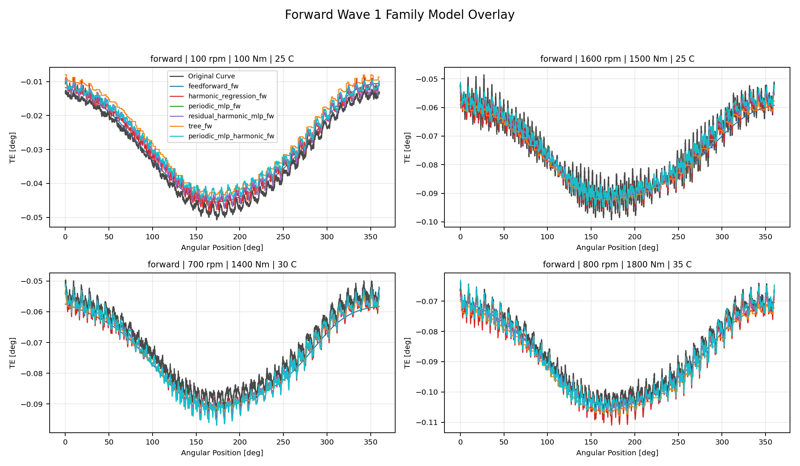
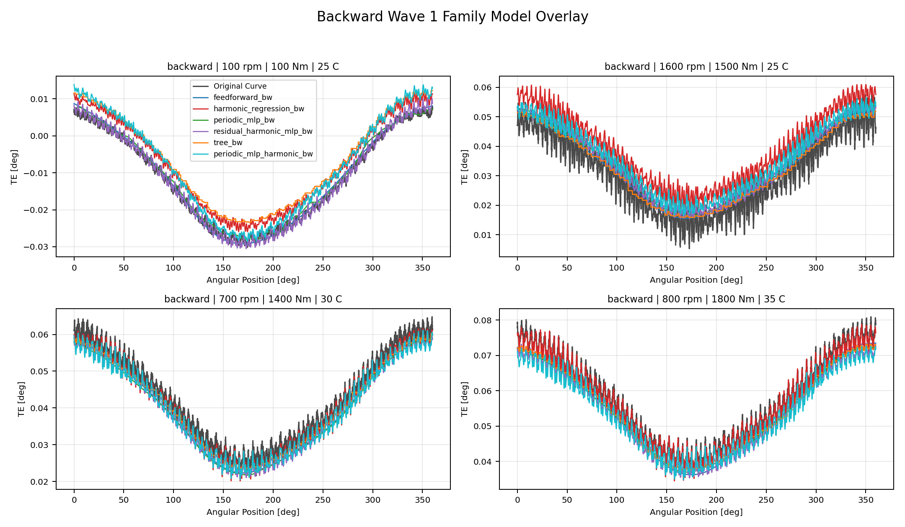
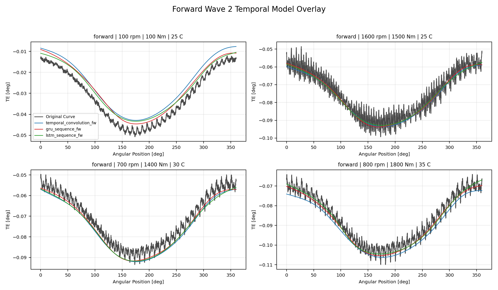
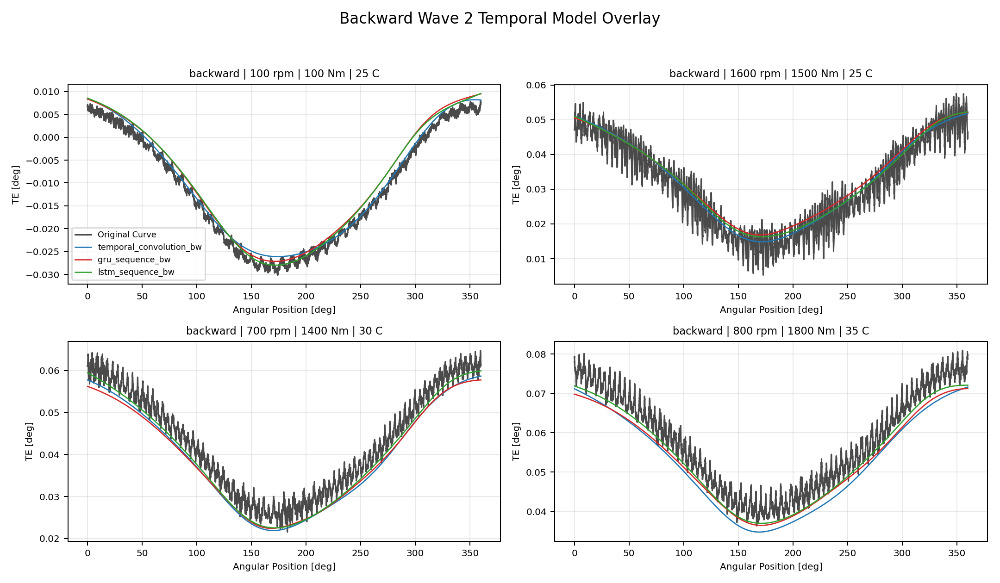
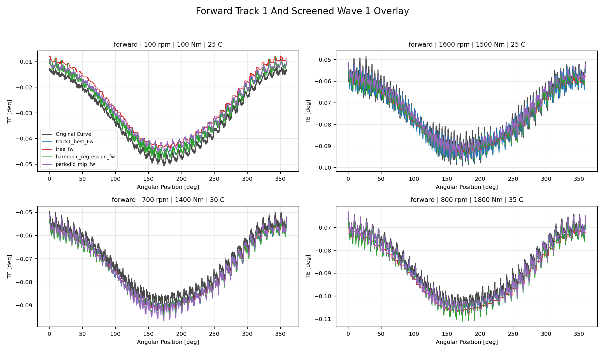
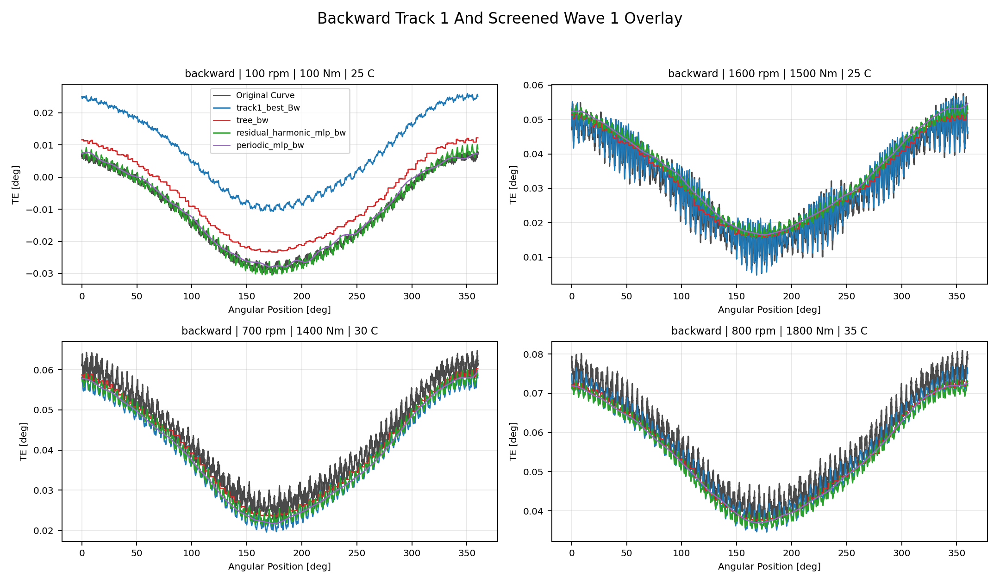
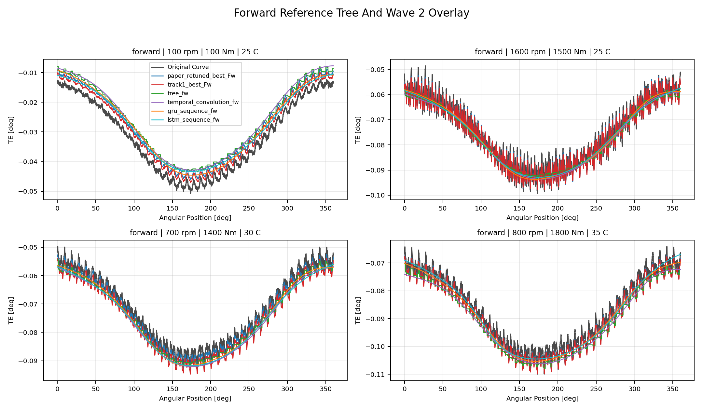
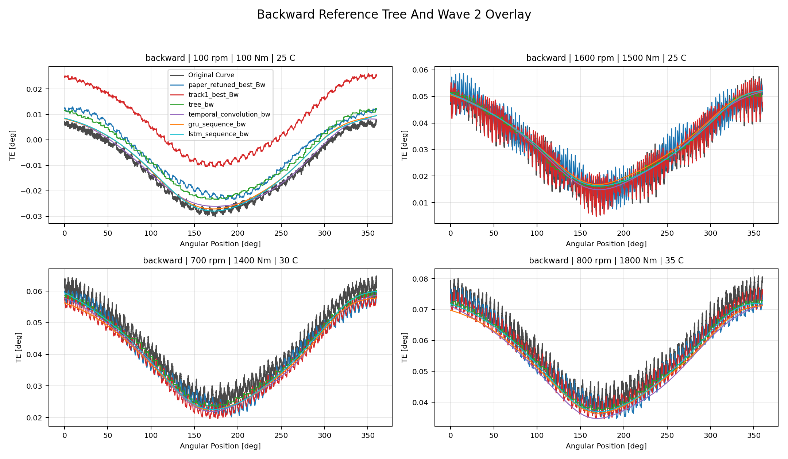

# Track 2 Multi-Model Curve Comparison Report

## Overview

This report compares representative `Track 2` TE curves by overlaying
multiple model predictions on the same original measured curve. The
plots are intended to show whether each model tracks the local harmonic
oscillations rather than only the broad mean trend.

## Scope

- each comparison image contains four deterministic held-out test curves;
- forward comparisons are shown on forward curves only;
- backward comparisons are shown on backward curves only;
- Wave 1 screening keeps the three strongest family-best models by
  `Curve MAE [deg]` within each direction;
- `Original Curve` uses the same visual weight as predictions and a
  dark-gray color for balanced comparison.

## Metrics Summary

### Forward Reference Model Overlay

| Candidate | Source | Surface | Curve MAE [deg] | Curve RMSE [deg] | Mean Error |
| --- | --- | --- | ---: | ---: | ---: |
| `paper_original_best_Fw` | `rcim_original` | Fw | 0.002769 | 0.002951 | 6.250 |
| `paper_retuned_best_Fw` | `rcim_retuned` | Fw | 0.001839 | 0.002041 | 4.109 |
| `track1_best_Fw` | `rcim_track1` | Fw | 0.003014 | 0.003204 | 6.819 |

### Forward Wave 1 Family Model Overlay

| Candidate | Source | Surface | Curve MAE [deg] | Curve RMSE [deg] | Mean Error |
| --- | --- | --- | ---: | ---: | ---: |
| `feedforward_fw` | `wave1_current_registry` | Fw | 0.003404 | 0.003855 | 7.551 |
| `harmonic_regression_fw` | `wave1_current_registry` | Fw | 0.003230 | 0.003494 | 7.185 |
| `periodic_mlp_fw` | `wave1_current_registry` | Fw | 0.003254 | 0.003553 | 7.232 |
| `residual_harmonic_mlp_fw` | `wave1_current_registry` | Fw | 0.003273 | 0.003563 | 7.266 |
| `tree_fw` | `wave1_current_registry` | Fw | 0.003053 | 0.003395 | 6.731 |
| `periodic_mlp_harmonic_fw` | `wave1_periodic_mlp_harmonic_campaign` | Fw | 0.003254 | 0.003553 | 7.232 |

### Backward Reference Model Overlay

| Candidate | Source | Surface | Curve MAE [deg] | Curve RMSE [deg] | Mean Error |
| --- | --- | --- | ---: | ---: | ---: |
| `paper_retuned_best_Bw` | `rcim_retuned` | Bw | 0.003675 | 0.004284 | 7.572 |
| `track1_best_Bw` | `rcim_track1` | Bw | 0.005027 | 0.005212 | 11.860 |

### Backward Wave 1 Family Model Overlay

| Candidate | Source | Surface | Curve MAE [deg] | Curve RMSE [deg] | Mean Error |
| --- | --- | --- | ---: | ---: | ---: |
| `feedforward_bw` | `wave1_current_registry` | Bw | 0.003586 | 0.004023 | 7.832 |
| `harmonic_regression_bw` | `wave1_current_registry` | Bw | 0.003678 | 0.004012 | 8.058 |
| `periodic_mlp_bw` | `wave1_current_registry` | Bw | 0.003574 | 0.004006 | 7.807 |
| `residual_harmonic_mlp_bw` | `wave1_current_registry` | Bw | 0.003536 | 0.003874 | 7.728 |
| `tree_bw` | `wave1_current_registry` | Bw | 0.003258 | 0.003651 | 7.051 |
| `periodic_mlp_harmonic_bw` | `wave1_periodic_mlp_harmonic_campaign` | Bw | 0.003583 | 0.003925 | 7.875 |

### Forward Wave 2 Temporal Model Overlay

| Candidate | Source | Surface | Curve MAE [deg] | Curve RMSE [deg] | Mean Error |
| --- | --- | --- | ---: | ---: | ---: |
| `temporal_convolution_fw` | `wave2_temporal_entry_registry` | Fw | 0.003603 | 0.004031 | 8.028 |
| `gru_sequence_fw` | `wave2_temporal_entry_registry` | Fw | 0.003330 | 0.003762 | 7.378 |
| `lstm_sequence_fw` | `wave2_temporal_entry_registry` | Fw | 0.003366 | 0.003800 | 7.450 |

### Backward Wave 2 Temporal Model Overlay

| Candidate | Source | Surface | Curve MAE [deg] | Curve RMSE [deg] | Mean Error |
| --- | --- | --- | ---: | ---: | ---: |
| `temporal_convolution_bw` | `wave2_temporal_entry_registry` | Bw | 0.003742 | 0.004166 | 8.184 |
| `gru_sequence_bw` | `wave2_temporal_entry_registry` | Bw | 0.003626 | 0.004082 | 7.907 |
| `lstm_sequence_bw` | `wave2_temporal_entry_registry` | Bw | 0.003555 | 0.003985 | 7.767 |

### Forward Track 1 And Screened Wave 1 Overlay

| Candidate | Source | Surface | Curve MAE [deg] | Curve RMSE [deg] | Mean Error |
| --- | --- | --- | ---: | ---: | ---: |
| `track1_best_Fw` | `rcim_track1` | Fw | 0.003014 | 0.003204 | 6.819 |
| `tree_fw` | `wave1_current_registry` | Fw | 0.003053 | 0.003395 | 6.731 |
| `harmonic_regression_fw` | `wave1_current_registry` | Fw | 0.003230 | 0.003494 | 7.185 |
| `periodic_mlp_fw` | `wave1_current_registry` | Fw | 0.003254 | 0.003553 | 7.232 |

### Backward Track 1 And Screened Wave 1 Overlay

| Candidate | Source | Surface | Curve MAE [deg] | Curve RMSE [deg] | Mean Error |
| --- | --- | --- | ---: | ---: | ---: |
| `track1_best_Bw` | `rcim_track1` | Bw | 0.005027 | 0.005212 | 11.860 |
| `tree_bw` | `wave1_current_registry` | Bw | 0.003258 | 0.003651 | 7.051 |
| `residual_harmonic_mlp_bw` | `wave1_current_registry` | Bw | 0.003536 | 0.003874 | 7.728 |
| `periodic_mlp_bw` | `wave1_current_registry` | Bw | 0.003574 | 0.004006 | 7.807 |

### Forward Reference Tree And Wave 2 Overlay

| Candidate | Source | Surface | Curve MAE [deg] | Curve RMSE [deg] | Mean Error |
| --- | --- | --- | ---: | ---: | ---: |
| `paper_retuned_best_Fw` | `rcim_retuned` | Fw | 0.001839 | 0.002041 | 4.109 |
| `track1_best_Fw` | `rcim_track1` | Fw | 0.003014 | 0.003204 | 6.819 |
| `tree_fw` | `wave1_current_registry` | Fw | 0.003053 | 0.003395 | 6.731 |
| `temporal_convolution_fw` | `wave2_temporal_entry_registry` | Fw | 0.003603 | 0.004031 | 8.028 |
| `gru_sequence_fw` | `wave2_temporal_entry_registry` | Fw | 0.003330 | 0.003762 | 7.378 |
| `lstm_sequence_fw` | `wave2_temporal_entry_registry` | Fw | 0.003366 | 0.003800 | 7.450 |

### Backward Reference Tree And Wave 2 Overlay

| Candidate | Source | Surface | Curve MAE [deg] | Curve RMSE [deg] | Mean Error |
| --- | --- | --- | ---: | ---: | ---: |
| `paper_retuned_best_Bw` | `rcim_retuned` | Bw | 0.003675 | 0.004284 | 7.572 |
| `track1_best_Bw` | `rcim_track1` | Bw | 0.005027 | 0.005212 | 11.860 |
| `tree_bw` | `wave1_current_registry` | Bw | 0.003258 | 0.003651 | 7.051 |
| `temporal_convolution_bw` | `wave2_temporal_entry_registry` | Bw | 0.003742 | 0.004166 | 8.184 |
| `gru_sequence_bw` | `wave2_temporal_entry_registry` | Bw | 0.003626 | 0.004082 | 7.907 |
| `lstm_sequence_bw` | `wave2_temporal_entry_registry` | Bw | 0.003555 | 0.003985 | 7.767 |

## Comparison Gallery - Forward Reference Model Overlay

Included models: `paper_original_best_Fw`, `paper_retuned_best_Fw`, `track1_best_Fw`.

## Comparison Gallery - Forward Wave 1 Family Model Overlay

Included models: `feedforward_fw`, `harmonic_regression_fw`, `periodic_mlp_fw`, `residual_harmonic_mlp_fw`, `tree_fw`, `periodic_mlp_harmonic_fw`.

## Comparison Gallery - Backward Reference Model Overlay

Included models: `paper_retuned_best_Bw`, `track1_best_Bw`.

## Comparison Gallery - Backward Wave 1 Family Model Overlay

Included models: `feedforward_bw`, `harmonic_regression_bw`, `periodic_mlp_bw`, `residual_harmonic_mlp_bw`, `tree_bw`, `periodic_mlp_harmonic_bw`.

## Comparison Gallery - Forward Wave 2 Temporal Model Overlay

Included models: `temporal_convolution_fw`, `gru_sequence_fw`, `lstm_sequence_fw`.

## Comparison Gallery - Backward Wave 2 Temporal Model Overlay

Included models: `temporal_convolution_bw`, `gru_sequence_bw`, `lstm_sequence_bw`.

## Comparison Gallery - Forward Track 1 And Screened Wave 1 Overlay

Included models: `track1_best_Fw`, `tree_fw`, `harmonic_regression_fw`, `periodic_mlp_fw`.

## Comparison Gallery - Backward Track 1 And Screened Wave 1 Overlay

Included models: `track1_best_Bw`, `tree_bw`, `residual_harmonic_mlp_bw`, `periodic_mlp_bw`.

## Comparison Gallery - Forward Reference Tree And Wave 2 Overlay

Included models: `paper_retuned_best_Fw`, `track1_best_Fw`, `tree_fw`, `temporal_convolution_fw`, `gru_sequence_fw`, `lstm_sequence_fw`.

## Comparison Gallery - Backward Reference Tree And Wave 2 Overlay

Included models: `paper_retuned_best_Bw`, `track1_best_Bw`, `tree_bw`, `temporal_convolution_bw`, `gru_sequence_bw`, `lstm_sequence_bw`.

## Output Artifacts

- output directory: `output\validation_checks\track2_multi_model_curve_comparison_report\2026-05-24-23-28-22__track2_multi_model_curve_comparison_report`;
- summary YAML: `output\validation_checks\track2_multi_model_curve_comparison_report\2026-05-24-23-28-22__track2_multi_model_curve_comparison_report\track2_multi_model_curve_comparison_summary.yaml`;
- metrics CSV: `output\validation_checks\track2_multi_model_curve_comparison_report\2026-05-24-23-28-22__track2_multi_model_curve_comparison_report\track2_multi_model_curve_comparison_metrics.csv`;
- report Markdown: `doc\reports\analysis\track2\multi_model_curve_comparison_report\[2026-05-24]\track2_multi_model_curve_comparison_report.md`.
