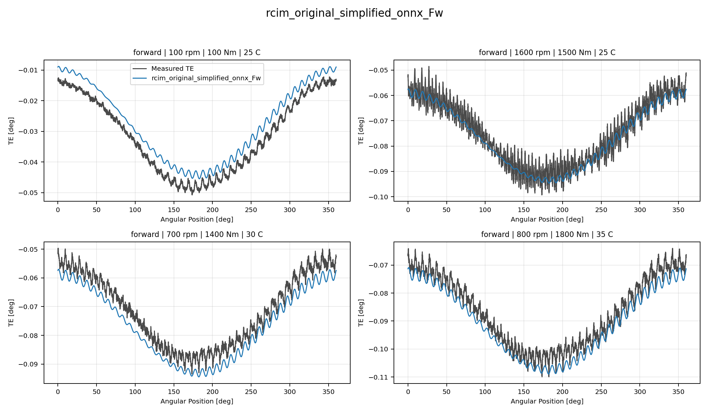

# Track 2 Sparse Original ONNX Variant Report

## Overview

This report evaluates two sparse forward `Track 2` candidates built
only from the recovered paper-original `ONNX` release under
`reference/rcim_ml_compensation_recovered_assets/models/exact_onnx_paper_release`.
Both variants reconstruct TE curves from harmonics `0`, `1`, `39`,
and `40` only.

## Track 2 Forward Metrics

| Candidate | Curves | MAE [deg] | RMSE [deg] | Mean Error [%] | P95 Error [%] |
| --- | ---: | ---: | ---: | ---: | ---: |
| `rcim_original_simplified_onnx_Fw` | 97 | 0.002617 | 0.002979 | 5.730 | 11.357 |
| `rcim_original_plc_hgbm_onnx_Fw` | 97 | 0.002449 | 0.002809 | 5.338 | 10.932 |
| `paper_original_best_Fw_original_onnx_release` | 97 | 0.002804 | 0.002987 | 6.329 | 13.847 |
| `paper_original_best_Fw` | 97 | 0.002769 | 0.002951 | 6.250 | 13.827 |
| `paper_retuned_best_Fw` | 97 | 0.001839 | 0.002041 | 4.109 | 9.866 |

## RCIM original simplified ONNX Fw

- candidate: `rcim_original_simplified_onnx_Fw`;
- selected harmonics: `0, 1, 39, 40`;
- loaded original `ONNX` targets: `7`.

### Loaded ONNX Targets

| Target | Harmonic | Family | Original ONNX Files |
| --- | ---: | --- | --- |
| `amplitude` | `A0` | `ET` | `ExtraTreeRegressor_ampl0.onnx` |
| `amplitude` | `A1` | `RF` | `RandomForestRegressor_ampl1.onnx` |
| `phase` | `P1` | `LGBM` | `LGBMRegressor_phase1.onnx` |
| `amplitude` | `A39` | `HGBM` | `HistGradientBoostingRegressor_ampl39.onnx` |
| `phase` | `P39` | `HGBM` | `HistGradientBoostingRegressor_phase39.onnx` |
| `amplitude` | `A40` | `ERT` | `ExtraTreesRegressor_ampl40.onnx` |
| `phase` | `P40` | `GBM` | `GradientBoostingRegressor_phase40.onnx` |

### Collage

### Collaged Curves

| Curve | Speed [rpm] | Torque [Nm] | Oil [C] | MAE [deg] | Mean Error [%] |
| --- | ---: | ---: | ---: | ---: | ---: |
| `Curve 1` | 100 | 100 | 25 | 0.004241 | 11.010 |
| `Curve 2` | 1600 | 1500 | 25 | 0.003029 | 5.961 |
| `Curve 3` | 700 | 1400 | 30 | 0.004597 | 10.503 |
| `Curve 4` | 800 | 1800 | 35 | 0.003744 | 8.153 |

## RCIM original PLC HGBM ONNX Fw

- candidate: `rcim_original_plc_hgbm_onnx_Fw`;
- selected harmonics: `0, 1, 39, 40`;
- loaded original `ONNX` targets: `7`.

### Loaded ONNX Targets

| Target | Harmonic | Family | Original ONNX Files |
| --- | ---: | --- | --- |
| `amplitude` | `A0` | `HGBM` | `HistGradientBoostingRegressor_ampl0.onnx` |
| `amplitude` | `A1` | `HGBM` | `HistGradientBoostingRegressor_ampl1.onnx` |
| `phase` | `P1` | `HGBM` | `HistGradientBoostingRegressor_phase1.onnx` |
| `amplitude` | `A39` | `HGBM` | `HistGradientBoostingRegressor_ampl39.onnx` |
| `phase` | `P39` | `HGBM` | `HistGradientBoostingRegressor_phase39.onnx` |
| `amplitude` | `A40` | `HGBM` | `HistGradientBoostingRegressor_ampl40.onnx` |
| `phase` | `P40` | `HGBM` | `HistGradientBoostingRegressor_phase40.onnx` |

### Collage

### Collaged Curves

| Curve | Speed [rpm] | Torque [Nm] | Oil [C] | MAE [deg] | Mean Error [%] |
| --- | ---: | ---: | ---: | ---: | ---: |
| `Curve 1` | 100 | 100 | 25 | 0.004190 | 10.877 |
| `Curve 2` | 1600 | 1500 | 25 | 0.002887 | 5.683 |
| `Curve 3` | 700 | 1400 | 30 | 0.002192 | 5.008 |
| `Curve 4` | 800 | 1800 | 35 | 0.002412 | 5.251 |

## Output Artifacts

- output directory: `output\validation_checks\track2_sparse_original_onnx_variants\2026-06-08-13-39-17__track2_sparse_original_onnx_variants`;
- summary YAML: `output\validation_checks\track2_sparse_original_onnx_variants\2026-06-08-13-39-17__track2_sparse_original_onnx_variants\track2_sparse_original_onnx_variants_summary.yaml`;
- metrics CSV: `output\validation_checks\track2_sparse_original_onnx_variants\2026-06-08-13-39-17__track2_sparse_original_onnx_variants\track2_sparse_original_onnx_variants_metrics.csv`;
- report Markdown: `doc\reports\analysis\track2\sparse_original_onnx_variants\[2026-06-08]\track2_sparse_original_onnx_variants_report.md`.
