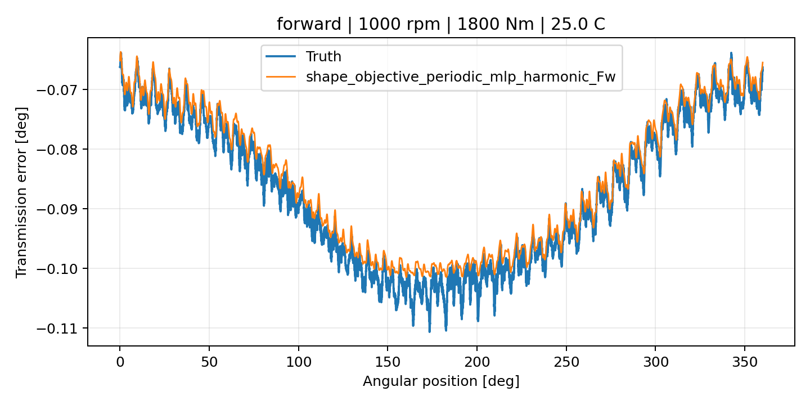
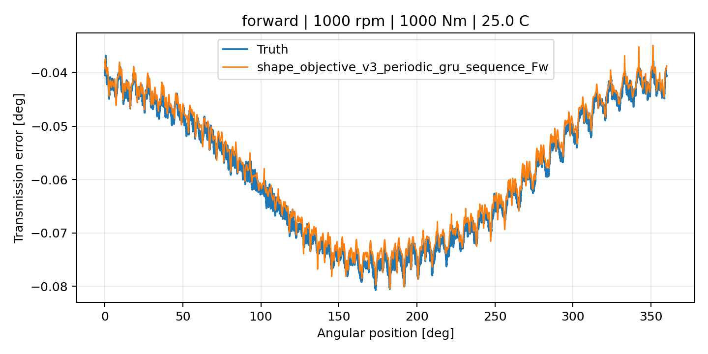
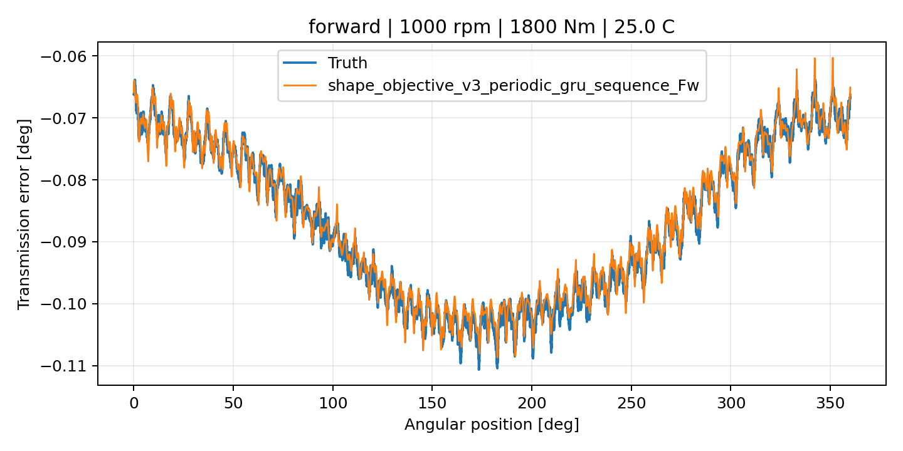
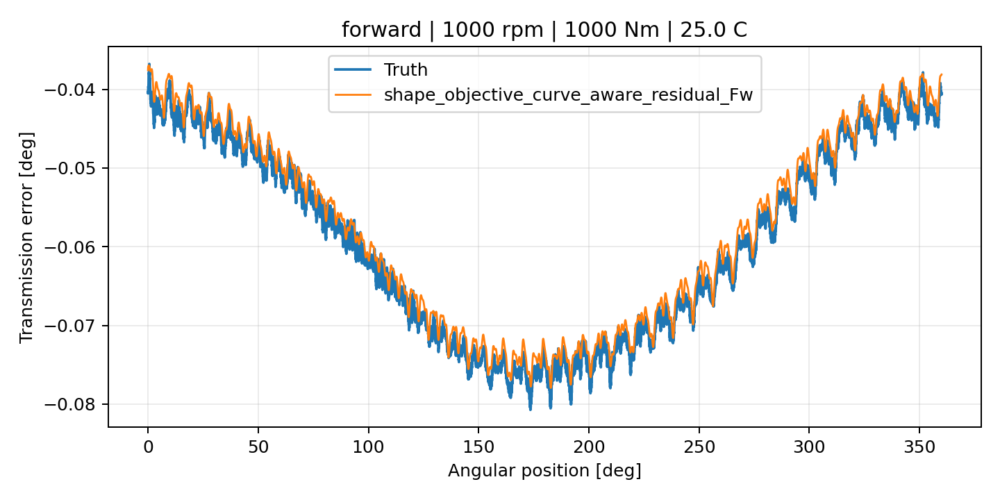
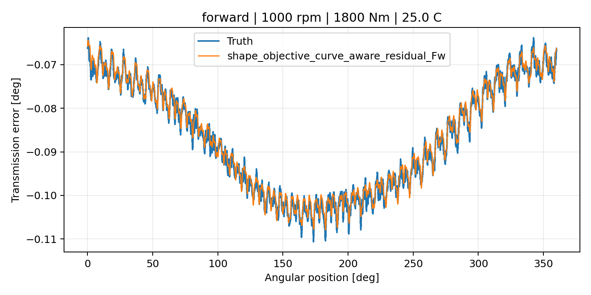
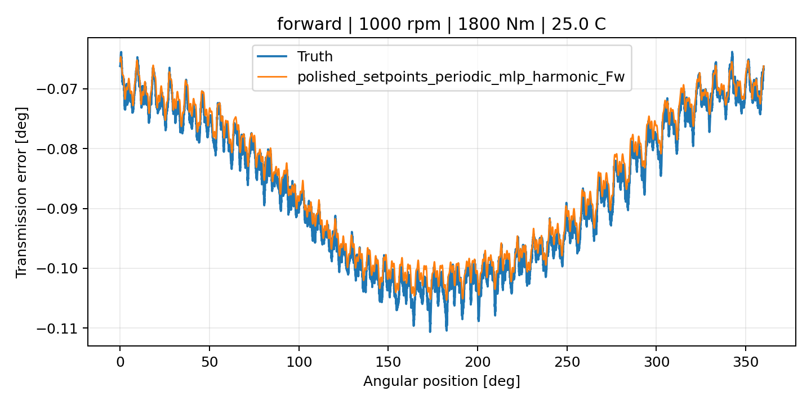
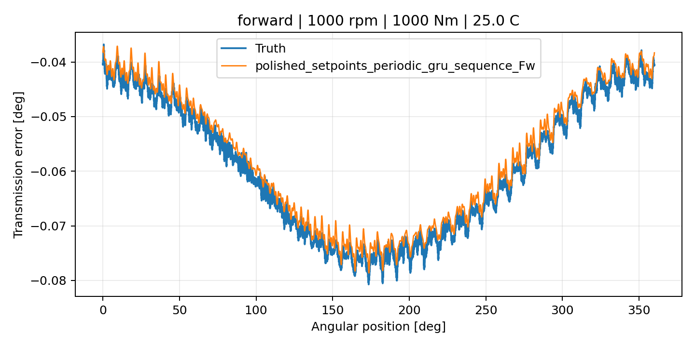
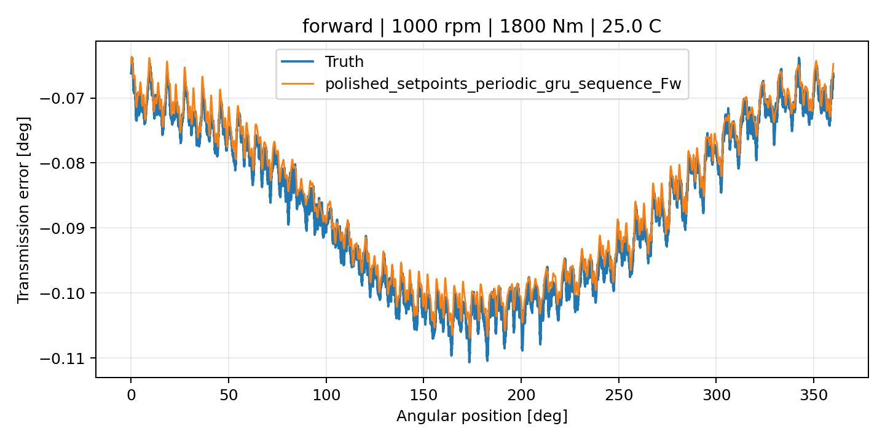
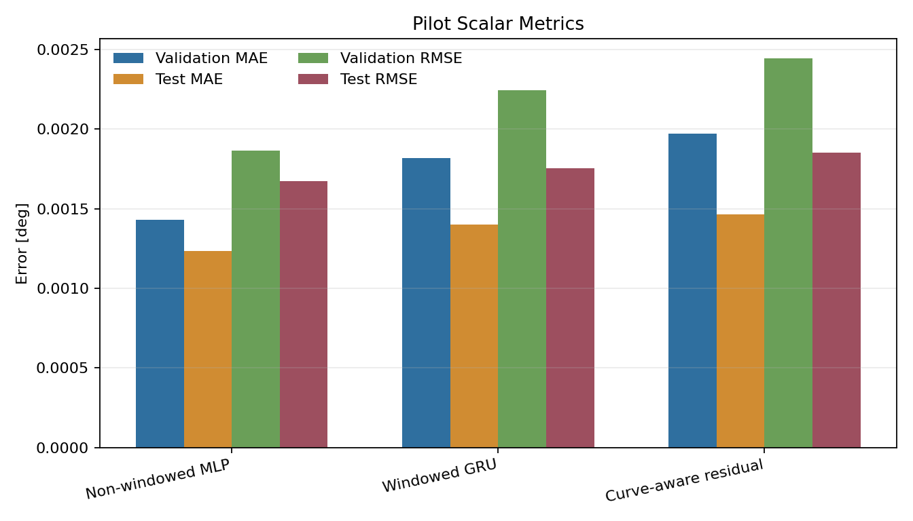
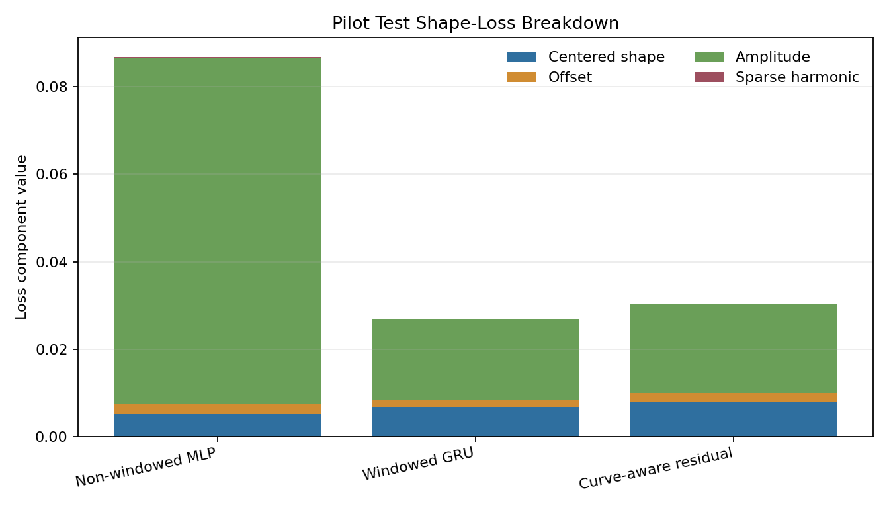

# Parallel Shape-Objective Follow-Up Campaign Results

## Overview

This report closes the approved `parallel_shape_objective_followup_2026_07_21`
pilot campaign. The campaign tested three `polished_dataset` setpoint `Fw`
arms after the prior shape-gate v2 branch failed bounded promotion:

- a windowed `periodic_gru_sequence` continuation with the stronger shape
  objective;
- a non-windowed `periodic_mlp_harmonic` arm;
- a curve-aware residual arm.

All three remote runs completed. The scalar campaign leader is
`te_shape_objective_periodic_mlp_harmonic_fw__polished_setpoints` with test MAE `0.001236`.
This is a pilot scalar result, not an official promotion. Promotion still
requires the bounded `TE Curve Verification Pipeline` shape-first screen
against both windowed and non-windowed references.

## Campaign Artifacts

| Artifact | Path |
| --- | --- |
| Campaign output | `output/training_campaigns/2026-07-21-18-52-44_parallel_shape_objective_followup_2026_07_21` |
| Campaign leaderboard | `output/training_campaigns/2026-07-21-18-52-44_parallel_shape_objective_followup_2026_07_21/campaign_leaderboard.yaml` |
| Campaign best run | `output/training_campaigns/2026-07-21-18-52-44_parallel_shape_objective_followup_2026_07_21/campaign_best_run.yaml` |
| Campaign execution report | `output/training_campaigns/2026-07-21-18-52-44_parallel_shape_objective_followup_2026_07_21/campaign_execution_report.md` |
| Planning report | `doc/reports/campaign_plans/cross_wave/shape_objective/2026-07-21-18-36-30_parallel_shape_objective_followup_campaign_plan_report.md` |
| Technical document | `doc/technical/2026-07/2026-07-21/2026-07-21-18-36-30_parallel_shape_objective_followup.md` |
| Track 2 pilot plot config | `config/paper_reimplementation/rcim_ml_compensation/reference_family_vs_feedforward/shape_objective_followup_track2_plot_polished_setpoints_fw_matrix.yaml` |
| Track 2 pilot curve plot summary | `doc/reports/campaign_results/track_2/verification_plots/shape_objective_followup_polished_setpoints_fw/track2_candidate_curve_plot_summary.yaml` |
| Secondary scalar graph bundle | `doc/reports/campaign_results/cross_wave/shape_objective/assets/2026-07-21_parallel_shape_objective_followup` |

## Execution Summary

| Field | Value |
| --- | --- |
| Campaign name | `parallel_shape_objective_followup_2026_07_21` |
| Started at | `2026-07-21T18:52:44` |
| Finished at | `2026-07-21T19:20:11` |
| Completed runs | 3 |
| Failed runs | 0 |
| Dataset | `polished_dataset` |
| Input mode | `setpoints` |
| Surface | `Fw` |
| Remote sync note | Manual sync recovery was required after the local SSH wrapper became stale post-training. |

## Campaign Winner

| Field | Value |
| --- | --- |
| Run name | `te_shape_objective_periodic_mlp_harmonic_fw__polished_setpoints` |
| Run instance | `2026-07-21-19-02-58__te_shape_objective_periodic_mlp_harmonic_fw__polished_setpoints` |
| Model family | `shape_objective_periodic_mlp_harmonic_fw` |
| Model type | `periodic_mlp` |
| Runtime contract | non-windowed pointwise setpoint model |
| Trainable parameters | 28,545 |
| Validation MAE | 0.001429 |
| Validation RMSE | 0.001867 |
| Test MAE | 0.001236 |
| Test RMSE | 0.001672 |

The winning checkpoint is stored at
`output/training_runs/shape_objective_followup/2026-07-21-19-02-58__te_shape_objective_periodic_mlp_harmonic_fw__polished_setpoints/checkpoints/periodic_mlp-epoch=025-val_mae=0.00142880.ckpt`.

## Pilot Comparison

| Family | Surface | Validation MAE | Test MAE | Decision |
| --- | --- | --- | --- | --- |
| `Non-windowed MLP` | Fw | 0.001429 | 0.001236 | Pilot scalar leader; requires curve-first screen |
| `Windowed GRU` | Fw | 0.001820 | 0.001400 | Do not promote from scalar closeout |
| `Curve-aware residual` | Fw | 0.001972 | 0.001463 | Do not promote from scalar closeout |

The non-windowed MLP arm has scalar test MAE
11.7% lower than
the windowed GRU continuation and
15.5% lower
than the curve-aware residual arm. This answers the branch question directly:
the best result in this pilot is not the time-windowed GRU branch.

## Metric Breakdown

| Metric | Validation | Test |
| --- | --- | --- |
| MAE | 0.001429 | 0.001236 |
| RMSE | 0.001867 | 0.001672 |
| Centered curve shape loss | 0.007328 | 0.005083 |
| Curve offset loss | 0.002797 | 0.002295 |
| Curve amplitude loss | 0.099152 | 0.079421 |
| Sparse harmonic shape loss | 0.000127 | 0.000086 |

## Pilot Graphs

### Track 2 Measured-Versus-Predicted Curves

The following plots are bounded Track 2 TE curve overlays. The dark curve is measured TE and the colored curve is the candidate prediction, rendered on held-out `polished_dataset` setpoint `Fw` curves.

### shape_objective_periodic_mlp_harmonic_Fw

### shape_objective_v3_periodic_gru_sequence_Fw

### shape_objective_curve_aware_residual_Fw

### polished_setpoints_periodic_mlp_harmonic_Fw

### polished_setpoints_periodic_gru_sequence_Fw

### Secondary Scalar Diagnostics

## Technical Interpretation

The scalar outcome rejects further investment in the v3 windowed GRU branch as
the immediate next candidate. It improved enough to remain informative, but the
non-windowed MLP produced lower validation MAE, lower test MAE, lower test
RMSE, and lower centered curve-shape loss in this pilot.

The curve-aware residual branch recovered from a poor first epoch but finished
behind both leading neural candidates on scalar error. Its structured residual
diagnostics remain useful for understanding offset behavior, but it should not
be expanded before a stronger scalar or curve-screen signal appears.

The practical next step is a bounded shape-gated `TE Curve Verification
Pipeline` screen for the non-windowed MLP winner, comparing it explicitly
against the current windowed forward reference and the best non-windowed
forward reference. Do not promote from this campaign leaderboard alone.

## Closeout Decision

The campaign is closed as a successful pilot with no training failures. The
recommended candidate for the next bounded curve-first screen is
`shape_objective_periodic_mlp_harmonic_fw`. The windowed GRU continuation and
curve-aware residual arms should remain as negative/secondary evidence unless
the curve screen contradicts the scalar ranking.
