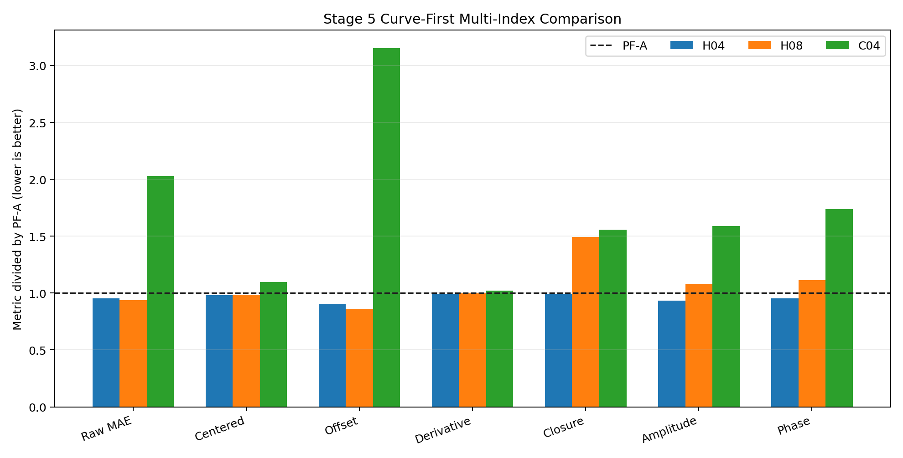
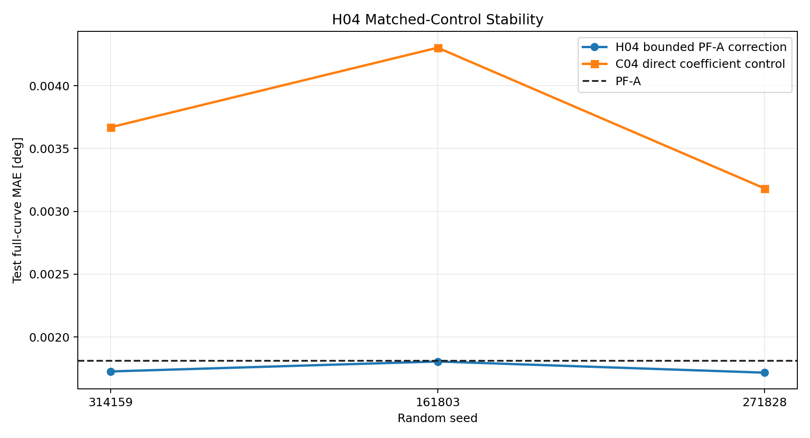
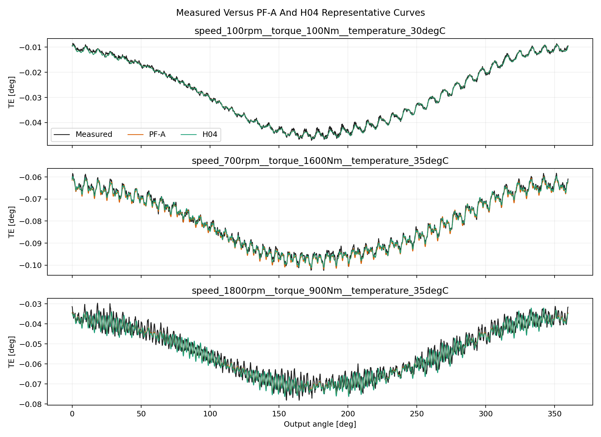

# Wave 5.2R Stage 5 Complex Harmonic Coefficient Residuals Results

## Executive Decision

Stage 5 is complete with a positive component-level result.

All `18` first-screen runs and all `4` conditional stability runs completed
without a failure. `H08` is the scalar raw-error leader, but it is not the
multi-index recommendation because it regresses closure, retained-amplitude,
and retained-phase behavior relative to PF-A.

`H04`, the deep bounded correction to the nine PF-A core complex coefficients,
passes every Stage 5 exit gate. It advances as a qualified structured component
for Stage 6. It does not replace the accepted periodic GRU, does not become a
new production best, and is not yet a full PINN.

## Scope And Integrity

- dataset: `polished_dataset`;
- inputs: setpoints only;
- surface: `Fw`;
- accepted curves: `966`;
- split: `675` train, `194` validation, `97` test;
- angular grid: `2048` uniform points on `0 <= theta < 2*pi`;
- split signature:
  `c1aa8718fb9bf88cc2021c121dc4f3b4010fc1d2e45ac90af5f4376aa64f8e16`;
- runtime measured inputs: none;
- target-derived runtime inputs: none;
- official TE Curve Verification Pipeline: not run.

## Campaign Execution

| Item | Result |
| --- | ---: |
| Planned first-screen runs | 18 |
| Completed first-screen runs | 18 |
| Failed first-screen runs | 0 |
| Conditional stability runs | 4 |
| Failed stability runs | 0 |
| Candidate formulations | 5 |
| Frozen first-screen seed | 314159 |
| Stability seeds | 271828, 161803 |
| Representation alignment | coefficient extraction, training, reconstruction, and evaluation share one uniform grid |

## Primary Curve-First Comparison

| Metric | PF-A | C04 | H04 | H08 | H04 vs PF-A |
| --- | ---: | ---: | ---: | ---: | ---: |
| Raw MAE [deg] | 0.001808977 | 0.003669246 | 0.001725884 | 0.001693343 | +4.59% |
| Centered MAE [deg] | 0.001381875 | 0.001518313 | 0.001355528 | 0.001363757 | +1.91% |
| Offset error [deg] | 0.000975232 | 0.003074926 | 0.000884399 | 0.000834846 | +9.31% |
| Peak-to-peak error [deg] | 0.004724678 | 0.004072875 | 0.004714630 | 0.003604733 | +0.21% |
| Derivative MAE [deg/sample] | 0.000937212 | 0.000957538 | 0.000928304 | 0.000936523 | +0.95% |
| Closure error [deg] | 0.000294624 | 0.000458545 | 0.000291202 | 0.000439377 | +1.16% |
| Amplitude MAE [deg] | 0.000194541 | 0.000309160 | 0.000181567 | 0.000209224 | +6.67% |
| Phase MAE [rad] | 0.337145853 | 0.584952853 | 0.321016671 | 0.374836453 | +4.78% |

H04 improves raw MAE by
`4.59%`
versus PF-A and by
`52.96%`
versus its matched direct coefficient control.

## Why H08 Is Not The Recommendation

H08 reaches the lowest raw MAE,
`0.001693343 deg`, but uses the broader
training-selected order set. Relative to PF-A it worsens:

- periodic closure from `0.000294624`
  to `0.000439377 deg`;
- retained amplitude MAE from
  `0.000194541` to
  `0.000209224 deg`;
- retained phase MAE from
  `0.337145853` to
  `0.374836453 rad`.

This is a real raw-error gain, not Stage 4-style analytical cancellation, but
it is not the best balanced component. The later Stage 6 spectral and Sobolev
work may revisit the added orders with direct derivative and spectral control.

## H04 Stability

| Seed | H04 MAE [deg] | C04 MAE [deg] | H04 vs PF-A |
| ---: | ---: | ---: | ---: |
| 314159 | 0.001725884 | 0.003669246 | +4.59% |
| 161803 | 0.001805115 | 0.004302256 | +0.21% |
| 271828 | 0.001716240 | 0.003182218 | +5.13% |

H04 mean MAE across the three seeds is
`0.001749080 deg`, with standard deviation
`0.000039818 deg`. Every seed beats PF-A and its matched
direct C04 control.

## Representative Full Curves

The following deterministic test cells compare measured TE, frozen PF-A, and
the first-screen H04 checkpoint on the same `2048`-point grid.

## Exit Gates

All ten gates listed below pass.

| Gate | Candidate | Reference or limit | Result |
| --- | ---: | ---: | --- |
| Raw MAE vs PF-A | 0.001725884 | 0.001808977 | passed |
| Raw MAE vs C04 | 0.001725884 | 0.003669246 | passed |
| Centered MAE vs PF-A | 0.001355528 | 0.001381875 | passed |
| Offset vs PF-A | 0.000884399 | 0.000975232 | passed |
| Derivative vs PF-A | 0.000928304 | 0.000937212 | passed |
| Closure vs PF-A | 0.000291202 | 0.000294624 | passed |
| Amplitude vs PF-A | 0.000181567 | 0.000194541 | passed |
| Phase vs PF-A | 0.321016671 | 0.337145853 | passed |
| Correction energy | 0.006915951 | 0.500000000 | passed |
| Three-seed worst vs PF-A | 0.001805115 | 0.001808977 | passed |

## Scientific Interpretation

Stage 5 demonstrates that physics-informed assistance can work in this dataset
when the analytical and learned parts share the same representation and the
learned freedom is constrained to explicit complex coefficients.

The result is stronger than a generic Fourier feature observation:

- the PF-A analytical contribution remains explicit;
- the network learns only bounded coefficient corrections;
- zero correction replays PF-A exactly;
- corrections remain below one percent of anchor RMS for H04;
- every retained harmonic contribution is inspectable;
- the gain survives three seeds and matched direct controls.

The result still does not prove a differential-equation PINN. H04 is a
qualified grey-box structured component that Stage 6 can augment with spectral
and Sobolev guidance.

## Program Decision

- Stage 5 status: complete, positive component-level result;
- qualified component: H04 bounded PF-A core-coefficient correction;
- raw-error-only leader: H08;
- production/model-registry promotion: no;
- accepted periodic GRU replacement: no;
- stability continuation: complete;
- official TE Curve Verification Pipeline: deferred from normal closeout;
- next executable step: Stage 6, Spectral And Sobolev Guidance.

## Artifact Map

- campaign:
  `output/training_campaigns/2026-07-28-16-17-06_wave52r_stage5_complex_harmonic_coefficient_residuals_2026_07_28/`;
- representation and exit gates:
  `output/analysis/wave_5_2r/stage5_complex_harmonic_coefficient_residuals/`;
- H04 first-screen run:
  `output/training_runs/complex_harmonic_coefficient_residuals/2026-07-28-16-17-13__stage5_h04/`;
- [Stage 5 model report](../../../analysis/model_development_waves/wave_5_2/physics_guided_pinn_reassessment/%5B2026-07-28%5D/stage5_complex_harmonic_coefficient_residuals/stage5_complex_harmonic_coefficient_residual_model_report.md);
- preliminary-screen integrity: the superseded sixteen-run screen was archived
  recoverably under `.temp/stage5_superseded_16_run_screen/` after the missing
  data-selected direct controls were detected; only the corrected eighteen-run
  campaign is canonical.
