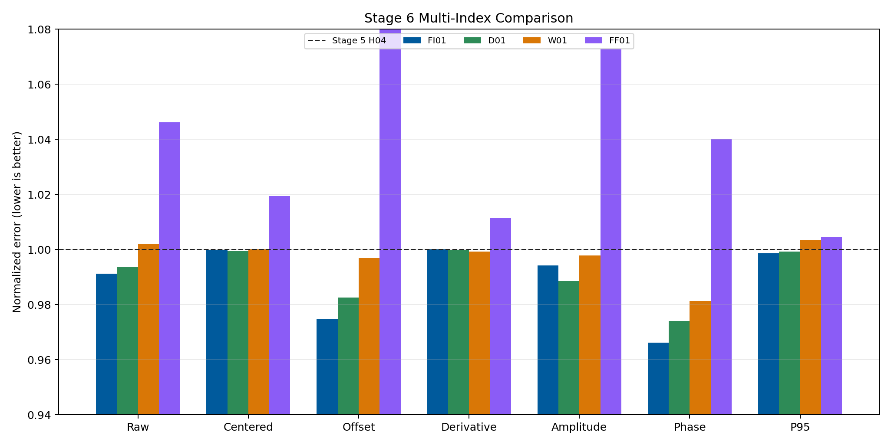
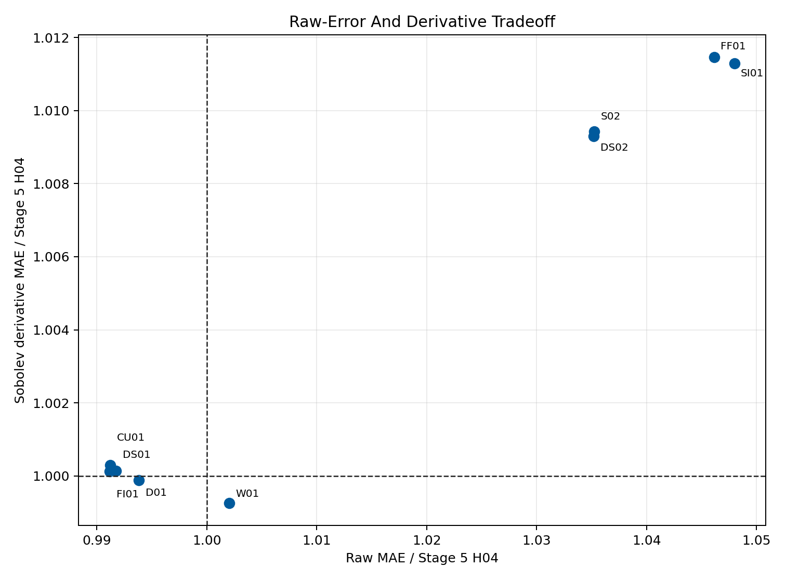
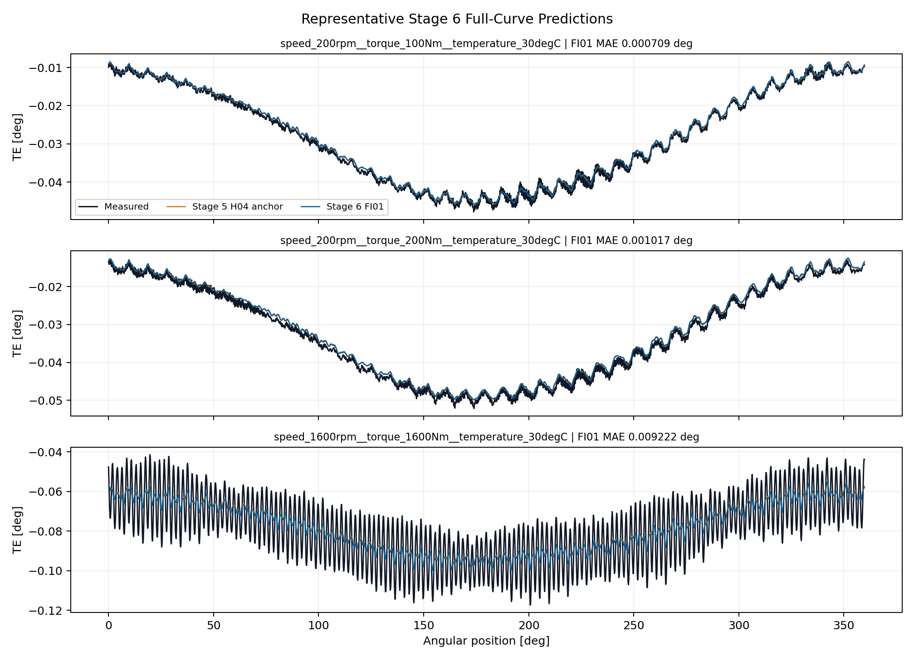

# Wave 5.2R Stage 6 Spectral And Sobolev Guidance Results

## Executive Decision

Stage 6 is complete as a valid negative result.

All `15` first-screen candidates completed without runtime failures, but no
eligible formulation passed the complete multi-index gate. The conditional
stability continuation was therefore correctly not started.

`FI01`, which combines bounded H04 coefficients, derivative and spectral
guidance, and training-only failure-informed angular weights, is the raw-error
leader at `0.001710638 deg`. This is a
`0.88%` improvement over the frozen Stage 5 H04 seed.
Nevertheless, FI01 slightly worsens Sobolev derivative MAE by
`0.012%` and reduces derivative correlation by
`0.002435`. It is not promoted.

Stage 5 H04 remains the qualified structured component entering Stage 7. No
Stage 6 model replaces the accepted periodic GRU or becomes a production
candidate.

## Scope And Integrity

- dataset: `polished_dataset`;
- input contract: setpoints only;
- surface: `Fw`;
- accepted curves: `966`;
- split: `675` train, `194` validation, `97` test;
- angular grid: `2048` uniform points;
- split signature:
  `c1aa8718fb9bf88cc2021c121dc4f3b4010fc1d2e45ac90af5f4376aa64f8e16`;
- first-screen seed: `314159`;
- target-derived runtime inputs: none;
- failed runs: `0`;
- official TE Curve Verification Pipeline: not run.

The preflight passed every derivative, spectrum, coordinate-bound, model-shape,
and leakage check. The second-derivative sensitivity gate failed, so curvature
supervision remained disabled before training as designed.

## Campaign Matrix

| Family | Candidates | Scientific question |
| --- | --- | --- |
| Coefficient controls | C01, C02, C03, C04 | Does representation or direct coefficient prediction explain the gain? |
| Sobolev and spectral | D01, S02, DS01, DS02 | Do first derivatives or complex frequency targets add held-out value? |
| Training strategies | CU01, FI01 | Does curriculum or localized failure weighting help? |
| Coordinate networks | FF00, FF01, SI00, SI01 | Do Fourier features or SIREN resolve missed angular structure? |
| Weak form | W01 | Do local Fourier moments help without pointwise derivative noise? |

## Primary Results

| Candidate | Raw MAE [deg] | Centered [deg] | Offset [deg] | D-MAE | D-corr. | P95 [deg] |
| --- | ---: | ---: | ---: | ---: | ---: | ---: |
| Stage 5 H04 | 0.0017259 | 0.0013555 | 0.0008844 | 0.2810657 | 0.3407822 | 0.0039334 |
| FI01 | 0.0017106 | 0.0013554 | 0.0008622 | 0.2811006 | 0.3383469 | 0.0039280 |
| D01 | 0.0017152 | 0.0013546 | 0.0008690 | 0.2810336 | 0.3398775 | 0.0039307 |
| W01 | 0.0017294 | 0.0013557 | 0.0008817 | 0.2808554 | 0.3411658 | 0.0039473 |
| FF01 | 0.0018055 | 0.0013819 | 0.0009719 | 0.2842875 | 0.3250251 | 0.0039516 |

## Gate Matrix

| Candidate | Raw | Centered | Offset | D-MAE | D-corr. | Amp. | Phase | P95 | Ctrl. | Final |
| --- | --- | --- | --- | --- | --- | --- | --- | --- | --- | --- |
| D01 | pass | pass | pass | fail | fail | pass | pass | pass | pass | fail |
| S02 | fail | pass | fail | fail | pass | fail | fail | pass | pass | fail |
| DS01 | pass | pass | pass | fail | fail | pass | pass | pass | pass | fail |
| DS02 | fail | pass | fail | fail | pass | fail | fail | pass | pass | fail |
| CU01 | pass | pass | pass | fail | fail | fail | pass | pass | pass | fail |
| FI01 | pass | pass | pass | fail | fail | pass | pass | pass | pass | fail |
| FF01 | fail | fail | fail | fail | fail | fail | fail | fail | pass | fail |
| SI01 | fail | fail | fail | fail | fail | fail | fail | fail | fail | fail |
| W01 | pass | pass | pass | fail | pass | fail | pass | fail | fail | fail |

No row passes all gates.

## What Worked

- FI01, CU01, DS01, and C02 all reduce raw MAE relative to Stage 5 H04.
- FI01 preserves centered shape, offset, amplitude, phase, and P95 within the
  declared gates while beating its DS01 matched control.
- D01 obtains the best centered-shape result among the leading bounded
  coefficient candidates and improves harmonic amplitude and phase.
- W01 produces the best derivative MAE and derivative correlation in the
  first screen, showing that weak local moments can alter the intended
  differential behavior.
- Every model keeps unsupported high-frequency energy bounded.
- The preflight successfully rejected unstable second-derivative supervision.

## What Did Not Work

- The pointwise derivative candidates fail the required derivative improvement
  thresholds despite their explicit Sobolev losses.
- FI01's raw-error gain does not transfer to derivative correlation.
- W01's derivative gain costs raw error, amplitude, and tail quality and does
  not beat its C01 control.
- Fragile-band H08 formulations S02 and DS02 worsen raw error and offset.
- Direct coefficient candidates C03 and C04 remain substantially worse.
- Fourier-feature and SIREN coordinate residuals do not beat the bounded
  coefficient family and do not demonstrate a useful spectral-bias correction.
- No candidate earns stability continuation or model promotion.

## Raw-Error And Derivative Tradeoff

The lower-left quadrant would improve both quantities relative to Stage 5 H04.
No candidate reaches the required improvement region with the remaining gates.

## Representative Full Curves

FI01 remains visually close to the qualified H04 component. Its improvement is
small and distributed; it does not expose a new localized correction capable
of satisfying the derivative gate.

## Scientific Interpretation

Stage 6 does not show that spectral or Sobolev guidance is useless. It shows
that, on the current bounded coefficient representation and fixed split, the
tested loss formulations mostly redistribute error among already correlated
curve metrics. A raw-curve gain can coexist with a worse derivative field, and
a weak-form derivative gain can coexist with worse tails or harmonic
amplitude.

This is exactly why the multi-index gate is necessary. Selecting FI01 by MAE
alone would overstate the physics contribution.

The next controlled hypothesis is decomposition rather than another global
loss mixture: Stage 7 separates the mean/offset quantity from the
mean-centered periodic shape. That design directly targets the offset-shape
competition visible here while preserving H04 as an inspectable structured
component.

## Program Decision

- Stage 6 status: complete, valid negative result;
- completed runs: `15 / 15`;
- stability runs: `0`, correctly skipped;
- raw-error leader: FI01;
- promoted Stage 6 candidate: none;
- retained component: Stage 5 H04;
- production or registry promotion: no;
- next step: Stage 7, Mean And Centered-Shape Multi-Head Model.

## Artifact Map

- campaign:
  `output/training_campaigns/2026-07-29-15-34-05_wave52r_stage6_spectral_sobolev_guidance_2026_07_29/`;
- gate summary:
  `output/analysis/wave_5_2r/stage6_spectral_sobolev_guidance/closeout/stage6_exit_gate_summary.yaml`;
- preflight:
  `output/analysis/wave_5_2r/stage6_spectral_sobolev_guidance/stage6_preflight_validation_summary.yaml`;
- FI01 checkpoint:
  `output/training_runs/spectral_sobolev_guidance/2026-07-29-15-34-13__stage6_fi01/best_model.pt`;
- model report:
  `doc/reports/analysis/model_development_waves/wave_5_2/physics_guided_pinn_reassessment/[2026-07-29]/stage6_spectral_sobolev_guidance/stage6_spectral_sobolev_guided_residual_model_report.md`.
