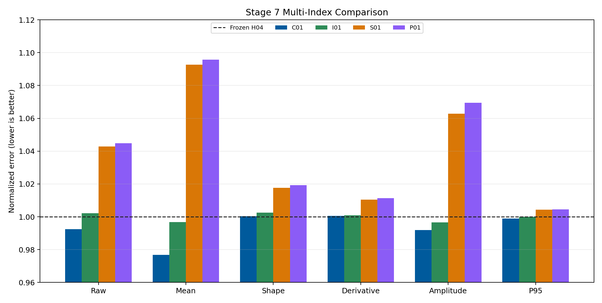
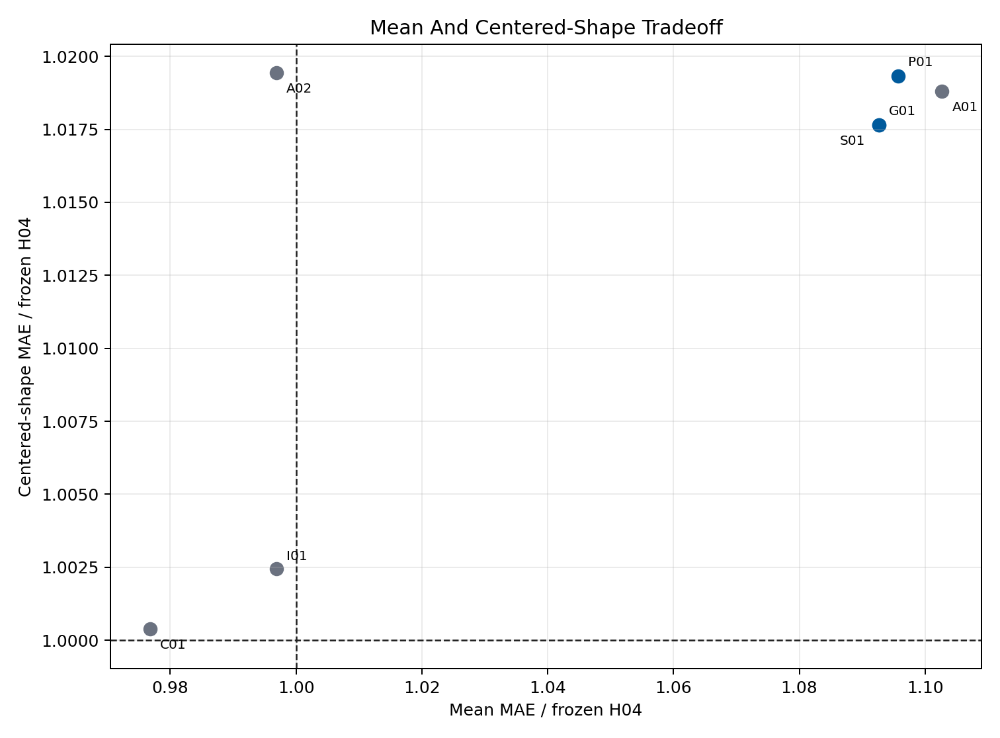
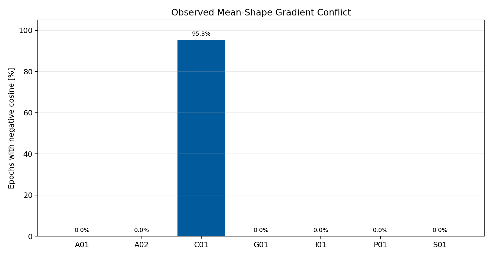
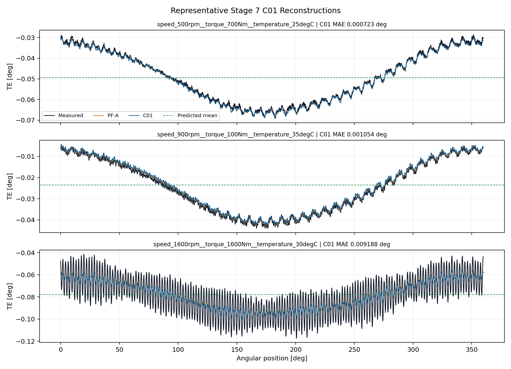

# Wave 5.2R Stage 7 Mean And Centered-Shape Multi-Head Results

## Executive Decision

Stage 7 is complete as a valid negative result.

All `7 / 7` first-screen runs completed without failure. No shared or partially
shared candidate passed the complete multi-index gate, so the conditional
stability continuation was correctly skipped.

C01, the monolithic H04 fine-tuning control, is the raw-error leader at
`0.001712731 deg`. It improves raw MAE by
`0.76%` and mean MAE by `2.32%`
relative to frozen H04, but centered-shape MAE changes by
`-0.04%`. C01 is not a multi-head candidate and does not
qualify for promotion.

Stage 5 H04 remains the qualified structured component entering Stage 8. No
Stage 7 model replaces the accepted periodic GRU or becomes a production
candidate.

## Scope And Integrity

- dataset: `polished_dataset`;
- input contract: setpoints only;
- surface: `Fw`;
- accepted curves: `966`;
- split: `675` train, `194` validation, `97` test;
- angular grid: `2048` uniform points;
- split signature:
  `c1aa8718fb9bf88cc2021c121dc4f3b4010fc1d2e45ac90af5f4376aa64f8e16`;
- first-screen seed: `314159`;
- completed runs: `7 / 7`;
- target-derived runtime inputs: none;
- official TE Curve Verification Pipeline: not run.

Every candidate satisfies exact decomposition invariants. Maximum observed
centered-shape mean is below `3.4e-10 deg`, and reconstruction identity error
is exactly zero on the test split.

## Candidate Matrix

| ID | Architecture | Parameters | Relative to I01 | Role |
| --- | --- | ---: | ---: | --- |
| C01 | monolithic H04 | 7123 | 0.523 | fine-tuning control |
| S01 | fully shared heads | 8179 | 0.601 | promotion candidate |
| P01 | partially shared | 10259 | 0.753 | promotion candidate |
| I01 | independent heads | 13619 | 1.000 | matched control |
| G01 | shared plus projection | 8179 | 0.601 | promotion candidate |
| A01 | analytical mean | 7090 | 0.521 | ablation |
| A02 | analytical shape | 6529 | 0.479 | ablation |

## Primary Results

| ID | Raw [deg] | Mean [deg] | Shape [deg] | D-MAE | Phase [rad] | P95 [deg] |
| --- | ---: | ---: | ---: | ---: | ---: | ---: |
| Frozen H04 | 0.0017259 | 0.0008844 | 0.0013555 | 0.2810657 | 0.3210167 | 0.0039334 |
| C01 | 0.0017127 | 0.0008638 | 0.0013561 | 0.2812074 | 0.3141944 | 0.0039294 |
| I01 | 0.0017296 | 0.0008816 | 0.0013589 | 0.2813380 | 0.3511679 | 0.0039332 |
| S01 | 0.0017998 | 0.0009664 | 0.0013794 | 0.2839949 | 0.3298313 | 0.0039502 |
| P01 | 0.0018031 | 0.0009690 | 0.0013817 | 0.2842617 | 0.3333249 | 0.0039511 |
| G01 | 0.0017998 | 0.0009664 | 0.0013794 | 0.2839949 | 0.3298313 | 0.0039502 |

## Gate Matrix

| ID | Raw | Mean | Shape | Deriv. | Harm. | P95 | Shared | Invariant | Final |
| --- | --- | --- | --- | --- | --- | --- | --- | --- | --- |
| S01 | fail | fail | fail | fail | fail | fail | fail | pass | fail |
| P01 | fail | fail | fail | fail | fail | fail | fail | pass | fail |
| G01 | fail | fail | fail | fail | fail | fail | fail | pass | fail |

No shared formulation passes any predictive improvement gate. The structural
invariants pass for all candidates.

## What Worked

- the mean-plus-shape reconstruction is exact and numerically stable;
- S01 uses `60.1%` and P01 uses `75.3%` of I01 parameters;
- C01 shows that continued bounded H04 optimization can improve raw and mean
  error while preserving closure, amplitude, phase, and P95;
- the campaign directly measures mean-shape gradient conflict;
- the analytical ablations localize the need to learn both components.

## What Did Not Work

- S01, P01, and G01 worsen raw, mean, shape, derivative, harmonic, and P95
  behavior relative to frozen H04;
- the parameter savings do not compensate for their predictive regression;
- I01 is the closest balanced decomposition but does not achieve the required
  mean and shape gains despite using the most parameters;
- A01 shows that a frozen analytical mean is insufficient;
- A02 shows that learning only the mean does not preserve the qualified shape;
- no candidate earns stability continuation or promotion.

## Mean And Shape Tradeoff

The lower-left quadrant improves both explicit quantities. C01 improves the
mean but sits slightly above the frozen shape baseline. Every multi-head
candidate remains outside the required improvement region.

## Gradient Conflict

C01 records negative mean-versus-shape cosine in
`95.3%`
of epochs. In the explicit shared-head models the measured shared gradient
cosine is non-negative, so G01's projection is never activated and G01 is
numerically equivalent to S01. This explains why gradient surgery does not
recover performance in this screen.

## Representative Full Curves

C01 remains close to frozen H04 and improves the mean component, but its worst
cell still exposes unresolved high-order shape error.

## Scientific Interpretation

Exact decomposition improves interpretability but does not by itself add
predictive information. The current dataset and bounded coefficient target
allow the monolithic model to trade mean against small shape changes more
effectively than the explicit multi-head models.

The result also distinguishes architectural conflict from gradient conflict.
C01 exhibits frequent negative cosine, while explicit shared heads do not.
Their failure therefore cannot be repaired by conflict projection alone; the
shared representation and optimization path are the limiting factors in this
screen.

Stage 8 returns to a weaker, mechanism-specific hypothesis: forward compliance
priors. It will start with diagnostics and sign-only or broad-bound constraints
rather than a hard equation.

## Program Decision

- Stage 7 status: complete, valid negative result;
- completed runs: `7 / 7`;
- stability runs: `0`, correctly skipped;
- raw-error leader: C01 monolithic control;
- promoted Stage 7 candidate: none;
- retained component: Stage 5 H04;
- production or registry promotion: no;
- next step: Stage 8, Weak Forward Compliance Priors.

## Artifact Map

- campaign:
  `output/training_campaigns/2026-07-29-17-46-21_wave52r_stage7_mean_centered_shape_multi_head_2026_07_29/`;
- gate summary:
  `output/analysis/wave_5_2r/stage7_mean_centered_shape_multi_head/closeout/stage7_exit_gate_summary.yaml`;
- preflight:
  `output/analysis/wave_5_2r/stage7_mean_centered_shape_multi_head/stage7_preflight_validation_summary.yaml`;
- C01 checkpoint:
  `output/training_runs/mean_centered_shape_multi_head/2026-07-29-17-46-25__stage7_c01/best_model.pt`;
- model report:
  `doc/reports/analysis/model_development_waves/wave_5_2/physics_guided_pinn_reassessment/[2026-07-29]/stage7_mean_centered_shape_multi_head/stage7_mean_centered_shape_multi_head_model_report.md`.
