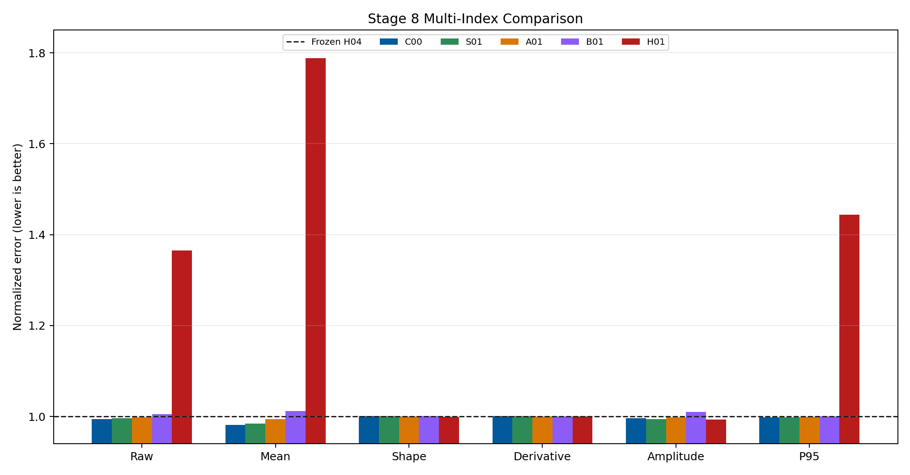
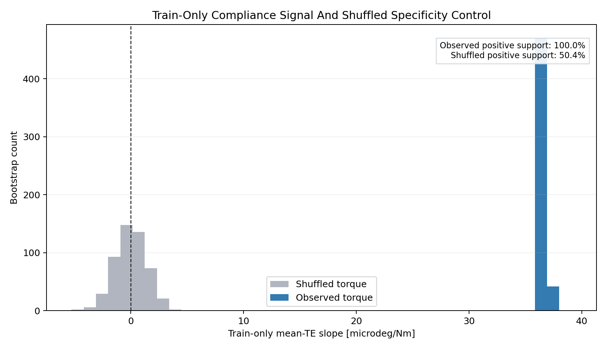
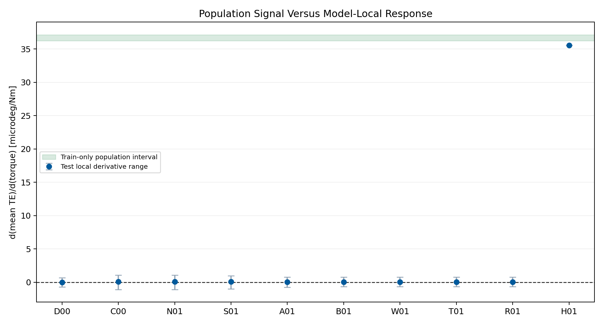
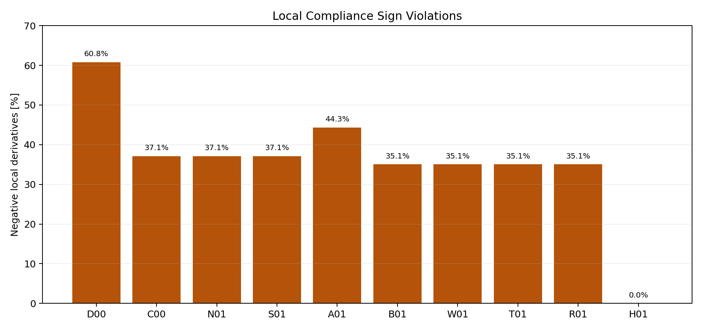
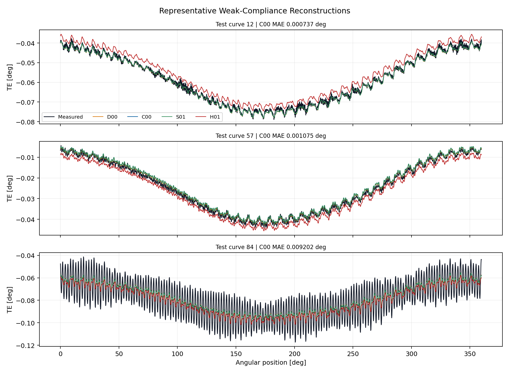

# Wave 5.2R Stage 8 Weak Forward Compliance Priors Results

## Executive Decision

Stage 8 is complete as a valid negative result.

All `10 / 10` first-screen runs completed without failure. No weak-compliance
candidate passed the complete multi-index gate, so the conditional stability
continuation was correctly skipped.

The training-only diagnostic strongly supports a positive *population*
association between applied torque and curve-mean TE: all `512 / 512`
bootstraps are positive, with a 95% interval from
`3.623920841e-05` to
`3.713770981e-05 deg/Nm`. The
shuffled-torque control returns `50.39%`
positive support, as expected under loss of specificity.

That valid observable relationship does not transfer into useful local
physics guidance. No weak-prior arm beats data-only C00, and all weak arms
retain negative model-local derivatives for `35.1%` to `44.3%` of test
conditions. H01 enforces a positive derivative everywhere, but materially
underfits raw and mean TE.

Stage 5 H04 remains the qualified structured component entering Stage 9. No
Stage 8 model replaces the accepted periodic GRU or becomes a production
candidate.

## Scope And Integrity

- dataset: `polished_dataset`;
- input contract: setpoints only;
- surface: `Fw`;
- accepted curves: `966`;
- split: `675` train, `194` validation, `97` test;
- angular grid: `2048` uniform points;
- split signature:
  `c1aa8718fb9bf88cc2021c121dc4f3b4010fc1d2e45ac90af5f4376aa64f8e16`;
- first-screen seed: `314159`;
- completed runs: `10 / 10`;
- failed runs: `0`;
- target-derived runtime inputs: none;
- validation or test targets used for prior estimation: no;
- official TE Curve Verification Pipeline: not run.

This stage intentionally tests an observable response prior, not an identified
contact-stiffness law. The dataset does not contain ordered load-unload cycles,
clearances, contact forces, hysteretic internal states, or component-level
stiffness measurements required by the Xu mechanical formulation.

## Candidate Matrix

| ID | Formulation | Role |
| --- | --- | --- |
| D00 | frozen H04 | immutable structured baseline |
| C00 | data-only H04 fine-tune | learned control |
| S01 | sign-only derivative penalty | weakest physics arm |
| B01 | broad bootstrap interval | interval arm |
| W01 | confidence-weighted interval | support-aware arm |
| T01 | temperature-stratified interval | conditional arm |
| A01 | delayed interval activation | curriculum arm |
| R01 | adaptive interval weighting | optimization arm |
| N01 | shuffled-torque interval | specificity control |
| H01 | fixed compliance equation | misspecification control |

## Primary Results

| ID | Raw [deg] | Mean [deg] | Shape [deg] | dTE/dT [deg/Nm] | Negative [%] |
| --- | ---: | ---: | ---: | ---: | ---: |
| D00 | 0.0017259 | 0.0008844 | 0.0013555 | -1.020e-08 | 60.8 |
| C00 | 0.0017169 | 0.0008681 | 0.0013577 | 9.982e-08 | 37.1 |
| S01 | 0.0017196 | 0.0008710 | 0.0013577 | 1.093e-07 | 37.1 |
| A01 | 0.0017224 | 0.0008790 | 0.0013561 | 2.069e-08 | 44.3 |
| B01 | 0.0017352 | 0.0008954 | 0.0013567 | 4.450e-08 | 35.1 |
| N01 | 0.0017169 | 0.0008681 | 0.0013577 | 9.982e-08 | 37.1 |
| H01 | 0.0023556 | 0.0015811 | 0.0013548 | 3.558e-05 | 0.0 |

C00 is the raw-error leader at `0.001716862 deg`.
It improves raw MAE by `0.52%` and mean MAE by
`1.85%` relative to frozen H04, while centered-shape MAE
changes by `-0.16%`. This gain is attributable to
bounded data-only fine-tuning, not to a compliance constraint.

S01 improves raw MAE by `0.36%` and mean MAE by
`1.51%` relative to frozen H04, but it is worse than C00
on both quantities and does not establish a consistently positive local
response.

## Train-Only Identifiability Diagnostic

The population slope is stable and specific to the real torque ordering. Its
median corresponds to an effective response scale of
`27282.7 Nm/deg`.
This number is a descriptive reciprocal slope, not an identified reducer
stiffness. It conflates operating-condition sampling, offsets, temperature,
speed, contact state, and unobserved hysteresis.

## Local Derivative Behavior

The green band is the train-only population interval. The learned model-local
derivatives are roughly three orders of magnitude smaller and cross zero for
every weak arm. The diagnostic therefore distinguishes two different claims:

1. higher-torque operating cells have higher mean TE on average;
2. each learned curve should respond monotonically to an infinitesimal torque
   perturbation while every other input remains fixed.

The first claim is supported. The second is not identified by this dataset and
is not recovered by the tested penalties.

### Sign Violations

H01 is the only formulation with zero sign violations. Its derivative is
fixed near the train-only population slope, but raw MAE rises to
`0.0023556 deg` and mean MAE to
`0.0015811 deg`. This is direct evidence that
the hard equation is misspecified for pointwise prediction.

## Gate Matrix

| ID | R-H04 | R-C00 | M-H04 | M-C00 | Shape | Curve | N01 | Sign | Final |
| --- | --- | --- | --- | --- | --- | --- | --- | --- | --- |
| S01 | pass | fail | pass | fail | pass | pass | fail | fail | fail |
| B01 | fail | fail | fail | fail | pass | fail | fail | fail | fail |
| W01 | fail | fail | fail | fail | pass | fail | fail | fail | fail |
| T01 | fail | fail | fail | fail | pass | fail | fail | fail | fail |
| A01 | pass | fail | pass | fail | pass | pass | fail | fail | fail |
| R01 | fail | fail | fail | fail | pass | fail | fail | fail | fail |

No candidate passes. S01 and A01 beat frozen H04 on raw and mean error, but
neither beats C00 or the shuffled-control requirement, and neither has
positive local derivatives throughout the test surface. B01, W01, T01, and
R01 additionally regress raw and mean behavior.

## What Worked

- the train-only bootstrap found a strong positive population association;
- the shuffled-torque bootstrap removed that directional support;
- autograd derivatives were computed without target-derived runtime inputs;
- the weak-to-hard ladder exposed the tradeoff between predictive fit and
  derivative enforcement;
- all curve-first diagnostics and failure controls completed deterministically.

## What Did Not Work

- no weak physics arm outperformed data-only C00;
- N01 is numerically identical to C00 because its shuffled interval does not
  activate a useful constraint;
- sign-only and delayed penalties leave `37.1%` and `44.3%` negative local
  derivatives, respectively;
- broad, weighted, temperature, and adaptive intervals converge to nearly the
  same inferior solution;
- the hard compliance equation removes sign violations only by sacrificing
  raw and mean accuracy;
- no candidate earns stability continuation or promotion.

## Representative Full Curves

C00 and S01 remain visually close to frozen H04. H01 shifts whole-curve levels
because the fixed compliance term dominates the mean response; its slightly
better centered-shape metric does not compensate for the offset error.

## Scientific Interpretation

The Stage 8 result does not show that compliance is absent. It shows that a
cross-sectional population trend is insufficient to define a causal,
pointwise constitutive residual. A PINN can compensate for an incomplete
mechanical model only when the residual constrains the intended state without
forcing the network to absorb systematic misspecification.

Here the missing load history, direction reversals, contact regime, clearance,
and internal torsional states make the local derivative ambiguous. The network
therefore treats the compliance penalties as optimization bias rather than
additional identifiable information.

This evidence justifies moving to Stage 9, where causal history is tested as
the missing information channel through temporal analytical-residual models.
Stage 9 must preserve the same negative-control and data-only comparison
discipline.

## Program Decision

- Stage 8 status: complete, valid negative result;
- completed runs: `10 / 10`;
- stability runs: `0`, correctly skipped;
- raw-error leader: C00 data-only control;
- promoted Stage 8 candidate: none;
- retained component: Stage 5 H04;
- production or registry promotion: no;
- next step: Stage 9, Temporal Analytical-Residual Models.

## Artifact Map

- campaign:
  `output/training_campaigns/2026-07-29-18-19-20_wave52r_stage8_weak_forward_compliance_priors_2026_07_29/`;
- gate summary:
  `output/analysis/wave_5_2r/stage8_weak_forward_compliance_priors/closeout/stage8_exit_gate_summary.yaml`;
- bootstrap:
  `output/analysis/wave_5_2r/stage8_weak_forward_compliance_priors/stage8_training_only_bootstrap.yaml`;
- preflight:
  `output/analysis/wave_5_2r/stage8_weak_forward_compliance_priors/stage8_preflight_validation_summary.yaml`;
- C00 checkpoint:
  `output/training_runs/weak_forward_compliance_priors/2026-07-29-18-19-22__stage8_c00/best_model.pt`;
- model report:
  `doc/reports/analysis/model_development_waves/wave_5_2/physics_guided_pinn_reassessment/[2026-07-29]/stage8_weak_forward_compliance_priors/stage8_weak_forward_compliance_priors_model_report.md`.
