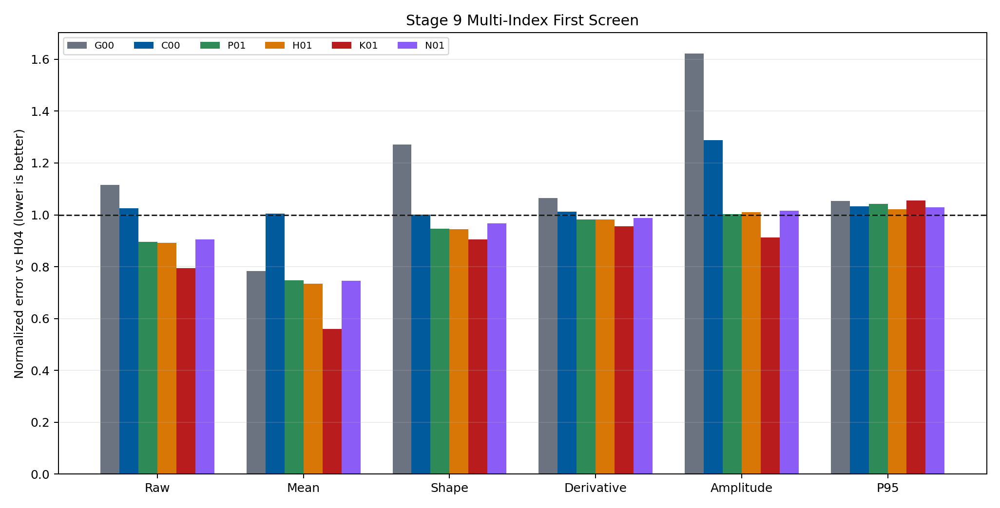
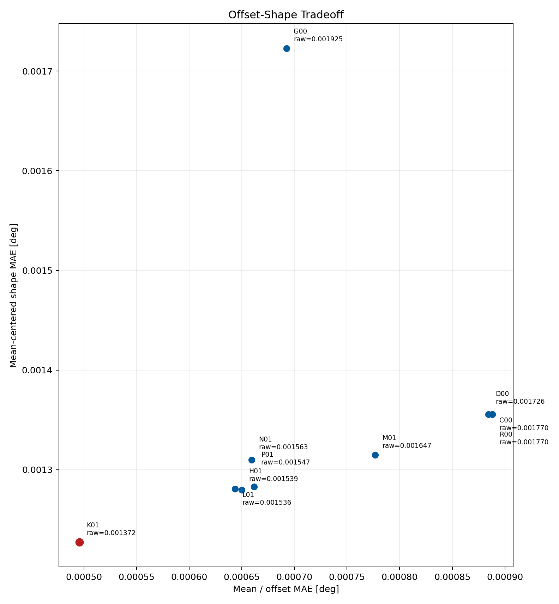
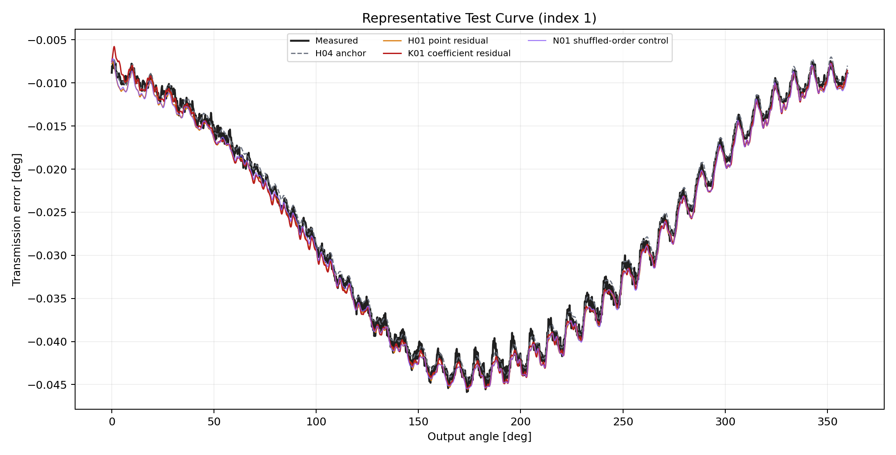
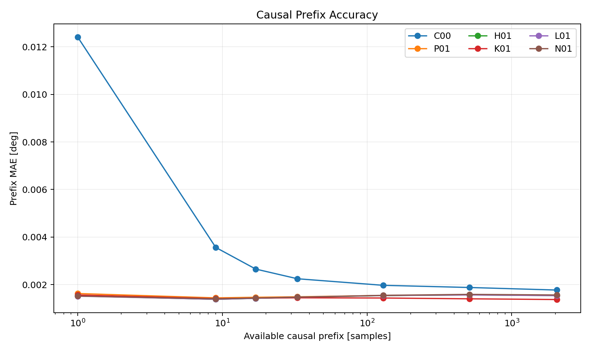
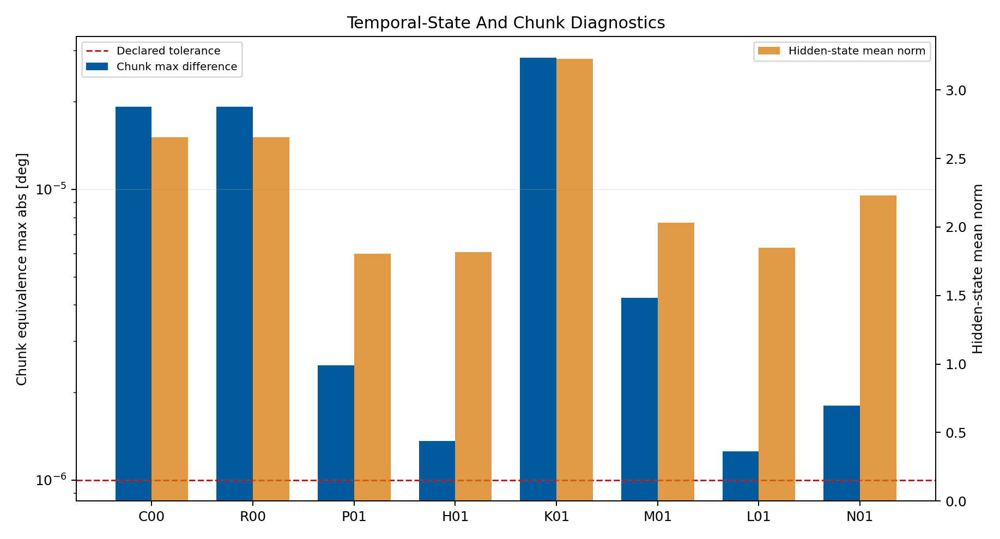

# Wave 5.2R Stage 9 Temporal Analytical-Residual Models Results

## Executive Summary

Stage 9 completed all 10 first-screen entries without runtime failures. The
causal coefficient-residual formulation `K01` is the clear scalar and component
leader: it improves raw MAE by
20.53%, mean
error by 43.93%,
and mean-centered shape error by
9.46% relative
to the frozen `H04` analytical anchor.

No candidate passed the complete predeclared gate. The result is therefore a
scientifically useful temporal-residual lead, not an official model promotion.
`K01` is retained as a qualified research component for later integration and
repair work. Stage 10 remains the next roadmap step.

## Scope And Controls

- Dataset: polished dataset, setpoint inputs, forward surface only.
- Split: frozen Stage 0 grouped `675/194/97` train/validation/test split.
- Analytical anchor: frozen Stage 8 `H04`.
- Historical temporal comparator: archived
  `polished_setpoints_periodic_gru_sequence_Fw` checkpoint.
- Temporal contract: unidirectional two-layer GRU with explicit zero-state
  initialization and state carry across causal chunks.
- First-screen seed: `314159`.
- Target-derived runtime inputs: zero.

The historical `G00` replay was regenerated after detecting that the initial
campaign script referenced the older actual-values checkpoint. The corrected
replay uses the canonical five-input polished-setpoint forward archive,
including the forward direction flag. No candidate was retrained.

## First-Screen Results

| Candidate | Formulation | Raw MAE | Mean MAE | Shape MAE | Closure | P95 |
| --- | --- | ---: | ---: | ---: | ---: | ---: |
| `K01` | `h04_coefficient_residual_gru` | 0.001372 | 0.000496 | 0.001227 | 0.000639 | 0.004148 |
| `L01` | `h04_context_curriculum_residual_gru` | 0.001536 | 0.000644 | 0.001281 | 0.000463 | 0.004044 |
| `H01` | `h04_causal_residual_gru` | 0.001539 | 0.000650 | 0.001280 | 0.000474 | 0.004017 |
| `P01` | `pf_a_causal_residual_gru` | 0.001547 | 0.000662 | 0.001283 | 0.000673 | 0.004097 |
| `N01` | `h04_shuffled_angular_order_residual_gru` | 0.001563 | 0.000659 | 0.001310 | 0.000729 | 0.004048 |
| `M01` | `h04_static_mean_temporal_shape_gru` | 0.001647 | 0.000777 | 0.001315 | 0.011127 | 0.004210 |
| `D00` | `frozen_h04` | 0.001726 | 0.000884 | 0.001356 | 0.000291 | 0.003933 |
| `C00` | `causal_periodic_gru` | 0.001770 | 0.000888 | 0.001356 | 0.013399 | 0.004066 |
| `R00` | `parameter_matched_zero_anchor_residual_gru` | 0.001770 | 0.000888 | 0.001356 | 0.013399 | 0.004066 |
| `G00` | `accepted_setpoint_periodic_gru_replay` | 0.001925 | 0.000693 | 0.001723 | 0.000234 | 0.004145 |

## What Worked

The analytical anchor plus a learned temporal correction is materially better
than either constituent alone. `K01` reached raw MAE
`0.001372 deg`, mean MAE
`0.000496 deg`, and shape MAE
`0.001227 deg`. It also beats the
corrected accepted GRU replay (`0.001925 deg`) and the
direct causal GRU control.

The coefficient-residual path was stronger than direct point residuals. This
supports the premise that the temporal network is most useful when it adjusts
an interpretable low-dimensional harmonic representation instead of freely
redrawing every angular sample.

`H01`, `K01`, and `L01` all beat the shuffled-order control on raw and mean
error. Chronological state therefore adds measurable value. However, the
shuffled control itself remains strong, showing that a substantial part of the
gain comes from angular features, analytical anchoring, and model capacity
rather than temporal ordering alone.

## What Did Not Pass

The direct causal GRU control `C00` did not beat `H04`; its raw MAE was
`0.001770 deg`. Temporal memory without the
analytical residual structure is therefore not sufficient on this screen.

All physics-guided candidates failed the strict complete gate:

- periodic closure was worse than the best retained baseline;
- per-curve P95 did not remain within the declared 2% tolerance;
- GPU one-pass versus 33-sample chunk evaluation exceeded the predeclared
  `1e-6 deg` maximum-difference tolerance.

The chunk deviations are small in absolute terms, from approximately
`1.25e-6` to `2.84e-5 deg`, and reset reproducibility remained exact. They are
consistent with numerical execution-order sensitivity, but the threshold is a
predeclared gate and was not relaxed after observing the results.

### Temporal-State Diagnostic

## Scientific Interpretation

Stage 9 validates the central hybrid-PINN argument: incomplete analytical
knowledge can guide the representation while a neural residual compensates for
missing effects. The strongest outcome is not a fully free neural sequence
model. It is a causal GRU operating on top of the `H04` harmonic anchor and
modifying harmonic coefficients.

The result is nevertheless not deployment-ready. The average behavior improves
strongly, while tail curves and periodic boundary consistency regress. Future
use of `K01` should therefore preserve its coefficient-residual structure but
add explicit boundary-consistent parameterization, tail-risk selection, and a
numerically calibrated chunk-equivalence audit.

## Decision

- Stage 9 status: completed without promotion.
- Official promoted candidate: none.
- Retained research component: `K01`.
- Stability repeats: not launched because no candidate passed every
  first-screen gate.
- Next roadmap action: Stage 10 sparse and symbolic formulation discovery.

## Reproducibility Evidence

- Campaign leaderboard:
  `output/training_campaigns/2026-07-29-18-52-55_wave52r_stage9_temporal_analytical_residual_models_2026_07_29/campaign_leaderboard.yaml`
- Gate summary:
  `output/training_campaigns/2026-07-29-18-52-55_wave52r_stage9_temporal_analytical_residual_models_2026_07_29/campaign_first_screen_gate_summary.yaml`
- Exit-gate summary:
  `output/analysis/wave_5_2r/stage9_temporal_analytical_residual_models/closeout/stage9_exit_gate_summary.yaml`
- Accepted GRU replay:
  `output/analysis/wave_5_2r/stage9_temporal_analytical_residual_models/stage9_accepted_gru_replay.npz`
