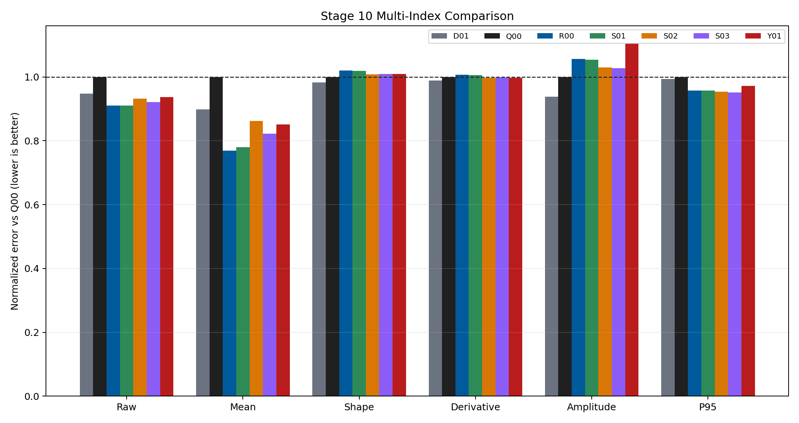
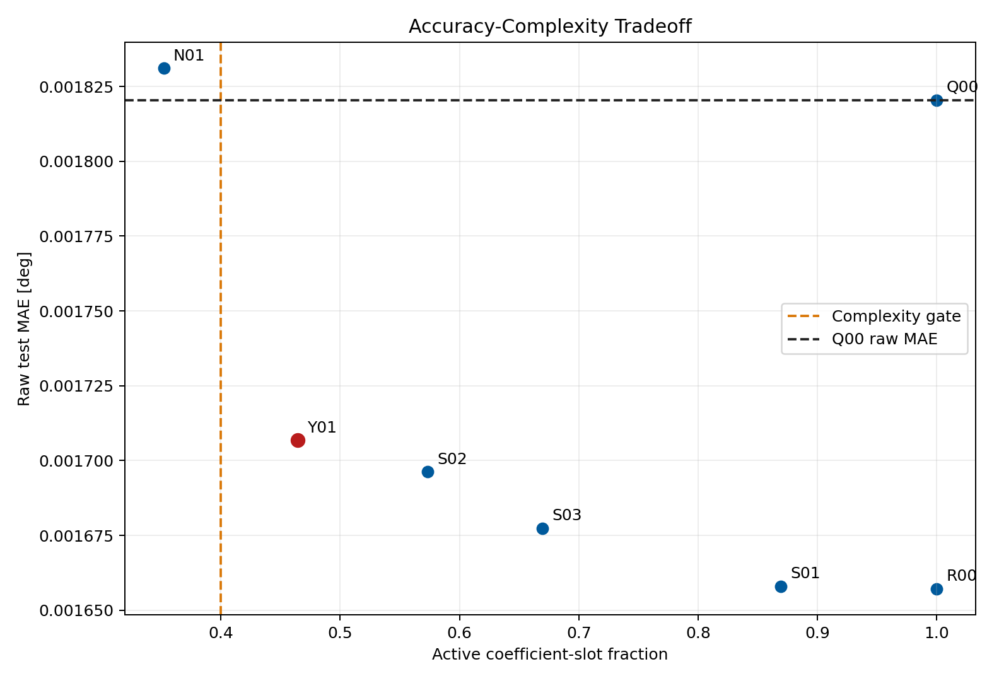
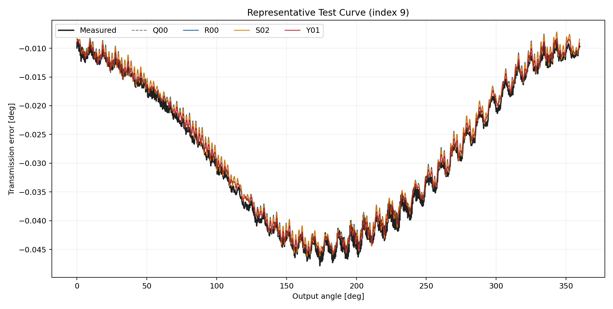
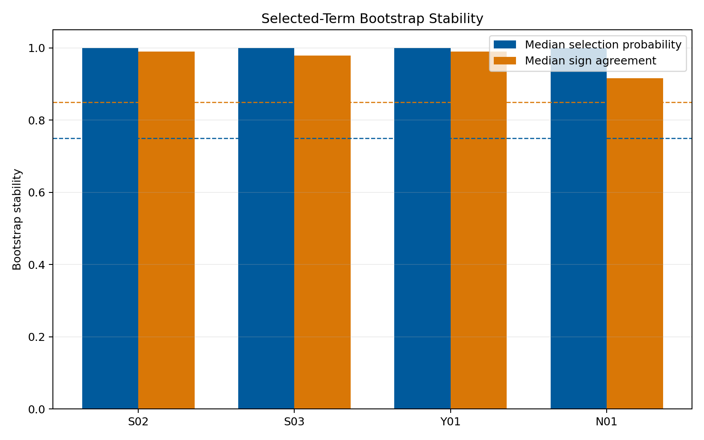

# Wave 5.2R Stage 10 Sparse And Symbolic Formulation Discovery Results

## Executive Summary

Stage 10 completed all ten diagnostic and fitted entries without runtime
failure. The extended condition library contains useful predictive structure:
dense ridge `R00` improved raw MAE by
8.97% and mean
error by 23.10%
relative to the complete-quadratic `Q00` control.

No sparse or constrained-symbolic candidate passed the full exit gate. The
candidate laws improved raw error but did not improve centered-shape error,
retained too many coefficient slots, and exposed weak sign stability in their
least stable selected terms. No expression is promoted or relabeled as a
physical law.

## Scope And Method

- Dataset: polished dataset, setpoint inputs, forward surface only.
- Split: frozen Stage 0 `675/194/97` grouped split.
- Harmonic representation: offset plus Stage 5 core sine/cosine orders.
- Baselines: PF-A, H04, and Stage 9 K01.
- Sparse selection: train-only threshold selection and `96` deterministic
  bootstraps.
- Validation: bounded alpha and threshold grid.
- Test access: one evaluation after term definitions were frozen.
- Runtime target-derived inputs: zero.

## First-Screen Results

| ID | Formulation | Raw MAE | Mean MAE | Shape MAE | Active fraction | Coefficient MAE |
| --- | --- | ---: | ---: | ---: | ---: | ---: |
| `D02` | `frozen_stage9_k01` | 0.001372 | 0.000496 | 0.001227 | 0.000 | N/A |
| `R00` | `dense_ridge_extended_library` | 0.001657 | 0.000757 | 0.001408 | 1.000 | 0.000218 |
| `S01` | `sequential_thresholded_ridge` | 0.001658 | 0.000767 | 0.001406 | 0.869 | 0.000218 |
| `S03` | `hierarchy_constrained_stable_sparse_refit` | 0.001677 | 0.000810 | 0.001393 | 0.670 | 0.000217 |
| `S02` | `bootstrap_stable_sparse_refit` | 0.001696 | 0.000848 | 0.001391 | 0.574 | 0.000220 |
| `Y01` | `bounded_separable_symbolic_library` | 0.001707 | 0.000838 | 0.001393 | 0.464 | 0.000223 |
| `D01` | `frozen_h04` | 0.001726 | 0.000884 | 0.001356 | 0.000 | N/A |
| `D00` | `frozen_pf_a` | 0.001809 | 0.000975 | 0.001382 | 0.000 | N/A |
| `Q00` | `complete_quadratic_coefficient_residual` | 0.001820 | 0.000984 | 0.001380 | 1.000 | 0.000220 |
| `N01` | `shuffled_label_stability_control` | 0.001831 | 0.001017 | 0.001381 | 0.352 | 0.000226 |

## What Worked

`R00` reached raw MAE `0.001657 deg`, compared with
`0.001820 deg` for `Q00`. The result demonstrates that
the extended library contains condition interactions absent from the complete
quadratic control.

All discovered laws remain periodic by construction. Their closure metrics
stay near the analytical references, deterministic replay is exact, and no
runtime target-derived feature is used.

The sparse and symbolic candidates also beat the shuffled-label control on raw
and coefficient error. Their improvement is therefore not reproduced by the
specificity control.

## What Did Not Pass

The predictive gain was not parsimonious enough. Active fractions were:

- `S01`: `0.869`;
- `S02`: `0.574`;
- `S03`: `0.670`;
- `Y01`: `0.464`.

The predeclared maximum was `0.40`. The most compact real candidate, `Y01`,
still retained 150 of
323 coefficient slots.

No sparse candidate improved centered-shape MAE over `Q00`. The least-stable
selected signs in the bootstrap candidates fell to approximately `0.53`, well
below the required `0.85`. Strong hierarchy added parent terms but could not
repair stability or complexity.

### Stability Diagnostic

## Scientific Interpretation

Stage 10 finds evidence for nonlinear condition interactions, but not for one
small universal correction law. The extended dense library improves curve
level and mean behavior while the shape surface remains difficult. This
suggests that useful interactions are distributed across harmonic channels or
that correlated library terms can exchange explanatory weight.

The correct conclusion is narrower than “symbolic regression failed.” A
predeclared compact library did not yield a stable low-complexity term set
under the current split and thresholds. Dense-library evidence can inform
future neural feature design, but it is not promoted as identified physics.

## Decision

- Stage 10 status: completed without qualified sparse terms.
- Official promoted candidate: none.
- Stable symbolic law: none.
- Diagnostic evidence retained: the extended library improves raw and mean
  error relative to the complete quadratic control.
- Stage 11 proceeds with uncertainty and physics-trust calibration.

## Reproducibility Evidence

- Campaign leaderboard:
  `output/training_campaigns/2026-07-29-20-21-49_wave52r_stage10_sparse_symbolic_discovery_2026_07_29/campaign_leaderboard.yaml`
- Gate summary:
  `output/training_campaigns/2026-07-29-20-21-49_wave52r_stage10_sparse_symbolic_discovery_2026_07_29/campaign_first_screen_gate_summary.yaml`
- Exit-gate summary:
  `output/analysis/wave_5_2r/stage10_sparse_symbolic_formulation_discovery/closeout/stage10_exit_gate_summary.yaml`
- Preflight:
  `output/analysis/wave_5_2r/stage10_sparse_symbolic_formulation_discovery/stage10_preflight_validation_summary.yaml`
