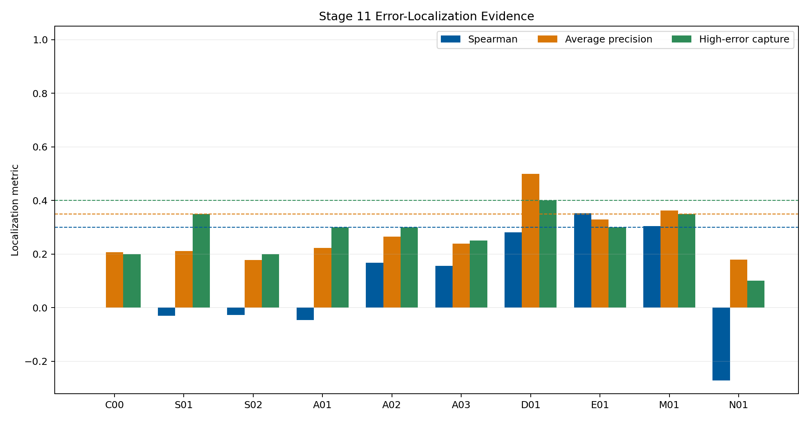
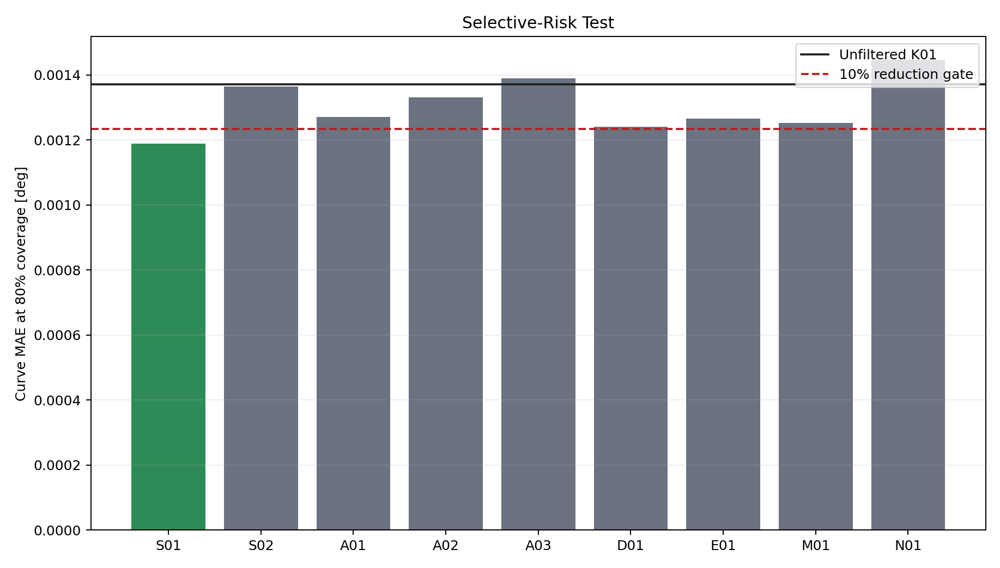
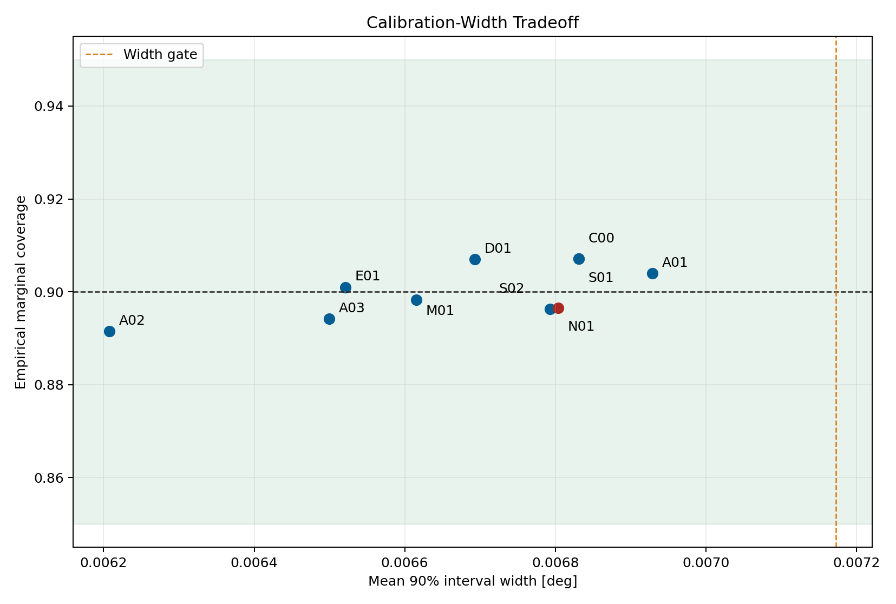
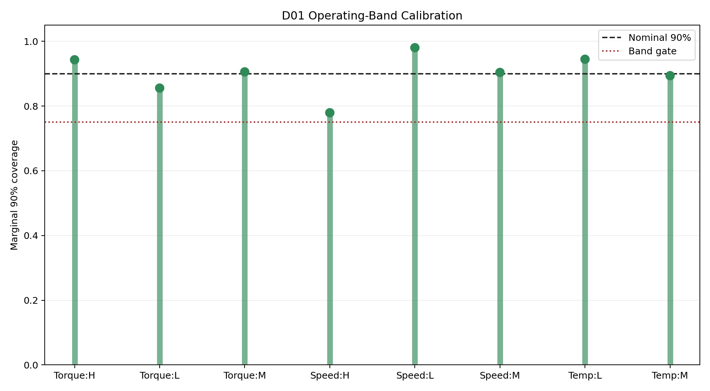
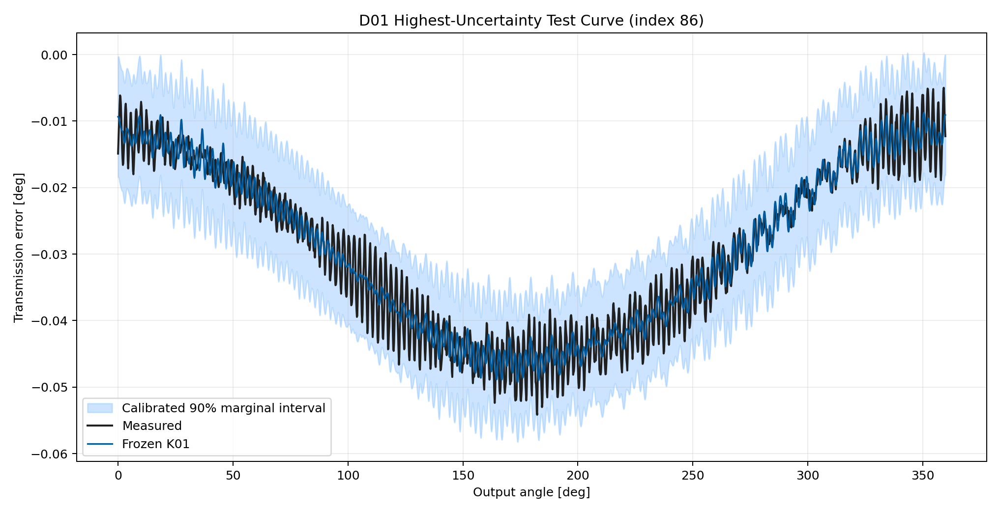

# Wave 5.2R Stage 11 Uncertainty And Physics-Trust Calibration Results

## Executive Summary

Stage 11 completed all ten calibration entries without campaign failure. The
frozen K01 curve remained the prediction center throughout. The campaign
tested whether causal operating-support, analytical-disagreement,
dense-model-disagreement, and five-seed ensemble signals could localize K01
error and support non-vacuous empirical intervals.

The qualified Stage 11 trust component is none. The strongest
diagnostic candidate is `D01` with Spearman
correlation `0.281`,
top-quintile average precision
`0.499`, and
high-error capture
`0.400`.
No result changes K01 promotion status or authorizes Wave 6.

## Scope And Leakage Boundary

- Dataset: polished dataset, setpoint inputs, forward surface only.
- Split: frozen `675/194/97` grouped split.
- Mean prediction: primary Stage 9 K01, unchanged.
- Calibration: validation partition only.
- Final evaluation: one held-out test pass.
- Runtime target-derived inputs: zero.
- Ensemble: five deterministic K01 seeds with identical architecture and
  optimization rules.

## Candidate Results

Candidate labels are: `C00` constant control, `S01` condition distance, `S02`
support boundary, `A01` PF-A/H04 disagreement, `A02` H04/K01 disagreement,
`A03` PF-A/K01 disagreement, `D01` R00/K01 disagreement, `E01` five-seed
spread, `M01` composite trust, and `N01` shuffled control.

| ID | Spearman | AP | Capture | MAE@80 | Cov90 | Width90 |
| --- | ---: | ---: | ---: | ---: | ---: | ---: |
| `C00` | 0.000 | 0.206 | 0.200 | 0.001372 | 0.907 | 0.006831 |
| `S01` | -0.031 | 0.211 | 0.350 | 0.001189 | 0.907 | 0.006831 |
| `S02` | -0.028 | 0.177 | 0.200 | 0.001365 | 0.896 | 0.006793 |
| `A01` | -0.047 | 0.223 | 0.300 | 0.001271 | 0.904 | 0.006929 |
| `A02` | 0.167 | 0.265 | 0.300 | 0.001331 | 0.891 | 0.006208 |

### Residual, Ensemble, And Composite Signals

| ID | Spearman | AP | Capture | MAE@80 | Cov90 | Width90 |
| --- | ---: | ---: | ---: | ---: | ---: | ---: |
| `A03` | 0.156 | 0.239 | 0.250 | 0.001389 | 0.894 | 0.006500 |
| `D01` | 0.281 | 0.499 | 0.400 | 0.001241 | 0.907 | 0.006693 |
| `E01` | 0.352 | 0.328 | 0.300 | 0.001266 | 0.901 | 0.006521 |
| `M01` | 0.304 | 0.362 | 0.350 | 0.001252 | 0.898 | 0.006616 |
| `N01` | -0.272 | 0.179 | 0.100 | 0.001446 | 0.897 | 0.006804 |

## Error Localization

The primary question is whether uncertainty ranks actual held-out curve error.
The constant control has no meaningful localization by construction, while the
shuffled control tests whether the observed score distribution alone can
reproduce the result. A candidate must exceed both controls and pass the fixed
rank, average-precision, capture, and selective-risk gates.

## Interval Calibration

All intervals are centered on the frozen K01 prediction. Validation absolute
residuals determine split-conformal quantiles; test labels do not tune widths.
The fixed gate requires empirical 90-percent marginal coverage between `0.85`
and `0.95` with mean width no more than `1.05` times the constant conformal
control.

## Operating-Band Evidence

Torque, speed, and temperature bands use train-defined terciles. Any populated
band with at least ten test curves must retain at least `0.75` marginal
coverage. The Stage 3 support tier remains visible separately because only a
small number of test curves occupy sparse or extrapolation tiers.

## Representative Calibrated Curve

The plot below shows the highest-uncertainty test curve for
`D01`. The interval is an empirical error band, not a
mechanistic probability distribution of reducer TE.

## Deployment Cost

Simple condition or disagreement signals retain one primary K01 checkpoint.
The ensemble candidate requires five K01 checkpoints and is therefore eligible
only as offline research evidence unless a future single-pass trust head
matches its calibration. The deployment gate remains a maximum `1.25` times
the primary K01 checkpoint cost.

## Decision

- Stage 11 status: `completed_without_qualified_trust_component`.
- Qualified trust component: none.
- Diagnostic best candidate: `D01`.
- Official mean prediction changed: no.
- K01 promoted: no.
- Physics-integrated Wave 6 authorized: no.
- Next step: Stage 12 advanced constraint optimization, applied only to
  ingredients that already showed isolated signal.

## Reproducibility Evidence

- Campaign leaderboard:
  `output/training_campaigns/2026-07-29-20-49-33_wave52r_stage11_uncertainty_trust_calibration_2026_07_29/campaign_leaderboard.yaml`
- Gate summary:
  `output/training_campaigns/2026-07-29-20-49-33_wave52r_stage11_uncertainty_trust_calibration_2026_07_29/campaign_first_screen_gate_summary.yaml`
- Exit-gate summary:
  `output/analysis/wave_5_2r/stage11_uncertainty_physics_trust_calibration/closeout/stage11_exit_gate_summary.yaml`
- Preflight:
  `output/analysis/wave_5_2r/stage11_uncertainty_physics_trust_calibration/stage11_preflight_validation_summary.yaml`
