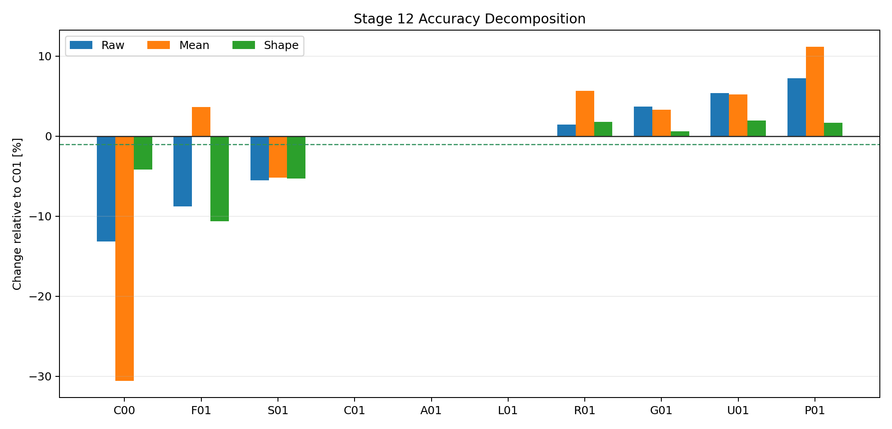
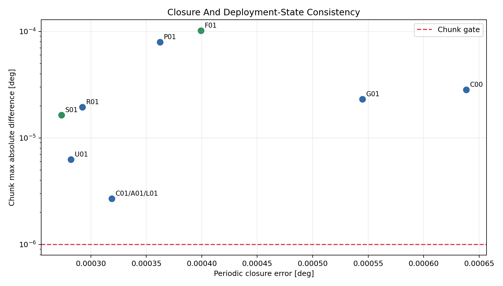
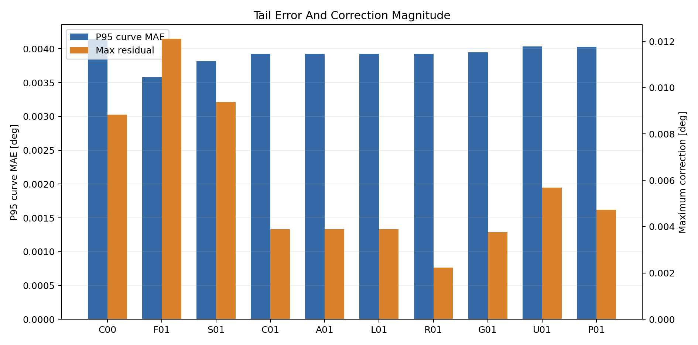
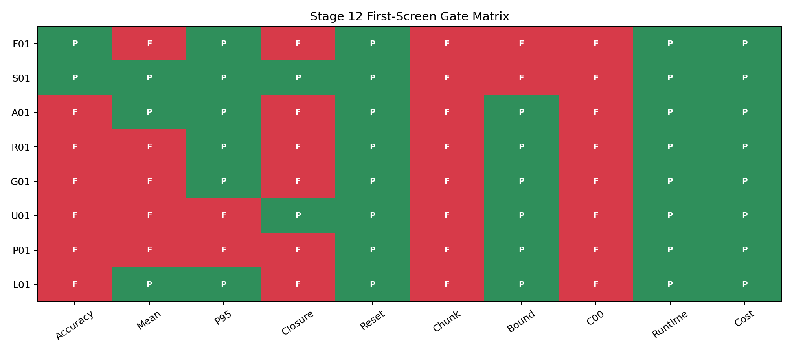

# Wave 5.2R Stage 12 Advanced Constraint Optimization Results

## Executive Outcome

Stage 12 completed all `10 / 10` first-screen entries. The initial P01 and L01
implementation failures were corrected and recovered without rerunning the
other eight valid entries. The final campaign has zero residual failures.

No advanced optimizer passed the complete gate. The frozen Stage 9 K01 replay
C00 remains the raw-error leader at `0.001371553 deg`, and no
candidate beat C00 while preserving the full curve-first, constraint, causal,
and deployment contract. Conditional stability was therefore skipped.

## Campaign Integrity

- Campaign: `wave52r_stage12_advanced_constraint_optimization_2026_07_29`
- Output: `output/training_campaigns/2026-07-29-21-52-53_wave52r_stage12_advanced_constraint_optimization_2026_07_29`
- Completed first-screen entries: `10`
- Residual failures: `0`
- Recovered entries: `P01`, `L01`
- Qualified winner: `None`
- Test curves: `97`
- Runtime target-derived inputs: `0`

## Primary Metric Surface

### Raw Leader Through Adaptive Weighting

| ID | Raw MAE | Mean MAE | Shape MAE | P95 | Closure | Chunk |
| --- | ---: | ---: | ---: | ---: | ---: | ---: |
| `C00` | 0.001372 | 0.000496 | 0.001227 | 0.004148 | 0.000639 | 2.84e-05 |
| `F01` | 0.001441 | 0.000740 | 0.001144 | 0.003586 | 0.000399 | 1.02e-04 |
| `S01` | 0.001492 | 0.000677 | 0.001213 | 0.003820 | 0.000273 | 1.64e-05 |
| `C01` | 0.001579 | 0.000714 | 0.001281 | 0.003925 | 0.000319 | 2.69e-06 |
| `A01` | 0.001579 | 0.000714 | 0.001281 | 0.003925 | 0.000319 | 2.69e-06 |

### Standard And Advanced Constraint Methods

| ID | Raw MAE | Mean MAE | Shape MAE | P95 | Closure | Chunk |
| --- | ---: | ---: | ---: | ---: | ---: | ---: |
| `L01` | 0.001579 | 0.000714 | 0.001281 | 0.003925 | 0.000319 | 2.69e-06 |
| `R01` | 0.001602 | 0.000755 | 0.001304 | 0.003924 | 0.000292 | 1.95e-05 |
| `G01` | 0.001637 | 0.000738 | 0.001289 | 0.003948 | 0.000545 | 2.31e-05 |
| `U01` | 0.001664 | 0.000752 | 0.001306 | 0.004037 | 0.000282 | 6.28e-06 |
| `P01` | 0.001694 | 0.000794 | 0.001302 | 0.004028 | 0.000362 | 7.95e-05 |

Relative to the matched C01 retraining, F01 improves centered-shape MAE by
`10.65%`
and raw MAE by
`8.76%`.
It nevertheless worsens mean MAE to `0.000740 deg`, exceeds
the correction bound, and does not beat frozen C00.

S01 improves raw, mean, shape, P95, and closure relative to C01. Its raw MAE
remains `8.75%` worse than
C00, its maximum correction grows to `0.009371 deg`,
and chunk equivalence remains above the `1e-6 deg` gate.

## Constraint And Deployment Behavior

Every trainable candidate fails the declared chunk-equivalence threshold.
C01 reaches `2.69e-06 deg`, which is close
but still above the frozen `1e-6 deg` gate. F01 and S01 improve parts of the
accuracy or closure surface while increasing state sensitivity.

The A01 augmented-Lagrangian inequalities remained inactive under the
predeclared budgets and therefore reproduced C01 exactly. This is evidence
that those particular budgets do not constrain the observed training regime;
they are not changed after observing test results.

## Method-Specific Findings

- G01 gradient-statistics balancing regresses raw and mean error and does not
  repair closure or chunk behavior.
- R01 relative-progress balancing slightly improves closure relative to C01
  but regresses raw, mean, and shape.
- P01 main-loss-preserving projection is the weakest raw-error result and
  also misses mean, P95, closure, and chunk gates.
- S01 adaptive curve weighting is the strongest multi-index diagnostic
  optimizer, but its larger corrections and failure against C00 prevent
  qualification.
- F01 failure-informed resampling gives the best trained raw and shape result,
  with favorable P95, but trades away mean fidelity, closure, bounded
  correction, and frozen-K01 superiority.
- U01 curriculum regularization improves closure but regresses raw, mean,
  shape, and P95.
- L01 performs seven L-BFGS closure evaluations; validation rejects the
  refinement and restores the C01 checkpoint exactly.

### Complete Gate Matrix

## Decision

Stage 12 promotes no optimizer and no new physics-informed component. The
accepted evidence remains:

- H04 as the qualified structured coefficient component;
- K01 as a qualified research component without official promotion;
- F01 and S01 as diagnostic evidence that hard-curve emphasis can trade shape
  and tail error against mean, correction magnitude, and state consistency.

Advanced optimization does not rescue the unresolved K01 closure and
chunk-equivalence limitations. Stage 13 Synthetic And Weak-Form Oracle Lane is
the next roadmap step. Physics-integrated Wave 6 remains closed.

## Reproducibility

The campaign uses the Stage 0 split signature
`c1aa8718fb9bf88cc2021c121dc4f3b4010fc1d2e45ac90af5f4376aa64f8e16`, frozen H04 and K01 provenance, seed `314159`, immutable
run directories, validation-only checkpoint selection, and one held-out test
evaluation per completed candidate. The two initial implementation failures
remain recorded in the campaign folder; the execution summary separately
records their successful recovery.
