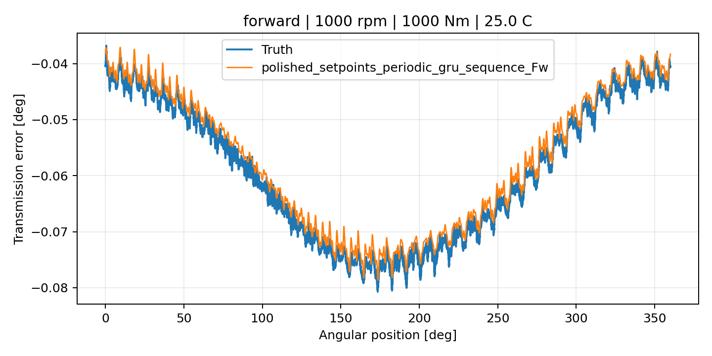
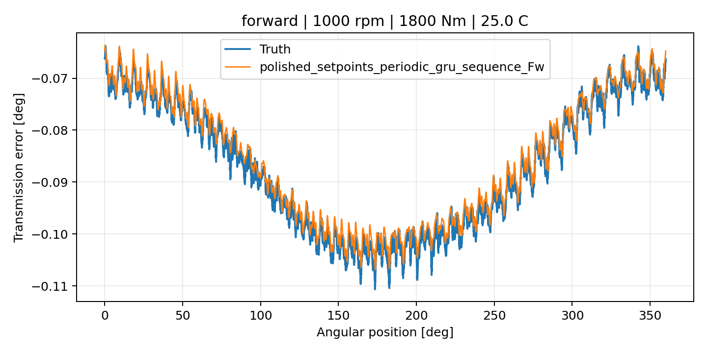
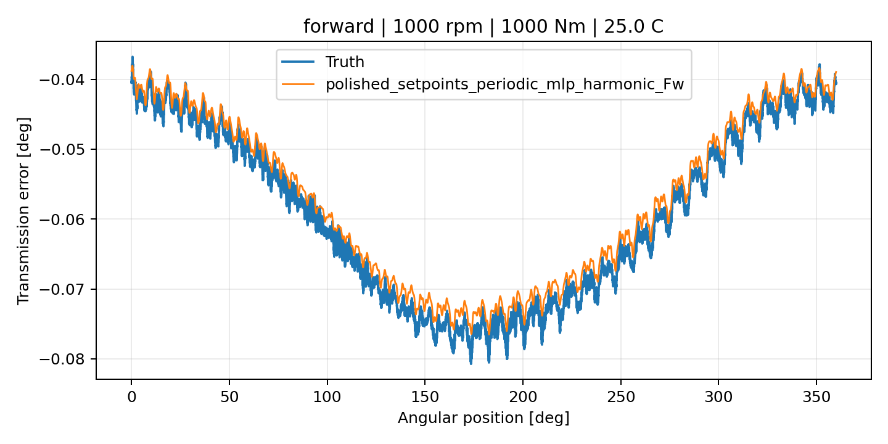
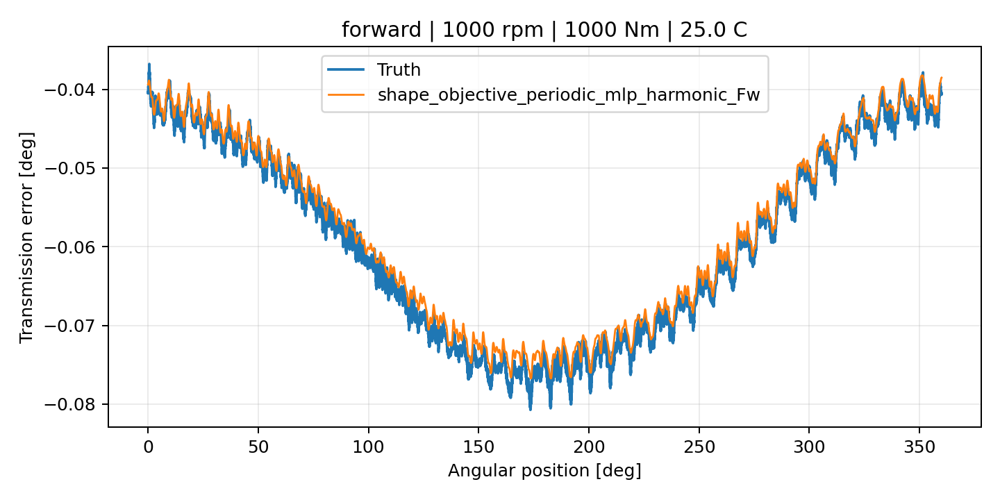
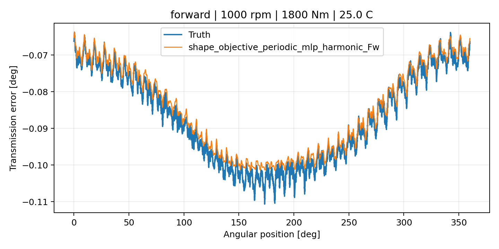
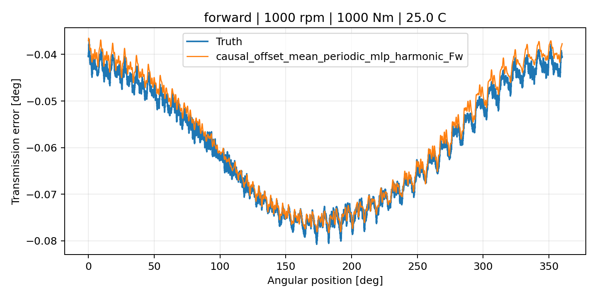
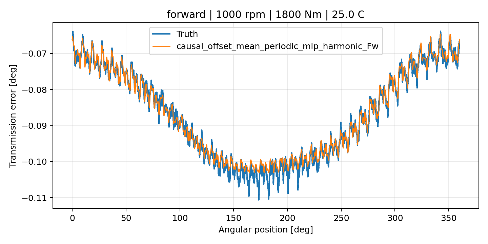
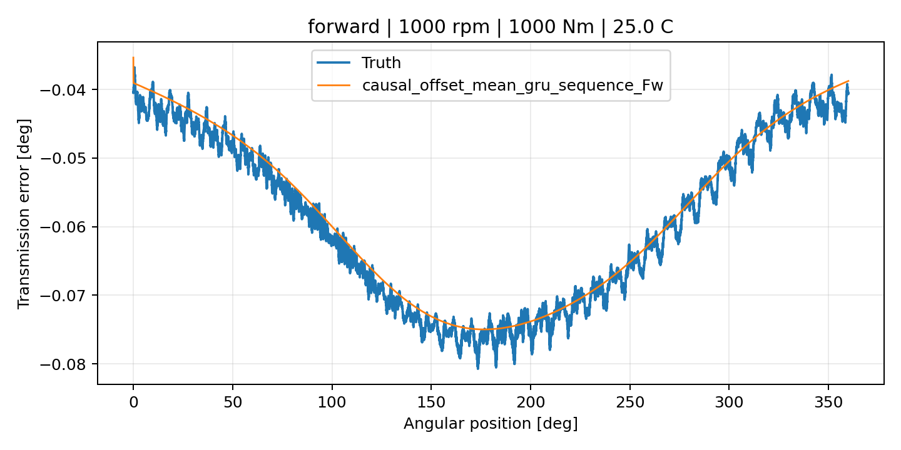
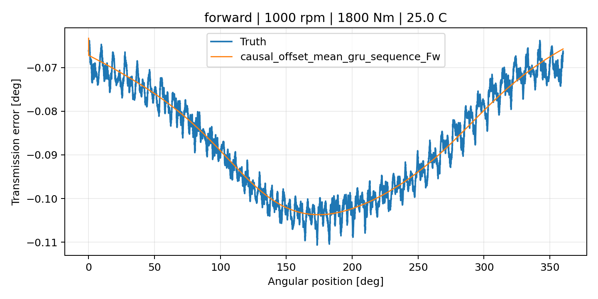

# Causal Offset Bounded TE Curve Verification Screen Closeout

## Overview

This closeout records the bounded `TE Curve Verification Pipeline` screen for
the `causal_offset_mean_calibration_pilot_2026_07_22` forward candidates on
`polished_dataset` setpoint inputs.

The screen compared the two causal offset / mean calibration candidates against
the accepted polished-setpoint forward baselines and the recent scalar
shape-objective high-water reference.

## Execution Summary

| Item | Value |
| --- | --- |
| Screen | `causal_offset_bounded_track2_screen_2026_07_22` |
| Dataset | `polished_dataset` |
| Input mode | `setpoints` |
| Surface | `Fw` / `forward` |
| Candidate count | `5` |
| Curve count | `100` |
| Matrix output | `output/validation_checks/track2_reference_comparison/2026-07-23-13-07-44__causal_offset_bounded_track2_screen_polished_setpoints_fw_matrix_causal_offset_bounded_track2_screen_polished_setpoints_fw` |
| Matrix report | `doc/reports/analysis/validation_checks/te_curve_verification_pipeline/2026-07-23-13-08-58_causal_offset_bounded_track2_screen_polished_setpoints_fw_matrix_causal_offset_bounded_track2_screen_polished_setpoints_fw_report.md` |
| Reranker output | `output/validation_checks/shape_gated_te_curve_reranker/2026-07-23-13-09-03__shape_gated_te_curve_reranker` |
| Reranker report | `doc/reports/analysis/te_curve_verification_pipeline/03_cvp_diagnostics/shape_gated_reranker/[2026-07-22]/causal_offset_bounded_track2_screen_polished_setpoints_fw_matrix_shape_gated_te_curve_reranker_report.md` |
| Plot count | `10` |
| Plot summary | `doc/reports/campaign_results/track_2/verification_plots/causal_offset_bounded_track2_screen_polished_setpoints_fw/track2_candidate_curve_plot_summary.yaml` |

## Metric Ranking

| Rank | Candidate | Raw MAE [deg] | RMSE [deg] | Mean Error [%] | P95 Error [%] |
| ---: | --- | ---: | ---: | ---: | ---: |
| 1 | `polished_setpoints_periodic_gru_sequence_Fw` | 0.001837 | 0.002179 | 3.750629 | 8.248098 |
| 2 | `polished_setpoints_periodic_mlp_harmonic_Fw` | 0.001938 | 0.002276 | 3.987765 | 10.017324 |
| 3 | `shape_objective_periodic_mlp_harmonic_Fw` | 0.002035 | 0.002412 | 4.222146 | 10.956483 |
| 4 | `causal_offset_mean_periodic_mlp_harmonic_Fw` | 0.002075 | 0.002478 | 4.314268 | 9.717112 |
| 5 | `causal_offset_mean_gru_sequence_Fw` | 0.002392 | 0.002868 | 5.009841 | 10.269009 |

## Shape-Gated Decision

| Rank | Candidate | Centered MAE [deg] | Shape Pass | Composite | Decision |
| ---: | --- | ---: | ---: | ---: | --- |
| 1 | `polished_setpoints_periodic_gru_sequence_Fw` | 0.001483 | 0.950000 | 0.007008 | recommended |
| 2 | `polished_setpoints_periodic_mlp_harmonic_Fw` | 0.001490 | 0.920000 | 0.239545 | candidate |
| 3 | `shape_objective_periodic_mlp_harmonic_Fw` | 0.001578 | 0.910000 | 0.419662 | candidate |
| 4 | `causal_offset_mean_periodic_mlp_harmonic_Fw` | 0.001652 | 0.920000 | 0.424363 | candidate |
| 5 | `causal_offset_mean_gru_sequence_Fw` | 0.002024 | 0.000000 | 0.961925 | shape gate failed |

## Harmonic Breakdown

| Rank | Candidate | FFT Sim. | Amp Err. [%] | Phase Err. [deg] |
| ---: | --- | ---: | ---: | ---: |
| 1 | `polished_setpoints_periodic_gru_sequence_Fw` | 0.984971 | 17.554759 | 12.349713 |
| 2 | `polished_setpoints_periodic_mlp_harmonic_Fw` | 0.983739 | 15.623668 | 12.951608 |
| 3 | `shape_objective_periodic_mlp_harmonic_Fw` | 0.983709 | 18.390567 | 17.439607 |
| 4 | `causal_offset_mean_periodic_mlp_harmonic_Fw` | 0.983672 | 19.654545 | 18.516624 |
| 5 | `causal_offset_mean_gru_sequence_Fw` | 0.975176 | 77.578652 | 71.215158 |

## Pilot Graphs

The bounded screen plot contract was backfilled after the closeout finding.
The package now contains two measured-versus-predicted TE curve plots for each
bounded-screen candidate.

### Polished Setpoints Periodic GRU Sequence Fw

### Polished Setpoints Periodic MLP Harmonic Fw

### Shape Objective Periodic MLP Harmonic Fw

### Causal Offset Mean Periodic MLP Harmonic Fw

### Causal Offset Mean GRU Sequence Fw

## Interpretation

The bounded screen does not promote either causal offset / mean calibration
candidate.

The accepted `polished_setpoints_periodic_gru_sequence_Fw` baseline remains the
forward recommendation. It leads on raw MAE, centered MAE, shape pass rate, and
composite score.

The non-windowed causal offset MLP remains a valid completed pilot, but it
ranks behind the accepted GRU, the non-windowed polished-setpoint MLP baseline,
and the prior shape-objective MLP reference. It does not justify expansion from
this profile.

The time-windowed causal residual-offset GRU is rejected for this branch. Its
shape pass rate is `0.000000`, and the reranker reports failures dominated by
harmonic amplitude error, phase error, derivative agreement, FFT similarity,
and peak-to-peak error.

## Output Quality Closeout

The original matrix summary reported `report_plot_count: 0` with empty preview
and report plot lists. The bounded-screen tooling fix has now backfilled the
expected Track 2 measured-versus-predicted plot package and made the future
bounded launchers run the plot builder explicitly.

The local operator log `.temp/campaing_log.log` also contains very long
unwrapped transfer/progress lines and PowerShell host records. The most visible
source is interactive `scp` transfer progress emitted during remote sync. This
was an operator-output problem, not a model-result change. The permanent
launcher/tooling fix now suppresses noisy transfer progress while preserving
repository-owned step summaries and failure status.

## Decision

Do not promote the causal offset / mean calibration candidates.

Do not expand the causal residual-offset GRU branch from this evidence.

Keep both time-windowed and non-windowed roads as comparison categories for
future designs, but close this direct causal-offset mean-calibration profile as
non-promoted.

The bounded campaign output contract is now repaired for future analogous
screens: remote sync logs should not flood the terminal with unwrapped progress
lines, and bounded Track 2 screens should reliably produce the expected
measured-versus-predicted TE curve plots when plot generation is part of the
operator-facing reporting contract.
