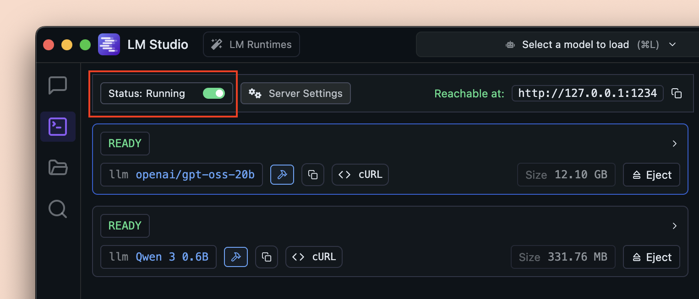
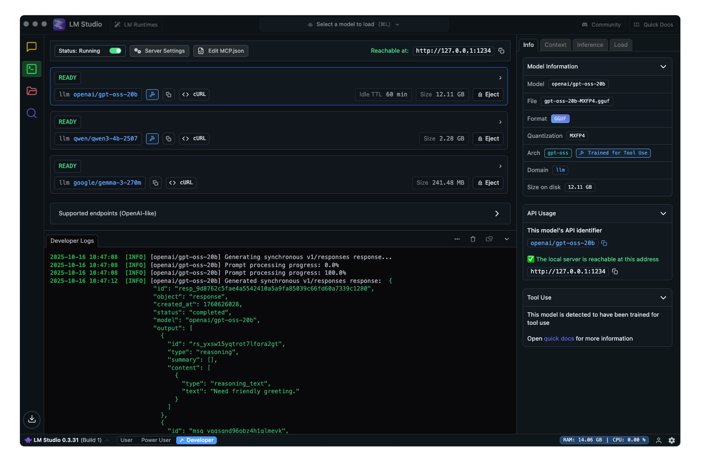

# LAN AI Node Server Setup Guide

## Purpose

This guide explains how to prepare a second Windows 11 workstation as a LAN AI
server for this repository.

The target setup is:

- the current workstation keeps the repository, orchestration, reports, and
  final artifacts;
- the second workstation exposes:
  - `LM Studio` for transcript cleanup and report synthesis;
  - `lan_ai_node_server.py` for `faster-whisper` transcription and
    `PaddleOCR`;
  - optional future remote training or heavier inference workloads.

This guide starts from a clean remote machine and ends with health checks and
first workflow execution from the current workstation terminal.

## Target Topology

### Current Workstation

Use the current workstation for:

- repository editing;
- workflow execution;
- report review;
- final documentation updates.

### Remote Workstation

Use the remote workstation for:

- `LM Studio`;
- `lan_ai_node_server.py`;
- `faster-whisper` model execution;
- `PaddleOCR`;
- optional later remote training workloads.

## Recommended Preparation Order

1. Generate the shared LAN tokens.
2. Enable Windows long paths and Git long paths.
3. Install Git if needed, then clone the repository.
4. Install NVIDIA CUDA if the remote workstation has a supported NVIDIA GPU.
5. Install Miniconda and initialize PowerShell.
6. Create the Conda environment and install `requirements.txt`.
7. Install and configure `LM Studio`.
8. Install and configure Windows `OpenSSH Server`.
9. Start `LM Studio` and `lan_ai_node_server.py`.
10. Run health checks from the current workstation.

## 1. Generate Shared Tokens In PowerShell

The repository uses two shared secrets:

- `STANDARDML_LAN_AI_TOKEN`
  protects `lan_ai_node_server.py`
- `LM_STUDIO_API_KEY`
  protects the `LM Studio` OpenAI-compatible API

Generate a strong random token in PowerShell:

```powershell
[Convert]::ToBase64String((1..48 | ForEach-Object { Get-Random -Maximum 256 } | ForEach-Object { [byte]$_ }))
```

Generate one token for each variable and store the values somewhere secure.

## 2. Persist Tokens As Windows Environment Variables

### Recommended: Per-User Persistent Variables

Run these commands on the remote workstation:

```powershell
[System.Environment]::SetEnvironmentVariable("STANDARDML_LAN_AI_TOKEN", "PASTE_LAN_TOKEN_HERE", "User")
[System.Environment]::SetEnvironmentVariable("LM_STUDIO_API_KEY", "PASTE_LM_STUDIO_TOKEN_HERE", "User")
```

Run the same two variables on the current workstation with the same values:

```powershell
[System.Environment]::SetEnvironmentVariable("STANDARDML_LAN_AI_TOKEN", "PASTE_LAN_TOKEN_HERE", "User")
[System.Environment]::SetEnvironmentVariable("LM_STUDIO_API_KEY", "PASTE_LM_STUDIO_TOKEN_HERE", "User")
```

Close and reopen PowerShell after setting them.

### Optional: Machine-Level Variables

If you want the variables available to all users on the remote workstation, run
an elevated PowerShell prompt:

```powershell
[System.Environment]::SetEnvironmentVariable("STANDARDML_LAN_AI_TOKEN", "PASTE_LAN_TOKEN_HERE", "Machine")
[System.Environment]::SetEnvironmentVariable("LM_STUDIO_API_KEY", "PASTE_LM_STUDIO_TOKEN_HERE", "Machine")
```

### Verify The Variables

```powershell
echo $env:STANDARDML_LAN_AI_TOKEN
echo $env:LM_STUDIO_API_KEY
```

Safer verification without printing the full values:

```powershell
python -c "import os; print(bool(os.environ.get('STANDARDML_LAN_AI_TOKEN'))); print(bool(os.environ.get('LM_STUDIO_API_KEY')))"
```

## 3. Enable Long Paths Before Cloning

Windows still has path-length edge cases, and this repository can hit them when
cloned deep under user folders.

First, open an elevated PowerShell window and enable Git long paths:

```powershell
git config --system core.longpaths true
git config --system --get core.longpaths
```

For extra Windows-side robustness, also enable Win32 long paths:

```powershell
New-ItemProperty -Path "HKLM:\SYSTEM\CurrentControlSet\Control\FileSystem" -Name "LongPathsEnabled" -Value 1 -PropertyType DWORD -Force
```

If you change `LongPathsEnabled`, reboot the remote workstation before cloning.

## 4. Clone The Repository On The Remote Workstation

Choose a reasonably short path. Avoid deeply nested clone locations.

Example:

```powershell
New-Item -ItemType Directory -Force -Path "C:\Work" | Out-Null
Set-Location "C:\Work"
git clone https://github.com/<your-org>/<your-repo>.git
Set-Location ".\StandardML - Codex"
```

If you use SSH-based Git access:

```powershell
git clone git@github.com:<your-org>/<your-repo>.git
```

## 5. Install CUDA On NVIDIA Remote Nodes

If the remote workstation has an NVIDIA GPU and you want GPU-backed
transcription, CUDA is strongly recommended.

### Check The GPU First

```powershell
nvidia-smi
```

If `nvidia-smi` is missing, install or update the NVIDIA driver first.

### Install CUDA

Follow the official CUDA installer for Windows:

- [CUDA Installation Guide for Microsoft Windows](https://docs.nvidia.com/cuda/cuda-installation-guide-microsoft-windows/)

The official CUDA flow is:

1. verify the system has a CUDA-capable GPU;
2. download the NVIDIA CUDA Toolkit;
3. install the CUDA Toolkit;
4. test that the installed software runs correctly.

After installation, reopen PowerShell and re-run:

```powershell
nvidia-smi
nvcc --version
```

### Notes For This Repository

- `faster-whisper` benefits from CUDA on the remote node;
- future PyTorch training or validation on the remote node also benefits from a
  proper CUDA install;
- if CUDA is not ready yet, the LAN AI node can still start in CPU mode for the
  first validation pass.

## 6. Install Miniconda From PowerShell

The official Conda documentation supports standard installer usage and silent
Windows installation for Miniconda.

Official reference:

- [Installing on Windows](https://docs.conda.io/projects/conda/en/stable/user-guide/install/windows.html)

### Download The Installer

```powershell
Set-Location $env:TEMP
Invoke-WebRequest -Uri "https://repo.anaconda.com/miniconda/Miniconda3-latest-Windows-x86_64.exe" -OutFile ".\Miniconda3-latest-Windows-x86_64.exe"
```

### Silent Install For The Current User

```powershell
Start-Process -FilePath ".\Miniconda3-latest-Windows-x86_64.exe" -ArgumentList "/InstallationType=JustMe","/RegisterPython=0","/S","/D=$env:USERPROFILE\\Miniconda3" -Wait
```

### Initialize PowerShell

```powershell
& "$env:USERPROFILE\Miniconda3\Scripts\conda.exe" init powershell
```

Close and reopen PowerShell. Then verify:

```powershell
conda --version
conda info
```

Official shell-init reference:

- [`conda init`](https://docs.conda.io/projects/conda/en/latest/commands/init.html?highlight=powershell)

## 7. Create The Conda Environment

Use a dedicated remote environment for the LAN AI node instead of reusing the
full repository environment. This keeps the remote node reproducible without
pulling the entire local workstation dependency surface.

From the repository root on the remote workstation:

```powershell
conda create -y -n standard_ml_lan_node python=3.12
conda activate standard_ml_lan_node
python -m pip install --upgrade pip wheel
python -m pip install -r requirements-lan-ai-node.txt
```

### Configure Persistent CUDA Runtime `PATH`

The NVIDIA CUDA 12 runtime DLLs installed through
`requirements-lan-ai-node.txt` live under `site-packages\nvidia\...\bin`.
Those directories must be added to `PATH` whenever the remote environment is
active, otherwise `faster-whisper` GPU execution fails with errors such as:

- `Library cublas64_12.dll is not found or cannot be loaded`

Run the repository-owned helper once after the packages are installed:

```powershell
conda activate standard_ml_lan_node
powershell -ExecutionPolicy Bypass -File .\scripts\tooling\setup_lan_ai_node_cuda_path.ps1 -CondaPrefix $env:CONDA_PREFIX
```

This writes Conda activation hooks under:

- `%CONDA_PREFIX%\etc\conda\activate.d\`
- `%CONDA_PREFIX%\etc\conda\deactivate.d\`

After that, reactivate the environment:

```powershell
conda deactivate
conda activate standard_ml_lan_node
```

Validate that the DLLs are now visible from `PATH`:

```powershell
where.exe cublas64_12.dll
where.exe cudnn64_9.dll
```

### Verify The Remote Environment

```powershell
python -c "import requests, fastapi, uvicorn, imageio_ffmpeg; print('ok')"
```

### Why This Uses A Dedicated Requirements File

The main repository `requirements.txt` is intentionally kept focused on the
canonical local workstation environment. The remote LAN node additionally needs
Windows-specific CUDA 12 runtime packages for `ctranslate2` /
`faster-whisper`, so those dependencies are tracked separately in:

- `requirements-lan-ai-node.txt`

## 8. Install And Configure LM Studio

Official references:

- [LM Studio Home / Download](https://model.lmstudio.ai/docs/system-requirements)
- [LM Studio Local Server](https://lmstudio.ai/docs/developer/core/server)
- [Serve on Local Network](https://lmstudio.ai/docs/developer/core/server/serve-on-network)
- [OpenAI Compatibility](https://lmstudio.ai/docs/developer/openai-compat)
- [REST Quickstart](https://lmstudio.ai/docs/developer/rest/quickstart)

### Install LM Studio

Download and install the Windows build from the official LM Studio site.

Current official download page:

- [LM Studio Download](https://model.lmstudio.ai/docs/system-requirements)

### Open The Developer Server

Start LM Studio, then open the Developer / Local Server page.

Official screenshot from the LM Studio documentation:



Image source: LM Studio official documentation.

### Configure The Server

Set the following:

- local server enabled;
- port `1234`;
- API authentication enabled, with the same token used for
  `LM_STUDIO_API_KEY`;
- `Serve on Local Network` enabled;
- keep the server bound only to the trusted local network.

The LM Studio docs note that enabling `Serve on Local Network` makes the server
bind to the machine's local network IP address instead of `localhost`.

Official screenshot from the LM Studio documentation:



Image source: LM Studio official documentation.

### Recommended Models To Download

For the current repository workflow, LM Studio is used for:

- transcript cleanup;
- semantic correction of noisy STT output;
- final report synthesis.

This means you want a good text-instruction model first, not a vision model.

Recommended starting set for an RTX A4000 16 GB machine:

- primary: `Qwen3 14B Instruct GGUF`
  prefer a `Q4_K_M` or similar 4-bit quantized variant
- fallback: `Qwen3 8B Instruct GGUF`
- alternative: `Gemma 3 12B Instruct`

Recommended order:

1. install one `Qwen3 14B Instruct` quantized model;
2. keep one smaller fallback such as `Qwen3 8B Instruct`;
3. add other models only after the baseline flow is stable.

### Why These Models

- the current workflow is cleanup/report heavy rather than code generation
  heavy;
- `Qwen` models are usually strong enough for Italian technical cleanup and
  structured report generation;
- a `14B` quantized model is realistic on a 16 GB GPU;
- an `8B` fallback is useful when memory pressure or concurrency increases.

## 9. Install And Configure OpenSSH Server On Windows 11

Official reference:

- [OpenSSH for Windows overview](https://learn.microsoft.com/en-us/windows-server/administration/openssh/openssh-overview)
- [OpenSSH install and first use](https://learn.microsoft.com/zh-tw/windows-server/administration/openssh/openssh_install_firstuse)

Open an elevated PowerShell prompt on the remote workstation:

```powershell
Add-WindowsCapability -Online -Name OpenSSH.Server~~~~0.0.1.0
Start-Service sshd
Set-Service -Name sshd -StartupType Automatic
```

Verify or create the firewall rule:

```powershell
if (!(Get-NetFirewallRule -Name "OpenSSH-Server-In-TCP" -ErrorAction SilentlyContinue)) {
    New-NetFirewallRule -Name "OpenSSH-Server-In-TCP" -DisplayName "OpenSSH Server (sshd)" -Enabled True -Direction Inbound -Protocol TCP -Action Allow -LocalPort 22
}
```

Check status:

```powershell
Get-Service sshd
```

### First SSH Login From The Current Workstation

From the current workstation:

```powershell
ssh REMOTE_USER@REMOTE_HOST
```

alternatives:

```powershell
ssh -l "REMOTE_USER" REMOTE_HOST
```

### Recommended Key-Based Login

Password login is useful for the first network validation, but the normal
workflow should switch to SSH keys before daily remote use from the current
workstation terminal.

### Generate Or Select The SSH Key On The Current Workstation

If you do not already have a dedicated key, generate one on the current
workstation:

```powershell
ssh-keygen -t ed25519
```

If you want a remote-node-specific key, use an explicit file name:

```powershell
ssh-keygen -t ed25519 -f "$env:USERPROFILE\.ssh\id_ed25519_fisso_martina"
```

Print the public key:

```powershell
Get-Content "$env:USERPROFILE\.ssh\id_ed25519_fisso_martina.pub"
```

Copy the full public-key line.

### Install The Public Key On The Remote Workstation

For a standard non-administrator Windows account, the expected target is:

- `%USERPROFILE%\.ssh\authorized_keys`

Create the folder and file if needed:

```powershell
New-Item -ItemType Directory -Force -Path "$env:USERPROFILE\.ssh" | Out-Null
notepad "$env:USERPROFILE\.ssh\authorized_keys"
```

Paste the public key into that file and save it.

### Important Windows Administrator Caveat

When the remote login account is a local administrator, Windows OpenSSH may use
this shared file instead of the profile-local `authorized_keys` file:

- `C:\ProgramData\ssh\administrators_authorized_keys`

This was the validated working path for the current remote workstation setup.

Create or update that file from an elevated PowerShell prompt on the remote
workstation:

```powershell
New-Item -ItemType File -Force -Path "C:\ProgramData\ssh\administrators_authorized_keys"
notepad "C:\ProgramData\ssh\administrators_authorized_keys"
```

Paste the same public key into that file and save it.

### Apply The Required ACLs

For a standard user-owned `authorized_keys` file:

```powershell
$account = "$env:COMPUTERNAME\$env:USERNAME"
icacls "$env:USERPROFILE\.ssh" /inheritance:r
icacls "$env:USERPROFILE\.ssh" /grant:r "${account}:(OI)(CI)F"
icacls "$env:USERPROFILE\.ssh\authorized_keys" /inheritance:r
icacls "$env:USERPROFILE\.ssh\authorized_keys" /grant:r "${account}:F"
```

For the administrator shared file, use an elevated PowerShell prompt:

```powershell
icacls "C:\ProgramData\ssh\administrators_authorized_keys" /inheritance:r
icacls "C:\ProgramData\ssh\administrators_authorized_keys" /grant:r "Administrators:F"
icacls "C:\ProgramData\ssh\administrators_authorized_keys" /grant:r "SYSTEM:F"
```

### Restart `sshd` After Updating The Key Files

Restart the SSH service from an elevated PowerShell prompt on the remote
workstation:

```powershell
Restart-Service sshd
```

### Validate Key-Based Login

Use the dedicated key explicitly during the first test:

```powershell
ssh -i "$env:USERPROFILE\.ssh\id_ed25519_fisso_martina" -l "Martina Salami" 155.185.226.100
```

For verbose troubleshooting:

```powershell
ssh -vvv -i "$env:USERPROFILE\.ssh\id_ed25519_fisso_martina" -l "Martina Salami" 155.185.226.100
```

### Create A Local SSH Alias

Once the key-based login works, create a local SSH alias on the current
workstation in:

- `C:\Users\<current-user>\.ssh\config`

Example:

```sshconfig
Host xilab-remote
    HostName 155.185.226.100
    User Martina Salami
    IdentityFile C:\Users\XiLabTRig\.ssh\id_ed25519_fisso_martina
    IdentitiesOnly yes
```

Validate both interactive and command-based access:

```powershell
ssh xilab-remote
ssh xilab-remote "hostname"
```

### Password-Based Fallback

On the current workstation:

```powershell
ssh REMOTE_USER@REMOTE_HOST
```

## 10. Start LM Studio On The Remote Workstation

Before launching the repository server, make sure LM Studio is already running
and that:

- the selected model is loaded;
- the local server is running;
- the server is reachable on the remote host IP and port `1234`.

Quick network check from the current workstation:

```powershell
Test-NetConnection REMOTE_HOST -Port 1234
```

If a later chat-generation request fails with HTTP `400`, inspect the currently
available LM Studio model ids:

```powershell
curl.exe -H "Authorization: Bearer $env:LM_STUDIO_API_KEY" "$env:LM_STUDIO_BASE_URL/v1/models"
```

## 11. Start `lan_ai_node_server.py` On The Remote Workstation

### Interactive Start On The Remote Machine

From a PowerShell window or an SSH session on the remote workstation:

```powershell
conda activate standard_ml_lan_node
python -B scripts/tooling/lan_ai_node_server.py --host 0.0.0.0 --port 8765 --whisper-model large-v3 --whisper-device cuda --whisper-compute-type float16
```

On Windows, if port `8765` is still owned by a stale previous
`lan_ai_node_server.py` process, the script now attempts to reclaim that port
automatically. Startup still fails explicitly if some unrelated program owns the
port.

The transcription endpoint also returns timestamped segment data to the local
workflow. The repository now uses those real segment boundaries to build smaller
cleanup chunks locally instead of asking `LM Studio` to segment an entire raw
transcript in one giant prompt.

### CPU Fallback Start

If CUDA is not ready yet:

```powershell
conda activate standard_ml_lan_node
python -B scripts/tooling/lan_ai_node_server.py --host 0.0.0.0 --port 8765 --whisper-model large-v3 --whisper-device cpu --whisper-compute-type int8
```

### Start Through SSH From The Current Workstation

After the SSH alias is configured, keep this as the standard terminal-centric
remote-control method:

```powershell
ssh xilab-remote
```

Then run on the remote shell:

```powershell
cd "C:\Users\Martina Salami\Documents\Davide\Physics-Informed-Neural-Networks"
conda activate standard_ml_lan_node
python -B scripts/tooling/lan_ai_node_server.py --host 0.0.0.0 --port 8765 --whisper-model large-v3 --whisper-device cuda --whisper-compute-type float16
```

For one-shot command execution, the validated pattern is:

```powershell
ssh xilab-remote "hostname"
```

When the SSH shell lands in `cmd.exe` and `conda activate` is unavailable, use
the non-interactive `conda run` form instead:

```powershell
ssh xilab-remote "cd /d C:\Users\Martina Salami\Documents\Davide\Physics-Informed-Neural-Networks && conda run -n standard_ml_lan_node python -B scripts/tooling/lan_ai_node_server.py --host 0.0.0.0 --port 8765 --whisper-model large-v3 --whisper-device cuda --whisper-compute-type float16"
```

This is the simplest reliable way to keep everything driven from the current
workstation terminal.

## 12. Set The Remaining Environment Variables On The Current Workstation

On the current workstation, configure the LAN endpoints:

```powershell
[System.Environment]::SetEnvironmentVariable("STANDARDML_LAN_AI_BASE_URL", "http://REMOTE_HOST:8765", "User")
[System.Environment]::SetEnvironmentVariable("LM_STUDIO_BASE_URL", "http://REMOTE_HOST:1234", "User")
```

Open a new PowerShell window and verify:

```powershell
echo $env:STANDARDML_LAN_AI_BASE_URL
echo $env:LM_STUDIO_BASE_URL
```

The current workstation should now have these four variables available:

- `STANDARDML_LAN_AI_TOKEN`
- `LM_STUDIO_API_KEY`
- `STANDARDML_LAN_AI_BASE_URL`
- `LM_STUDIO_BASE_URL`

## 13. Run The First Health Checks

### Network Reachability

From the current workstation:

```powershell
Test-NetConnection REMOTE_HOST -Port 22
Test-NetConnection REMOTE_HOST -Port 8765
Test-NetConnection REMOTE_HOST -Port 1234
```

### LAN AI Node Health

```powershell
curl.exe -H "Authorization: Bearer $env:STANDARDML_LAN_AI_TOKEN" "$env:STANDARDML_LAN_AI_BASE_URL/health"
```

Expected response shape:

```json
{
  "status": "ok",
  "faster_whisper_available": true,
  "paddleocr_available": true
}
```

### LM Studio Model Listing

```powershell
curl.exe -H "Authorization: Bearer $env:LM_STUDIO_API_KEY" "$env:LM_STUDIO_BASE_URL/v1/models"
```

If the result is empty, make sure a model is loaded or available in LM Studio.

### Optional LM Studio Chat Check

```powershell
curl.exe -H "Authorization: Bearer $env:LM_STUDIO_API_KEY" -H "Content-Type: application/json" -d "{\"model\":\"YOUR_MODEL_ID\",\"messages\":[{\"role\":\"user\",\"content\":\"Reply with OK\"}]}" "$env:LM_STUDIO_BASE_URL/v1/chat/completions"
```

## 14. Run The First Repository Workflow From The Current Workstation

Once both health checks pass, run the workflow from the current workstation:

```powershell
python -B scripts/tooling/extract_video_guide_knowledge.py --video-filter "Machine_Learning_2" --limit-videos 1 --transcript-provider lan --cleanup-provider lmstudio --report-provider lmstudio --ocr-provider lan --transcript-model large-v3 --cleanup-model YOUR_MODEL_ID --report-model YOUR_MODEL_ID --force
```

Example model values:

- `--cleanup-model qwen3:14b`
- `--report-model qwen3:14b`

Use the real LM Studio model identifier shown by `/v1/models`.

## 15. Normal Daily Routine

1. Start or verify `LM Studio` on the remote workstation.
2. Open an SSH session from the current workstation to the remote workstation.
3. Start `lan_ai_node_server.py` on the remote workstation.
4. Run `/health` and `/v1/models` checks from the current workstation.
5. Launch the repository workflow from the current workstation.

## Troubleshooting

### `ssh` Cannot Connect

- verify `sshd` is running on the remote workstation;
- verify the firewall rule exists;
- verify the remote IP address did not change;
- run `Test-NetConnection REMOTE_HOST -Port 22`.

Validated remote-side checks:

```powershell
ipconfig
Get-Service sshd
netstat -ano | findstr :22
Test-NetConnection 127.0.0.1 -Port 22
Test-NetConnection REMOTE_HOST -Port 22
```

Validated current-workstation checks:

```powershell
Test-NetConnection REMOTE_HOST -Port 22
ssh xilab-remote "hostname"
```

If `sshd` is running and listening on `0.0.0.0:22` but the current
workstation still cannot connect, inspect the Windows network profile and the
OpenSSH firewall-rule scope on the remote workstation. In the validated setup,
SSH became reachable only after the remote workstation network profile was
aligned and the firewall allowed the port on the active profile.

### `LM Studio` Is Not Reachable From LAN

- verify `Serve on Local Network` is enabled;
- verify the server is running;
- verify Windows Firewall allows the chosen port;
- verify the base URL uses the remote host IP, not `localhost`.

Validated remote-side checks:

```powershell
netstat -ano | findstr :1234
Test-NetConnection 127.0.0.1 -Port 1234
Test-NetConnection REMOTE_HOST -Port 1234
```

Validated current-workstation checks:

```powershell
Test-NetConnection REMOTE_HOST -Port 1234
curl.exe -H "Authorization: Bearer $env:LM_STUDIO_API_KEY" "$env:LM_STUDIO_BASE_URL/v1/models"
```

Validated firewall rule if the service listens locally but remains unreachable
from the current workstation:

```powershell
New-NetFirewallRule -Name "LM-Studio-1234" -DisplayName "LM Studio 1234" -Enabled True -Direction Inbound -Protocol TCP -Action Allow -LocalPort 1234 -Profile Domain,Private,Public
```

### `/health` Returns `401 Unauthorized`

- verify `STANDARDML_LAN_AI_TOKEN` is identical on both machines;
- verify the request is sending `Authorization: Bearer ...`.

### `LM Studio` Returns Unauthorized Or Empty Results

- verify the API token in LM Studio matches `LM_STUDIO_API_KEY`;
- verify the request uses `Authorization: Bearer ...`;
- verify the target model is loaded or available.

### `faster-whisper` Fails On CUDA

- start once in CPU mode to validate the whole flow;
- verify `nvidia-smi`;
- verify CUDA installation;
- then retry with `--whisper-device cuda`.

### LAN AI Node Port `8765` Is Not Reachable

- verify `lan_ai_node_server.py` is still running;
- verify it is listening on `0.0.0.0:8765`;
- verify Windows Firewall allows port `8765`.

Validated remote-side checks:

```powershell
netstat -ano | findstr :8765
Test-NetConnection 127.0.0.1 -Port 8765
Test-NetConnection REMOTE_HOST -Port 8765
```

Validated current-workstation checks:

```powershell
Test-NetConnection REMOTE_HOST -Port 8765
curl.exe -H "Authorization: Bearer $env:STANDARDML_LAN_AI_TOKEN" "$env:STANDARDML_LAN_AI_BASE_URL/health"
```

Validated firewall rule:

```powershell
New-NetFirewallRule -Name "StandardML-LAN-AI-8765" -DisplayName "StandardML LAN AI Node 8765" -Enabled True -Direction Inbound -Protocol TCP -Action Allow -LocalPort 8765 -Profile Domain,Private,Public
```

If `Test-NetConnection REMOTE_HOST -Port 1234` and
`Test-NetConnection REMOTE_HOST -Port 8765` both fail from the current
workstation, but both succeed on the remote workstation itself, the most likely
cause is missing inbound firewall rules rather than a bind-address issue. This
exact pattern was validated during the first real LAN-node connection test.

## Official References

- [LM Studio Home / Download](https://model.lmstudio.ai/docs/system-requirements)
- [LM Studio Local Server](https://lmstudio.ai/docs/developer/core/server)
- [Serve on Local Network](https://lmstudio.ai/docs/developer/core/server/serve-on-network)
- [LM Studio OpenAI Compatibility](https://lmstudio.ai/docs/developer/openai-compat)
- [LM Studio REST Quickstart](https://lmstudio.ai/docs/developer/rest/quickstart)
- [Conda Installing on Windows](https://docs.conda.io/projects/conda/en/stable/user-guide/install/windows.html)
- [`conda init`](https://docs.conda.io/projects/conda/en/latest/commands/init.html?highlight=powershell)
- [OpenSSH for Windows Overview](https://learn.microsoft.com/en-us/windows-server/administration/openssh/openssh-overview)
- [OpenSSH Install And First Use](https://learn.microsoft.com/zh-tw/windows-server/administration/openssh/openssh_install_firstuse)
- [Maximum Path Length Limitation](https://learn.microsoft.com/en-us/windows/win32/fileio/maximum-file-path-limitation)
- [CUDA Installation Guide for Microsoft Windows](https://docs.nvidia.com/cuda/cuda-installation-guide-microsoft-windows/)
